# 10. Voice Control Course

## 10.1 WonderEcho Pro Overview

### 10.1.1 WonderEcho Pro Introduction

WonderEcho Pro, also known as the AI voice interaction box, features an onboard high-performance noise-reduction microphone and a high-fidelity speaker. It uses a USB audio module, supports driver-free plug-and-play operation, and is compatible with audio playback and recording across multiple operating systems.

It integrates multiple speech processing modules and uses advanced noise suppression algorithms to effectively filter background noise from the environment, supporting the complete process from wake-up to speech recognition and interaction. With its modular design, each functional component, such as wake-up, detection, recognition, and synthesis, can be developed and tested independently.

### 10.1.2 WonderEcho Pro Features and Specifications

1. Onboard microphone and speaker interfaces for audio input and output.

2. Driver-free, multi-system compatible, and plug-and-play. Combines listening and speaking in one device and supports Windows, macOS, Linux, Android, and other systems.

3. Uses a standard USB 2.0 interface.

4. Control interface: USB

5. Speech chip model: CI1302

6. Speaker driver: 3.0 W per channel at 4 Ω BTL

7. Supply voltage: 5 V

### 10.1.3 Recording and Playback Test

**The following example uses Raspberry Pi 5 for demonstration. The same connection and test procedure also applies to Jetson and other compatible devices.**

#### 10.1.3.1 Connection Diagram and Detection


If the controller is a Raspberry Pi, the desktop can be accessed remotely through **[1.7.1.3 VNC Installation](https://wiki.hiwonder.com/projects/rosorin-pro/en/latest/docs/1_ROSOrin_Pro_User_Manual.html#vnc-installation)** in the user manual. After entering the system, check whether the microphone and speaker icons appear in the upper-right corner. As shown below, their presence indicates a successful connection.


If the controller is a Jetson, use the NoMachine remote connection tool and check whether the speaker icon appears in the upper-right corner of the system. Refer to tutorial **[1.7.1.2 NoMachine Installation](https://wiki.hiwonder.com/projects/rosorin-pro/en/latest/docs/1_ROSOrin_Pro_User_Manual.html#nomachine-installation)** for detailed information on accessing the remote desktop.


#### 10.1.3.2 Recording Test

1. Open a new command-line terminal and enter the following command. The option used here is `-l`, a lowercase L. Check the `card` number and note that the card number in this example is 0. This is only an example. Use the actual query result.

   ```
   arecord -l
   ```

   

2. Enter the command below to start recording, and replace `hw:0` with the card number found in the previous step.

   ```
   arecord -D hw:0,0 -f S16_LE -r 16000 -c 2 test.wav
   ```

3. A file named **test.wav** is then generated in the current folder.


4. Record a short clip of about 5 seconds, then press **Ctrl + C** to stop recording.

#### 10.1.3.3 Playback Test

1. After recording is complete, enter the following command in the current folder to check whether the recording was saved successfully.

    ```
    ls
    ```


2. If **test.wav** appears, the recording was successful. Enter the following command for playback testing.

   ```
   aplay test.wav
   ```


### 10.1.4 WonderEcho Pro Installation

> [!NOTE]
>
> **When installing WonderEcho Pro, keep the front of the robot facing forward, and position the WonderEcho Pro with its USB port facing left, which is the direction of the Raspberry Pi USB ports.**


## 10.2 Voice Control Features

### 10.2.1 Voice-Controlled Robot Movement

#### 10.2.1.1 Program Overview

This section demonstrates how to use the robot’s voice recognition feature to control robot movement, such as moving forward or backward by voice command.

In the program design, the node subscribes to the voice recognition service to perform sound source localization, noise reduction, and speech recognition, then obtains the recognized phrase and the angle of the sound source. After the robot is awakened and a specific phrase is spoken, the robot provides the corresponding voice feedback. When a specific color is recognized, the issued voice command is used to control the chassis to move forward, backward, turn left, turn right, and perform other actions.

Before starting this experiment, refer to **Preparation** below to complete the required setup, then follow the section **Operation Steps** to experience the feature.

<p id ="p10-2-1-2"></p>

#### 10.2.1.2 Preparation

1. First, connect WonderEcho Pro to the computer with a Type-C data cable.

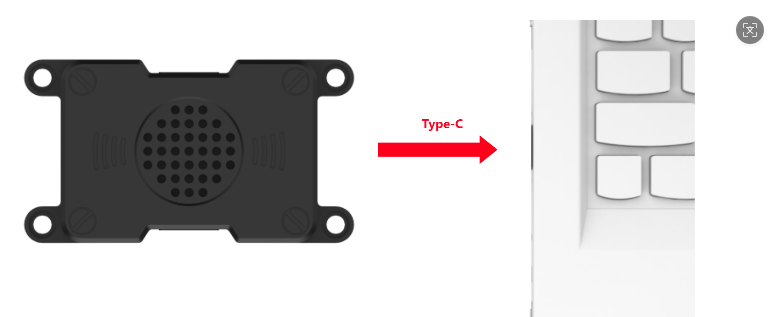

2. Open **PACK_UPDATE_TOOL.exe** under **[2. Softwares\6. Firmware Flashing Tool](https://drive.google.com/drive/folders/1EJkwyTzH41VwMuQcJhn7kSNYjEHCFM4d?usp=sharing)**, select the **CI1302** chip, then click **Update**.

   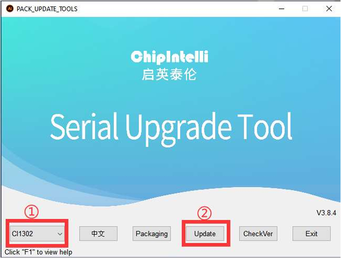

   The following steps use **CI1302-English-SingleMic_V00916_UART0_115200_2M.bin** as an example. The same procedure also applies to flashing the Chinese wake word firmware.

3. Click to select the firmware, then locate **CI1302-English-SingleMic_V00916_UART0_115200_2M.bin** under the **[Voice Control Basic Lesson (2025)/WonderEcho Pro/05 Appendix](https://drive.google.com/drive/folders/1cac3Lk0PsyjmU1LoKvBltH8ixRmQJYwj?usp=sharing)** path.

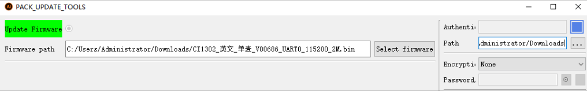

4. Find the corresponding serial port and select it.

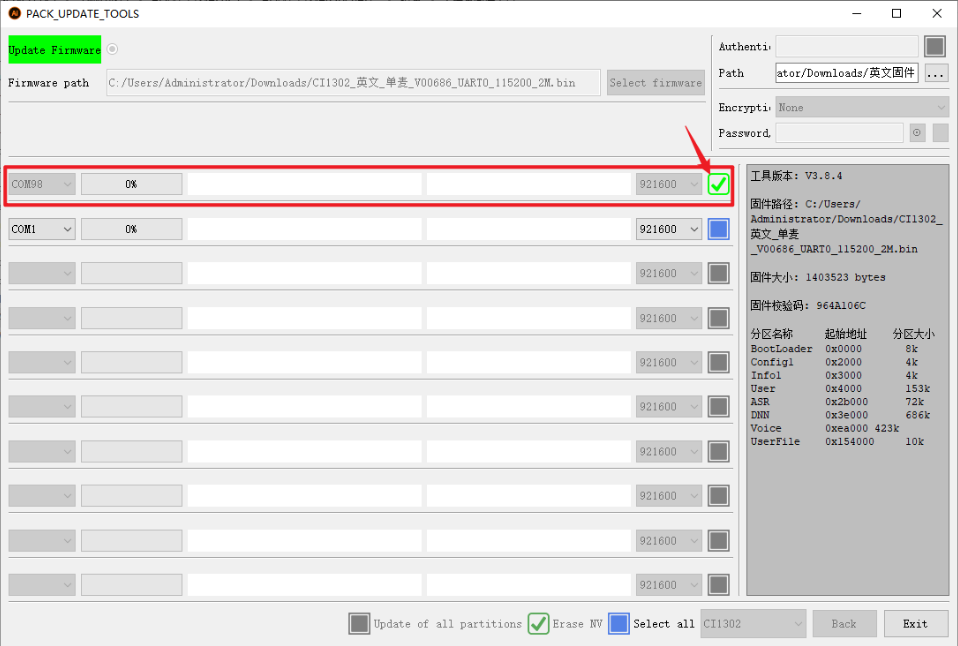

5. Then press the **RST** button on the voice interaction module to enter flashing mode. Wait until the flashing process is completed successfully.

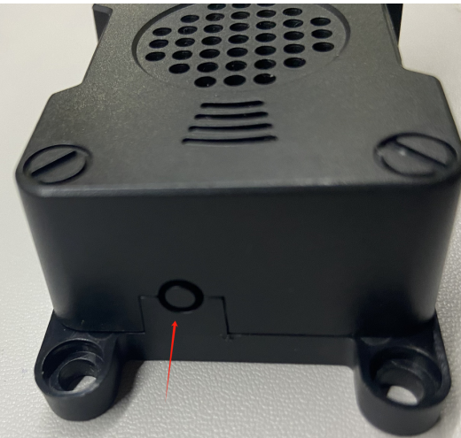


#### 10.2.1.3 Operation Steps

<p id ="p11-3-2-1"></p>

> [!NOTE]
>
> **Commands are case-sensitive. The Tab key can be used for keyword auto-completion.**

1. Power on the robot and connect it to NoMachine. For remote desktop installation and connection, refer to Section **[1.7.1.2 NoMachine Installation](https://wiki.hiwonder.com/projects/rosorin-pro/en/latest/docs/1_ROSOrin_Pro_User_Manual.html#nomachine-installation)** in the user manual.

3. Click the desktop icon  to open a command-line terminal.

4. Enter the following command to stop the app auto-start service:

   ```
   sudo systemctl stop start_app_node.service
   ```

   

5. Enter the following command and press **Enter** to enable voice-controlled robot movement:

   ```
   ros2 launch xf_mic_asr_offline voice_control_move.launch.py
   ```


6. After the program finishes loading, first say the wake word **Hello Hiwonder**. When the speaker responds with **I’m here**, the next voice command can be given. For example, saying **Go forward** causes the robot to recognize the command, and it plays back **Okay, moving forward**, and then moves forward accordingly.

The command phrases and corresponding actions are as follows:

| Command Phrase |   Function    |
| :----------------: | :---------------: |
|      Forward       | Move the robot forward |
|      Backward      | Move the robot backward |
|     Turn left      | Turn the robot left |
|     Turn right     | Turn the robot right |

> [!NOTE]
>
> * **For the best experience, operate the robot in a relatively quiet environment.**
>
> * **Saying the wake word before each voice command is recommended.**
>
> * **Speak loudly and clearly when giving voice commands.**
>
> * **Give one voice command at a time. Wait until the robot finishes its current response before giving the next command.**

7. To stop this feature, open a new command-line terminal and enter the following command:

   ```
   ~/.stop_ros.sh
   ```

   

8. Then close all terminals that were opened.

#### 10.2.1.4 Program Analysis

Voice-controlled robot movement links the voice control node with the robot’s low-level driver node, allowing spoken commands to control the robot and execute the corresponding actions.

1. Launch file

The launch file is located at:

**/home/ubuntu/ros2_ws/src/xf_mic_asr_offline/launch/voice_control_move.launch.py**

**Launch file**

```py
    controller_launch = IncludeLaunchDescription(
        PythonLaunchDescriptionSource(
            os.path.join(controller_package_path, 'launch/controller.launch.py')),
    )

    lidar_launch = IncludeLaunchDescription(
        PythonLaunchDescriptionSource(
            os.path.join(peripherals_package_path, 'launch/lidar.launch.py')),
    )

    mic_launch = IncludeLaunchDescription(
        PythonLaunchDescriptionSource(
            os.path.join(xf_mic_asr_offline_package_path, 'launch/mic_init.launch.py')),
    )
```

`controller_launch` starts the chassis control node and enables servo and motor control.

`lidar_launch` starts the LiDAR node and publishes LiDAR data.

`mic_launch` starts the microphone function.

**Start node**

```py
    voice_control_move_node = Node(
        package='xf_mic_asr_offline',
        executable='voice_control_move.py',
        output='screen',
    )
```

`voice_control_move_node`  is used to launch the voice-controlled movement program.

2. Python Program File

The source code is located at:

**/home/ubuntu/ros2_ws/src/xf_mic_asr_offline/scripts/voice_control_move.py**

**Function**

Main:

```py
def main():
    node = VoiceControMovelNode('voice_control_move')
    rclpy.spin(node)
    node.destroy_node()
    rclpy.shutdown()
```

Starts voice-controlled movement.

**Class**

```py
class VoiceControMovelNode(Node):
    def __init__(self, name):
        rclpy.init()
        super().__init__(name)

        self.angle = None
        self.words = None
        self.running = True
        self.haved_stop = False
        self.lidar_follow = False
        self.start_follow = False
        self.last_status = Twist()
```

`Init`:

```py
        self.pid_yaw = pid.PID(1.6, 0, 0.16)
        self.pid_dist = pid.PID(1.7, 0, 0.16)

        self.language = os.environ['ASR_LANGUAGE']
        self.lidar_type = os.environ.get('LIDAR_TYPE')
        self.machine_type = os.environ.get('MACHINE_TYPE')
        self.mecanum_pub = self.create_publisher(Twist, '/controller/cmd_vel', 1)
        self.buzzer_pub = self.create_publisher(BuzzerState, '/ros_robot_controller/set_buzzer', 1)
        qos = QoSProfile(depth=1, reliability=QoSReliabilityPolicy.BEST_EFFORT)
        self.create_subscription(LaserScan, '/scan_raw', self.lidar_callback, qos)  # subscribe to LiDAR data
        self.create_subscription(String, '/asr_node/voice_words', self.words_callback, 1)
        self.create_subscription(Int32, '/awake_node/angle', self.angle_callback, 1)

        self.client = self.create_client(Trigger, '/asr_node/init_finish')
        self.client.wait_for_service()  # blocking wait
        self.declare_parameter('delay', 0)
        time.sleep(self.get_parameter('delay').value)
        self.mecanum_pub.publish(Twist())
        self.play('running')

        self.get_logger().info('Wake up word: hello hiwonder')
        self.get_logger().info('No need to wake up within 15 seconds after waking up')
        if self.machine_type == 'JetRover_Acker':
            self.get_logger().info('Voice command: turn left/turn right/go forward/go backward')
        else:
            self.get_logger().info('Voice command: turn left/turn right/go forward/go backward/come here')
        self.time_stamp = time.time()
        self.current_time_stamp = time.time()
        threading.Thread(target=self.main, daemon=True).start()
        self.create_service(Trigger, '~/init_finish', self.get_node_state)
        self.get_logger().info('\033[1;32m%s\033[0m' % 'start')
```

Initializes each parameter, calls the chassis node, buzzer node, LiDAR node, and voice recognition node, and finally starts the `main` function.

`get_node_state`:

```py
    def get_node_state(self, request, response):
        response.success = True
        return response
```

Initializes the node state.

`Play`:

```py
    def play(self, name):
        voice_play.play(name, language=self.language)
```

Plays audio.

`words_callback`:

```py
    def words_callback(self, msg):
        self.words = json.dumps(msg.data, ensure_ascii=False)[1:-1]
        if self.language == 'Chinese':
            self.words = self.words.replace(' ', '')
        self.get_logger().info('words:%s' % self.words)
        if self.words is not None and self.words not in ['wake-up-success', 'Sleep', 'Fail-5-times',
                                                         'Fail-10-times']:
            pass
        elif self.words == 'wake-up-success':
            self.play('awake')
        elif self.words == 'Sleep':
            msg = BuzzerState()
            msg.freq = 1000
            msg.on_time = 0.1

            msg.off_time = 0.01
            msg.repeat = 1
            self.buzzer_pub.publish(msg)
```

Speech recognition callback function. Reads the microphone data returned by the node.

`angle_callback`:

```py
    def angle_callback(self, msg):
        self.angle = msg.data
        self.get_logger().info('angle:%s' % self.angle)
        self.start_follow = False
        self.mecanum_pub.publish(Twist())
```

Sound source recognition callback function. Reads the direction of the sound source according to the wake-up direction. This direction is the angle identified by the microphone sound source localization function.

`lidar_callback`:

```py
    def lidar_callback(self, lidar_data):
        twist = Twist()
        # data size = scanning angle / angle increment for each scan
        if self.lidar_type != 'G4':
            min_index = int(math.radians(MAX_SCAN_ANGLE / 2.0) / lidar_data.angle_increment)
            max_index = int(math.radians(MAX_SCAN_ANGLE / 2.0) / lidar_data.angle_increment)
            left_ranges = lidar_data.ranges[:max_index]  # left-side data
            right_ranges = lidar_data.ranges[::-1][:max_index]  # right-side data
        elif self.lidar_type == 'G4':
            '''
                ranges[right...->left]

                    forward
                     lidar
                 left 0 right

            '''
            min_index = int(math.radians((360 - MAX_SCAN_ANGLE) / 2.0) / lidar_data.angle_increment)
            max_index = min_index + int(math.radians(MAX_SCAN_ANGLE / 2.0) / lidar_data.angle_increment)
            left_ranges = lidar_data.ranges[::-1][min_index:max_index][::-1]  # left-side data
            right_ranges = lidar_data.ranges[min_index:max_index][::-1]  # right-side data
        # self.get_logger().info(self.lidar_type)
        if self.start_follow:
            # obtain data based on the settings
            angle = self.scan_angle / 2
            angle_index = int(angle / lidar_data.angle_increment + 0.50)
            left_range, right_range = np.array(left_ranges[:angle_index]), np.array(right_ranges[:angle_index])

            
            # self.get_logger().info(str(left_range))
            # merge distance data from the right half counterclockwise to the left half
            ranges = np.append(right_range[::-1], left_range)
            nonzero = ranges.nonzero()
            nonan = np.isfinite(ranges[nonzero])
            dist_ = ranges[nonzero][nonan]
            # self.get_logger().info(str(dist_))
            if len(dist_) > 0:
```

LiDAR callback function processes LiDAR data. The following function uses the angle identified by the microphone sound source localization, together with PID, to calculate the angular velocity, then starts tracking the object closest to the robot. Based on the object position detected by LiDAR, PID is used to control linear velocity and angular velocity.

Main:

```py
    def main(self):
        while True:
            if self.words is not None:
                twist = Twist()
                if self.words == '前进' or self.words == 'go forward':
                    self.play('go')
                    self.time_stamp = time.time() + 2
                    twist.linear.x = 0.2
                elif self.words == '后退' or self.words == 'go backward':
                    self.play('back')
                    self.time_stamp = time.time() + 2
                    twist.linear.x = -0.2
                elif self.words == '左转' or self.words == 'turn left':
                    self.play('turn_left')
                    self.time_stamp = time.time() + 2
                    if self.machine_type == 'JetRover_Acker':
                        twist.linear.x = 0.2
                        twist.angular.z = twist.linear.x/0.5 
                    else:
                        twist.angular.z = 0.8
                elif self.words == '右转' or self.words == 'turn right':
                    self.play('turn_right')
                    self.time_stamp = time.time() + 2
                    if self.machine_type == 'JetRover_Acker':
                        twist.linear.x = 0.2
                        twist.angular.z = -twist.linear.x/0.5
                    else:
                        twist.angular.z = -0.8
```

Execution strategy after a command is received. Different linear and angular velocities are published according to different commands so the robot can perform different movements.

### 10.2.2 Voice-Controlled Robotic Arm

#### 10.2.2.1 Program Overview

This section demonstrates how to combine the robot’s voice recognition feature with the vision robotic arm to control the arm and execute the corresponding actions.

In the program design, the node subscribes to the voice recognition service to perform sound source localization, noise reduction, and speech recognition, then obtains the recognized phrase and the angle of the sound source. After the robot is awakened and a specific phrase is spoken, the robot gives the corresponding voice feedback. When a specific color is recognized, the issued voice command is used to control the robotic arm and perform the corresponding action.

Before starting this experiment, complete the required setup by referring to **Preparation** below, then follow the section **Operation Steps** to experience the feature.

#### 10.2.2.2 Preparation

Reference tutorial: [10.2.1.2 Preparation](p10-2-1-2)

#### 10.2.2.3 Operation Steps

> [!NOTE]
>
> **Commands are case-sensitive. The Tab key can be used for keyword auto-completion.**

1. Power on the robot and connect it to NoMachine. For remote desktop installation and connection, refer to Section **[1.7.1.2 NoMachine Installation](https://wiki.hiwonder.com/projects/rosorin-pro/en/latest/docs/1_ROSOrin_Pro_User_Manual.html#nomachine-installation)** in the user manual.

3. Click the desktop icon  to open a command-line terminal.

4. Enter the following command to stop the app auto-start service:

   ```
   sudo systemctl stop start_app_node.service
   ```

   

5. Enter the following command and press **Enter** to enable voice control for the robotic arm:

   ```
   ros2 launch xf_mic_asr_offline voice_control_arm.launch.py
   ```


6. After the program finishes loading, say the wake word **Hello Hiwonder** and wait for the voice device to respond with **I’m here**. Then say the command **Pull up a radish**, and the robotic arm will pick up the object directly in front. Saying **Hand it to me** will prompt the robotic arm to pass the picked-up object over from the side.

   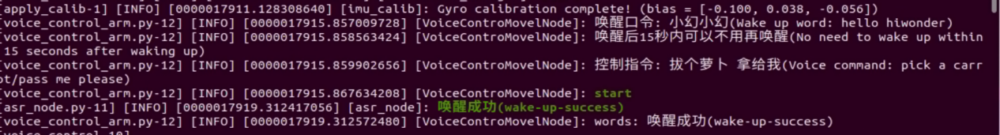

> [!NOTE]
>
> * **For the best experience, operate the robot in a relatively quiet environment.**
>
> * **Saying the wake word before each voice command is recommended.**
>
> * **Speak loudly and clearly when giving voice commands.**
>
> * **Give one voice command at a time. Wait until the robot finishes its current response before giving the next command.**

7. To stop this feature, open a new command-line terminal and enter the following command:

   ```
   ~/.stop_ros.sh
   ```

   

8. Then close all terminals that were opened.

#### 10.2.2.4 Program Analysis

Voice control for the robotic arm links the voice control node with the robot’s low-level driver node, allowing spoken commands to control the robotic arm and execute the corresponding actions.

1. Launch file

The launch file is located at:

**/home/ubuntu/ros2_ws/src/xf_mic_asr_offline/launch/voice_control_arm.launch.py**

**Launch file**

```py
    controller_launch = IncludeLaunchDescription(
        PythonLaunchDescriptionSource(
            os.path.join(controller_package_path, 'launch/controller.launch.py')),
    )

    mic_launch = IncludeLaunchDescription(
        PythonLaunchDescriptionSource(
            os.path.join(xf_mic_asr_offline_package_path, 'launch/mic_init.launch.py')),
    )
```

`controller_launch` starts the chassis control node and enables servo and motor control.

`mic_launch` starts the microphone function.

**Start node**

```py
    voice_control_arm_node = Node(
        package='xf_mic_asr_offline',
        executable='voice_control_arm.py',
        output='screen',
    )
```

`voice_control_arm_node` is used to launch the voice-controlled movement program.

2. Python Program File

The source code is located at:

**/home/ubuntu/ros2_ws/src/xf_mic_asr_offline/scripts/voice_control_move.py**

**Function**

Main:

```py
def main():
    node = VoiceControMovelNode('voice_control_move')
    rclpy.spin(node)
    node.destroy_node()
    rclpy.shutdown()
```

Starts voice-controlled movement.

**Class**

```py
class VoiceControMovelNode(Node):
    def __init__(self, name):
        rclpy.init()
        super().__init__(name)

        self.angle = None
        self.words = None
        self.running = True
        self.haved_stop = False
        self.lidar_follow = False
        self.start_follow = False
        self.last_status = Twist()
        self.threshold = 3
        self.speed = 0.3
        self.stop_dist = 0.4
        self.count = 0
        self.scan_angle = math.radians(90)

        self.pid_yaw = pid.PID(1.6, 0, 0.16)
        self.pid_dist = pid.PID(1.7, 0, 0.16)

        self.language = os.environ['ASR_LANGUAGE']
        self.lidar_type = os.environ.get('LIDAR_TYPE')
        self.machine_type = os.environ.get('MACHINE_TYPE')
        self.mecanum_pub = self.create_publisher(Twist, '/controller/cmd_vel', 1)
        self.buzzer_pub = self.create_publisher(BuzzerState, '/ros_robot_controller/set_buzzer', 1)
        qos = QoSProfile(depth=1, reliability=QoSReliabilityPolicy.BEST_EFFORT)
        self.create_subscription(LaserScan, '/scan_raw', self.lidar_callback, qos)  # subscribe to LiDAR data
        self.create_subscription(String, '/asr_node/voice_words', self.words_callback, 1)
        self.create_subscription(Int32, '/awake_node/angle', self.angle_callback, 1)

        self.client = self.create_client(Trigger, '/asr_node/init_finish')
        self.client.wait_for_service()  # blocking wait
        self.declare_parameter('delay', 0)
        time.sleep(self.get_parameter('delay').value)
        self.mecanum_pub.publish(Twist())
        self.play('running')
```

`Init`:

```py
    def __init__(self, name):
        rclpy.init()
        super().__init__(name)

        self.angle = None
        self.words = None
        self.running = True
        self.haved_stop = False
        self.lidar_follow = False
        self.start_follow = False
        self.last_status = Twist()
        self.threshold = 3
        self.speed = 0.3
        self.stop_dist = 0.4
        self.count = 0
        self.scan_angle = math.radians(90)

        self.pid_yaw = pid.PID(1.6, 0, 0.16)
        self.pid_dist = pid.PID(1.7, 0, 0.16)
```

Initializes each parameter, calls the servo node, buzzer node, and voice recognition node, and finally starts the `main` function.

`get_node_state`:

```py
    def get_node_state(self, request, response):
        response.success = True
        return response
```

Initializes the node state.

`Play`:

```py
    def play(self, name):
        voice_play.play(name, language=self.language)
```

Plays audio.

`words_callback`:

```py
    def words_callback(self, msg):
        self.words = json.dumps(msg.data, ensure_ascii=False)[1:-1]
        if self.language == 'Chinese':
            self.words = self.words.replace(' ', '')
        self.get_logger().info('words:%s' % self.words)
        if self.words is not None and self.words not in ['wake-up-success', 'Sleep', 'Fail-5-times',
                                                         'Fail-10-times']:
            pass
        elif self.words == 'wake-up-success':
            self.play('awake')
        elif self.words == 'Sleep':
            msg = BuzzerState()
            msg.freq = 1000
            msg.on_time = 0.1

            msg.off_time = 0.01
            msg.repeat = 1
            self.buzzer_pub.publish(msg)
```

The speech recognition callback function reads the microphone data returned by the node and executes the corresponding action group based on the recognized command.

### 10.2.3 Voice-Controlled Color Recognition

#### 10.2.3.1 Program Overview

This section demonstrates how to combine the robot’s voice recognition feature with the vision robotic arm to recognize red, green, and blue objects.

In the program design, the node subscribes to the voice recognition service to perform sound source localization, noise reduction, and speech recognition, then obtains the recognized phrase and the angle of the sound source. After the robot is awakened and a specific phrase is spoken, the robot provides the corresponding voice feedback. When a specific command is recognized, the onboard camera identifies red, green, and blue objects.

Before starting this experiment, complete the required setup by referring to **Preparation** below, then follow the section **Operation Steps** to experience the feature.

#### 10.2.3.2 Preparation

Reference tutorial: [10.2.1.2 Preparation](p10-2-1-2)

#### 10.2.3.3 Operation Steps

> [!NOTE]
>
> * **When recognizing color blocks, make sure the background does not contain objects with similar or identical colors, as this may interfere with detection.**
>
> * **If color recognition is inaccurate, the color threshold can be adjusted by referring to Section [6.1 Color Threshold Adjustment](https://wiki.hiwonder.com/projects/rosorin-pro/en/latest/docs/6_ROS%2BOpenCV_Course.html#color-threshold-adjustment) in the 6. ROS+OpenCV Course.**

1. Power on the robot and connect it to NoMachine. For remote desktop installation and connection, refer to Section **[1.7.1.2 NoMachine Installation](https://wiki.hiwonder.com/projects/rosorin-pro/en/latest/docs/1_ROSOrin_Pro_User_Manual.html#nomachine-installation)** in the user manual.

3. Click the desktop icon  to open a command-line terminal.

4. Enter the following command to stop the app auto-start service:

   ```
   sudo systemctl stop start_app_node.service
   ```

   

5. Enter the following command and press **Enter** to enable voice-controlled color recognition:

   ```
   ros2 launch xf_mic_asr_offline voice_control_color_detect.launch.py
   ```


6. After the program starts, say the wake word **Hello Hiwonder** first, then say **Start color recognition** to begin color recognition. The robot identifies the color and announces its name. For example, place a red block within the camera’s field of view. Once a red object is detected, the robot announces **Red**.

To stop color recognition, first say the wake word, then say **Stop color recognition**.

> [!NOTE]
>
> * **For the best experience, operate the robot in a relatively quiet environment.**
>
> * **Saying the wake word before each voice command is recommended.**
>
> * **Speak loudly and clearly when giving voice commands.**
>
> * **Give one voice command at a time. Wait until the robot finishes its current response before giving the next command.**

7. To stop this feature, open a new command-line terminal and enter the following command:

   ```
   ~/.stop_ros.sh
   ```

   

8. Then close all terminals that were opened.

#### 10.2.3.4 Program Analysis

Voice-controlled color recognition links the voice control node with the robot’s low-level driver node and the camera node, allowing spoken commands to control color recognition on the robot.

1. Launch File

The launch file is located at:

**/home/ubuntu/ros2_ws/src/xf_mic_asr_offline/launch/voice_control_color_detect.py.launch**

**Launch file**

```py
    controller_launch = IncludeLaunchDescription(
        PythonLaunchDescriptionSource(
            os.path.join(controller_package_path, 'launch/controller.launch.py')),
    )

    color_detect_launch = IncludeLaunchDescription(
        PythonLaunchDescriptionSource(
            os.path.join(example_package_path, 'example/color_detect/color_detect_node.launch.py')),
        launch_arguments={
            'enable_display': 'true',
        }.items(),       
    )

    mic_launch = IncludeLaunchDescription(
        PythonLaunchDescriptionSource(
            os.path.join(xf_mic_asr_offline_package_path, 'launch/mic_init.launch.py')),
    )

    voice_control_color_detect_node = Node(
        package='xf_mic_asr_offline',
        executable='voice_control_color_detect.py',
        output='screen',
    )

    init_pose_launch = IncludeLaunchDescription(
        PythonLaunchDescriptionSource(os.path.join(controller_package_path, 'launch/init_pose.launch.py')),
        launch_arguments={
            'namespace': '',  
            'use_namespace': 'false',
            'action_name': 'horizontal',
        }.items(),
    )
```

`controller_launch` starts the chassis control node and enables servo and motor control.

`color_detect_launch` starts the color recognition node.

`mic_launch` starts the microphone function.

`init_pose_launch` initializes the action.

**Start node**

```py
    voice_control_color_detect_node = Node(
        package='xf_mic_asr_offline',
        executable='voice_control_color_detect.py',
        output='screen',
    )
```

`voice_control_color_detect_node` launches the voice-controlled color recognition program.

2. Python Program File

The source code is located at:

**/home/ubuntu/ros2_ws/src/xf_mic_asr_offline/scripts/voice_control_color_detect.py**

**Function**

Main:

```py
def main():
    node = VoiceControlColorDetectNode('voice_control_color_detect')
    executor = MultiThreadedExecutor()
    executor.add_node(node)
    executor.spin()
    node.destroy_node()
```

Starts voice-controlled color recognition.

**Class**

`VoiceControlColorDetectNode`:

```py
class VoiceControlColorDetectNode(Node):
    def __init__(self, name):
        rclpy.init()
        super().__init__(name, allow_undeclared_parameters=True, automatically_declare_parameters_from_overrides=True)
        
        self.count = 0
        self.color = None
        self.running = True
        self.last_color = None
```

`Init`:

```py
        self.count = 0
        self.color = None
        self.running = True
        self.last_color = None
        signal.signal(signal.SIGINT, self.shutdown)

        self.language = os.environ['ASR_LANGUAGE']
        
        self.buzzer_pub = self.create_publisher(BuzzerState, '/ros_robot_controller/set_buzzer', 1)
        timer_cb_group = ReentrantCallbackGroup()
        self.create_subscription(String, '/asr_node/voice_words', self.words_callback, 1, callback_group=timer_cb_group)
        self.create_subscription(ColorsInfo, '/color_detect/color_info', self.get_color_callback, 1)
        self.client = self.create_client(Trigger, '/asr_node/init_finish')
        self.client.wait_for_service()
        self.client = self.create_client(Trigger, '/color_detect/init_finish')
        self.client.wait_for_service() 
        self.set_color_client = self.create_client(SetColorDetectParam, '/color_detect/set_param', callback_group=timer_cb_group)
        self.set_color_client.wait_for_service()
        self.play('running')
        self.get_logger().info('Wake up word: hello hiwonder')
        self.get_logger().info('No need to wake up within 15 seconds after waking up')
        self.get_logger().info('Voice command: start color recognition/stop color recognition')

        threading.Thread(target=self.main, daemon=True).start()
        self.create_service(Trigger, '~/init_finish', self.get_node_state)
        self.get_logger().info('\033[1;32m%s\033[0m' % 'start')
```

Initializes each parameter, calls the chassis node, buzzer node, LiDAR node, voice recognition node, and color recognition node, and finally starts the `main` function.

`get_node_state`:

```py
    def get_node_state(self, request, response):
        response.success = True
        return response
```

Sets the current node state.

`Play`:

```py
    def play(self, name):
        voice_play.play(name, language=self.language)
```

Plays audio.

`Shutdown`:

```py
    def shutdown(self, signum, frame):
        self.running = False
```

Callback function after the program is closed. Sets the `running` parameter to `False` to stop the program.

`get_color_callback`:

```py
    def get_color_callback(self, msg):
        data = msg.data
        if data != []:
            if data[0].radius > 30:
                self.color = data[0].color
            else:
                self.color = None
        else:
            self.color = None
```

Obtains the current color recognition result from the information published by the color recognition node.

`send_request`:

```py
    def send_request(self, client, msg):
        future = client.call_async(msg)
        while rclpy.ok():
            if future.done() and future.result():
                return future.result()
```

Publishes a service request.

`words_callback`:

```py
    def words_callback(self, msg):
        words = json.dumps(msg.data, ensure_ascii=False)[1:-1]
        if self.language == 'Chinese':
            words = words.replace(' ', '')
        self.get_logger().info('words: %s'%words)
        if words is not None and words not in ['wake-up-success', 'Sleep', 'Fail-5-times',
                                               'Fail-10-times']:
            if words == '开启颜色识别' or words == 'start color recognition':
                msg_red = ColorDetect()
                msg_red.color_name = 'red'
                msg_red.detect_type = 'circle'
                msg_green = ColorDetect()
                msg_green.color_name = 'green'
                msg_green.detect_type = 'circle'
                msg_blue = ColorDetect()
                msg_blue.color_name = 'blue'
                msg_blue.detect_type = 'circle'
                msg = SetColorDetectParam.Request()
                msg.data = [msg_red, msg_green, msg_blue]
                res = self.send_request(self.set_color_client, msg)
```

This speech recognition callback function determines whether recognition should be enabled based on the recognized voice command. If enabled, it then provides feedback according to the result returned by the color recognition node.

Main:

```py
    def main(self):
        while self.running:
            if self.color == 'red' and self.last_color != 'red':
                self.last_color = 'red'
                self.play('red')
                self.get_logger().info('\033[1;32m%s\033[0m' % 'red')
            elif self.color == 'green' and self.last_color != 'green':
                self.last_color = 'green'
                self.play('green')
                self.get_logger().info('\033[1;32m%s\033[0m' % 'green')
            elif self.color == 'blue' and self.last_color != 'blue':
                self.last_color = 'blue'
                self.play('blue')
                self.get_logger().info('\033[1;32m%s\033[0m' % 'blue')
            else:
                self.count += 1
                time.sleep(0.01)
                if self.count > 50:
                    self.count = 0
                    self.last_color = self.color
```

Announces the corresponding voice feedback according to the recognized color.

### 10.2.4 Voice-Controlled Color Tracking

#### 10.2.4.1 Program Overview

This experiment uses the robot's built-in voice recognition function together with the vision robotic arm to identify red, green, and blue color blocks.

In the program design, the voice recognition service published by the subscribed node is used to locate, denoise, and recognize speech, then obtain the recognized command and the sound source angle. After the robot is successfully awakened and a specific command is spoken, the robot provides the corresponding voice feedback. When the specified color is detected, the pan-tilt camera on the robot tracks the target object of that color.

Before starting this experiment, complete the required setup by referring to **Preparation** below, then follow the section **Operation Steps** to experience the feature.

#### 10.2.4.2 Preparation

Reference tutorial: [10.2.1.2 Preparation](p10-2-1-2)

#### 10.2.4.3 Operation Steps

> [!NOTE]
>
> * **When recognizing color blocks, make sure the background does not contain objects with similar or identical colors, as this may interfere with detection.**
>
> * **If color recognition is inaccurate, the color threshold can be adjusted by referring to Section [6.1 Color Threshold Adjustment](https://wiki.hiwonder.com/projects/rosorin-pro/en/latest/docs/6_ROS%2BOpenCV_Course.html#color-threshold-adjustment) in the 6. ROS+OpenCV Course.**

1. Power on the robot and connect it to NoMachine. For remote desktop installation and connection, refer to Section **[1.7.1.2 NoMachine Installation](https://wiki.hiwonder.com/projects/rosorin-pro/en/latest/docs/1_ROSOrin_Pro_User_Manual.html#nomachine-installation)** in the user manual.

3. Click the desktop icon  to open a command-line terminal.

4. Enter the following command to stop the app auto-start service:

   ```
   sudo systemctl stop start_app_node.service
   ```

   

5. Enter the following command and press **Enter** to enable voice-controlled color tracking:

   ```
   ros2 launch xf_mic_asr_offline voice_control_color_track.launch.py
   ```


6. After the program starts successfully, the robot can be controlled via voice commands. The program supports red, green, and blue. Using red as an example, place a red object within the camera's field of view. Say the wake word **Hello Hiwonder** first, then say the tracking command **Track red object**. For the other two colors, the commands are **Track blue object** for blue and **Track green object** for green. When red, which is the color specified by the voice command, is detected, the robotic arm camera tracks the target object in real time and keeps the depth camera facing the red block. When the color block is moved, the pan-tilt also rotates accordingly.

> [!NOTE]
>
> * **For the best experience, operate the robot in a relatively quiet environment.**
>
> * **Saying the wake word before each voice command is recommended.**
>
> * **Speak loudly and clearly when giving voice commands.**
>
> * **Give one voice command at a time. Wait until the robot finishes its current response before giving the next command.**

7. To stop this feature, open a new command-line terminal and enter the following command:

   ```
   ~/.stop_ros.sh
   ```

   

8. Then close all terminals that were opened.

#### 10.2.4.4 Program Analysis

Voice-controlled color tracking links the voice control node with the camera node, allowing spoken commands to control color recognition and target tracking.

1. Launch File

The launch file is located at:

**/home/ubuntu/ros2_ws/src/xf_mic_asr_offline/launch/voice_control_color_track.py.launch**

**Launch file**

```py
    color_track_launch = IncludeLaunchDescription(
        PythonLaunchDescriptionSource(
            os.path.join(example_package_path, 'example/color_track/color_track_node.launch.py')),
        launch_arguments={'start': 'false'}.items()
    )

    mic_launch = IncludeLaunchDescription(
        PythonLaunchDescriptionSource(
            os.path.join(xf_mic_asr_offline_package_path, 'launch/mic_init.launch.py')),
    )
```

`color_track_launch` starts the color tracking node.

`mic_launch` starts the microphone function.

**Start node**

```py
    voice_control_color_track_node = Node(
        package='xf_mic_asr_offline',
        executable='voice_control_color_track.py',
        output='screen',
    )
```

`voice_control_color_track_node` calls the source code for voice-controlled color tracking and starts the program.

2. Python Program File

The source code is located at:

**/home/ubuntu/ros2_ws/src/xf_mic_asr_offline/scripts/voice_control_color_track.py**

**Function**

Main:

```py
def main():
    node = VoiceControlColorTrackNode('voice_control_color_track')
    executor = MultiThreadedExecutor()
    executor.add_node(node)
    executor.spin()
    node.destroy_node()
```

Starts voice-controlled color tracking.

**Class**

`VoiceControlColorTrackNode`:

```py
class VoiceControlColorTrackNode(Node):
    def __init__(self, name):
        rclpy.init()
        super().__init__(name, allow_undeclared_parameters=True, automatically_declare_parameters_from_overrides=True)

        self.language = os.environ['ASR_LANGUAGE']
        timer_cb_group = ReentrantCallbackGroup()
        self.buzzer_pub = self.create_publisher(BuzzerState, '/ros_robot_controller/set_buzzer', 1)
        self.create_subscription(String, '/asr_node/voice_words', self.words_callback, 1, callback_group=timer_cb_group)
```

`Init`:

```py
    def __init__(self, name):
        rclpy.init()
        super().__init__(name, allow_undeclared_parameters=True, automatically_declare_parameters_from_overrides=True)

        self.language = os.environ['ASR_LANGUAGE']
        timer_cb_group = ReentrantCallbackGroup()
        self.buzzer_pub = self.create_publisher(BuzzerState, '/ros_robot_controller/set_buzzer', 1)
        self.create_subscription(String, '/asr_node/voice_words', self.words_callback, 1, callback_group=timer_cb_group)
        self.client = self.create_client(Trigger, '/asr_node/init_finish')
        self.client.wait_for_service()
        self.client = self.create_client(Trigger, '/color_track/init_finish')
        self.client.wait_for_service()
        self.start_client = self.create_client(Trigger, '/color_track/start')
        self.start_client.wait_for_service()
        self.set_color_client = self.create_client(SetString, '/color_track/set_color', callback_group=timer_cb_group)
        self.set_color_client.wait_for_service()

        self.timer = self.create_timer(0.0, self.init_process, callback_group=timer_cb_group)
```

Initializes each parameter, calls the buzzer node, voice recognition node, and color tracking node, and finally initializes the action.

`init_process`:

```py
    def init_process(self):
        self.timer.cancel()

        res = self.send_request(self.start_client, Trigger.Request())
        if res.success:
            self.get_logger().info('open color_track')
        else:
            self.get_logger().info('open color_track fail')
        self.play('running')
        self.get_logger().info('Wake up word: hello hiwonder')
        self.get_logger().info('No need to wake up within 15 seconds after waking up')
        self.get_logger().info('Voice command: track red/green/blue object')

        self.create_service(Trigger, '~/init_finish', self.get_node_state)
        self.get_logger().info('\033[1;32m%s\033[0m' % 'start')
```

Starts the color tracking feature and provides command prompts while marking node initialization.

`get_node_state`:

```py
    def get_node_state(self, request, response):
        response.success = True
        return response
```

Sets the current node state.

`Play`:

```py
    def play(self, name):
        voice_play.play(name, language=self.language)
```

Plays audio.

`send_request`:

```py
    def send_request(self, client, msg):
        future = client.call_async(msg)
        while rclpy.ok():
            if future.done() and future.result():
                return future.result()
```

Publishes a service request.

`words_callback`:

```py
    def words_callback(self, msg):
        words = json.dumps(msg.data, ensure_ascii=False)[1:-1]
        if self.language == 'Chinese':
            words = words.replace(' ', '')
        self.get_logger().info('words: %s'%words)
        if words is not None and words not in ['wake-up-success', 'Sleep', 'Fail-5-times',
                                               'Fail-10-times']:
            if words == '追踪红色' or words == 'track red object':
                msg = SetString.Request()
                msg.data = 'red'
                res = self.send_request(self.set_color_client, msg)
                if res.success:
                    self.play('start_track_red')
                else:
                    self.play('track_fail')
            elif words == '追踪绿色' or words == 'track green object':
                msg = SetString.Request()
                msg.data = 'green'
                res = self.send_request(self.set_color_client, msg)
                if res.success:
                    self.play('start_track_green')
                else:
                    self.play('track_fail')
            elif words == '追踪蓝色' or words == 'track blue object':
                msg = SetString.Request()
                msg.data = 'blue'
                res = self.send_request(self.set_color_client, msg)
                if res.success:
                    self.play('start_track_blue')
                else:
                    self.play('track_fail')
            elif words == '停止追踪' or words == 'stop tracking':
                msg = SetString.Request()
                res = self.send_request(self.set_color_client, msg)
                if res.success:
                    self.play('stop_track')
                else:
                    self.play('stop_fail')
        elif words == 'wake-up-success':
            self.play('awake')
        elif words == 'Sleep':
            msg = BuzzerState()
            msg.freq = 1900
            msg.on_time = 0.05
            msg.off_time = 0.01
            msg.repeat = 1
            self.buzzer_pub.publish(msg)
```

The voice recognition callback function controls whether color tracking is enabled based on the recognized command, plays the corresponding voice prompt, and sends the target tracking color to the color tracking node. The tracking process is implemented inside the color tracking node.

### 10.2.5 Voice-Controlled Color Sorting

#### 10.2.5.1 Program Overview

This experiment uses the robot's built-in voice recognition function together with the vision robotic arm to recognize red, green, and blue color blocks, then perform gripping and sorting actions.

In the program design, the voice recognition service published by the subscribed node is used to locate, denoise, and recognize speech, then obtain the recognized command and the sound source angle. After the robot is successfully awakened and a specific command is spoken, the robot provides the corresponding voice feedback. When the specified color is detected, the robotic arm moves down to the target position, grips the color block, then places it in the specified position.

Before starting this experiment, complete the required setup by referring to **Preparation** below, then follow the section **Operation Steps** to experience the feature.

#### 10.2.5.2 Preparation

Reference tutorial: [10.2.1.2 Preparation](p10-2-1-2)

#### 10.2.5.3 Operation Steps

> [!NOTE]
>
> **When recognizing color blocks, make sure the background does not contain objects with similar or identical colors, as this may interfere with detection.**
>
> **If color recognition is inaccurate, adjust the color threshold in [6. ROS+OpenCV Course](https://wiki.hiwonder.com/projects/rosorin-pro/en/latest/docs/6_ROS%2BOpenCV_Course.html).**

1. Power on the robot and connect it to NoMachine. For remote desktop installation and connection, refer to Section **[1.7.1.2 NoMachine Installation](https://wiki.hiwonder.com/projects/rosorin-pro/en/latest/docs/1_ROSOrin_Pro_User_Manual.html#nomachine-installation)** in the user manual.

3. Click the desktop icon  to open a command-line terminal.

4. Enter the following command to stop the app auto-start service:

   ```
   sudo systemctl stop start_app_node.service
   ```

   

5. Enter the following command and press **Enter** to enable voice-controlled color sorting:

   ```
   ros2 launch xf_mic_asr_offline voice_control_color_sorting.launch.py debug:=true
   ```


6. After startup, the vision robotic arm enters the calibration pose. Place the color block to be recognized at the center of the gripper, as shown below.

   

7. The robotic arm then lifts upward and enters the ready state for recognition. During this process, the color block does not need to be moved.

8. After the program identifies the position of the current color block, the returned camera image displays a yellow box marking that position. This marked position is then used as the reference for subsequent recognition and gripping actions.

9. Say the wake word **Hello Hiwonder**, then say the command **Start color sorting** to start color block sorting. The robotic arm then grips the color block.

10. The robot then places the color block in the area corresponding to its color, as shown below.

    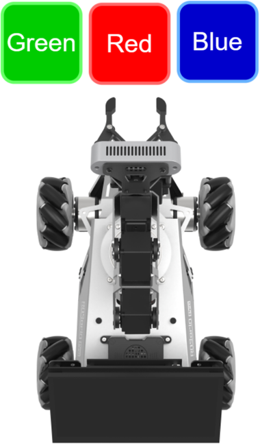

9. After placement, the robotic arm returns to the recognition-ready posture described in step 6. Place the color block inside the yellow bounding box in the camera feed for recognition again, then run the color sorting function again.

10. Say the wake word **Hello Hiwonder**, then say the command **Stop color sorting** to stop color sorting on the vision robotic arm.

11. To stop this feature, open a new command-line terminal and enter the following command:

    ```
    ~/.stop_ros.sh
    ```

    

12. Then close all terminals that were opened.

#### 10.2.5.4 Program Analysis

Voice-controlled color sorting links the voice control node with the camera node, allowing spoken commands to start or stop the feature.

1. Launch File

The launch file is located at:

**/home/ubuntu/ros2_ws/src/xf_mic_asr_offline/launch/voice_control_color_track.launch.py**

**Launch file**

```py
    color_track_launch = IncludeLaunchDescription(
        PythonLaunchDescriptionSource(
            os.path.join(example_package_path, 'example/color_track/color_track_node.launch.py')),
        launch_arguments={'start': 'false'}.items()
    )

    mic_launch = IncludeLaunchDescription(
        PythonLaunchDescriptionSource(
            os.path.join(xf_mic_asr_offline_package_path, 'launch/mic_init.launch.py')),
    )
```

`color_sorting_launch` starts the color sorting node.

`mic_launch` starts the microphone function.

**Start node**

```py
    voice_control_color_track_node = Node(
        package='xf_mic_asr_offline',
        executable='voice_control_color_track.py',
        output='screen',
    )
```

`voice_control_color_track_node` calls the source code for voice-controlled color sorting and starts the program.

2. Python Program File

The source code is located at:

**/home/ubuntu/ros2_ws/src/xf_mic_asr_offline/scripts/voice_control_color_detect.py**

**Function**

Main:

```py
def main():
    node = VoiceControlColorDetectNode('voice_control_color_detect')
    executor = MultiThreadedExecutor()
    executor.add_node(node)
    executor.spin()
    node.destroy_node()
```

Starts voice-controlled color sorting.

**Class**

`VoiceControlColorSortingNode`:

```py
class VoiceControlColorDetectNode(Node):
    def __init__(self, name):
        rclpy.init()
        super().__init__(name, allow_undeclared_parameters=True, automatically_declare_parameters_from_overrides=True)
        
        self.count = 0
        self.color = None
        self.running = True
        self.last_color = None
        signal.signal(signal.SIGINT, self.shutdown)
```

`Init`:

```py
    def __init__(self, name):
        rclpy.init()
        super().__init__(name, allow_undeclared_parameters=True, automatically_declare_parameters_from_overrides=True)
        
        self.count = 0
        self.color = None
        self.running = True
        self.last_color = None
        signal.signal(signal.SIGINT, self.shutdown)

        self.language = os.environ['ASR_LANGUAGE']
        
        self.buzzer_pub = self.create_publisher(BuzzerState, '/ros_robot_controller/set_buzzer', 1)
        timer_cb_group = ReentrantCallbackGroup()
        self.create_subscription(String, '/asr_node/voice_words', self.words_callback, 1, callback_group=timer_cb_group)
        self.create_subscription(ColorsInfo, '/color_detect/color_info', self.get_color_callback, 1)
        self.client = self.create_client(Trigger, '/asr_node/init_finish')
        self.client.wait_for_service()
        self.client = self.create_client(Trigger, '/color_detect/init_finish')
        self.client.wait_for_service() 
        self.set_color_client = self.create_client(SetColorDetectParam, '/color_detect/set_param', callback_group=timer_cb_group)
        self.set_color_client.wait_for_service()
        self.play('running')
        self.get_logger().info('Wake up word: hello hiwonder')
        self.get_logger().info('No need to wake up within 15 seconds after waking up')
        self.get_logger().info('Voice command: start color recognition/stop color recognition')

        threading.Thread(target=self.main, daemon=True).start()
        self.create_service(Trigger, '~/init_finish', self.get_node_state)
        self.get_logger().info('\033[1;32m%s\033[0m' % 'start')
```

Initializes each parameter and calls the voice recognition node and the color sorting node.

`get_node_state`:

```py
    def get_node_state(self, request, response):
        response.success = True
        return response
```

Sets the current node state.

`Play`:

```py
    def play(self, name):
        voice_play.play(name, language=self.language)
```

Plays audio.

`send_request`:

```py
    def send_request(self, client, msg):
        future = client.call_async(msg)
        while rclpy.ok():
            if future.done() and future.result():
                return future.result()
```

Publishes a service request.

`words_callback`:

```py
    def words_callback(self, msg):
        words = json.dumps(msg.data, ensure_ascii=False)[1:-1]
        if self.language == 'Chinese':
            words = words.replace(' ', '')
        self.get_logger().info('words: %s'%words)
        if words is not None and words not in ['wake-up-success', 'Sleep', 'Fail-5-times',
                                               'Fail-10-times']:
            if words == '开启颜色识别' or words == 'start color recognition':
                msg_red = ColorDetect()
                msg_red.color_name = 'red'
                msg_red.detect_type = 'circle'
                msg_green = ColorDetect()
                msg_green.color_name = 'green'
                msg_green.detect_type = 'circle'
                msg_blue = ColorDetect()
                msg_blue.color_name = 'blue'
                msg_blue.detect_type = 'circle'
                msg = SetColorDetectParam.Request()
                msg.data = [msg_red, msg_green, msg_blue]
                res = self.send_request(self.set_color_client, msg)
                if res.success:
                    self.play('open_success')
                else:
                    self.play('open_fail')
            elif words == '关闭颜色识别' or words == 'stop color recognition':
                msg = SetColorDetectParam.Request()
                res = self.send_request(self.set_color_client, msg)
                if res.success:
                    self.play('close_success')
                else:
                    self.play('close_fail')
        elif words == 'wake-up-success':
            self.play('awake')
        elif words == 'Sleep':
            msg = BuzzerState()
            msg.freq = 1900
            msg.on_time = 0.05
            msg.off_time = 0.01
            msg.repeat = 1
            self.buzzer_pub.publish(msg)
```

The voice recognition callback function controls whether sorting is enabled based on the recognized command and plays the corresponding voice prompt. The sorting process is implemented inside the color sorting node.

### 10.2.6 Voice-Controlled Waste Sorting

This section explains how to control the robot by voice to recognize and sort waste cards.

#### 10.2.6.1 Preparation

Reference tutorial: [10.2.1.2 Preparation](p10-2-1-2)

#### 10.2.6.2 Program Overview

First, the voice recognition service published by the subscribed node is used to locate, denoise, and recognize speech, then obtain the recognized command and the sound source angle.

Next, after the robot is successfully awakened and a specific command is spoken, the robot provides the corresponding voice feedback.

Finally, command matching is performed. Based on the matching result, the robot executes the corresponding action.

#### 10.2.6.3 Operation Steps

> [!NOTE]
>
> **Commands are case-sensitive. The Tab key can be used for keyword auto-completion.**

1. Power on the robot and connect it to the NoMachine remote control software. For remote desktop connection details, refer to Section **[1.7.1.2 NoMachine Installation](https://wiki.hiwonder.com/projects/rosorin-pro/en/latest/docs/1_ROSOrin_Pro_User_Manual.html#nomachine-installation)** in the user manual.

3. Click the desktop icon  to open a command-line terminal.

4. Enter the following command to stop the app auto-start service:

   ```
   sudo systemctl stop start_app_node.service
   ```

   

5. Enter the following command and press **Enter** to start the waste sorting feature:

   ```
   ros2 launch xf_mic_asr_offline voice_control_garbage_classification.launch.py debug:=true
   ```

6. Before recognition and gripping, the robotic arm enters the calibration stage and performs a downward gripping motion. At this time, the gripper is open, and the **garbage block** needs to be placed at the **center of the gripper**.

   

7. The robotic arm then lifts upward and enters the ready state for recognition. Then say the wake word and the command to start waste sorting. Back in the remote interface, a green box appears in the software window to mark the calibrated recognition area.

   

   The program uses boxes in different colors to identify card objects. A number smaller than 1 appears beside each name. Using DisposableChopsticks as an example, the **0.96** shown to the right of DisposableChopsticks indicates the confidence score of the current recognition result. The range is from 0 to 1. A larger value indicates a more accurate recognition result. Better lighting usually leads to better recognition performance.

8. The robot then places the garbage block in the corresponding category area, as shown below.

   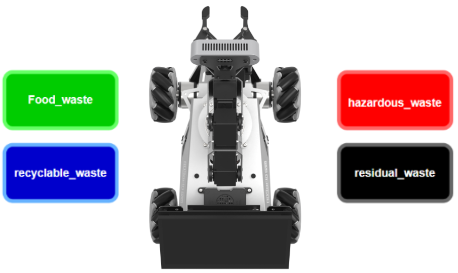

   | Name | Category |
   | --------------------------- | ------------------------------------------------------------ |
   | food_waste | DisposableChopsticks <br />BrokenBones<br />Ketchup |
   | hazardous_waste | Marker<br />OralLiquidBottle<br />StorageBattery |
   | recyclable_waste | PlasticBottle<br />Toothbrush<br />Umbrella |
   | residual_waste | Plate<br />CigaretteEnd<br />DisposableChopsticks |

9. After calibration is completed, the green box in the image changes to yellow and becomes the recognition area. Only garbage card blocks placed inside this area are recognized and then gripped.

   

10. To stop this feature, open a new command-line terminal and enter the following command:

    ```
    ~/.stop_ros.sh
    ```

    

11. Then close all terminals that were opened.

#### 10.2.6.4 Program Analysis

1. Launch File

Voice-controlled waste sorting links the voice control node with the camera node, allowing spoken commands to start or stop the feature and announce the category after the corresponding garbage card is picked up.

The launch file is located at:

**/home/ubuntu/ros2_ws/src/xf_mic_asr_offline/launch/voice_control_garbage_classification.launch.py**

**Launch file**

```py
    garbage_classification_launch = IncludeLaunchDescription(
        PythonLaunchDescriptionSource(
            os.path.join(example_package_path, 'example/garbage_classification/garbage_classification.launch.py')),
        launch_arguments={'start': 'false',
                          'broadcast': 'true'}.items()
    )

    mic_launch = IncludeLaunchDescription(
        PythonLaunchDescriptionSource(
            os.path.join(xf_mic_asr_offline_package_path, 'launch/mic_init.launch.py')),
    )
```

`garbage_classification_launch` starts the garbage classification node.

`mic_launch` starts the microphone function.

**Start node**

```py
    voice_control_garbage_classification_node = Node(
        package='xf_mic_asr_offline',
        executable='voice_control_garbage_classification.py',
        output='screen',
    )
```

`voice_control_garbage_classification_node` calls the source code for voice-controlled color sorting and starts the program.

2. Python Program File

The source code is located at:

**/home/ubuntu/ros2_ws/src/xf_mic_asr_offline/scripts/voice_control_garbage_classification.py**

**Function**

Main:

```py
def main():
    node = VoiceControlGarbageClassificationNode('voice_control_garbage_classification')
    executor = MultiThreadedExecutor()
    executor.add_node(node)
    executor.spin()
    node.destroy_node()
```

Starts voice-controlled garbage classification.

**Class**

`VoiceControlColorSortingNode`:

```py
class VoiceControlGarbageClassificationNode(Node):
    def __init__(self, name):
        rclpy.init()
        super().__init__(name, allow_undeclared_parameters=True, automatically_declare_parameters_from_overrides=True)
        self.running = True
        self.language = os.environ['ASR_LANGUAGE']
        timer_cb_group = ReentrantCallbackGroup()
        self.buzzer_pub = self.create_publisher(BuzzerState, '/ros_robot_controller/set_buzzer', 1)
        self.create_subscription(String, '/asr_node/voice_words', self.words_callback, 1, callback_group=timer_cb_group)
```

`Init`:

```py
    def __init__(self, name):
        rclpy.init()
        super().__init__(name, allow_undeclared_parameters=True, automatically_declare_parameters_from_overrides=True)
        self.running = True
        self.language = os.environ['ASR_LANGUAGE']
        timer_cb_group = ReentrantCallbackGroup()
        self.buzzer_pub = self.create_publisher(BuzzerState, '/ros_robot_controller/set_buzzer', 1)
        self.create_subscription(String, '/asr_node/voice_words', self.words_callback, 1, callback_group=timer_cb_group)
        self.client = self.create_client(Trigger, '/asr_node/init_finish')
        self.client.wait_for_service()
        self.start_client = self.create_client(Trigger, '/garbage_classification/start', callback_group=timer_cb_group)
        self.start_client.wait_for_service()
        self.play('running')

        self.get_logger().info('Wake up word: hello hiwonder')
        self.get_logger().info('No need to wake up within 15 seconds after waking up')
        self.get_logger().info('Voice command: sort waste/stop sort waste')
        self.create_service(Trigger, '~/init_finish', self.get_node_state)
        self.get_logger().info('\033[1;32m%s\033[0m' % 'start')
```

Initializes each parameter and calls the buzzer node, voice recognition node, and garbage classification node.

`get_node_state`:

```py
    def get_node_state(self, request, response):
        response.success = True
        return response
```

Sets the current node state.

`Play`:

```py
    def play(self, name):
        voice_play.play(name, language=self.language)
```

Plays audio.

`send_request`:

```py
    def send_request(self, client, msg):
        future = client.call_async(msg)
        while rclpy.ok():
            if future.done() and future.result():
                return future.result()
```

Publishes a service request.

`words_callback`:

```py
    def words_callback(self, msg):
        words = json.dumps(msg.data, ensure_ascii=False)[1:-1]
        if self.language == 'Chinese':
            words = words.replace(' ', '')
        self.get_logger().info('words: %s'%words)
        if words is not None and words not in ['wake-up-success', 'Sleep', 'Fail-5-times',
                                               'Fail-10-times']:
            if words == '开启垃圾分类' or words == 'sort waste':
                res = self.send_request(self.start_client, Trigger.Request())
                if res.success:
                    self.play('open_success')
                else:
                    self.play('open_fail')
            elif words == '关闭垃圾分类' or words == 'stop sort waste':
                res = self.send_request(self.start_client, Trigger.Request())
                if res.success:
                    self.play('close_success')
                else:
                    self.play('close_fail')
        elif words == 'wake-up-success':
            self.play('awake')
        elif words == 'Sleep':
            msg = BuzzerState()
            msg.freq = 1900
            msg.on_time = 0.05
            msg.off_time = 0.01
            msg.repeat = 1
            self.buzzer_pub.publish(msg)
```

The voice recognition callback function controls whether waste classification is enabled based on the recognized command and plays the corresponding voice prompt. The classification process is implemented inside the waste classification node.

### 10.2.7 Voice-Controlled Multi-Point Navigation

This section introduces how to control the robot by voice and navigate on a completed map.

#### 10.2.7.1 Preparation

* **Firmware Flashing**

Reference tutorial: [10.2.1.2 Preparation](p10-2-1-2)

* **Build a Map**

1. Build a map of the area where the robot is currently located. For mapping details, refer to **[5.1 Mapping Tutorial](https://wiki.hiwonder.com/projects/rosorin-pro/en/latest/docs/5_Mapping_%26_Navigation_Course.html#mapping-tutorial)** in the **5. Mapping & Navigation Course**.

2. Place the robot on an open platform and ensure sufficient free space within a 3-meter radius centered on the robot.

#### 10.2.7.2 Program Overview

First, enable the robot navigation service, load the map, and start the multi-point navigation service.

Then, the node subscribes to the voice recognition service to perform sound source localization, noise reduction, and voice recognition, and then obtains the recognized phrase and the angle of the sound source.

Next, the microphone recognizes speech. When the wake word and the command are recognized and meet the configured recognition threshold, the robot provides the corresponding voice feedback.

Finally, the robot navigates to the corresponding position on the map according to the recognized command. Global planning is performed first, and local planning is used when obstacles are encountered during movement.

#### 10.2.7.3 Operation Steps

<p id ="p11-3-8-1"></p>

> [!NOTE]
>
> **Commands are case-sensitive. The Tab key can be used for keyword auto-completion.**

1. Power on the robot and connect it to NoMachine. For remote desktop installation and connection, refer to Section **[1.7.1.2 NoMachine Installation](https://wiki.hiwonder.com/projects/rosorin-pro/en/latest/docs/1_ROSOrin_Pro_User_Manual.html#nomachine-installation)** in the user manual.

3. Click the desktop icon  to open a command-line terminal.

4. Enter the following command to stop the app auto-start service:

   ```
   sudo systemctl stop start_app_node.service
   ```

   

5. Enter the following command and press **Enter** to enable voice-controlled robot navigation:

   ```
   ros2 launch xf_mic_asr_offline voice_control_navigation.launch.py map:=map_01
   ```


The `map_01` at the end of the command is the map name. This parameter can be modified as needed. The map files are stored in **/home/ubuntu/ros2_ws/src/slam/maps**.

6. To stop this feature, open a new command-line terminal and enter the following command:

   ```
   ~/.stop_ros.sh
   ```

   

7. Then close all terminals that were opened.

#### 10.2.7.4 Program Outcome

After the activity starts, say the wake word **Hello Hiwonder**, then say a command to control the robot's movement.

For example, say **Hello Hiwonder** first, and the robot responds with **I'm here**. Then say **Go to point A**, and the robot moves to the upper-right side of the start position.

The command phrases and corresponding functions are shown in the table below. The directions are based on the robot's first-person perspective.

| **Command Phrase** |                 **Function**                  |
| :----------: | :---------------------------------------: |
|    Go to point A     | Move the robot to point A, which is at the upper-right of the starting position. |
|    Go to point B     |  Move the robot to point B, which is at the upper-left of the starting position.  |
|    Go to point C     |    Move the robot to point C, which is below point A.    |
|    Return to origin    |           Move the robot back to the origin.           |

#### 10.2.7.5 Program Analysis

1. Launch File

The launch file is located at:

**/home/ubuntu/ros2_ws/src/xf_mic_asr_offline/launch/voice_control_navigation.launch.py**

**Launch file**

```py
    navigation_launch = IncludeLaunchDescription(
        PythonLaunchDescriptionSource(
            os.path.join(navigation_package_path, 'launch/navigation.launch.py')),
        launch_arguments={
            'map': map_name,
            'master_name': master_name,
            'robot_name': robot_name
        }.items(),
    )

    mic_launch = IncludeLaunchDescription(
        PythonLaunchDescriptionSource(
            os.path.join(xf_mic_asr_offline_package_path, 'launch/mic_init.launch.py')),
    )
```

`navigation_launch` starts navigation.

`mic_launch` starts the microphone function.

**Start node**

```py
    voice_control_navigation_node = Node(
        package='xf_mic_asr_offline',
        executable='voice_control_navigation.py',
        output='screen',
        parameters=[{
            'map_frame': map_frame,
            'costmap': cosmap,
            'cmd_vel': cmd_vel,
            'goal': goal,
        }]
    )
```

`voice_control_navigation_node` calls the source code for voice-controlled multi-point navigation and starts the program.

2. Python Program File

The source code is located at:

**/home/ubuntu/ros2_ws/src/xf_mic_asr_offline/scripts/voice_control_navigation.py**

**Function**

Main:

```py
def main():
    node = VoiceControlNavNode('voice_control_nav')
    rclpy.spin(node)
    node.destroy_node()
    rclpy.shutdown()
```

Starts voice-controlled multi-point navigation.

**Class**

`VoiceControlNavNode`:

```py
class VoiceControlNavNode(Node):
    def __init__(self, name):
        rclpy.init()
        super().__init__(name)

        self.angle = None
        self.words = None
        self.running = True
        self.haved_stop = False
        self.last_status = Twist()
```

`Init`:

```py
    def __init__(self, name):
        rclpy.init()
        super().__init__(name)

        self.angle = None
        self.words = None
        self.running = True
        self.haved_stop = False
        self.last_status = Twist()

        self.language = os.environ['ASR_LANGUAGE']
        self.declare_parameter('costmap', '/local_costmap/costmap')
        self.declare_parameter('map_frame', 'map')
        self.declare_parameter('goal_pose', '/goal_pose')
        self.declare_parameter('cmd_vel', '/controller/cmd_vel')

        self.costmap = self.get_parameter('costmap').value
        self.map_frame = self.get_parameter('map_frame').value
        self.goal_pose = self.get_parameter('goal_pose').value
        self.cmd_vel = self.get_parameter('cmd_vel').value

        self.clock = self.get_clock()
        self.mecanum_pub = self.create_publisher(Twist, self.cmd_vel, 1)
        self.goal_pub = self.create_publisher(PoseStamped, self.goal_pose, 1)
        self.create_subscription(String, '/asr_node/voice_words', self.words_callback, 1)
        self.create_subscription(Int32, '/awake_node/angle', self.angle_callback, 1)
        
        self.client = self.create_client(Trigger, '/asr_node/init_finish')
        self.client.wait_for_service()

        self.mecanum_pub.publish(Twist())
        self.buzzer_pub = self.create_publisher(BuzzerState, '/ros_robot_controller/set_buzzer', 1)
        self.play('running')

        self.get_logger().info('Wake up word: hello hiwonder')
        self.get_logger().info('No need to wake up within 15 seconds after waking up')
        self.get_logger().info('Voice command: go to A/B/C point go back to the start')

        threading.Thread(target=self.main, daemon=True).start()
        self.create_service(Trigger, '~/init_finish', self.get_node_state)
        self.get_logger().info('\033[1;32m%s\033[0m' % 'start')
```

Initializes each parameter, sets the parameters required for navigation, calls the voice recognition node and buzzer node, and starts the `main` function.

`get_node_state`:

```
    def get_node_state(self, request, response):
        response.success = True
        return response
```

Sets the current node state.

`Play`:

```py
    def play(self, name):
        voice_play.play(name, language=self.language)
```

Plays audio.

`words_callback`:

```py
    def words_callback(self, msg):
        self.words = json.dumps(msg.data, ensure_ascii=False)[1:-1]
        if self.language == 'Chinese':
            self.words = self.words.replace(' ', '')
        self.get_logger().info('words:%s' % self.words)
        if self.words is not None and self.words not in ['wake-up-success', 'Sleep', 'Fail-5-times',
                                                         'Fail-10-times']:
            pass
        elif self.words == 'wake-up-success':
            self.play('awake')
        elif self.words == 'Sleep':
            msg = BuzzerState()
            msg.freq = 1000
            msg.on_time = 0.1
            msg.off_time = 0.01
            msg.repeat = 1
            self.buzzer_pub.publish(msg)
```

The voice recognition callback function controls whether waste classification is enabled based on the recognized command and plays the corresponding voice prompt. The classification process is implemented inside the waste classification node.

`angle_callback`:

```py
    def angle_callback(self, msg):
        self.angle = msg.data
        self.get_logger().info('angle:%s' % self.angle)
```

The sound source recognition callback function reads the angle of the sound source relative to the microphone based on the wake direction.

Main:

```py
    def main(self):
        while True:
            if self.words is not None:
                pose = PoseStamped()
                pose.header.frame_id = self.map_frame
                pose.header.stamp = self.clock.now().to_msg()
                if self.words == '去\'A\'点' or self.words == 'go to A point':
                    self.get_logger().info('>>>>>> go a')
                    pose.pose.position.x = 1.0
                    pose.pose.position.y = -1.0
                    pose.pose.orientation.w = 1.0
                    self.play('go_a')
                    self.goal_pub.publish(pose)
                elif self.words == '去\'B\'点' or self.words == 'go to B point':
                    self.get_logger().info('>>>>>> go b')
                    pose.pose.position.x = 2.0
                    pose.pose.position.y = 0.0
                    pose.pose.orientation.w = 1.0
                    self.play('go_b')
                    self.goal_pub.publish(pose)
                elif self.words == '去\'C\'点' or self.words == 'go to C point':
                    self.get_logger().info('>>>>>> go c')
                    pose.pose.position.x = 1.0
                    pose.pose.position.y = 1.0
                    pose.pose.orientation.w = 1.0
                    self.play('go_c')
                    self.goal_pub.publish(pose)
                elif self.words == '回原点' or self.words == 'go back to the start':
                    self.get_logger().info('>>>>>> go origin')
                    pose.pose.position.x = 0.0
                    pose.pose.position.y = 0.0
                    pose.pose.orientation.w = 1.0
                    self.play('go_origin')
                    self.goal_pub.publish(pose)
                self.words = None
            else:
                time.sleep(0.01)
```

Publishes navigation target points to the navigation node according to the recognized voice command and plays the corresponding voice feedback.

* **Feature extension**

By default, point A is at the upper-right corner of the map relative to the robot’s starting position, with coordinates **1, -1**, in meters. Changing the coordinate values changes the position of point A. The following example moves point A to the lower-right of the starting position.

> [!NOTE]
>
> * **The operations in this section can also be used to modify the positions of point B and point C.**
>
> * **Commands are case-sensitive. The Tab key can be used for keyword auto-completion.**

1. Power on the robot and connect it to the NoMachine remote control software.

2. Click the desktop icon  to open a command-line terminal.

3. Enter the following command to stop the app auto-start service:

   ```
   sudo systemctl stop start_app_node.service
   ```


4. Enter the following command and press **Enter** to open the program file:

   ```
   vim ./ros2_ws/src/xf_mic_asr_offline/scripts/voice_control_navigation.py
   ```


5. Find the code shown below:

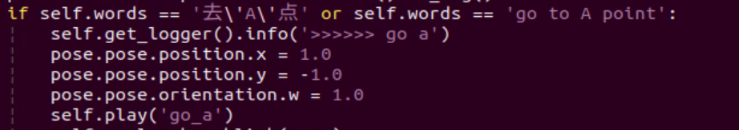

6. Press the **i** key to enter edit mode. Change **1** to **-1**.

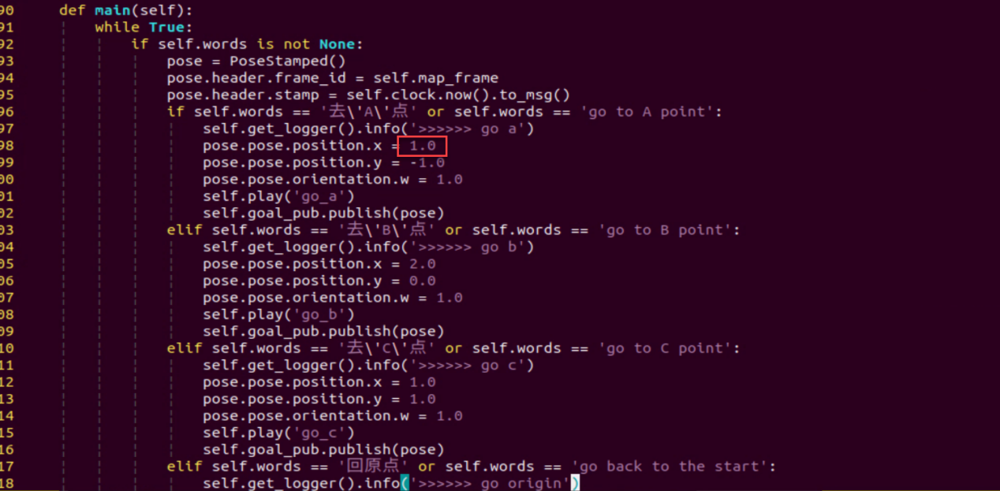

From the robot's first-person perspective, the positive X-axis points forward, and the positive Y-axis points to the left. Therefore, changing the X-axis coordinate of point A from a positive value to a negative value moves the point to the lower-right side of the robot.

7. After the modification is complete, press **Esc**, enter `:wq`, and press **Enter** to save and exit the file.

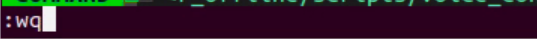

8. Restart the feature by following **[Operation Steps](#p11-3-8-1)** to verify the modified result.

### 10.2.8 Voice-Controlled Navigation and Transport

This section introduces how to control the robot by voice and perform navigation-based transport on a completed map.

#### 10.2.8.1 Preparation

* **Firmware Flashing**

Reference tutorial: [10.2.1.2 Preparation](p10-2-1-2)

* **Build a Map**

1. Build a map of the area where the robot is currently located. For mapping details, refer to **[5.1 Mapping Tutorial](https://wiki.hiwonder.com/projects/rosorin-pro/en/latest/docs/5_Mapping_%26_Navigation_Course.html#mapping-tutorial)** in the **5. Mapping & Navigation Course**.

2. Place the robot on an open platform and ensure sufficient free space within a 3-meter radius centered on the robot.

#### 10.2.8.2 Program Overview

First, enable the robot navigation service, load the map, and start the multi-point navigation service.

Then, the node subscribes to the voice recognition service to perform sound source localization, noise reduction, and speech recognition, then obtains the recognized phrase and the angle of the sound source.

Next, the microphone recognizes speech. When the wake word and the command are recognized and meet the configured recognition threshold, the robot provides the corresponding voice feedback.

Finally, the robot navigates to the corresponding position on the map according to the recognized command. Global planning is performed first, and local planning is used when obstacles are encountered during movement. When the robot reaches the first point, the alignment-and-pick service is called. When it reaches the second point, the place service is called.

#### 10.2.8.3 Operation Steps

<p id ="p11-3-9-1"></p>

> [!NOTE]
>
> **Commands are case-sensitive. The Tab key can be used for keyword auto-completion.**

1. Power on the robot and connect it to NoMachine. For remote desktop installation and connection, refer to Section **[1.7.1.2 NoMachine Installation](https://wiki.hiwonder.com/projects/rosorin-pro/en/latest/docs/1_ROSOrin_Pro_User_Manual.html#nomachine-installation)** in the user manual.

2. Click the desktop icon  to open a command-line terminal.

4. Enter the following command to stop the app auto-start service:

   ```
   sudo systemctl stop start_app_node.service
   ```

   

5. Enter the following command and press **Enter** to enable voice-controlled navigation and transport:

   ```
   ros2 launch xf_mic_asr_offline voice_control_navigation_transport.launch.py map:=map_01
   ```


The `map_01` at the end of the command is the map name. This parameter can be modified as needed. The map files are stored in **/home/ubuntu/ros2_ws/src/slam/maps**.

5. To stop this feature, open a new command-line terminal and enter the following command:

```
~/.stop_ros.sh
```


6. Then close all terminals that were opened.

#### 10.2.8.4 Program Outcome

After the activity starts, say the wake word **Hello Hiwonder**, then say a command to control the robot's movement.

For example, say **Hello Hiwonder** first, and the robot responds with **I’m here**. Then say **Start navigation and transport**. The robot moves to the map coordinate 0, 0.5, 0 to pick up the object. After gripping is complete, it moves to coordinate 1.5, 0, 0 for placement.

#### 10.2.8.5 Program Analysis

1. Launch File

The launch file is located at:

**/home/ubuntu/ros2_ws/src/xf_mic_asr_offline/launch/voice_control_navigation_transport.launch.py**

**Launch file**

```py
    navigation_transport_launch = IncludeLaunchDescription(
        PythonLaunchDescriptionSource(
            os.path.join(example_package_path, 'example/navigation_transport/navigation_transport.launch.py')),
        launch_arguments={
            'map': map_name,
            'broadcast': 'true',
            'place_position': "[0.0, 0.5, 0.0, 0.0, 0.0]",
        }.items(),
    )

    mic_launch = IncludeLaunchDescription(
        PythonLaunchDescriptionSource(
            os.path.join(xf_mic_asr_offline_package_path, 'launch/mic_init.launch.py')),
    )
```

`navigation_transport_launch` starts the navigation and transport function.

`mic_launch` starts the microphone function.

**Start node**

```py
    voice_control_navigation_transport_node = Node(
        package='xf_mic_asr_offline',
        executable='voice_control_navigation_transport.py',
        output='screen',
        parameters=[{
            'pick_position': [1.5, 0, 0.0, 0.0, 0.0],
        }]
    )
```

`voice_control_navigation_node` calls the source code for voice-controlled multi-point navigation and starts the program.

2. Python Program File

The source code is located at:

**/home/ubuntu/ros2_ws/src/xf_mic_asr_offline/scripts/voice_control_navigation_transport.py**

**Function**

Main:

```py
def main():
    node = VoiceControlNavigationTransportNode('voice_control_navigation_transport')
    executor = MultiThreadedExecutor()
    executor.add_node(node)
    executor.spin()
    node.destroy_node()
```

Starts voice-controlled navigation and transport.

**Class**

`VoiceControlNavigationTransportNode`:

```py
class VoiceControlNavigationTransportNode(Node):
    def __init__(self, name):
        rclpy.init()
        super().__init__(name, allow_undeclared_parameters=True, automatically_declare_parameters_from_overrides=True)
        self.running = True

        self.language = os.environ['ASR_LANGUAGE']
        self.pick_position = self.get_parameter('pick_position').value
        timer_cb_group = ReentrantCallbackGroup()
        self.buzzer_pub = self.create_publisher(BuzzerState, '/ros_robot_controller/set_buzzer', 1)
        self.create_subscription(String, '/asr_node/voice_words', self.words_callback, 1, callback_group=timer_cb_group)
        self.set_pose_client = self.create_client(SetPose2D, '/navigation_transport/pick', callback_group=timer_cb_group)
        self.set_pose_client.wait_for_service()
        self.client = self.create_client(Trigger, '/asr_node/init_finish')
        self.client.wait_for_service()
        self.play('running')

        self.get_logger().info('Wake up word: hello hiwonder')
        self.get_logger().info('No need to wake up within 15 seconds after waking up')
        self.get_logger().info('控制指令: 导航搬运(Voice command: navigate and transport)')
        self.create_service(Trigger, '~/init_finish', self.get_node_state)
        self.get_logger().info('\033[1;32m%s\033[0m' % 'start')
```

`Init`:

```py
    def __init__(self, name):
        rclpy.init()
        super().__init__(name, allow_undeclared_parameters=True, automatically_declare_parameters_from_overrides=True)
        self.running = True

        self.language = os.environ['ASR_LANGUAGE']
        self.pick_position = self.get_parameter('pick_position').value
        timer_cb_group = ReentrantCallbackGroup()
        self.buzzer_pub = self.create_publisher(BuzzerState, '/ros_robot_controller/set_buzzer', 1)
        self.create_subscription(String, '/asr_node/voice_words', self.words_callback, 1, callback_group=timer_cb_group)
        self.set_pose_client = self.create_client(SetPose2D, '/navigation_transport/pick', callback_group=timer_cb_group)
        self.set_pose_client.wait_for_service()
        self.client = self.create_client(Trigger, '/asr_node/init_finish')
        self.client.wait_for_service()
        self.play('running')

        self.get_logger().info('Wake up word: hello hiwonder')
        self.get_logger().info('No need to wake up within 15 seconds after waking up')
        self.get_logger().info('Voice command: navigate and transport')
        self.create_service(Trigger, '~/init_finish', self.get_node_state)
        self.get_logger().info('\033[1;32m%s\033[0m' % 'start')
```

Initializes each parameter, sets the parameters required for navigation and transport, calls the voice recognition node and the navigation and transport node, and starts the `main` function.

`get_node_state`:

```py
    def get_node_state(self, request, response):
        response.success = True
        return response
```

Sets the current node state.

`send_request`:

```py
    def send_request(self, client, msg):
        future = client.call_async(msg)
        while rclpy.ok():
            if future.done() and future.result():
                return future.result()
```

Publishes a service request.

`Play`:

```py
    def play(self, name):
        voice_play.play(name, language=self.language)
```

Plays audio.

`words_callback`:

```py
    def words_callback(self, msg):
        words = json.dumps(msg.data, ensure_ascii=False)[1:-1]
        if self.language == 'Chinese':
            words = words.replace(' ', '')
        self.get_logger().info('words: %s'%words)
        if words is not None and words not in ['wake-up-success', 'Sleep', 'Fail-5-times',
                                               'Fail-10-times']:
            if words == '导航搬运' or words == 'navigate and transport':
                msg = SetPose2D.Request()
                msg.data.x = self.pick_position[0]
                msg.data.y = self.pick_position[1]
                msg.data.roll = self.pick_position[2]
                msg.data.pitch = self.pick_position[3]
                msg.data.yaw = self.pick_position[4]
                self.get_logger().info(str(msg))
                res = self.send_request(self.set_pose_client, msg)
                if res.success:
                    self.play('start_navigating')
                else:
                    self.play('open_fail')
        elif words == 'wake-up-success':
            self.play('awake')
        elif words == 'Sleep':
            msg = BuzzerState()
            msg.freq = 1900
            msg.on_time = 0.05
            msg.off_time = 0.01
            msg.repeat = 1
            self.buzzer_pub.publish(msg)
```

The voice recognition callback function controls whether navigation starts based on the recognized command.

#### Gripping Calibration

By default, the recognition and gripping area is located at the center of the image and usually does not need adjustment. If the robotic arm cannot grip the color block during the activity, the area position can be adjusted through program commands. The steps are as follows.

1. Power on the robot and connect it to the NoMachine remote control software.

2. Click the desktop icon  to open a command-line terminal.

3. Enter the following command to stop the app auto-start service:

   ```
   sudo systemctl stop start_app_node.service
   ```

   

4. Enter the following command to start calibration for the gripping position:

   ```
   ros2 launch example automatic_pick.launch.py debug:=true
   ```

   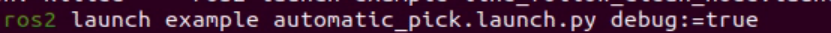

5. After the robotic arm moves to the gripping position, place the color block in the center of the gripper. Wait for the robotic arm to reset and grip again. Calibration is complete after this process. Once calibration is complete, the terminal prints the pixel coordinates of the color block in the image and a completion message.

   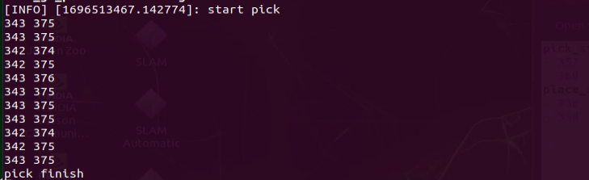

   The automatically calibrated data is saved in **/home/ros2_ws/src/example/config/automatic_pick_rol.yaml**.

   **pick_stop_pixel_coordinate** is the pixel coordinate of the gripping position in the image. The first value is the x-axis coordinate. Decreasing this value moves the gripping position left. Increasing this value moves the gripping position to the right. The second value is the y-axis coordinate. Decreasing this value moves the gripping position closer. Increasing this value moves the gripping position farther away. In most cases, the automatic calibration result can be used, though it can also be adjusted as needed.

   **place_stop_pixel_coordinate** is the pixel coordinate of the placement position in the image. The first value is the x-axis coordinate. Decreasing this value moves the gripping position left. Increasing this value moves the gripping position to the right. The second value is the y-axis coordinate. Decreasing this value moves the gripping position closer. Increasing this value moves the gripping position farther away.

   > [!NOTE]
   >
   > **Automatic calibration only calibrates the coordinates of the gripping position. The coordinates of the placement position are not calibrated automatically. If a placement target is set and the placement result is not ideal, manual adjustment is required.**

   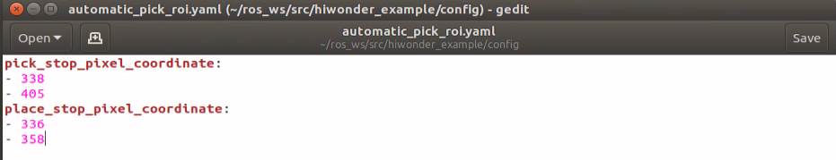

6. After the modification is complete, follow **[Operation Steps](#p11-3-9-1)** to test the feature.

## 10.3 Switching Wake Words

<p id ="p11-4"></p>

The system uses the English wake-up phrase **Hello Hiwonder** by default. To use a different wake-up phrase or command, follow the steps below.

1. Make sure the corresponding firmware is flashed first. Refer to the tutorial [12.4 Comprehensive Application of Large AI Models/12.4.1 Preparation](https://wiki.hiwonder.com/projects/rosorin-pro/en/latest/docs/12_Large_AI_Model_Courses.html#id31) in the **12. Large AI Model Courses** for detailed instructions.

   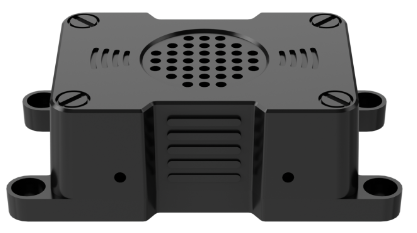

   <p style="text-align:center">AI Voice Interaction Box WonderEcho Pro</p>

   1. Then use the configuration tool on the desktop to set and save the language. Double-click the Tool icon  on the system desktop.
   
   2. Set the language to **English**, then click **Save** > **Apply** > **Quit**.
   
      
   
   3. After restarting the robot, the wake word will be successfully switched.
