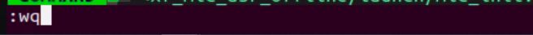
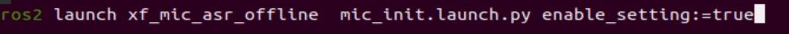
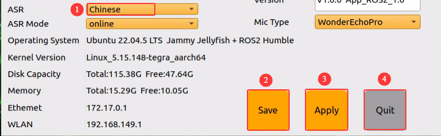

# 10. Voice Control Course

## 10.1 Introduction to WonderEcho Pro

### 10.1.1 Overview of WonderEcho Pro

WonderEcho Pro, also called the AI voice interaction box, integrates a high-performance noise-reduction microphone and a high-fidelity speaker. It uses a USB audio conversion module and supports driver-free plug-and-play operation, recording, and playback across multiple systems.

It integrates different speech-processing modules and uses advanced noise suppression algorithms. Background noise in the environment can be filtered effectively, which supports the full workflow from wake-word detection to speech recognition and interaction. This interaction box adopts a modular design, so each functional component, such as wake-up, detection, recognition, and synthesis, can be developed and tested independently.

### 10.1.2 Features and Specifications of WonderEcho Pro

1. Built-in microphone and speaker interfaces support audio input and output.

2. Driver-free, compatible with multiple systems, and ready for plug-and-play operation. The integrated listening and playback design supports Windows, macOS, Linux, Android, and other systems.

3. Uses a standard USB 2.0 interface.

4. Control interface: USB

5. Speech chip model: Cl1302

6. Speaker drive: 3.0 W per channel, 4 Ω BTL

7. Supply voltage: 5 V

### 10.1.3 Recording and Playback Test

**The Raspberry Pi 5 is used as the example below. The same connection and test procedure also apply to Jetson and other compatible devices.**

* **Connection Diagram and Detection**


If the main controller is a Raspberry Pi, access the Raspberry Pi desktop through `VNC` remote desktop according to **[1. Robot Version Overview -> 1.4.2 Remote Device Connection]()**. Check whether the microphone and speaker icons appear in the upper-right corner. If the icons are present, the connection is successful.


If the main controller is a Jetson device, use the NoMachine remote connection tool and check whether the speaker icon appears in the upper-right area of the system interface.


* **Recording Test**

1. Open a new terminal, then run the following command. The `-l` option uses a lowercase `l`. Check the displayed card number. The example below shows `0`. Use the actual query result in practice.

   ```
   arecord -l
   ```

   

2. Run the following command to start recording. Replace the highlighted card number with the number obtained in the previous step.

   ```
   arecord -D hw:0,0 -f S16_LE -r 16000 -c 2 test.wav
   ```

3. A file named **`test.wav`** will be generated in the current folder.


4. Record about 5 seconds of audio, then press **Ctrl+C** to stop recording.

* **Playback Test**

1. After recording is complete, run the following command in the current folder to check whether the file was created successfully.

    ```
    ls
    ```


2. If **`test.wav`** appears, the recording was successful. Run the following command for playback testing:

   ```
   aplay test.wav
   ```


## 10.2 WonderEchoPro Installation

> [!NOTE]
>
> **When installing WonderEchoPro, keep the front of the robot facing forward. The WonderEchoPro USB port should face left, which is the same side as the Raspberry Pi USB interface.**


### 10.2.1 Voice-Controlled Robot Movement

* **Program Overview**

This section uses the speech recognition feature carried by the robot to control the robot to perform the corresponding movement, such as moving forward and backward through voice commands.

In the program design, the speech recognition service published by the microphone array node is subscribed to. Speech localization, noise reduction, and recognition are then performed to obtain the recognized sentence and the sound-source angle. After the robot is awakened successfully and a specific command is spoken, the robot provides corresponding voice feedback. Specific voice commands are then published to the robot to control chassis actions such as forward movement, backward movement, left turns, and right turns.

Complete the setup in **Preparation**, then follow **Procedure** to experience this feature.

* **Preparation**

1. Before this lesson starts, install the **microphone array module**, **sound card**, and **speaker** on the robot if they are not already installed, then connect them to the **USB** port on the hub.

2. Refer to the related materials in the same directory to apply for an **APPID** and replace the language resource file **`common.jet`**.

* **Operation Steps**

<p id ="p11-3-2-1"></p>

> [!NOTE]
>
> **Commands are case-sensitive. Use the Tab key to complete keywords.**

1. Start the robot and connect it to the NoMachine remote control software. For connection details, refer to **[1. Robot Quick Start Guide -> 6. Development Environment Setup]()**.

2. The robot uses the English wake word `hello hi hiwonder` by default. To switch to Chinese or to use WonderEchoPro with flashed voice interaction command words, refer to [10.3 Switching Between Chinese and English Wake Words](#p11-4).

3. Click the icon  on the system desktop to open a terminal.

4. Run the following command to stop the APP auto-start service:

   ```
   sudo systemctl stop start_app_node.service
   ```

   

5. Run the following command and press **Enter** to start voice-controlled robot movement:

   ```
   ros2 launch xf_mic_asr_offline voice_control_move.launch.py
   ```


6. After the program is loaded successfully, say the wake word **小幻小幻** first and wait for the speaker to play **我在**. Then say the next voice command. For example, say **前进**. After the robot recognizes the command, the speaker will play **好的，开始前进**, and the robot will perform the corresponding movement.

The command phrases and their corresponding actions are listed below:

| **Command Phrase** | **Function** |
| --- | --- |
| `前进` | Move the robot forward |
| `后退` | Move the robot backward |
| `左转` | Turn the robot left |
| `右转` | Turn the robot right |

> [!NOTE]
>
> **Notes:**
>
> **Use this feature in a relatively quiet environment for the best experience.**
>
> **Say the wake word before each voice command when possible.**
>
> **Speak each voice command loudly and clearly.**
>
> **Issue commands one at a time and wait until one feedback cycle is complete before saying the next command.**

7. To stop this feature, open a new terminal and run the following command:

   ```
   ~/.stop_ros.sh
   ```

   

8. Close all terminals that were opened during the procedure.

* **Program Analysis**

Voice-controlled robot movement connects the voice-control node with the robot low-level driver node, then uses spoken commands to control the robot to perform the corresponding actions.

**1. Launch File**

The launch file is located at:

**/home/ubuntu/ros2_ws/src/xf_mic_asr_offline/launch/voice_control_move.launch.py**

**Launch File**

```py
    controller_launch = IncludeLaunchDescription(
        PythonLaunchDescriptionSource(
            os.path.join(controller_package_path, 'launch/controller.launch.py')),
    )

    lidar_launch = IncludeLaunchDescription(
        PythonLaunchDescriptionSource(
            os.path.join(peripherals_package_path, 'launch/lidar.launch.py')),
    )

    mic_launch = IncludeLaunchDescription(
        PythonLaunchDescriptionSource(
            os.path.join(xf_mic_asr_offline_package_path, 'launch/mic_init.launch.py')),
    )
```

`controller_launch` starts the chassis-control node. After startup, the servo motors can be controlled.

`lidar_launch` starts the LiDAR node and publishes LiDAR data.

`mic_launch` starts the microphone function.

**Start Node**

```py
    voice_control_move_node = Node(
        package='xf_mic_asr_offline',
        executable='voice_control_move.py',
        output='screen',
    )
```

`voice_control_move_node` calls the source code for voice-controlled movement and starts the program.

**2. Python Launch File**

The program source code is located at:

**/home/ubuntu/ros2_ws/src/xf_mic_asr_offline/scripts/voice_control_move.py**

**Function**

`Main`:

```py
def main():
    node = VoiceControMovelNode('voice_control_move')
    rclpy.spin(node)
    node.destroy_node()
    rclpy.shutdown()
```

Starts voice-controlled movement.

**Class**

```py
class VoiceControMovelNode(Node):
    def __init__(self, name):
        rclpy.init()
        super().__init__(name)

        self.angle = None
        self.words = None
        self.running = True
        self.haved_stop = False
        self.lidar_follow = False
        self.start_follow = False
        self.last_status = Twist()
```

`Init`:

```py
        self.pid_yaw = pid.PID(1.6, 0, 0.16)
        self.pid_dist = pid.PID(1.7, 0, 0.16)

        self.language = os.environ['ASR_LANGUAGE']
        self.lidar_type = os.environ.get('LIDAR_TYPE')
        self.machine_type = os.environ.get('MACHINE_TYPE')
        self.mecanum_pub = self.create_publisher(Twist, '/controller/cmd_vel', 1)
        self.buzzer_pub = self.create_publisher(BuzzerState, '/ros_robot_controller/set_buzzer', 1)
        qos = QoSProfile(depth=1, reliability=QoSReliabilityPolicy.BEST_EFFORT)
        self.create_subscription(LaserScan, '/scan_raw', self.lidar_callback, qos)  # Subscribe to LiDAR data
        self.create_subscription(String, '/asr_node/voice_words', self.words_callback, 1)
        self.create_subscription(Int32, '/awake_node/angle', self.angle_callback, 1)

        self.client = self.create_client(Trigger, '/asr_node/init_finish')
        self.client.wait_for_service()  # Blocking wait
        self.declare_parameter('delay', 0)
        time.sleep(self.get_parameter('delay').value)
        self.mecanum_pub.publish(Twist())
        self.play('running')

        self.get_logger().info('唤醒口令: 小幻小幻(Wake up word: hello hiwonder)')
        self.get_logger().info('唤醒后15秒内可以不用再唤醒(No need to wake up within 15 seconds after waking up)')
        if self.machine_type == 'JetRover_Acker':
            self.get_logger().info('控制指令: 左转 右转 前进 后退(Voice command: turn left/turn right/go forward/go backward)')
        else:
            self.get_logger().info('控制指令: 左转 右转 前进 后退 过来(Voice command: turn left/turn right/go forward/go backward/come here)')
        self.time_stamp = time.time()
        self.current_time_stamp = time.time()
        threading.Thread(target=self.main, daemon=True).start()
        self.create_service(Trigger, '~/init_finish', self.get_node_state)
        self.get_logger().info('\033[1;32m%s\033[0m' % 'start')
```

Initializes the parameters, calls the chassis node, buzzer node, LiDAR node, and speech recognition node, then starts the `main` function.

`get_node_state`:

```py
    def get_node_state(self, request, response):
        response.success = True
        return response
```

Initializes the node state.

`Play`:

```py
    def play(self, name):
        voice_play.play(name, language=self.language)
```

Plays audio.

`words_callback`:

```py
    def words_callback(self, msg):
        self.words = json.dumps(msg.data, ensure_ascii=False)[1:-1]
        if self.language == 'Chinese':
            self.words = self.words.replace(' ', '')
        self.get_logger().info('words:%s' % self.words)
        if self.words is not None and self.words not in ['唤醒成功(wake-up-success)', '休眠(Sleep)', '失败5次(Fail-5-times)',
                                                         '失败10次(Fail-10-times']:
            pass
        elif self.words == '唤醒成功(wake-up-success)':
            self.play('awake')
        elif self.words == '休眠(Sleep)':
            msg = BuzzerState()
            msg.freq = 1000
            msg.on_time = 0.1

            msg.off_time = 0.01
            msg.repeat = 1
            self.buzzer_pub.publish(msg)
```

The speech-recognition callback function reads the data returned by the microphone through the node.

`angle_callback`:

```py
    def angle_callback(self, msg):
        self.angle = msg.data
        self.get_logger().info('angle:%s' % self.angle)
        self.start_follow = False
        self.mecanum_pub.publish(Twist())
```

The sound-source recognition callback function reads the direction of the detected sound source. The angle is provided by microphone-based sound-source localization.

`lidar_callback`:

```py
    def lidar_callback(self, lidar_data):
        twist = Twist()
        # Data size = scan angle / angle increment per scan
        if self.lidar_type != 'G4':
            min_index = int(math.radians(MAX_SCAN_ANGLE / 2.0) / lidar_data.angle_increment)
            max_index = int(math.radians(MAX_SCAN_ANGLE / 2.0) / lidar_data.angle_increment)
            left_ranges = lidar_data.ranges[:max_index]  # Left-side data
            right_ranges = lidar_data.ranges[::-1][:max_index]  # Right-side data
        elif self.lidar_type == 'G4':
            '''
                ranges[right...->left]

                    forward
                     lidar
                 left 0 right

            '''
            min_index = int(math.radians((360 - MAX_SCAN_ANGLE) / 2.0) / lidar_data.angle_increment)
            max_index = min_index + int(math.radians(MAX_SCAN_ANGLE / 2.0) / lidar_data.angle_increment)
            left_ranges = lidar_data.ranges[::-1][min_index:max_index][::-1]  # Left-side data
            right_ranges = lidar_data.ranges[min_index:max_index][::-1]  # Right-side data
        # self.get_logger().info(self.lidar_type)
        if self.start_follow:
            # Get data according to the settings
            angle = self.scan_angle / 2
            angle_index = int(angle / lidar_data.angle_increment + 0.50)
            left_range, right_range = np.array(left_ranges[:angle_index]), np.array(right_ranges[:angle_index])

            
            # self.get_logger().info(str(left_range))
            # Merge the distance data from the right side counterclockwise to the left side
            ranges = np.append(right_range[::-1], left_range)
            nonzero = ranges.nonzero()
            nonan = np.isfinite(ranges[nonzero])
            dist_ = ranges[nonzero][nonan]
            # self.get_logger().info(str(dist_))
            if len(dist_) > 0:
```

The LiDAR callback function processes LiDAR data. During following behavior, the robot uses the microphone sound-source localization angle together with PID control to calculate angular velocity, then tracks the object closest to the robot. The robot also uses the detected object position in the LiDAR scan together with PID control to calculate linear and angular velocity.

`Main`:

```py
    def main(self):
        while True:
            if self.words is not None:
                twist = Twist()
                if self.words == '前进' or self.words == 'go forward':
                    self.play('go')
                    self.time_stamp = time.time() + 2
                    twist.linear.x = 0.2
                elif self.words == '后退' or self.words == 'go backward':
                    self.play('back')
                    self.time_stamp = time.time() + 2
                    twist.linear.x = -0.2
                elif self.words == '左转' or self.words == 'turn left':
                    self.play('turn_left')
                    self.time_stamp = time.time() + 2
                    if self.machine_type == 'JetRover_Acker':
                        twist.linear.x = 0.2
                        twist.angular.z = twist.linear.x/0.5 
                    else:
                        twist.angular.z = 0.8
                elif self.words == '右转' or self.words == 'turn right':
                    self.play('turn_right')
                    self.time_stamp = time.time() + 2
                    if self.machine_type == 'JetRover_Acker':
                        twist.linear.x = 0.2
                        twist.angular.z = -twist.linear.x/0.5
                    else:
                        twist.angular.z = -0.8
```

After a command is received, different linear and angular velocities are published according to the command so the robot can perform different movements.

* **Extensions**

**1. Modify the Wake Word**

The default wake word is **小幻小幻**. It can be changed by modifying the configuration file. The example below changes the wake word to **小爱小爱**.

> [!NOTE]
>
> **Commands are case-sensitive. Use the Tab key to complete keywords.**

1. Start the robot and connect it to the NoMachine remote control software.

2. Click the icon  on the system desktop to open a terminal.

3. Run the following command and press **Enter**:

   ```
   vim ./ros2_ws/src/xf_mic_asr_offline/launch/mic_init.launch.py
   ```

   

4. Find the code shown below:


5. Press **i** to enter edit mode, then change the value of **`chinese_awake_words`** to **`xiao3 ai4 xiao3 ai4`**.


6. After the modification is complete, press **Esc**, type **`:wq`**, then press **Enter** to save the file and exit.



7. Run the following command to set the wake command:

   ```
   ros2 launch xf_mic_asr_offline mic_init.launch.py enable_setting:=true
   ```



The setting process takes about 30 seconds. The parameter `enable_setting` does not need to be added again during the next startup.

8. Refer to [Procedure](#p11-3-2-1) to restart the feature and check the modified result.

### 10.2.2 Voice-Controlled Robotic Arm

* **Program Overview**

This section combines the robot speech recognition feature with the vision-guided robotic arm to control the robotic arm to perform the corresponding actions.

In the program design, the speech recognition service published by the microphone array node is subscribed to. Speech localization, noise reduction, and recognition are then performed to obtain the recognized sentence and the sound-source angle. After the robot is awakened successfully and a specific command is spoken, the robot provides corresponding voice feedback. Specific voice commands are then published to the robotic arm so it can perform the corresponding actions.

Complete the setup in **Preparation**, then follow **Procedure** to experience this feature.

* **Preparation**

1. Before this lesson starts, install the **microphone array module**, **sound card**, and **speaker** on the robot if they are not already installed, then connect them to the **USB** port on the hub.

2. Refer to the related materials in the same directory to apply for an **APPID** and replace the language resource file **`common.jet`**.

* **Operation Steps**

> [!NOTE]
>
> **Commands are case-sensitive. Use the Tab key to complete keywords.**

1. Start the robot and connect it to the NoMachine remote control software. For connection details, refer to **[1. Robot Quick Start Guide -> 6. Development Environment Setup]()**.

2. The robot uses the English wake word `hello hi hiwonder` by default. To switch to Chinese or to use WonderEchoPro with flashed voice interaction command words, refer to [10.3 Switching Between Chinese and English Wake Words](#p11-4).

3. Click the icon  on the system desktop to open a terminal.

4. Run the following command to stop the APP auto-start service:

   ```
   sudo systemctl stop start_app_node.service
   ```

   

5. Run the following command and press **Enter** to start voice-controlled robot movement:

   ```
   ros2 launch xf_mic_asr_offline voice_control_arm.launch.py
   ```


6. After the program loads successfully, say the wake word **小幻小幻** first and wait for the speaker to play **我在**.

   Then say the control command **拔个萝卜**. The robotic arm will pick up the object directly in front. Then say **拿给我**. The robotic arm will hand the picked object over from the side.

   

> [!NOTE]
>
> **Notes:**
>
> **Use this feature in a relatively quiet environment for the best experience.**
>
> **Say the wake word before each voice command when possible.**
>
> **Speak each voice command loudly and clearly.**
>
> **Issue commands one at a time and wait until one feedback cycle is complete before saying the next command.**

7. To stop this feature, open a new terminal and run the following command:

   ```
   ~/.stop_ros.sh
   ```

   

8. Close all terminals that were opened during the procedure.

* **Program Analysis**

Voice-controlled robotic arm operation connects the voice-control node with the robot low-level driver node, then uses spoken commands to control the robotic arm to perform the corresponding actions.

**1. Launch File**

The launch file is located at:

**/home/ubuntu/ros2_ws/src/xf_mic_asr_offline/launch/voice_control_arm.launch.py**

**Launch File**

```py
    controller_launch = IncludeLaunchDescription(
        PythonLaunchDescriptionSource(
            os.path.join(controller_package_path, 'launch/controller.launch.py')),
    )

    mic_launch = IncludeLaunchDescription(
        PythonLaunchDescriptionSource(
            os.path.join(xf_mic_asr_offline_package_path, 'launch/mic_init.launch.py')),
    )
```

`controller_launch` starts the chassis-control node. After startup, the servo motors can be controlled.

`mic_launch` starts the microphone function.

**Start Node**

```py
    voice_control_arm_node = Node(
        package='xf_mic_asr_offline',
        executable='voice_control_arm.py',
        output='screen',
    )
```

`voice_control_move_node` calls the source code for voice-controlled movement and starts the program.

**2. Python Launch File**

The program source code is located at:

**/home/ubuntu/ros2_ws/src/xf_mic_asr_offline/scripts/voice_control_move.py**

**Function**

`Main`:

```py
def main():
    node = VoiceControMovelNode('voice_control_move')
    rclpy.spin(node)
    node.destroy_node()
    rclpy.shutdown()
```

Starts voice-controlled movement.

**Class**

```py
class VoiceControMovelNode(Node):
    def __init__(self, name):
        rclpy.init()
        super().__init__(name)

        self.angle = None
        self.words = None
        self.running = True
        self.haved_stop = False
        self.lidar_follow = False
        self.start_follow = False
        self.last_status = Twist()
        self.threshold = 3
        self.speed = 0.3
        self.stop_dist = 0.4
        self.count = 0
        self.scan_angle = math.radians(90)

        self.pid_yaw = pid.PID(1.6, 0, 0.16)
        self.pid_dist = pid.PID(1.7, 0, 0.16)

        self.language = os.environ['ASR_LANGUAGE']
        self.lidar_type = os.environ.get('LIDAR_TYPE')
        self.machine_type = os.environ.get('MACHINE_TYPE')
        self.mecanum_pub = self.create_publisher(Twist, '/controller/cmd_vel', 1)
        self.buzzer_pub = self.create_publisher(BuzzerState, '/ros_robot_controller/set_buzzer', 1)
        qos = QoSProfile(depth=1, reliability=QoSReliabilityPolicy.BEST_EFFORT)
        self.create_subscription(LaserScan, '/scan_raw', self.lidar_callback, qos)  # Subscribe to LiDAR data
        self.create_subscription(String, '/asr_node/voice_words', self.words_callback, 1)
        self.create_subscription(Int32, '/awake_node/angle', self.angle_callback, 1)

        self.client = self.create_client(Trigger, '/asr_node/init_finish')
        self.client.wait_for_service()  # Blocking wait
        self.declare_parameter('delay', 0)
        time.sleep(self.get_parameter('delay').value)
        self.mecanum_pub.publish(Twist())
        self.play('running')
```

`Init`:

```py
    def __init__(self, name):
        rclpy.init()
        super().__init__(name)

        self.angle = None
        self.words = None
        self.running = True
        self.haved_stop = False
        self.lidar_follow = False
        self.start_follow = False
        self.last_status = Twist()
        self.threshold = 3
        self.speed = 0.3
        self.stop_dist = 0.4
        self.count = 0
        self.scan_angle = math.radians(90)

        self.pid_yaw = pid.PID(1.6, 0, 0.16)
        self.pid_dist = pid.PID(1.7, 0, 0.16)
```

Initializes the parameters, calls the servo node, buzzer node, and speech recognition node, then starts the `main` function.

`get_node_state`:

```py
    def get_node_state(self, request, response):
        response.success = True
        return response
```

Initializes the node state.

`Play`:

```py
    def play(self, name):
        voice_play.play(name, language=self.language)
```

Plays audio.

`words_callback`:

```py
    def words_callback(self, msg):
        self.words = json.dumps(msg.data, ensure_ascii=False)[1:-1]
        if self.language == 'Chinese':
            self.words = self.words.replace(' ', '')
        self.get_logger().info('words:%s' % self.words)
        if self.words is not None and self.words not in ['唤醒成功(wake-up-success)', '休眠(Sleep)', '失败5次(Fail-5-times)',
                                                         '失败10次(Fail-10-times']:
            pass
        elif self.words == '唤醒成功(wake-up-success)':
            self.play('awake')
        elif self.words == '休眠(Sleep)':
            msg = BuzzerState()
            msg.freq = 1000
            msg.on_time = 0.1

            msg.off_time = 0.01
            msg.repeat = 1
            self.buzzer_pub.publish(msg)
```

The speech-recognition callback function reads the data returned by the microphone through the node and runs the corresponding action group according to the recognized speech.

### 10.2.3 Voice-Controlled Color Recognition

* **Program Overview**

This section combines the robot speech recognition feature with the vision-guided robotic arm to recognize red, green, and blue objects.

In the program design, the speech recognition service published by the microphone array node is subscribed to. Speech localization, noise reduction, and recognition are then performed to obtain the recognized sentence and the sound-source angle. After the robot is awakened successfully and a specific command is spoken, the robot provides corresponding voice feedback. The onboard camera then recognizes red, green, and blue objects.

Complete the setup in **Preparation**, then follow **Procedure** to experience this feature.

* **Preparation**

1. Before this lesson starts, install the **microphone array module**, **sound card**, and **speaker** on the robot if they are not already installed, then connect them to the **USB** port on the hub.

2. Refer to the related materials in the same directory to apply for an **APPID** and replace the language resource file **`common.jet`**.

* **Operation Steps**

> [!NOTE]
>
> **Notes:**
>
> **Do not place objects with the same or similar colors in the background during color recognition, or interference may occur.**
>
> **If color recognition is inaccurate, adjust the color threshold in [ROS2 Course \ 6 ROS+OpenCV Course]().**

1. Start the robot and connect it to the NoMachine remote control software. For connection details, refer to **[1. Robot Quick Start Guide -> 6. Development Environment Setup]()**.

2. The robot uses the English wake word `hello hi hiwonder` by default. To switch to Chinese or to use WonderEchoPro with flashed voice interaction command words, refer to [10.3 Switching Between Chinese and English Wake Words](#p11-4).

3. Click the icon  on the system desktop to open a terminal.

4. Run the following command to stop the APP auto-start service:

   ```
   sudo systemctl stop start_app_node.service
   ```

   

5. Run the following command and press **Enter** to start voice-controlled robot movement:

   ```
   ros2 launch xf_mic_asr_offline voice_control_color_detect.launch.py
   ```


6. After the program starts, say the wake word **小幻小幻**, then say the command **开启颜色识别** to start color recognition. The robot recognizes the color and broadcasts the color name. Using red as an example, place a red block within the camera view. When a red object is recognized, the robot broadcasts **红色**.

   To stop color recognition, say the wake word **小幻小幻**, then say **关闭颜色识别**.

> [!NOTE]
>
> **Notes:**
>
> **Use this feature in a relatively quiet environment for the best experience.**
>
> **Say the wake word before each voice command when possible.**
>
> **Speak each voice command loudly and clearly.**
>
> **Issue commands one at a time and wait until one feedback cycle is complete before saying the next command.**

7. To stop this feature, open a new terminal and run the following command:

   ```
   ~/.stop_ros.sh
   ```

   

8. Close all terminals that were opened during the procedure.

* **Program Analysis**

Voice-controlled color recognition connects the voice-control node with the robot low-level driver node and the camera node, then uses spoken commands to control the robot to recognize color blocks.

**1. Launch File**

The launch file is located at:

**/home/ubuntu/ros2_ws/src/xf_mic_asr_offline/launch/voice_control_color_detect.py.launch**

**Launch File**

```py
    controller_launch = IncludeLaunchDescription(
        PythonLaunchDescriptionSource(
            os.path.join(controller_package_path, 'launch/controller.launch.py')),
    )

    color_detect_launch = IncludeLaunchDescription(
        PythonLaunchDescriptionSource(
            os.path.join(example_package_path, 'example/color_detect/color_detect_node.launch.py')),
        launch_arguments={
            'enable_display': 'true',
        }.items(),       
    )

    mic_launch = IncludeLaunchDescription(
        PythonLaunchDescriptionSource(
            os.path.join(xf_mic_asr_offline_package_path, 'launch/mic_init.launch.py')),
    )

    voice_control_color_detect_node = Node(
        package='xf_mic_asr_offline',
        executable='voice_control_color_detect.py',
        output='screen',
    )

    init_pose_launch = IncludeLaunchDescription(
        PythonLaunchDescriptionSource(os.path.join(controller_package_path, 'launch/init_pose.launch.py')),
        launch_arguments={
            'namespace': '',  
            'use_namespace': 'false',
            'action_name': 'horizontal',
        }.items(),
    )
```

`controller_launch` starts the chassis control node. After startup, it can control the servos and motors.

`color_detect_launch` starts the color-recognition node.

`mic_launch` starts the microphone function.

`init_pose_launch` initializes the motion.

**Start Node**

```py
    voice_control_color_detect_node = Node(
        package='xf_mic_asr_offline',
        executable='voice_control_color_detect.py',
        output='screen',
    )
```

`voice_control_color_detect_node` calls the source code for voice-controlled color recognition and starts the program.

**2. Python Program**

The program source code is located at:

**/home/ubuntu/ros2_ws/src/xf_mic_asr_offline/scripts/voice_control_color_detect.py**

**Function**

`Main`:

```py
def main():
    node = VoiceControlColorDetectNode('voice_control_color_detect')
    executor = MultiThreadedExecutor()
    executor.add_node(node)
    executor.spin()
    node.destroy_node()
```

Starts voice-controlled color recognition.

**Class**

VoiceControlColorDetectNode**：**

```py
class VoiceControlColorDetectNode(Node):
    def __init__(self, name):
        rclpy.init()
        super().__init__(name, allow_undeclared_parameters=True, automatically_declare_parameters_from_overrides=True)
        
        self.count = 0
        self.color = None
        self.running = True
        self.last_color = None
```

`Init`:

```py
        self.count = 0
        self.color = None
        self.running = True
        self.last_color = None
        signal.signal(signal.SIGINT, self.shutdown)

        self.language = os.environ['ASR_LANGUAGE']
        
        self.buzzer_pub = self.create_publisher(BuzzerState, '/ros_robot_controller/set_buzzer', 1)
        timer_cb_group = ReentrantCallbackGroup()
        self.create_subscription(String, '/asr_node/voice_words', self.words_callback, 1, callback_group=timer_cb_group)
        self.create_subscription(ColorsInfo, '/color_detect/color_info', self.get_color_callback, 1)
        self.client = self.create_client(Trigger, '/asr_node/init_finish')
        self.client.wait_for_service()
        self.client = self.create_client(Trigger, '/color_detect/init_finish')
        self.client.wait_for_service() 
        self.set_color_client = self.create_client(SetColorDetectParam, '/color_detect/set_param', callback_group=timer_cb_group)
        self.set_color_client.wait_for_service()
        self.play('running')
        self.get_logger().info('唤醒口令: 小幻小幻(Wake up word: hello hiwonder)')
        self.get_logger().info('唤醒后15秒内可以不用再唤醒(No need to wake up within 15 seconds after waking up)')
        self.get_logger().info('控制指令: 开启颜色识别 关闭颜色识别(Voice command: start color recognition/stop color recognition)')

        threading.Thread(target=self.main, daemon=True).start()
        self.create_service(Trigger, '~/init_finish', self.get_node_state)
        self.get_logger().info('\033[1;32m%s\033[0m' % 'start')
```

Initializes the parameters, calls the chassis node, buzzer node, LiDAR node, speech recognition node, and color-recognition node, then starts the `main` function.

`get_node_state`:

```py
    def get_node_state(self, request, response):
        response.success = True
        return response
```

Sets the current node state.

`Play`:

```py
    def play(self, name):
        voice_play.play(name, language=self.language)
```

Plays audio.

Shutdown：

```py
    def shutdown(self, signum, frame):
        self.running = False
```

The callback function after program shutdown sets the `running` parameter to `False` so the program stops.

get_color_callback：

```py
    def get_color_callback(self, msg):
        data = msg.data
        if data != []:
            if data[0].radius > 30:
                self.color = data[0].color
            else:
                self.color = None
        else:
            self.color = None
```

Obtains the current color-recognition result from the data published by the color-recognition node.

send_request:

```py
    def send_request(self, client, msg):
        future = client.call_async(msg)
        while rclpy.ok():
            if future.done() and future.result():
                return future.result()
```

Publishes a service request.

`words_callback`:

```py
    def words_callback(self, msg):
        words = json.dumps(msg.data, ensure_ascii=False)[1:-1]
        if self.language == 'Chinese':
            words = words.replace(' ', '')
        self.get_logger().info('words: %s'%words)
        if words is not None and words not in ['唤醒成功(wake-up-success)', '休眠(Sleep)', '失败5次(Fail-5-times)',
                                               '失败10次(Fail-10-times']:
            if words == '开启颜色识别' or words == 'start color recognition':
                msg_red = ColorDetect()
                msg_red.color_name = 'red'
                msg_red.detect_type = 'circle'
                msg_green = ColorDetect()
                msg_green.color_name = 'green'
                msg_green.detect_type = 'circle'
                msg_blue = ColorDetect()
                msg_blue.color_name = 'blue'
                msg_blue.detect_type = 'circle'
                msg = SetColorDetectParam.Request()
                msg.data = [msg_red, msg_green, msg_blue]
                res = self.send_request(self.set_color_client, msg)
```

The speech-recognition callback function controls whether recognition is enabled according to the recognized speech. When recognition is enabled, feedback is provided according to the information from the color-recognition node.

`Main`:

```py
    def main(self):
        while self.running:
            if self.color == 'red' and self.last_color != 'red':
                self.last_color = 'red'
                self.play('red')
                self.get_logger().info('\033[1;32m%s\033[0m' % 'red')
            elif self.color == 'green' and self.last_color != 'green':
                self.last_color = 'green'
                self.play('green')
                self.get_logger().info('\033[1;32m%s\033[0m' % 'green')
            elif self.color == 'blue' and self.last_color != 'blue':
                self.last_color = 'blue'
                self.play('blue')
                self.get_logger().info('\033[1;32m%s\033[0m' % 'blue')
            else:
                self.count += 1
                time.sleep(0.01)
                if self.count > 50:
                    self.count = 0
                    self.last_color = self.color
```

Plays the corresponding voice feedback according to the recognized color.

### 10.2.4 Voice-Controlled Color Tracking

* **Program Overview**

This section combines the robot speech recognition feature with the vision-guided robotic arm to recognize red, green, and blue color blocks.

In the program design, the speech recognition service published by the microphone array node is subscribed to. Speech localization, noise reduction, and recognition are then performed to obtain the recognized sentence and the sound-source angle. After the robot is awakened successfully and a specific command is spoken, the robot provides corresponding voice feedback. The pan-tilt camera then follows the target object of the specified color.

Complete the setup in **Preparation**, then follow **Procedure** to experience this feature.

* **Preparation**

1. Before this lesson starts, install the **microphone array module**, **sound card**, and **speaker** on the robot if they are not already installed, then connect them to the **USB** port on the hub.

2. Refer to the related materials in the same directory to apply for an **APPID** and replace the language resource file **`common.jet`**.

* **Operation Steps**

> [!NOTE]
>
> **Notes:**
>
> **Do not place objects with the same or similar colors in the background during color recognition, or interference may occur.**
>
> **If color recognition is inaccurate, adjust the color threshold in [ROS2 Course \ 6 ROS+OpenCV Course]().**

1. Start the robot and connect it to the NoMachine remote control software. For connection details, refer to **[1. Robot Quick Start Guide -> 6. Development Environment Setup]()**.

2. The robot uses the English wake word `hello hi hiwonder` by default. To switch to Chinese or to use WonderEchoPro with flashed voice interaction command words, refer to [10.3 Switching Between Chinese and English Wake Words](#p11-4).

3. Click the icon  on the system desktop to open a terminal.

4. Run the following command to stop the APP auto-start service:

   ```
   sudo systemctl stop start_app_node.service
   ```

   

5. Run the following command and press **Enter** to start voice-controlled color tracking:

   ```
   ros2 launch xf_mic_asr_offline voice_control_color_track.launch.py
   ```


6. After the program starts, voice commands can be issued. The program recognizes red, green, and blue. Using red as an example, place a red object within the camera view. Say the wake word **小幻小幻**, then say the tracking command **追踪红色**. For blue and green, use **追踪蓝色** and **追踪绿色**. Once red is recognized, the camera on the robotic arm tracks the target object in real time so the 3D depth camera stays aligned with the red block. When the block moves, the pan-tilt moves with it.

> [!NOTE]
>
> **Notes:**
>
> **Use this feature in a relatively quiet environment for the best experience.**
>
> **Say the wake word before each voice command when possible.**
>
> **Speak each voice command loudly and clearly.**
>
> **Issue commands one at a time and wait until one feedback cycle is complete before saying the next command.**

7. To stop this feature, open a new terminal and run the following command:

   ```
   ~/.stop_ros.sh
   ```

   

8. Close all terminals that were opened during the procedure.

* **Program Analysis**

Voice-controlled color tracking connects the voice-control node with the camera node, then uses spoken commands to control the robot to recognize and track color blocks.

**1. Launch File**

The launch file is located at:

**/home/ubuntu/ros2_ws/src/xf_mic_asr_offline/launch/voice_control_color_track.py.launch**

**Launch File**

```py
    color_track_launch = IncludeLaunchDescription(
        PythonLaunchDescriptionSource(
            os.path.join(example_package_path, 'example/color_track/color_track_node.launch.py')),
        launch_arguments={'start': 'false'}.items()
    )

    mic_launch = IncludeLaunchDescription(
        PythonLaunchDescriptionSource(
            os.path.join(xf_mic_asr_offline_package_path, 'launch/mic_init.launch.py')),
    )
```

`color_track_launch` starts the color-tracking node.

`mic_launch` starts the microphone function.

**Start Node**

```py
    voice_control_color_track_node = Node(
        package='xf_mic_asr_offline',
        executable='voice_control_color_track.py',
        output='screen',
    )
```

`voice_control_color_track_node` calls the source code for voice-controlled color tracking and starts the program.

**2. Python Program**

The program source code is located at:

**/home/ubuntu/ros2_ws/src/xf_mic_asr_offline/scripts/voice_control_color_track.py**

**Function**

`Main`:

```py
def main():
    node = VoiceControlColorTrackNode('voice_control_color_track')
    executor = MultiThreadedExecutor()
    executor.add_node(node)
    executor.spin()
    node.destroy_node()
```

Starts voice-controlled color tracking.

**Class**

VoiceControlColorTrackNode**：**

```py
class VoiceControlColorTrackNode(Node):
    def __init__(self, name):
        rclpy.init()
        super().__init__(name, allow_undeclared_parameters=True, automatically_declare_parameters_from_overrides=True)

        self.language = os.environ['ASR_LANGUAGE']
        timer_cb_group = ReentrantCallbackGroup()
        self.buzzer_pub = self.create_publisher(BuzzerState, '/ros_robot_controller/set_buzzer', 1)
        self.create_subscription(String, '/asr_node/voice_words', self.words_callback, 1, callback_group=timer_cb_group)
```

`Init`:

```py
    def __init__(self, name):
        rclpy.init()
        super().__init__(name, allow_undeclared_parameters=True, automatically_declare_parameters_from_overrides=True)

        self.language = os.environ['ASR_LANGUAGE']
        timer_cb_group = ReentrantCallbackGroup()
        self.buzzer_pub = self.create_publisher(BuzzerState, '/ros_robot_controller/set_buzzer', 1)
        self.create_subscription(String, '/asr_node/voice_words', self.words_callback, 1, callback_group=timer_cb_group)
        self.client = self.create_client(Trigger, '/asr_node/init_finish')
        self.client.wait_for_service()
        self.client = self.create_client(Trigger, '/color_track/init_finish')
        self.client.wait_for_service()
        self.start_client = self.create_client(Trigger, '/color_track/start')
        self.start_client.wait_for_service()
        self.set_color_client = self.create_client(SetString, '/color_track/set_color', callback_group=timer_cb_group)
        self.set_color_client.wait_for_service()

        self.timer = self.create_timer(0.0, self.init_process, callback_group=timer_cb_group)
```

Initializes the parameters, calls the buzzer node, speech recognition node, and color-tracking node, then initializes the motion.

init_process：

```py
    def init_process(self):
        self.timer.cancel()

        res = self.send_request(self.start_client, Trigger.Request())
        if res.success:
            self.get_logger().info('open color_track')
        else:
            self.get_logger().info('open color_track fail')
        self.play('running')
        self.get_logger().info('唤醒口令: 小幻小幻(Wake up word: hello hiwonder)')
        self.get_logger().info('唤醒后15秒内可以不用再唤醒(No need to wake up within 15 seconds after waking up)')
        self.get_logger().info('控制指令: 追踪红色 追踪绿色 追踪蓝色 停止追踪(Voice command: track red/green/blue object)')

        self.create_service(Trigger, '~/init_finish', self.get_node_state)
        self.get_logger().info('\033[1;32m%s\033[0m' % 'start')
```

Starts the color-tracking feature, provides command prompts, and initializes the marker node.

`get_node_state`:

```py
    def get_node_state(self, request, response):
        response.success = True
        return response
```

Sets the current node state.

`Play`:

```py
    def play(self, name):
        voice_play.play(name, language=self.language)
```

Plays audio.

send_request:

```py
    def send_request(self, client, msg):
        future = client.call_async(msg)
        while rclpy.ok():
            if future.done() and future.result():
                return future.result()
```

Publishes a service request.

`words_callback`:

```py
    def words_callback(self, msg):
        words = json.dumps(msg.data, ensure_ascii=False)[1:-1]
        if self.language == 'Chinese':
            words = words.replace(' ', '')
        self.get_logger().info('words: %s'%words)
        if words is not None and words not in ['唤醒成功(wake-up-success)', '休眠(Sleep)', '失败5次(Fail-5-times)',
                                               '失败10次(Fail-10-times']:
            if words == '追踪红色' or words == 'track red object':
                msg = SetString.Request()
                msg.data = 'red'
                res = self.send_request(self.set_color_client, msg)
                if res.success:
                    self.play('start_track_red')
                else:
                    self.play('track_fail')
            elif words == '追踪绿色' or words == 'track green object':
                msg = SetString.Request()
                msg.data = 'green'
                res = self.send_request(self.set_color_client, msg)
                if res.success:
                    self.play('start_track_green')
                else:
                    self.play('track_fail')
            elif words == '追踪蓝色' or words == 'track blue object':
                msg = SetString.Request()
                msg.data = 'blue'
                res = self.send_request(self.set_color_client, msg)
                if res.success:
                    self.play('start_track_blue')
                else:
                    self.play('track_fail')
            elif words == '停止追踪' or words == 'stop tracking':
                msg = SetString.Request()
                res = self.send_request(self.set_color_client, msg)
                if res.success:
                    self.play('stop_track')
                else:
                    self.play('stop_fail')
        elif words == '唤醒成功(wake-up-success)':
            self.play('awake')
        elif words == '休眠(Sleep)':
            msg = BuzzerState()
            msg.freq = 1900
            msg.on_time = 0.05
            msg.off_time = 0.01
            msg.repeat = 1
            self.buzzer_pub.publish(msg)
```

The speech recognition callback function determines whether color tracking should be enabled based on the recognized voice command, plays the corresponding voice response, and passes the target color to the color tracking node. The tracking logic is implemented in the color tracking node.

### 10.2.5 Voice-Controlled Color Block Sorting

* **Program Overview**

This section combines the robot speech recognition feature with the vision-guided robotic arm to recognize red, green, and blue color blocks, then pick and sort them.

In the program design, the speech recognition service published by the microphone array node is subscribed to. Speech localization, noise reduction, and recognition are then performed to obtain the recognized sentence and the sound-source angle. After the robot is awakened successfully and a specific command is spoken, the robot provides corresponding voice feedback. After the specified color is recognized, the robotic arm moves down to the target position, picks up the color block, and places it at the specified location.

Complete the setup in **Preparation**, then follow **Procedure** to experience this feature.

* **Preparation**

1. Before this lesson starts, install the **microphone array module**, **sound card**, and **speaker** on the robot if they are not already installed, then connect them to the **USB** port on the hub.

2. Refer to the related materials in the same directory to apply for an **APPID** and replace the language resource file **`common.jet`**.

3. Prepare three color blocks in different colors in advance: red, green, and blue.

* **Operation Steps**

> [!NOTE]
>
> **Notes:**
>
> **Do not place objects with the same or similar colors in the background during color recognition, or interference may occur.**
>
> **If color recognition is inaccurate, adjust the color threshold in [ROS2 Course \ 6 ROS+OpenCV Course]().**

1. Start the robot and connect it to the NoMachine remote control software. For connection details, refer to **[1. Robot Quick Start Guide -> 6. Development Environment Setup]()**.

2. The robot uses the English wake word `hello hi hiwonder` by default. To switch to Chinese or to use WonderEchoPro with flashed voice interaction command words, refer to [10.3 Switching Between Chinese and English Wake Words](#p11-4).

3. Click the icon  on the system desktop to open a terminal.

4. Run the following command to stop the APP auto-start service:

   ```
   sudo systemctl stop start_app_node.service
   ```

   

5. Run the following command and press **Enter** to start voice-controlled color sorting:

   ```
   ros2 launch xf_mic_asr_offline voice_control_color_sorting.launch.py debug:=true
   ```


6. After startup, the vision-guided robotic arm moves to a calibrated pose. Place the color block to be recognized in the center of the gripper, as shown below:

   

7. The robotic arm then lifts up and enters the waiting-for-recognition state. During this process, the color block does not need to be moved.

8. After the program identifies the exact position of the current color block, the camera feed highlights the position with a yellow box. Subsequent recognition, picking, and related actions use this position as the reference.

9. Say the wake word **小幻小幻**, then say the command **开启颜色分拣** to start color block sorting. The robotic arm then picks up the color block.

10. The robot then places the color block in the matching color zone, as shown below.

    

11. After placement, the robotic arm returns to the waiting-for-recognition pose shown in Step 6. Place the color block inside the yellow box in the video feed for recognition again, and the color block sorting feature can be executed again.

12. Say the wake word **小幻小幻**, then say the command **停止颜色分拣** to stop color block sorting on the vision-guided robotic arm.

13. To stop this feature, open a new terminal and run the following command:

    ```
    ~/.stop_ros.sh
    ```

    

14. Close all terminals that were opened during the procedure.

* **Program Analysis**

Voice-controlled color sorting connects the voice-control node with the camera node, then uses spoken commands to start or stop this feature.

**1. Launch File**

The launch file is located at:

**/home/ubuntu/ros2_ws/src/xf_mic_asr_offline/launch/voice_control_color_track.launch.py**

**Launch File**

```py
    color_track_launch = IncludeLaunchDescription(
        PythonLaunchDescriptionSource(
            os.path.join(example_package_path, 'example/color_track/color_track_node.launch.py')),
        launch_arguments={'start': 'false'}.items()
    )

    mic_launch = IncludeLaunchDescription(
        PythonLaunchDescriptionSource(
            os.path.join(xf_mic_asr_offline_package_path, 'launch/mic_init.launch.py')),
    )
```

`color_sorting_launch` starts the color sorting node.

`mic_launch` starts the microphone function.

**Start Node**

```py
    voice_control_color_track_node = Node(
        package='xf_mic_asr_offline',
        executable='voice_control_color_track.py',
        output='screen',
    )
```

`voice_control_color_track_node` is used to call the source code for voice-controlled color sorting and start the program.

**2. Python Program**

The program source code is located at:

**/home/ubuntu/ros2_ws/src/xf_mic_asr_offline/scripts/voice_control_color_detect.py**

**Function**

`Main`:

```py
def main():
    node = VoiceControlColorDetectNode('voice_control_color_detect')
    executor = MultiThreadedExecutor()
    executor.add_node(node)
    executor.spin()
    node.destroy_node()
```

Starts voice-controlled color sorting.

**Class**

VoiceControlColorSortingNode**：**

```py
class VoiceControlColorDetectNode(Node):
    def __init__(self, name):
        rclpy.init()
        super().__init__(name, allow_undeclared_parameters=True, automatically_declare_parameters_from_overrides=True)
        
        self.count = 0
        self.color = None
        self.running = True
        self.last_color = None
        signal.signal(signal.SIGINT, self.shutdown)
```

`Init`:

```py
    def __init__(self, name):
        rclpy.init()
        super().__init__(name, allow_undeclared_parameters=True, automatically_declare_parameters_from_overrides=True)
        
        self.count = 0
        self.color = None
        self.running = True
        self.last_color = None
        signal.signal(signal.SIGINT, self.shutdown)

        self.language = os.environ['ASR_LANGUAGE']
        
        self.buzzer_pub = self.create_publisher(BuzzerState, '/ros_robot_controller/set_buzzer', 1)
        timer_cb_group = ReentrantCallbackGroup()
        self.create_subscription(String, '/asr_node/voice_words', self.words_callback, 1, callback_group=timer_cb_group)
        self.create_subscription(ColorsInfo, '/color_detect/color_info', self.get_color_callback, 1)
        self.client = self.create_client(Trigger, '/asr_node/init_finish')
        self.client.wait_for_service()
        self.client = self.create_client(Trigger, '/color_detect/init_finish')
        self.client.wait_for_service() 
        self.set_color_client = self.create_client(SetColorDetectParam, '/color_detect/set_param', callback_group=timer_cb_group)
        self.set_color_client.wait_for_service()
        self.play('running')
        self.get_logger().info('唤醒口令: 小幻小幻(Wake up word: hello hiwonder)')
        self.get_logger().info('唤醒后15秒内可以不用再唤醒(No need to wake up within 15 seconds after waking up)')
        self.get_logger().info('控制指令: 开启颜色识别 关闭颜色识别(Voice command: start color recognition/stop color recognition)')

        threading.Thread(target=self.main, daemon=True).start()
        self.create_service(Trigger, '~/init_finish', self.get_node_state)
        self.get_logger().info('\033[1;32m%s\033[0m' % 'start')
```

Initializes each parameter and calls the speech recognition node and the color sorting node.

`get_node_state`:

```py
    def get_node_state(self, request, response):
        response.success = True
        return response
```

Sets the current node state.

`Play`:

```py
    def play(self, name):
        voice_play.play(name, language=self.language)
```

Plays audio.

send_request:

```py
    def send_request(self, client, msg):
        future = client.call_async(msg)
        while rclpy.ok():
            if future.done() and future.result():
                return future.result()
```

Publishes a service request.

`words_callback`:

```py
    def words_callback(self, msg):
        words = json.dumps(msg.data, ensure_ascii=False)[1:-1]
        if self.language == 'Chinese':
            words = words.replace(' ', '')
        self.get_logger().info('words: %s'%words)
        if words is not None and words not in ['唤醒成功(wake-up-success)', '休眠(Sleep)', '失败5次(Fail-5-times)',
                                               '失败10次(Fail-10-times']:
            if words == '开启颜色识别' or words == 'start color recognition':
                msg_red = ColorDetect()
                msg_red.color_name = 'red'
                msg_red.detect_type = 'circle'
                msg_green = ColorDetect()
                msg_green.color_name = 'green'
                msg_green.detect_type = 'circle'
                msg_blue = ColorDetect()
                msg_blue.color_name = 'blue'
                msg_blue.detect_type = 'circle'
                msg = SetColorDetectParam.Request()
                msg.data = [msg_red, msg_green, msg_blue]
                res = self.send_request(self.set_color_client, msg)
                if res.success:
                    self.play('open_success')
                else:
                    self.play('open_fail')
            elif words == '关闭颜色识别' or words == 'stop color recognition':
                msg = SetColorDetectParam.Request()
                res = self.send_request(self.set_color_client, msg)
                if res.success:
                    self.play('close_success')
                else:
                    self.play('close_fail')
        elif words == '唤醒成功(wake-up-success)':
            self.play('awake')
        elif words == '休眠(Sleep)':
            msg = BuzzerState()
            msg.freq = 1900
            msg.on_time = 0.05
            msg.off_time = 0.01
            msg.repeat = 1
            self.buzzer_pub.publish(msg)
```

The speech recognition callback function determines whether sorting should be enabled based on the recognized voice command, plays the corresponding voice response according to the recognition result, and implements the sorting behavior in the color sorting node.

### 10.2.6 Voice-Controlled Garbage Sorting

This lesson explains how to use voice commands to control the robot to recognize and sort waste cards.

* **Preparation**

1. Before this lesson starts, install the **microphone array module**, **sound card**, and **speaker** on the robot if they are not already installed, then connect them to the **USB** port on the hub.

2. Confirm that the **APPID** in the configuration file has been updated through the remote desktop, and replace the **Common.jet** file with the file obtained by downloading and extracting it from iFLYTEK.

3. If the preparation above has not been completed, refer to **[ROS2 Course \ 10 Voice Control Course \ Basic Voice Course]()** in the same chapter to apply for the APPID and replace the file.

* **Program Overview**

First, the speech recognition service published by the microphone array node is subscribed to. Speech localization, noise reduction, and recognition are then performed to obtain the recognized sentence and the sound-source angle.

Next, after the robot is awakened successfully and a specific phrase is spoken, the robot gives the corresponding voice response.

Finally, the recognized phrase is matched against the command list, and the robot performs the corresponding action based on the result.

* **Operation Steps**

> [!NOTE]
>
> **Commands are case-sensitive. Use the Tab key to complete keywords.**

1. Start the robot and connect it to the NoMachine remote control software. For details about connecting through the remote desktop, refer to **[1. Robot Quick Start Guide -> 6. Development Environment Setup]()**.

2. The robot uses the English wake word `hello hi hiwonder` by default. To switch to Chinese or to use WonderEchoPro with flashed voice interaction command words, refer to [10.3 Switching Between Chinese and English Wake Words](#p11-4).

3. Click the icon  on the system desktop to open a terminal.

4. Run the following command to stop the APP auto-start service:

   ```
   sudo systemctl stop start_app_node.service
   ```

   

5. Run the following command and press **Enter** to start garbage sorting:

   ```
   ros2 launch xf_mic_asr_offline voice_control_garbage_classification.launch.py debug:=true
   ```

6. Before recognition and picking begin, the robotic arm enters the calibration stage. It performs a downward grasping motion. At this time, the gripper remains open. Place the **waste block** in the **center of the gripper**.

   

7. The robotic arm then raises up and enters the waiting-for-recognition state. Say the wake word again, then issue the command to start garbage sorting. In the remote interface, a red box appears on the screen to mark the calibrated recognition position.

   

   The program uses boxes in different colors to identify waste-card objects. A number smaller than 1 appears beside each name. Using `BananaPeel` as an example, the `0.96` shown to the right indicates the current confidence score. The range is from 0 to 1. A larger value indicates a more accurate recognition result. Better lighting generally improves recognition performance.

8. The robot then places the waste block in the corresponding color-coded area, as shown below.

   

   | Waste Category | Recognized Items |
   | --- | --- |
   | `food_waste` | `BananaPeel`, `BrokenBones`, `Ketchup` |
   | `hazardous_waste` | `Marker`, `OralLiquidBottle`, `StorageBattery` |
   | `recyclable_waste` | `PlasticBottle`, `Toothbrush`, `Umbrella` |
   | `residual_waste` | `Plate`, `CigaretteEnd`, `DisposableChopsticks` |


9. After calibration and recognition are completed, the red box in the image turns yellow and becomes the recognition area. Only waste-card blocks placed within this area are recognized and picked up.

   

10. To stop this feature, open a new terminal and run the following command:

    ```
    ~/.stop_ros.sh
    ```

    

11. Close all terminals that were opened during the procedure.

* **Program Analysis**

**1. Launch File**

Voice-controlled garbage sorting connects the voice-control node with the camera node, then uses spoken commands to start or stop this feature and broadcast the waste category after the corresponding waste card is picked up.

The launch file is located at:

**/home/ubuntu/ros2_ws/src/xf_mic_asr_offline/launch/voice_control_garbage_classification.launch.py**

**Launch File**

```py
    garbage_classification_launch = IncludeLaunchDescription(
        PythonLaunchDescriptionSource(
            os.path.join(example_package_path, 'example/garbage_classification/garbage_classification.launch.py')),
        launch_arguments={'start': 'false',
                          'broadcast': 'true'}.items()
    )

    mic_launch = IncludeLaunchDescription(
        PythonLaunchDescriptionSource(
            os.path.join(xf_mic_asr_offline_package_path, 'launch/mic_init.launch.py')),
    )
```

`garbage_classification_launch` starts the garbage classification node.

`mic_launch` starts the microphone function.

**Start Node**

```py
    voice_control_garbage_classification_node = Node(
        package='xf_mic_asr_offline',
        executable='voice_control_garbage_classification.py',
        output='screen',
    )
```

`voice_control_garbage_classification_node` is used to call the source code for voice-controlled garbage classification and start the program.

**2. Python Program**

The program source code is located at:

**/home/ubuntu/ros2_ws/src/xf_mic_asr_offline/scripts/voice_control_garbage_classification.py**

**Function**

`Main`:

```py
def main():
    node = VoiceControlGarbageClassificationNode('voice_control_garbage_classification')
    executor = MultiThreadedExecutor()
    executor.add_node(node)
    executor.spin()
    node.destroy_node()
```

Starts voice-controlled garbage classification.

**Class**

VoiceControlColorSortingNode**：**

```py
class VoiceControlGarbageClassificationNode(Node):
    def __init__(self, name):
        rclpy.init()
        super().__init__(name, allow_undeclared_parameters=True, automatically_declare_parameters_from_overrides=True)
        self.running = True
        self.language = os.environ['ASR_LANGUAGE']
        timer_cb_group = ReentrantCallbackGroup()
        self.buzzer_pub = self.create_publisher(BuzzerState, '/ros_robot_controller/set_buzzer', 1)
        self.create_subscription(String, '/asr_node/voice_words', self.words_callback, 1, callback_group=timer_cb_group)
```

`Init`:

```
    def __init__(self, name):
        rclpy.init()
        super().__init__(name, allow_undeclared_parameters=True, automatically_declare_parameters_from_overrides=True)
        self.running = True
        self.language = os.environ['ASR_LANGUAGE']
        timer_cb_group = ReentrantCallbackGroup()
        self.buzzer_pub = self.create_publisher(BuzzerState, '/ros_robot_controller/set_buzzer', 1)
        self.create_subscription(String, '/asr_node/voice_words', self.words_callback, 1, callback_group=timer_cb_group)
        self.client = self.create_client(Trigger, '/asr_node/init_finish')
        self.client.wait_for_service()
        self.start_client = self.create_client(Trigger, '/garbage_classification/start', callback_group=timer_cb_group)
        self.start_client.wait_for_service()
        self.play('running')

        self.get_logger().info('唤醒口令: 小幻小幻(Wake up word: hello hiwonder)')
        self.get_logger().info('唤醒后15秒内可以不用再唤醒(No need to wake up within 15 seconds after waking up)')
        self.get_logger().info('控制指令: 开启垃圾分类 关闭垃圾分类(Voice command: sort waste/stop sort waste)')
        self.create_service(Trigger, '~/init_finish', self.get_node_state)
        self.get_logger().info('\033[1;32m%s\033[0m' % 'start')
```

Initializes each parameter and calls the buzzer node, speech recognition node, and garbage classification node.

`get_node_state`:

```py
    def get_node_state(self, request, response):
        response.success = True
        return response
```

Sets the current node state.

`Play`:

```py
    def play(self, name):
        voice_play.play(name, language=self.language)
```

Plays audio.

send_request:

```py
    def send_request(self, client, msg):
        future = client.call_async(msg)
        while rclpy.ok():
            if future.done() and future.result():
                return future.result()
```

Publishes a service request.

`words_callback`:

```py
    def words_callback(self, msg):
        words = json.dumps(msg.data, ensure_ascii=False)[1:-1]
        if self.language == 'Chinese':
            words = words.replace(' ', '')
        self.get_logger().info('words: %s'%words)
        if words is not None and words not in ['唤醒成功(wake-up-success)', '休眠(Sleep)', '失败5次(Fail-5-times)',
                                               '失败10次(Fail-10-times']:
            if words == '开启垃圾分类' or words == 'sort waste':
                res = self.send_request(self.start_client, Trigger.Request())
                if res.success:
                    self.play('open_success')
                else:
                    self.play('open_fail')
            elif words == '关闭垃圾分类' or words == 'stop sort waste':
                res = self.send_request(self.start_client, Trigger.Request())
                if res.success:
                    self.play('close_success')
                else:
                    self.play('close_fail')
        elif words == '唤醒成功(wake-up-success)':
            self.play('awake')
        elif words == '休眠(Sleep)':
            msg = BuzzerState()
            msg.freq = 1900
            msg.on_time = 0.05
            msg.off_time = 0.01
            msg.repeat = 1
            self.buzzer_pub.publish(msg)
```

The speech recognition callback function determines whether garbage classification should be enabled based on the recognized voice command, plays the corresponding voice response according to the recognition result, and implements the classification behavior in the garbage classification node.

### 10.2.7 Voice-Controlled Multi-Point Navigation

This lesson uses voice commands to control the robot, then performs navigation on a completed map.

* **Preparation**

1. Before this lesson starts, install the **microphone array module**, **sound card**, and **speaker** on the robot if they are not already installed, then connect them to the **USB** port on the hub.

2. Confirm that the **APPID** in the configuration file has been updated through the remote desktop, and replace the **Common.jet** file with the file obtained by downloading and extracting it from iFLYTEK.

3. If the preparation above has not been completed, refer to **[ROS2 Course \ 10 Voice Control Course \ Basic Voice Course]()** in the same chapter to apply for the APPID and replace the file.

4. Build a map of the area where the robot is currently located. For mapping details, refer to the document under **[ROS2 Course \ 6 Mapping and Navigation Course]()**.

5. Place the robot on an open platform and make sure there is enough free space within 3 meters around the robot.

* **Program Overview**

First, the robot navigation service is started, the map is loaded, and the multi-point navigation service is started.

Next, the speech recognition service published by the microphone array node is subscribed to. Sound-source localization, noise reduction, and speech recognition are then performed to obtain the recognized sentence and the sound-source angle.

After that, speech is recognized through the microphone. When the wake word and control command are recognized and meet the configured threshold, the robot provides the corresponding voice feedback.

Finally, the robot navigates to the corresponding location on the map according to the recognized command. Navigation performs global planning first, then switches to local planning when obstacles are encountered during movement.

* **Operation Steps**

<p id ="p11-3-8-1"></p>

> [!NOTE]
>
> **Commands are case-sensitive. Use the Tab key to complete keywords.**

1. Start the robot and connect it to the NoMachine remote control software. For connection details, refer to **[1. Robot Quick Start Guide -> 6. Development Environment Setup]()**.

2. The robot uses the English wake word `hello hi hiwonder` by default. To switch to Chinese or to use WonderEchoPro with flashed voice interaction command words, refer to [10.3 Switching Between Chinese and English Wake Words](#p11-4).

3. Click the icon  on the system desktop to open a terminal.

4. Run the following command to stop the APP auto-start service:

   ```
   sudo systemctl stop start_app_node.service
   ```

   

5. Run the following command and press **Enter** to start voice-controlled multi-point navigation:

   ```
   ros2 launch xf_mic_asr_offline voice_control_navigation.launch.py map:=map_01
   ```


`map_01` at the end of the command is the map name. This parameter can be modified as needed. The map storage path is `/home/ubuntu/ros2_ws/src/slam/maps`.

6. To stop this feature, open a new terminal and run the following command:

   ```
   ~/.stop_ros.sh
   ```

   

7. Close all terminals that were opened during the procedure.

* **Feature Description**

After the feature starts, say the wake word **小幻小幻** first, then say the command phrase to control robot movement.

For example, say **小幻小幻** first. The robot replies with **我在**. Then say **去A点**, and the robot moves to the upper-right side of the starting position.

The command phrases and their corresponding functions are shown in the table below, based on the robot's first-person perspective:

| **Command Phrase** | **Function** |
| :---: | :--- |
| `去A点` | Moves the robot to Point A, which is to the upper right of the start position |
| `去B点` | Moves the robot to Point B, which is to the upper left of the start position |
| `去C点` | Moves the robot to Point C, which is below Point A |
| `回原点` | Moves the robot back to the origin |

* **Program Analysis**

**1. Launch File**

The launch file is located at:

**/home/ubuntu/ros2_ws/src/xf_mic_asr_offline/launch/voice_control_navigation.launch.py**

**Launch File**

```py
    navigation_launch = IncludeLaunchDescription(
        PythonLaunchDescriptionSource(
            os.path.join(navigation_package_path, 'launch/navigation.launch.py')),
        launch_arguments={
            'map': map_name,
            'master_name': master_name,
            'robot_name': robot_name
        }.items(),
    )

    mic_launch = IncludeLaunchDescription(
        PythonLaunchDescriptionSource(
            os.path.join(xf_mic_asr_offline_package_path, 'launch/mic_init.launch.py')),
    )
```

`navigation_launch` starts navigation.

`mic_launch` starts the microphone function.

**Start Node**

```py
    voice_control_navigation_node = Node(
        package='xf_mic_asr_offline',
        executable='voice_control_navigation.py',
        output='screen',
        parameters=[{
            'map_frame': map_frame,
            'costmap': cosmap,
            'cmd_vel': cmd_vel,
            'goal': goal,
        }]
    )
```

`voice_control_navigation_node` is used to call the source code for voice-controlled multi-point navigation and start the program.

**2. Python Program**

The program source code is located at:

**/home/ubuntu/ros2_ws/src/xf_mic_asr_offline/scripts/voice_control_navigation.py**

**Function**

`Main`:

```py
def main():
    node = VoiceControlNavNode('voice_control_nav')
    rclpy.spin(node)
    node.destroy_node()
    rclpy.shutdown()
```

Starts voice-controlled multi-point navigation.

**Class**

VoiceControlNavNode**：**

```py
class VoiceControlNavNode(Node):
    def __init__(self, name):
        rclpy.init()
        super().__init__(name)

        self.angle = None
        self.words = None
        self.running = True
        self.haved_stop = False
        self.last_status = Twist()
```

`Init`:

```py
    def __init__(self, name):
        rclpy.init()
        super().__init__(name)

        self.angle = None
        self.words = None
        self.running = True
        self.haved_stop = False
        self.last_status = Twist()

        self.language = os.environ['ASR_LANGUAGE']
        self.declare_parameter('costmap', '/local_costmap/costmap')
        self.declare_parameter('map_frame', 'map')
        self.declare_parameter('goal_pose', '/goal_pose')
        self.declare_parameter('cmd_vel', '/controller/cmd_vel')

        self.costmap = self.get_parameter('costmap').value
        self.map_frame = self.get_parameter('map_frame').value
        self.goal_pose = self.get_parameter('goal_pose').value
        self.cmd_vel = self.get_parameter('cmd_vel').value

        self.clock = self.get_clock()
        self.mecanum_pub = self.create_publisher(Twist, self.cmd_vel, 1)
        self.goal_pub = self.create_publisher(PoseStamped, self.goal_pose, 1)
        self.create_subscription(String, '/asr_node/voice_words', self.words_callback, 1)
        self.create_subscription(Int32, '/awake_node/angle', self.angle_callback, 1)
        
        self.client = self.create_client(Trigger, '/asr_node/init_finish')
        self.client.wait_for_service()

        self.mecanum_pub.publish(Twist())
        self.buzzer_pub = self.create_publisher(BuzzerState, '/ros_robot_controller/set_buzzer', 1)
        self.play('running')

        self.get_logger().info('唤醒口令: 小幻小幻(Wake up word: hello hiwonder)')
        self.get_logger().info('唤醒后15秒内可以不用再唤醒(No need to wake up within 15 seconds after waking up)')
        self.get_logger().info('控制指令: 去A点 去B点 去C点 回原点(Voice command: go to A/B/C point go back to the start')

        threading.Thread(target=self.main, daemon=True).start()
        self.create_service(Trigger, '~/init_finish', self.get_node_state)
        self.get_logger().info('\033[1;32m%s\033[0m' % 'start')
```

Initializes each parameter, sets the parameters required for navigation, calls the speech recognition node and buzzer node, and starts the `main` function.

`get_node_state`:

```
    def get_node_state(self, request, response):
        response.success = True
        return response
```

Sets the current node state.

`Play`:

```py
    def play(self, name):
        voice_play.play(name, language=self.language)
```

Plays audio.

`words_callback`:

```py
    def words_callback(self, msg):
        self.words = json.dumps(msg.data, ensure_ascii=False)[1:-1]
        if self.language == 'Chinese':
            self.words = self.words.replace(' ', '')
        self.get_logger().info('words:%s' % self.words)
        if self.words is not None and self.words not in ['唤醒成功(wake-up-success)', '休眠(Sleep)', '失败5次(Fail-5-times)',
                                                         '失败10次(Fail-10-times']:
            pass
        elif self.words == '唤醒成功(wake-up-success)':
            self.play('awake')
        elif self.words == '休眠(Sleep)':
            msg = BuzzerState()
            msg.freq = 1000
            msg.on_time = 0.1
            msg.off_time = 0.01
            msg.repeat = 1
            self.buzzer_pub.publish(msg)
```

The speech recognition callback function processes the recognized voice content, handles the corresponding voice response, and prepares the navigation command flow according to the recognized result.

`angle_callback`:

```py
    def angle_callback(self, msg):
        self.angle = msg.data
        self.get_logger().info('angle:%s' % self.angle)
```

The sound-source recognition callback function reads the angle of the sound source relative to the microphone according to the wake-up direction.

`Main`:

```py
    def main(self):
        while True:
            if self.words is not None:
                pose = PoseStamped()
                pose.header.frame_id = self.map_frame
                pose.header.stamp = self.clock.now().to_msg()
                if self.words == '去\'A\'点' or self.words == 'go to A point':
                    self.get_logger().info('>>>>>> go a')
                    pose.pose.position.x = 1.0
                    pose.pose.position.y = -1.0
                    pose.pose.orientation.w = 1.0
                    self.play('go_a')
                    self.goal_pub.publish(pose)
                elif self.words == '去\'B\'点' or self.words == 'go to B point':
                    self.get_logger().info('>>>>>> go b')
                    pose.pose.position.x = 2.0
                    pose.pose.position.y = 0.0
                    pose.pose.orientation.w = 1.0
                    self.play('go_b')
                    self.goal_pub.publish(pose)
                elif self.words == '去\'C\'点' or self.words == 'go to C point':
                    self.get_logger().info('>>>>>> go c')
                    pose.pose.position.x = 1.0
                    pose.pose.position.y = 1.0
                    pose.pose.orientation.w = 1.0
                    self.play('go_c')
                    self.goal_pub.publish(pose)
                elif self.words == '回原点' or self.words == 'go back to the start':
                    self.get_logger().info('>>>>>> go origin')
                    pose.pose.position.x = 0.0
                    pose.pose.position.y = 0.0
                    pose.pose.orientation.w = 1.0
                    self.play('go_origin')
                    self.goal_pub.publish(pose)
                self.words = None
            else:
                time.sleep(0.01)
```

According to the navigation point identified by speech recognition, a navigation goal is published to the navigation node and the corresponding voice prompt is played.

**2. Feature Extension**

By default, Point A is at the upper-right corner of the robot's starting position on the map, and its coordinates are `(1, -1)` in meters. Modifying the coordinate values changes the position of Point A. The example below moves Point A to the lower right of the start position:

> [!NOTE]
>
> **Notes:**
>
> The same procedure can be used to modify the positions of Points B and C.
>
> Commands are case-sensitive. The **Tab** key can be used to complete keywords.

1. Start the robot and connect it to the NoMachine remote control software.

2. Click the icon  on the system desktop to open a terminal.

3. Run the following command to stop the APP auto-start service:

   ```
   sudo systemctl stop start_app_node.service
   ```


4. Run the following command and press **Enter** to open the program file:

   ```
   vim ./ros2_ws/src/xf_mic_asr_offline/scripts/voice_control_navigation.py
   ```


5. Locate the code shown below:


6. Press **i** to enter edit mode. Change **1** to **-1**.


From the robot's first-person perspective, the positive direction of the X-axis is forward, and the positive direction of the Y-axis is left. Therefore, changing the X-coordinate of Point A from a positive value to a negative value moves that point to the lower-right side of the robot.

7. After the modification is complete, press **Esc**, enter **:wq**, then press **Enter** to save the file and exit.


8. Restart the feature by following [Procedure](#p11-3-8-1), then check the updated result.

### 10.2.8 Voice-Controlled Navigation Transport

This lesson uses voice commands to control the robot, then performs navigation transport on a completed map.

* **Preparation**

1. Before this lesson starts, install the **microphone array module**, **sound card**, and **speaker** on the robot if they are not already installed, then connect them to the **USB** port on the hub.

2. Confirm that the **APPID** in the configuration file has been updated through the remote desktop, and replace the **Common.jet** file with the file obtained by downloading and extracting it from iFLYTEK.

3. If the preparation above has not been completed, refer to **[ROS2 Course \ 10 Voice Control Course \ Basic Voice Course]()** in the same chapter to apply for the APPID and replace the file.

4. Build a map of the area where the robot is currently located. For mapping details, refer to the document under **[ROS2 Course \ 6 Mapping and Navigation Course]()**.

5. Place the robot on an open platform and make sure there is enough free space within 3 meters around the robot.

* **Program Overview**

First, the robot navigation service is started, the map is loaded, and the multi-point navigation service is started.

Next, the speech recognition service published by the microphone array node is subscribed to. Sound-source localization, noise reduction, and speech recognition are then performed to obtain the recognized sentence and the sound-source angle.

After that, speech is recognized through the microphone. When the wake word and control command are recognized and meet the configured threshold, the robot provides the corresponding voice feedback.

Finally, the robot navigates to the corresponding location on the map according to the recognized command. Navigation performs global planning first, then switches to local planning when obstacles are encountered during movement. After the first point is reached, the aligned picking service is called. After the second point is reached, the placing service is called.

* **Operation Steps**

<p id ="p11-3-9-1"></p>

> [!NOTE]
>
> **Commands are case-sensitive. Use the Tab key to complete keywords.**

1. Start the robot and connect it to the NoMachine remote control software. For connection details, refer to **[1. Robot Quick Start Guide -> 6. Development Environment Setup]()**.

2. The robot uses the English wake word `hello hi hiwonder` by default. To switch to Chinese or to use WonderEchoPro with flashed voice interaction command words, refer to [10.3 Switching Between Chinese and English Wake Words](#p11-4).

3. Click the icon  on the system desktop to open a terminal.

4. Run the following command to stop the APP auto-start service:

   ```
   sudo systemctl stop start_app_node.service
   ```

   

5. Run the following command and press **Enter** to start voice-controlled navigation transport:

   ```
   ros2 launch xf_mic_asr_offline voice_control_navigation_transport.launch.py map:=map_01
   ```


`map_01` at the end of the command is the map name. This parameter can be modified as needed. The map storage path is `/home/ubuntu/ros2_ws/src/slam/maps`.

6. To stop this feature, open a new terminal and run the following command:

   ```
   ~/.stop_ros.sh
   ```

   

7. Close all terminals that were opened during the procedure.

* **Feature Description**

After the feature starts, say the wake word **小幻小幻** first, then say the command phrase to control robot movement.

For example, say **小幻小幻** first. The robot replies with **我在**. Then say **导航搬运**. The robot moves to the map position `(0, 0.5, 0)` to pick up the object, then moves to `(1.5, 0, 0)` to place it after the pick-up is complete.

* **Program Analysis**

**1. Launch File**

The launch file is located at:

**/home/ubuntu/ros2_ws/src/xf_mic_asr_offline/launch/voice_control_navigation_transport.launch.py**

**Launch File**

```py
    navigation_transport_launch = IncludeLaunchDescription(
        PythonLaunchDescriptionSource(
            os.path.join(example_package_path, 'example/navigation_transport/navigation_transport.launch.py')),
        launch_arguments={
            'map': map_name,
            'broadcast': 'true',
            'place_position': "[0.0, 0.5, 0.0, 0.0, 0.0]",
        }.items(),
    )

    mic_launch = IncludeLaunchDescription(
        PythonLaunchDescriptionSource(
            os.path.join(xf_mic_asr_offline_package_path, 'launch/mic_init.launch.py')),
    )
```

`navigation_transport_launch` starts the navigation transport feature.

`mic_launch` starts the microphone function.

**Start Node**

```py
    voice_control_navigation_transport_node = Node(
        package='xf_mic_asr_offline',
        executable='voice_control_navigation_transport.py',
        output='screen',
        parameters=[{
            'pick_position': [1.5, 0, 0.0, 0.0, 0.0],
        }]
    )
```

`voice_control_navigation_node` is used to call the source code for voice-controlled navigation transport and start the program.

**2. Python Program**

The program source code is located at:

**/home/ubuntu/ros2_ws/src/xf_mic_asr_offline/scripts/voice_control_navigation_transport.py**

**Function**

`Main`:

```py
def main():
    node = VoiceControlNavigationTransportNode('voice_control_navigation_transport')
    executor = MultiThreadedExecutor()
    executor.add_node(node)
    executor.spin()
    node.destroy_node()
```

Starts voice-controlled navigation transport.

**Class**

VoiceControlNavigationTransportNode**：**

```py
class VoiceControlNavigationTransportNode(Node):
    def __init__(self, name):
        rclpy.init()
        super().__init__(name, allow_undeclared_parameters=True, automatically_declare_parameters_from_overrides=True)
        self.running = True

        self.language = os.environ['ASR_LANGUAGE']
        self.pick_position = self.get_parameter('pick_position').value
        timer_cb_group = ReentrantCallbackGroup()
        self.buzzer_pub = self.create_publisher(BuzzerState, '/ros_robot_controller/set_buzzer', 1)
        self.create_subscription(String, '/asr_node/voice_words', self.words_callback, 1, callback_group=timer_cb_group)
        self.set_pose_client = self.create_client(SetPose2D, '/navigation_transport/pick', callback_group=timer_cb_group)
        self.set_pose_client.wait_for_service()
        self.client = self.create_client(Trigger, '/asr_node/init_finish')
        self.client.wait_for_service()
        self.play('running')

        self.get_logger().info('唤醒口令: 小幻小幻(Wake up word: hello hiwonder)')
        self.get_logger().info('唤醒后15秒内可以不用再唤醒(No need to wake up within 15 seconds after waking up)')
        self.get_logger().info('控制指令: 导航搬运(Voice command: navigate and transport)')
        self.create_service(Trigger, '~/init_finish', self.get_node_state)
        self.get_logger().info('\033[1;32m%s\033[0m' % 'start')
```

`Init`:

```py
    def __init__(self, name):
        rclpy.init()
        super().__init__(name, allow_undeclared_parameters=True, automatically_declare_parameters_from_overrides=True)
        self.running = True

        self.language = os.environ['ASR_LANGUAGE']
        self.pick_position = self.get_parameter('pick_position').value
        timer_cb_group = ReentrantCallbackGroup()
        self.buzzer_pub = self.create_publisher(BuzzerState, '/ros_robot_controller/set_buzzer', 1)
        self.create_subscription(String, '/asr_node/voice_words', self.words_callback, 1, callback_group=timer_cb_group)
        self.set_pose_client = self.create_client(SetPose2D, '/navigation_transport/pick', callback_group=timer_cb_group)
        self.set_pose_client.wait_for_service()
        self.client = self.create_client(Trigger, '/asr_node/init_finish')
        self.client.wait_for_service()
        self.play('running')

        self.get_logger().info('唤醒口令: 小幻小幻(Wake up word: hello hiwonder)')
        self.get_logger().info('唤醒后15秒内可以不用再唤醒(No need to wake up within 15 seconds after waking up)')
        self.get_logger().info('控制指令: 导航搬运(Voice command: navigate and transport)')
        self.create_service(Trigger, '~/init_finish', self.get_node_state)
        self.get_logger().info('\033[1;32m%s\033[0m' % 'start')
```

Initializes each parameter, sets the parameters required for navigation transport, calls the speech recognition node and navigation transport node, and starts the `main` function.

`get_node_state`:

```py
    def get_node_state(self, request, response):
        response.success = True
        return response
```

Sets the current node state.

send_request:

```py
    def send_request(self, client, msg):
        future = client.call_async(msg)
        while rclpy.ok():
            if future.done() and future.result():
                return future.result()
```

Publishes a service request.

`Play`:

```py
    def play(self, name):
        voice_play.play(name, language=self.language)
```

Plays audio.

`words_callback`:

```py
    def words_callback(self, msg):
        words = json.dumps(msg.data, ensure_ascii=False)[1:-1]
        if self.language == 'Chinese':
            words = words.replace(' ', '')
        self.get_logger().info('words: %s'%words)
        if words is not None and words not in ['唤醒成功(wake-up-success)', '休眠(Sleep)', '失败5次(Fail-5-times)',
                                               '失败10次(Fail-10-times']:
            if words == '导航搬运' or words == 'navigate and transport':
                msg = SetPose2D.Request()
                msg.data.x = self.pick_position[0]
                msg.data.y = self.pick_position[1]
                msg.data.roll = self.pick_position[2]
                msg.data.pitch = self.pick_position[3]
                msg.data.yaw = self.pick_position[4]
                self.get_logger().info(str(msg))
                res = self.send_request(self.set_pose_client, msg)
                if res.success:
                    self.play('start_navigating')
                else:
                    self.play('open_fail')
        elif words == '唤醒成功(wake-up-success)':
            self.play('awake')
        elif words == '休眠(Sleep)':
            msg = BuzzerState()
            msg.freq = 1900
            msg.on_time = 0.05
            msg.off_time = 0.01
            msg.repeat = 1
            self.buzzer_pub.publish(msg)
```

The speech recognition callback function determines whether navigation should be enabled based on the recognized voice command.

* **Pick Calibration**

By default, the recognition and pick-up area is centered in the image, and adjustment is usually unnecessary. If the robotic arm fails to pick up the color block during the experience, this area can be adjusted through the program commands. The procedure is as follows:

1. Start the robot and connect it to the NoMachine remote control software.

2. Click the icon  on the system desktop to open a terminal.

3. Run the following command to stop the APP auto-start service:

   ```
   sudo systemctl stop start_app_node.service
   ```

   

4. Run the following command to start calibrating the pick-up position:

   ```
   ros2 launch example automatic_pick.launch.py debug:=true
   ```

   

5. After the robotic arm moves to the pick-up position, place the color block at the center of the gripper. Wait for the robotic arm to reset and pick again to complete the calibration. When calibration is complete, the terminal prints the pixel coordinates of the color block in the image and a completion message.

   

   The automatically calibrated data is saved in the file **`/home/ros2_ws/src/example/config/automatic_pick_rol.yaml`**.

   **`pick_stop_pixel_coordinate`** is the pixel coordinate of the pick-up position in the image. The first value is the X-axis coordinate. Decreasing it moves the horizontal pick-up position to the left, and increasing it moves the horizontal pick-up position to the right. The second value is the Y-axis coordinate. Decreasing it moves the pick-up position closer, and increasing it moves the pick-up position farther away. In most cases, the automatic calibration result is sufficient, but it can also be adjusted as needed.

   **`place_stop_pixel_coordinate`** is the pixel coordinate of the placing position in the image. The first value is the X-axis coordinate. Decreasing it moves the horizontal pick-up position to the left, and increasing it moves the horizontal pick-up position to the right. The second value is the Y-axis coordinate. Decreasing it moves the pick-up position closer, and increasing it moves the pick-up position farther away. **Note:** automatic calibration only calibrates the coordinates of the pick-up position. The coordinates of the placing position are not calibrated automatically. If a placing target has been set and the placing result is unsatisfactory, manual adjustment is required.

   

6. After the modification is complete, follow [Procedure](#p11-3-9-1) to run the feature again.

## 10.3 Switching Between Chinese and English Wake Words

<p id ="p11-4"></p>

The system uses the English wake word `hello hiwonder` by default. To use a Chinese wake word or command phrase, follow the steps below.

1. The current voice device used by the robot is the AI Voice Interaction Box `WonderEchoPro`. Flash the corresponding language firmware first. For the detailed procedure, refer to **[Basic Voice Course \ 1 WonderEchoPro \ 2 Firmware Flashing -> 1 Firmware Flashing]()** in the same directory.

   

   <p style="text-align:center">AI Voice Interaction Box (WonderEchoPro)</p>

2. Then use the configuration tool on the desktop to set and save the language. Double-click the Tool icon on the system desktop .

3. Set the language to **Chinese**, then click **Save** > **Apply** > **Quit**.

   

4. After the robot restarts, the wake word switch takes effect.


