# 13. OpenClaw Applications

[TOC]


<p id ="anther13.1"></p>

> [!NOTE]
>
> **OpenClaw and the related packages are preconfigured at the factory. For the first setup, follow section [13.1 Preparation](#anther13.1) to import the resources and compile. If errors or compatibility issues appear later while running the examples, follow section [13.1 Preparation](#anther13.1) to re-import the backup resource files provided by Hiwonder, restore the packages and `skills` to the corresponding paths, and compile again. After compilation succeeds, continue with the tutorial examples.**

## 13.1 Preparation

Before running the examples, move the OpenClaw resource files to the corresponding folder first.

1. Use NoMachine to connect to the robot remotely and enter the system desktop.
2. Drag **openclaw_resource.zip** from the OpenClaw resource folder to the desktop.

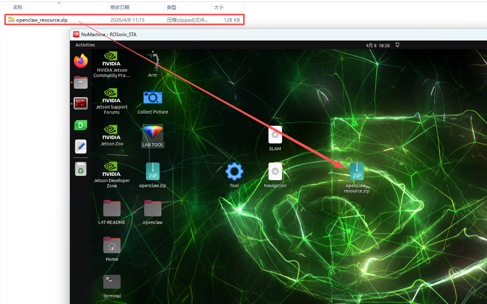

3. Click the terminal icon 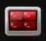 on the left side of the system interface to open the command line terminal.
4. Enter the following command to extract the file to the corresponding path.

```bash
unzip ~/Desktop/openclaw_resource.zip -d .
```

5. Enter the following command to go to the folder.

```bash
cd openclaw_resource
```

6. Enter the following command to run the script.

```bash
zsh deploy.sh
```

7. In the following prompts, keep entering **y**.

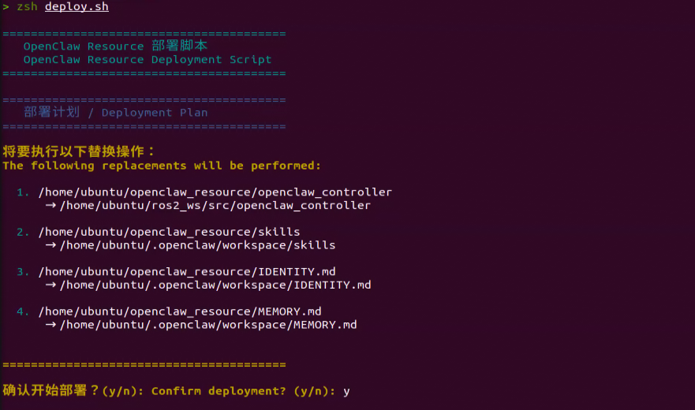

8. After the script finishes, the previous backups of **IDENTITY.md**, **MEMORY.md**, and **skills** are stored in the **backup.20260408_111805** folder. Enter `ls` to view them.
9. Then enter the following command in the terminal to go to the workspace and compile the **openclaw_controller** package.

```bash
cd ~/ros2_ws/ && colcon build --event-handlers  console_direct+  --cmake-args  -DCMAKE_BUILD_TYPE=Release --symlink-install --packages-select openclaw_controller
```

10. After compilation is complete, enter the following command to refresh the environment variables.

```bash
source ~/.zshrc
```

<p id ="anther13.2"></p>

## 13.2 Large Model API Key Setup

Before using OpenClaw on the robot, configure the model used by the agent first. This requires obtaining an API key for the large model and filling it in the corresponding configuration file. 

OpenClaw supports multiple large AI models. If a different model is selected, obtain the corresponding API key online and add it to the configuration file.

### 13.2.1 Large Model API Key Setup

> [!NOTE]
>
> **This section requires registering on the official OpenAI website and obtaining an API key for accessing large language models.**

#### 13.2.1.1 OpenAI Account Registration and Deployment

1) Copy and open the following URL: https://platform.openai.com/docs/overview, then click the **Sign Up** button in the upper-right corner.


2) Register and log in using a Google, Microsoft, or Apple account, as prompted.


3) After logging in, click the Settings button, then go to **Billing**, and click **Payment Methods** to add a payment method. The payment is used to purchase **tokens**.

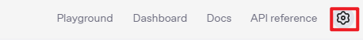


4) After completing the preparation steps, click **API Keys** and create a new key. Follow the prompts to fill in the required information, then save the key for later use.


5) The creation and deployment of the large model have been completed, and this API will be used in the following sections.

### 13.2.2 API Configuration

1. Use NoMachine to connect to the robot, then click the terminal icon  on the left side of the interface to open a terminal.

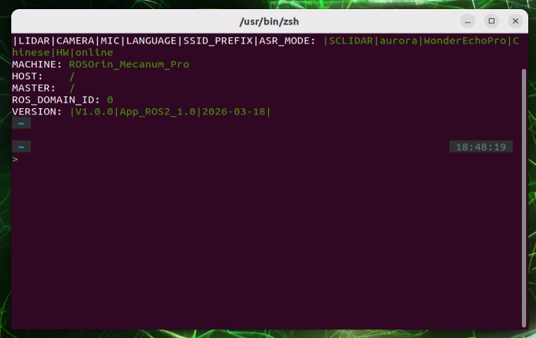

2. Enter the following command to configure OpenClaw.

```bash
openclaw config
```

3. Select **Local (this machine)** and press **Enter**.

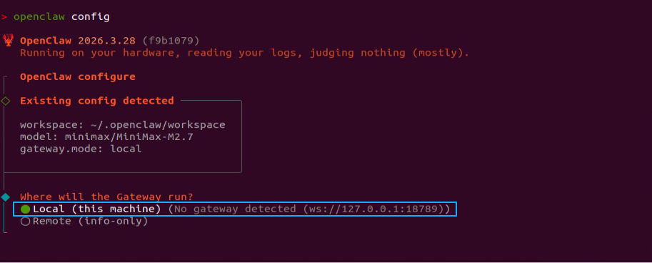

4. The model item needs to be configured here. Select **Model** and press **Enter**.

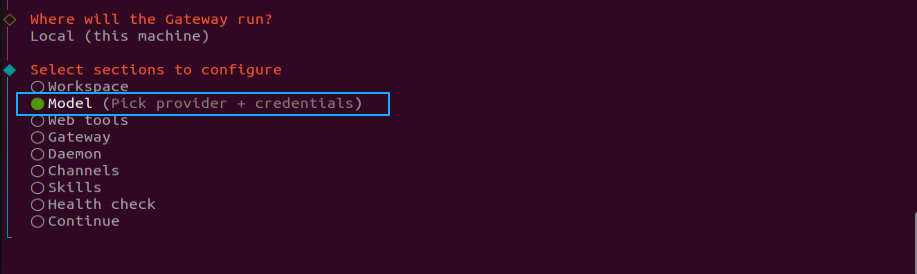

5. Select **OpenAI**, press **Enter**.

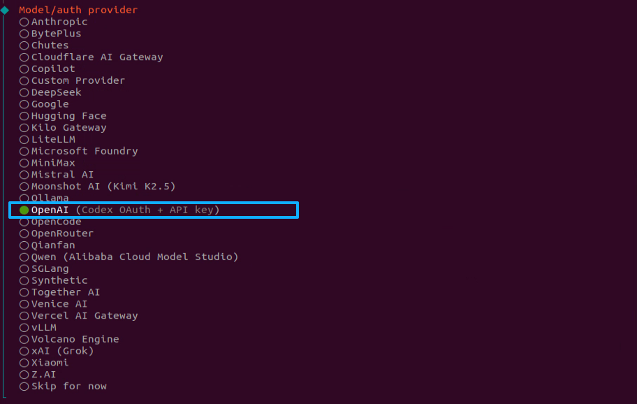

6. Select **OpenAI API key** and press **Enter**.

   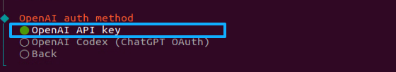

7. Paste the previously generated API key here.

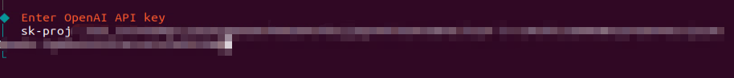

8. Select **openai/gpt-5.4** or another suitable model, then press **Enter**.

   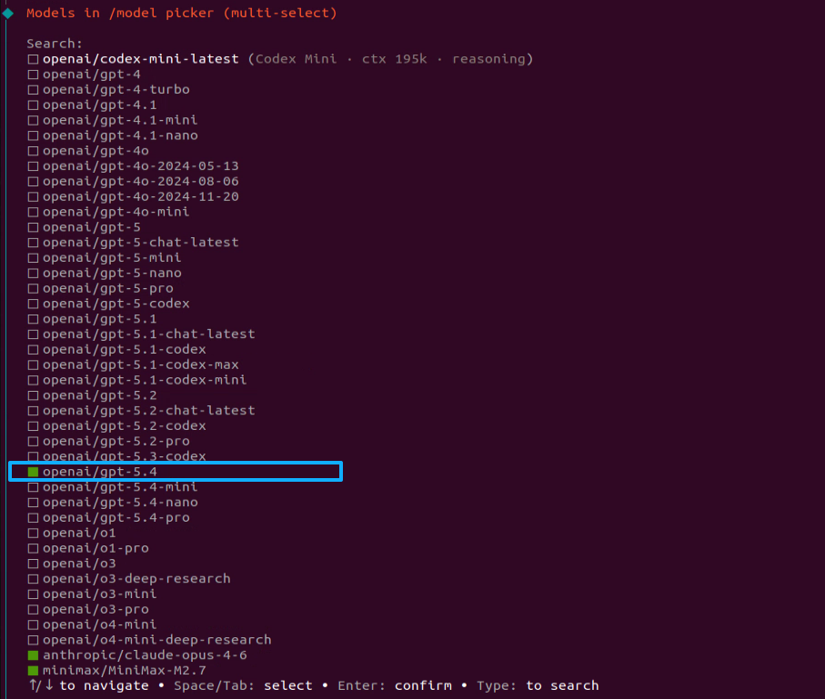

9. This completes the model configuration.

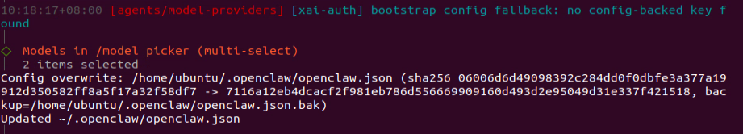

<p id ="anther10.4.3"></p>

## 13.3 OpenClaw Basic Applications

### 13.3.1 OpenClaw Controls Robot Movement

After the program starts, robot movement can be controlled by entering text commands such as **Move forward for 1 second, move backward for 2 seconds, and finally turn right for 1 second.** OpenClaw matches the task to the skill description, then sends messages or service calls according to the command to control robot movement. After the task is executed, OpenClaw invokes the configured large model through the agent to generate a text reply.

#### 13.3.1.1 Preparation

* **Preparation**

Configure the large AI model API key.

Reference Tutorial: [13.1 Preparation](#anther13.1)

* **Configure the Large Model API Key**

Reference Tutorial: [13.2 Large Model API Key Setup](#anther13.2)

#### 13.3.1.2 Operation Steps

> [!NOTE]
>
> * **Command input is case-sensitive and space-sensitive.**
>
> * **The robot must be connected to the network. Use STA mode on a local network or AP mode for a direct connection through Ethernet.**

1. Click the terminal icon  on the left side of the system interface to open the command line terminal.
2. Enter the following command to disable the app auto-start service.

```bash
sudo systemctl stop start_app_node.service
```

3. Enter the following command and press **Enter** to start robot hardware control. The camera feed will also open.

```bash
ros2 launch openclaw_controller robot_base_control.launch.py
```

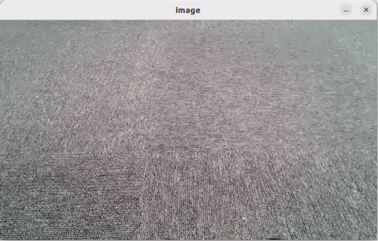

4. Open a new terminal, enter the following command, and press **Enter** to start the OpenClaw service. If the service is already running, this step can be skipped.

```bash
openclaw gateway run
```

5. Open a new terminal, enter the following command, and press **Enter** to open the TUI window for command input.

```bash
openclaw tui
```

6. In the TUI window or on the app chat page, enter the following command and press **Enter** to control robot movement: **Move forward for 1 second, then move backward for 2 seconds.**

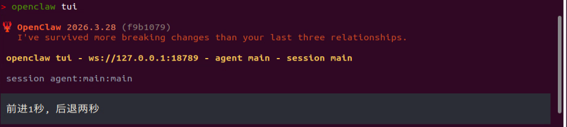

7. After a short wait, the robot moves forward for 1 second and then backward for 2 seconds. A text reply is then generated in the TUI window.

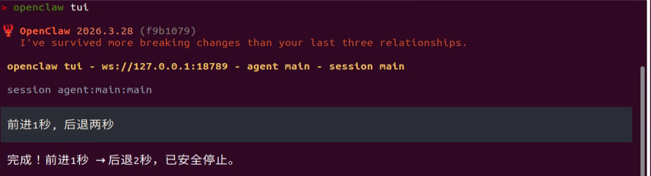

> [!NOTE]
>
> **Responses are generated automatically by the large model. Only the intended meaning is guaranteed. The exact wording may vary.**

8. When the output shown above appears in the TUI window, one round of dialogue has been completed, and a new control command can be entered to start the next interaction.
9. To continue experiencing other basic applications, keep entering other control commands according to the tutorial. To switch to comprehensive applications, press **Ctrl + C** in the last terminal opened in step 5 to stop robot hardware control. If the process does not exit, press **Ctrl + C** several times. If it still cannot be closed, open a new terminal and enter the following command to clear the ROS nodes.

```bash
~/.stop_ros.sh
```

10. To close OpenClaw completely, press **Ctrl + C** in each terminal window.

#### 13.3.1.3 Program Outcome

After the feature starts, text commands can be entered freely in the TUI window or on the app chat page to control forward movement, backward movement, left turns, right turns, and stop.

> [!NOTE]
>
> **Actual performance may vary depending on the large AI model used. Differences may appear in command execution time, response time, and the final execution result.**

#### 13.3.1.4 Program Analysis

Program path:

**/home/ubuntu/ros2_ws/src/openclaw_controller/openclaw_controller/robot_base_control/claw_move_control.py**

1. Initializes three parameters for linear velocity, angular velocity, and stop duration. It creates a chassis control node that receives string-based movement commands, places the commands into a queue, and processes them in a background thread. Finally, publishes velocity control messages and provides a service for querying the current movement state.

```python
        self.default_linear = 0.15
        self.default_angular = 0.45
        self.default_stop_duration = 0.5

        self.cmd_vel_pub = self.create_publisher(Twist, '/controller/cmd_vel', 1)
        self.subscription = self.create_subscription(
            String, '~/chassis_command', self.command_callback, 10)
        self.move_status = 'stop'
        self.create_service(Trigger, '~/move_status', self.move_status_srv_callback)

        self.command_queue = queue.Queue()
        self.client = self.create_client(Trigger, '/init_pose/init_finish')
        self.client.wait_for_service()
        self.worker_thread = threading.Thread(target=self.process_commands, daemon=True)
        self.worker_thread.start()
```

2. When an external request is received to query the current movement state, this function prints `self.move_status` and returns it through the service response.

```python
    def move_status_srv_callback(self, request, response):
        self.get_logger().info('\033[1;32m Move status: [%s]\033[0m' % self.move_status)
        response.success = True
        response.message = self.move_status
        return response
```

3. This function generates the corresponding chassis velocity control message `Twist` according to the input direction string and updates the robot movement state.

```python
    def parse_twist(self, direction):
        twist = Twist()
        self.move_status = 'moving'
        if direction == 'forward':
            twist.linear.x = self.default_linear
        elif direction == 'backward':
            twist.linear.x = -self.default_linear
        elif direction == 'left':
            twist.linear.x = self.default_linear
            twist.angular.z = self.default_angular
        elif direction == 'right':
            twist.linear.x = self.default_linear
            twist.angular.z = -self.default_angular
        elif direction == 'stop':
            pass
        else:
            return None
        return twist
```

4. This function receives the subscribed string command, trims and validates it, prints a log message, and then places it into the command queue for the background thread to process.

```python
    def command_callback(self, msg):
        cmd = msg.data.strip()
        if not cmd:
            return
        self.get_logger().info(f'\033[1;34m Command: {cmd}\033[0m')
        self.command_queue.put(cmd)
```

5. This function continuously reads pending commands from the command queue and calls the execution function to handle them in sequence.

```python
    def process_commands(self):
        while rclpy.ok():
            try:
                cmd = self.command_queue.get(timeout=0.5)
            except queue.Empty:
                continue
            self.execute_command(cmd)
            self.command_queue.task_done()
```

6. This function parses a composite movement command expressed as a string, executes multiple chassis motions in sequence, and stops the robot after the sequence finishes or if an error occurs.

```python
    def execute_command(self, cmd):
        try:
            cmd = cmd.replace('，', ',')
            parts = [p.strip() for p in cmd.split(',') if p.strip()]
            actions = []
            self.move_status = 'moving'
            for p in parts:
                w = p.split()
                dir = w[0].lower()
                dur = float(w[1]) if len(w) > 1 else self.default_stop_duration
                actions.append((dir, dur))
            
            for i, (dir, dur) in enumerate(actions):
                twist = self.parse_twist(dir)
                if twist is None:
                    self.get_logger().error(f'\033[91mUnknown direction: {dir}\033[0m')
                    self._stop()
                    return
                self.cmd_vel_pub.publish(twist)
                time.sleep(dur)
                if i < len(actions) - 1:
                    self._stop()
                    time.sleep(self.default_stop_duration)
            self._stop()
            self.get_logger().info(f'\033[1;33m Command done\033[0m')
        except Exception as e:
            self.get_logger().error(f'Execution error: {e}')
            self._stop()

```

### 13.3.2 OpenClaw Controls Robotic Arm Movement

After the program starts, the robotic arm can be controlled by entering text commands such as **Pull up a carrot** and **Hand it over**. OpenClaw matches the task to the skill description, then sends messages or service calls according to the command to control the robotic arm. After the task is executed, OpenClaw invokes the configured large model through the agent to generate a text reply.

#### 13.3.2.1 Preparation

* **Preparation**

Reference Tutorial: [13.1 Preparation](#anther13.1)

* **Configure the Large Model API Key**

Reference Tutorial: [13.2 Large Model API Key Setup](#anther13.2)

#### 13.3.2.2 Operation Steps

> [!NOTE]
>
> * **Command input is case-sensitive and space-sensitive.**
>
> * **The robot must be connected to the network. Use STA mode on a local network or AP mode for a direct connection through Ethernet.**

1. Click the terminal icon  on the left side of the system interface to open the command line terminal.
2. Enter the following command to disable the app auto-start service.

```bash
sudo systemctl stop start_app_node.service
```

3. Enter the following command and press **Enter** to start robot hardware control. The camera feed will also open.

```bash
ros2 launch openclaw_controller robot_base_control.launch.py
```


4. Open a new terminal, enter the following command, and press **Enter** to start the OpenClaw service. If the service is already running, this step can be skipped.

```bash
openclaw gateway run
```

5. Open a new terminal, enter the following command, and press **Enter** to open the TUI window for command input.

```bash
openclaw tui
```

6. In the TUI window or on the app chat page, enter the following command and press **Enter** to control the robotic arm: **Pull up a carrot**.

7. After a short wait, the robotic arm performs the carrot-pulling action, and a text reply is then generated in the TUI window.

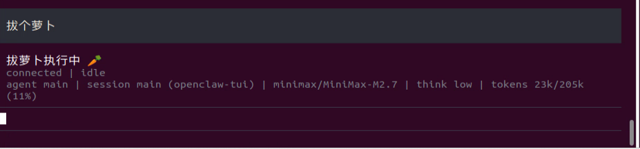

> [!NOTE]
>
> **Responses are generated automatically by the large model. Only the intended meaning is guaranteed. The exact wording may vary.**

8. When the output shown above appears in the TUI window, one round of dialogue has been completed, and a new control command can be entered to start the next interaction.
9. To continue experiencing other basic applications, keep entering other control commands according to the tutorial. To switch to comprehensive applications, press **Ctrl + C** in the last terminal opened in step 5 to stop robot hardware control. If the process does not exit, press **Ctrl + C** several times. If it still cannot be closed, open a new terminal and enter the following command to clear the ROS nodes.

```bash
~/.stop_ros.sh
```

10. To close OpenClaw completely, press **Ctrl + C** in each terminal window.

#### 13.3.2.3 Program Outcome

After the feature starts, text commands can be entered freely in the TUI window or on the app chat page to control the robotic arm for pulling up a carrot, handing over an object, raising the arm, and initializing the arm.

> [!NOTE]
>
> **Actual performance may vary depending on the large AI model used. Differences may appear in command execution time, response time, and the final execution result.**

#### 13.3.2.4 Program Analysis

Program path:

**/home/ubuntu/ros2_ws/src/openclaw_controller/openclaw_controller/robot_base_control/claw_arm_group_control.py**

1. Initializes a robotic arm action group control node for receiving action group commands, controlling the servos to execute preset actions, providing a robotic arm state query service, and waiting for the initial pose service to become ready before startup.

```python
        self.controller = ActionGroupController(
            self.create_publisher(ServosPosition, 'servo_controller', 1),
            '/home/ubuntu/software/arm_pc/ActionGroups'
        )
        
        self.subscription = self.create_subscription(
            String,
            '~/arm_group_control',
            self.command_callback,
            10
        )

        self._execution_lock = threading.Lock()
        self._is_executing = False
        self.arm_status = 'stop'
        self.create_service(Trigger, '~/arm_group_status', self.arm_group_status_srv_callback)
        self.supported_actions = ['voice_pick', 'voice_give', 'init', 'camera_up']

        signal.signal(signal.SIGINT, self.shutdown)
        self.client = self.create_client(Trigger, '/init_pose/init_finish')
        self.client.wait_for_service()
```

2. When an external request is received to query the current movement state, this function prints `self.arm_status` and returns it through the service response.

```python
    def arm_group_status_srv_callback(self, request, response):
        self.get_logger().info('\033[1;32mArm status: [%s]\033[0m' % self.arm_status)
        response.success = True
        response.message = self.arm_status
        return response
```

3. This function receives the robotic arm action command, checks whether the arm is currently executing an action, and whether the command is valid. If execution is allowed, it sets the arm state to running and starts a new thread to execute the action.

```python
    def command_callback(self, msg):
        cmd = msg.data.strip()
        if not cmd:
            return
        
        self.get_logger().info(f'\033[1;34mCommand received: {cmd}\033[0m')
        
        with self._execution_lock:
            if self._is_executing:
                self.get_logger().warn(f'\033[93mBusy, ignoring command: {cmd}\033[0m')
                return
        
        if cmd not in self.supported_actions:
            self.get_logger().error(f'\033[91mUnsupported action: {cmd}\033[0m')
            return

        with self._execution_lock:
            self._is_executing = True
        self.arm_status = 'moving'
        threading.Thread(target=self.execute_action, args=(cmd,), daemon=True).start()
```

4. This function executes the specified robotic arm action group command. After successful execution, it updates the state and prints a completion log. If execution fails, it records the error. The running flag is released at the end, whether execution succeeds or fails.

```python
    def execute_action(self, cmd):
        try:
            self.controller.run_action(cmd)
            self.arm_status = 'finished'
            self.get_logger().info(f'\033[1;32mAction {cmd} completed\033[0m')
        except Exception as e:
            self.get_logger().error(f'\033[91mError executing {cmd}: {e}\033[0m')
        finally:
            with self._execution_lock:
                self._is_executing = False
```

### 13.3.3 OpenClaw Analyzes the Camera Feed

After the program starts, OpenClaw can recognize the current camera feed from text commands and save the captured image locally. For example, commands such as **Take a photo**, **Take a look**, and **What do you see?** can be entered. OpenClaw matches the input with the corresponding skills and skill descriptions, then subscribes to the ROS 2 camera image topic based on the command. After the task is executed, OpenClaw calls the configured large AI model through the agent to generate a text response.

#### 13.3.3.1 Preparation

* **Preparation**

Reference Tutorial: [13.1 Preparation](#anther13.1)

* **Configure the Large Model API Key**

Reference Tutorial: [13.2 Large Model API Key Setup](#anther13.2)

#### 13.3.3.2 Operation Steps

> [!NOTE]
>
> * **Command input is case-sensitive and space-sensitive.**
>
> * **The robot must be connected to the network. Use STA mode on a local network or AP mode for a direct connection through Ethernet.**

1. Click the terminal icon  on the left side of the system interface to open the command line terminal.
2. Enter the following command to disable the app auto-start service.

```bash
sudo systemctl stop start_app_node.service
```

3. Enter the following command and press **Enter** to start robot hardware control. The camera feed will also open.

```bash
ros2 launch openclaw_controller robot_base_control.launch.py
```

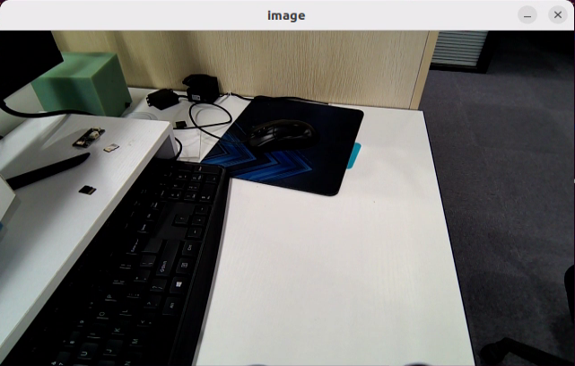

4. Open a new terminal, enter the following command, and press **Enter** to start the OpenClaw service. If the service is already running, this step can be skipped.

```bash
openclaw gateway run
```

5. Open a new terminal, enter the following command, and press **Enter** to open the TUI window for command input.

```bash
openclaw tui
```

6. In the TUI window or on the app chat page, enter the following command and press **Enter** to start image analysis: **Take a photo, tell me what is in the scene, summarize it, and tell me where it was saved.**

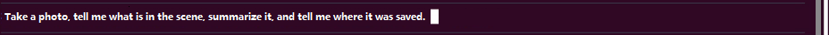

7. After a short wait, OpenClaw describes the current scene in text, saves the image, and shows the storage path.

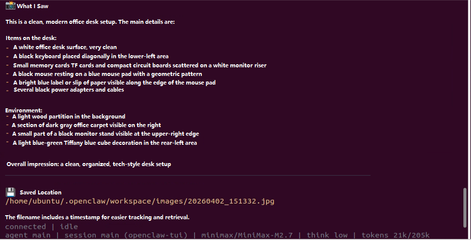

> [!NOTE]
>
> **Responses are generated automatically by the large model. Only the intended meaning is guaranteed. The exact wording may vary.**

8. When the output shown above appears in the TUI window, one round of dialogue has been completed, and a new control command can be entered to start the next interaction.
9. To continue experiencing other basic applications, keep entering other control commands according to the tutorial. To switch to comprehensive applications, press **Ctrl + C** in the last terminal opened in step 5 to stop robot hardware control. If the process does not exit, press **Ctrl + C** several times. If it still cannot be closed, open a new terminal and enter the following command to clear the ROS nodes.

```bash
~/.stop_ros.sh
```

10. To close OpenClaw completely, press **Ctrl + C** in each terminal window.

#### 13.3.3.3 Program Outcome

After the feature starts, text commands can be entered freely in the TUI window or on the app chat page, and OpenClaw describes the current scene in text.

> [!NOTE]
>
> **Actual performance may vary depending on the large AI model used. Differences may appear in command execution time, response time, and the final execution result.**

## 13.4 OpenClaw Comprehensive Applications

### 13.4.1 OpenClaw + 3D Object Color Grasping

After the program starts, text can be entered to control the robot, such as **Pick up a red block and then put it down.** OpenClaw matches the task to the skill description, then sends messages or service calls according to the command to control the robotic arm for 3D object color grasping. After the task is executed, OpenClaw invokes the configured large model through the agent to generate a text reply.

#### 13.4.1.1 Preparation

* **Preparation**

Reference Tutorial: [13.1 Preparation](#anther13.1)

* **Configure the Large Model API Key**

Reference Tutorial: [13.2 Large Model API Key Setup](#anther13.2)

#### 13.4.1.2 Operation Steps

> [!NOTE]
>
> * **Command input is case-sensitive and space-sensitive.**
>
> * **The robot must be connected to the network. Use STA mode on a local network or AP mode for a direct connection through Ethernet.**
>
> * Adjust the color threshold in advance according to **[1. Tutorials/6. ROS+OpenCV Course](https://wiki.hiwonder.com/projects/rosorin-pro/en/latest/docs/6_ROS%2BOpenCV_Course.html)**.

1. Click the terminal icon  on the left side of the system interface to open the command line terminal.
2. Enter the following command to disable the app auto-start service.

```bash
sudo systemctl stop start_app_node.service
```

3. Enter the following command and press **Enter** to start robot hardware control. The camera feed will also open.

> [!NOTE]
>
> * **Because the controller performance differs across hardware platforms, Raspberry Pi 5 and Jetson Nano use 3D color-based object grasping, while Jetson Orin Nano and Orin NX support 3D object tracking and grasping. Select the appropriate command based on the controller used by the robot.**
> * **3D grasping is supported only on versions equipped with a depth camera.**

```bash
ros2 launch openclaw_controller robot_base_control.launch.py
```

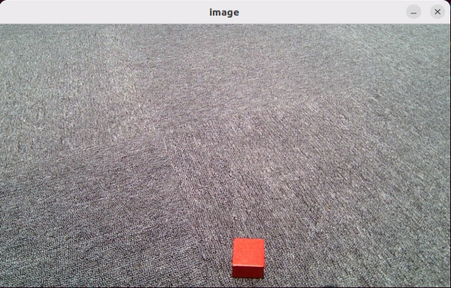

4. Open a new terminal, enter the following command, and press **Enter** to start the OpenClaw service. If the service is already running, this step can be skipped.

```bash
openclaw gateway run
```

5. Open a new terminal, enter the following command, and press **Enter** to open the TUI window for command input.

```bash
openclaw tui
```

6. In the TUI window or on the app chat page, enter the following command and press **Enter** to control the robotic arm: **Pick up a red block and then put it down.**

7. After a short wait, the robotic arm grasps and places the block, and a text reply is then generated in the TUI window.

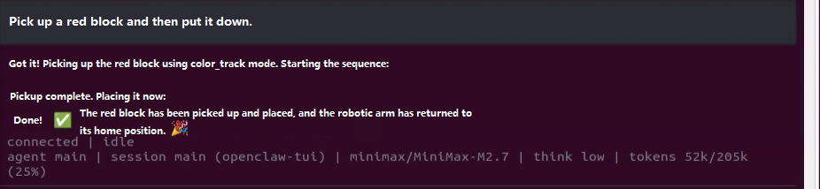

> [!NOTE]
>
> **Responses are generated automatically by the large model. Only the intended meaning is guaranteed. The exact wording may vary.**

8. When the output shown above appears in the TUI window, one round of dialogue has been completed, and a new control command can be entered to start the next interaction.
9. To continue experiencing other basic applications, keep entering other control commands according to the tutorial. To switch to comprehensive applications, press **Ctrl + C** in the last terminal opened in step 5 to stop robot hardware control. If the process does not exit, press **Ctrl + C** several times. If it still cannot be closed, open a new terminal and enter the following command to clear the ROS nodes.

```bash
~/.stop_ros.sh
```

10. To close OpenClaw completely, press **Ctrl + C** in each terminal window.

#### 13.4.1.3 Program Outcome

After the feature starts, text commands can be entered freely in the TUI window or on the app chat page to control the robotic arm for color-based grasping or depth-based grasping.

> [!NOTE]
>
> **Actual performance may vary depending on the large AI model used. Differences may appear in command execution time, response time, and the final execution result.**

<p id ="anther13.4.1.4"></p>

#### 13.4.1.4 Step-by-Step Debugging

> [!NOTE]
>
> **If OpenClaw does not start successfully after a text command is entered in the TUI window, run the commands step by step to locate any error messages.**

1. Start the feature:

```bash
ros2 launch openclaw_controller robot_base_control.launch.py
```

2. Start the feature service:

```bash
ros2 service call /claw_track_and_grab/start std_srvs/srv/Trigger "{}"
```

3. Set the color:

```bash
ros2 service call /claw_track_and_grab/set_color interfaces/srv/SetString "{data: 'red'}"
```

4. After alignment, send the pick command:

```bash
ros2 service call /claw_track_and_grab/start_pick std_srvs/srv/Trigger "{}"
```

5. Place the object:

```bash
ros2 service call /claw_track_and_grab/place std_srvs/srv/Trigger "{}"
```

6. Initialize the pose:

```bash
ros2 service call /claw_track_and_grab/init_pose std_srvs/srv/Trigger "{}"
```

7. Query the pick status:

```bash
ros2 service call /claw_track_and_grab/pick_status std_srvs/srv/Trigger "{}"
```

#### 13.4.1.5 Program Analysis

Program path:

**/home/ubuntu/ros2_ws/src/openclaw_controller/openclaw_controller/claw_track_and_grab/claw_track_and_grab.py**

1. This function is used for target tracking control. After the target center point is detected, it calculates the horizontal and vertical offsets between the target and the image center, then adjusts the pan-tilt `yaw` and `pitch` through PID control so the target gradually moves to the center of the image. A maximum step limit is also added to prevent the servos from moving too quickly or shaking.

```python
    def obj_track_proc(self,source_image,result_image,center):
        h, w = source_image.shape[:2]
        if center is not None:
            center_x, center_y = int(center[0]),int(center[1])
            cv2.circle(result_image, (int(center_x), int(center_y)), 3, (255,255,255), 2)

            center_x_1 = center_x / w
            if abs(center_x_1 - 0.5) > 0.02: # No further adjustment is needed when the difference is within the threshold
                self.pid_yaw.SetPoint = 0.5 # The target is the center of the image, which is half of the full image width
                self.pid_yaw.update(center_x_1)
                self.yaw = min(max(self.yaw + self.pid_yaw.output, 0), 1000)
            else:
                self.pid_yaw.clear() # Reset the PID controller after the target reaches the center

            center_y_1 = center_y / h
            if abs(center_y_1 - 0.5) > 0.02:
                self.pid_pitch.SetPoint = 0.5
                self.pid_pitch.update(center_y_1)
                self.pitch = min(max(self.pitch + self.pid_pitch.output, 100), 720)
            else:
                self.pid_pitch.clear()
            
            new_yaw = self.yaw
            new_pitch = self.pitch
            delta_yaw = new_yaw - self.last_yaw
            delta_pitch = new_pitch - self.last_pitch
            if abs(delta_yaw) > self.max_step:
                new_yaw = self.last_yaw + (self.max_step if delta_yaw > 0 else -self.max_step)
            if abs(delta_pitch) > self.max_step:
                new_pitch = self.last_pitch + (self.max_step if delta_pitch > 0 else -self.max_step)
            
            self.yaw = new_yaw
            self.pitch = new_pitch
            self.last_yaw = new_yaw
            self.last_pitch = new_pitch

            return (result_image, (self.pitch, self.yaw), (center_x, center_y), 5)
        else:
            return (result_image, None, None, 0)
```

2. This function first scales the input image, applies blur, converts it to the LAB color space, and performs threshold segmentation to extract the target region of the specified color. It then uses erosion and dilation to remove noise and smooth the edges, selects the lowest valid target from all effective contours as the tracking target, and calculates the offset between the target center and the image center. PID is then used to adjust `yaw` and `pitch` separately so the target gradually moves to the image center. Finally, the target circle and label are drawn on the result image.

```python
    def proc(self, source_image, result_image, color_ranges):
        h, w = source_image.shape[:2]
        color = color_ranges['lab']['Stereo'][self.target_color]

        img = cv2.resize(source_image, (int(w/2), int(h/2)))
        img_blur = cv2.GaussianBlur(img, (3, 3), 3) # Gaussian blur
        img_lab = cv2.cvtColor(img_blur, cv2.COLOR_BGR2LAB) # Convert to the LAB color space
        mask = cv2.inRange(img_lab, tuple(color['min']), tuple(color['max'])) # Binarization

        # Smooth edges, remove small patches, and merge nearby blocks
        eroded = cv2.erode(mask, cv2.getStructuringElement(cv2.MORPH_RECT, (3, 3)))
        dilated = cv2.dilate(eroded, cv2.getStructuringElement(cv2.MORPH_RECT, (3, 3)))
        # Find contours
        contours = cv2.findContours(dilated, cv2.RETR_EXTERNAL, cv2.CHAIN_APPROX_NONE)[-2]
        best_c = None
        max_y = -1  # Record the largest y value, which is the lowest position in the image
        for c in contours:
            if math.fabs(cv2.contourArea(c)) < 50:
                continue
            (center_x, center_y), radius = cv2.minEnclosingCircle(c) # Minimum enclosing circle
            # Choose the contour closest to the bottom of the image because the camera is tilted downward and the lower object is nearer
            if best_c is None or center_y > max_y:
                best_c = (c, center_x, center_y)
                max_y = center_y

        # If a matching contour exists
        if best_c is not None:
            (center_x, center_y), radius = cv2.minEnclosingCircle(best_c[0]) # Minimum enclosing circle

            # Circle the recognized target block to be tracked
            circle_color = common.range_rgb[self.target_color] if self.target_color in common.range_rgb else (0x55, 0x55, 0x55)
            cv2.circle(result_image, (int(center_x * 2), int(center_y * 2)), int(radius * 2), circle_color, 2)
            
            cv2.putText(result_image, 'TargetObject', (int(center_x * 2) - 30, int(center_y * 2) - int(radius * 2) - 10),
                       cv2.FONT_HERSHEY_SIMPLEX, 0.5, circle_color, 2)

            center_x = center_x * 2
            center_x_1 = center_x / w
            if abs(center_x_1 - 0.5) > 0.02: # No further adjustment is needed when the difference is within the threshold
                self.pid_yaw.SetPoint = 0.5 # The target is the center of the image, which is half of the full image width
                self.pid_yaw.update(center_x_1)
                self.yaw = min(max(self.yaw + self.pid_yaw.output, 0), 1000)
            else:
                self.pid_yaw.clear() # Reset the PID controller after the target reaches the center

            center_y = center_y * 2
            center_y_1 = center_y / h
            if abs(center_y_1 - 0.5) > 0.02:
                self.pid_pitch.SetPoint = 0.5
                self.pid_pitch.update(center_y_1)
                self.pitch = min(max(self.pitch + self.pid_pitch.output, 100), 720)
            else:
                self.pid_pitch.clear()
            return (result_image, (self.pitch, self.yaw), (center_x, center_y), radius * 2)
        else:
            return (result_image, None, None, 0)
```

3. This function receives synchronized RGB images, depth images, and camera intrinsic data, then pushes them into the image queue. When the queue is full, the oldest group of data is removed first and the latest group is added, which prevents queue buildup and ensures that later processing uses relatively recent image data.

```python
    def multi_callback(self, ros_rgb_image, ros_depth_image, depth_camera_info):
        if self.image_queue.full():
            self.image_queue.get()
        self.image_queue.put((ros_rgb_image, ros_depth_image, depth_camera_info))
```

4. This function requests the current end-effector pose through the pose service client, extracts the position coordinates and orientation quaternion from the returned result, then calls `xyz_quat_to_mat` to convert them to a homogeneous transformation matrix. The matrix is stored in `self.endpoint` and returned. It can be used later for coordinate transformation, kinematics calculation, and robotic arm control.

```python
    def get_endpoint(self):
        endpoint = self.send_request(self.get_current_pose_client, GetRobotPose.Request()).pose
        self.endpoint = common.xyz_quat_to_mat([endpoint.position.x, endpoint.position.y, endpoint.position.z],
                                        [endpoint.orientation.w, endpoint.orientation.x, endpoint.orientation.y, endpoint.orientation.z])
        return self.endpoint
```

5. This function is used to set the placement action group.

```python
    def place_function(self):
        self.get_logger().info('\033[1;32m%s\033[0m' % "place_function")

        set_servo_position(self.joints_pub, 1.5, ((1, 500), (2, 535), (3, 170), (4, 220), (5, 500)))
        time.sleep(1.5)
        set_servo_position(self.joints_pub, 1.5, ((1, 500), (2, 160), (3, 400), (4, 350), (5, 500)))
        time.sleep(1.5)
        set_servo_position(self.joints_pub, 1, ((1, 500), (2, 160), (3, 400), (4, 350), (5, 500), (10, 150)))
        time.sleep(2.5)

        set_servo_position(self.joints_pub, 2.5, ((1, 500), (2, 635), (3, 120), (4, 140), (5, 500)))
        time.sleep(2.5)

        time.sleep(5)
        self.pick_status = 'place_finish'
```

6. This function executes the robotic arm grasping process. It first selects the appropriate end-effector yaw angle according to the target height, then calls the pose solving service to calculate the corresponding servo pulse widths and drives the arm to the grasping position. After that, the gripper closes to complete the grasp. The target is then lifted upward along the z axis by a certain distance and the arm pose is replanned to perform the lifting action after grasping. Finally, the arm returns to a preset pose, a stop command is sent, and the grasping state, target tracking state, and PID controller are reset for the next grasping task.

```python
    def pick(self, position):
        if position[2] < 0.2:
            yaw = 80
        else:
            yaw = 30
        msg = set_pose_target(position, yaw, [-180.0, 180.0], 1.0)
        res = self.send_request(self.set_pose_target_client, msg)
        if res.pulse:
            servo_data = res.pulse
            set_servo_position(self.joints_pub, 1, ((1, servo_data[0]), ))
            time.sleep(1)
            set_servo_position(self.joints_pub, 1.5, ((1, servo_data[0]),(2, servo_data[1]), (3, servo_data[2]),(4, servo_data[3]), (5, servo_data[4])))
            time.sleep(1.5)
        set_servo_position(self.joints_pub, 0.5, ((10, 560),))
        time.sleep(1)
        position[2] += 0.1

        msg = set_pose_target(position, yaw, [-180.0, 180.0], 1.0)
        res = self.send_request(self.set_pose_target_client, msg)
        if res.pulse:
            servo_data = res.pulse
            set_servo_position(self.joints_pub, 1, ((1, servo_data[0]),(2, servo_data[1]), (3, servo_data[2]),(4, servo_data[3]), (5, servo_data[4])))
            time.sleep(1)
        set_servo_position(self.joints_pub, 1, ((1, 500), (2, 650), (3, 100), (4, 120), (5, 500), (10, 560)))
        time.sleep(1)

        # Stop
        self.send_request(self.stop_client, Trigger.Request())
        self.pick_status = 'pick_finish'
        self.target_center = None
        self.pick_enabled = False  # Reset after picking. start_pick must be triggered again next time
        self.arm_movement_enabled = False  # Stop arm movement after picking is completed
        self.target_color = None   # Clear the target color. Set the color again before the next tracking task

        # Reset the tracker PID state before setting it to None
        if self.tracker is not None:
            self.tracker.yaw = 500
            self.tracker.pitch = 70
            self.tracker.pid_yaw.clear()
            self.tracker.pid_pitch.clear()
        self.tracker = None         # Clear the tracker to avoid residual state

        self.stamp = time.time()
        self.moving = False
```

### 13.4.2 OpenClaw + 3D Object Tracking and Grasping

After the program starts, text can be entered to control the robot, such as **Pick up a cube and then put it down.** OpenClaw matches the task to the skill description, then sends messages or service calls according to the command to control the robotic arm for 3D object tracking and grasping. After the task is executed, OpenClaw invokes the configured large model through the agent to generate a text reply.

#### 13.4.2.1 Preparation

* **Preparation**

Reference Tutorial: [13.1 Preparation](#anther13.1)

* **Configure the Large Model API Key**

Reference Tutorial: [13.2 Large Model API Key Setup](#anther13.2)

#### 13.4.2.2 Operation Steps

> [!NOTE]
>
> * **Command input is case-sensitive and space-sensitive.**
>
> * **The robot must be connected to the network. Use STA mode on a local network or AP mode for a direct connection through Ethernet.**
>
> * Adjust the color threshold in advance according to **[1. Tutorials/6. ROS+OpenCV Course](https://wiki.hiwonder.com/projects/rosorin-pro/en/latest/docs/6_ROS%2BOpenCV_Course.html)**.

1. Click the terminal icon  on the left side of the system interface to open the command line terminal.
2. Enter the following command to disable the app auto-start service.

```bash
sudo systemctl stop start_app_node.service
```

3. Enter the following command and press **Enter** to start robot hardware control. The camera feed will also open.

> [!NOTE]
>
> * **Because the controller performance differs across hardware platforms, Raspberry Pi 5 and Jetson Nano use 3D color-based object grasping, while Jetson Orin Nano and Orin NX support 3D object tracking and grasping. Select the appropriate command based on the controller used by the robot.**
> * **3D grasping is supported only on versions equipped with a depth camera.**

```bash
ros2 launch openclaw_controller robot_base_control.launch.py  track_method:="obj_track"  object_track_debug:=true enable_tracking:=true
```

> [!NOTE]
>
> **Depth-based grasping requires using the mouse to draw a box around the target block in the camera feed.**

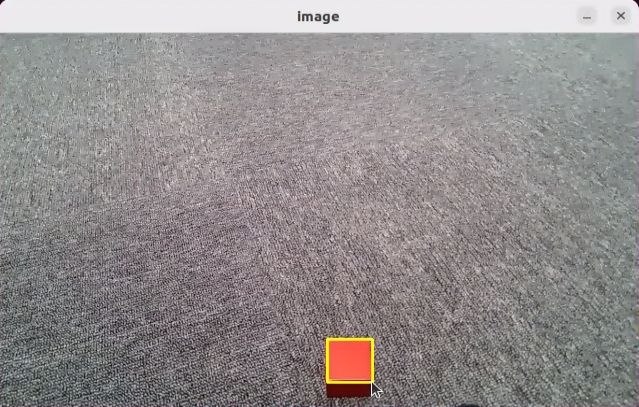

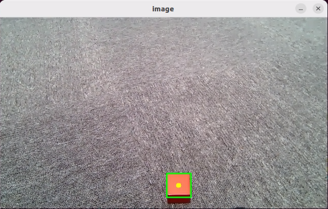

4. Open a new terminal, enter the following command, and press **Enter** to start the OpenClaw service. If the service is already running, this step can be skipped.

```bash
openclaw gateway run
```

5. Open a new terminal, enter the following command, and press **Enter** to open the TUI window for command input.

```bash
openclaw tui
```

6. In the TUI window or on the app chat page, enter the following command and press **Enter** to control the robotic arm: **Pick up a cube and then put it down.**

7. After a short wait, the robotic arm grasps and places the object, and a text reply is then generated in the TUI window.

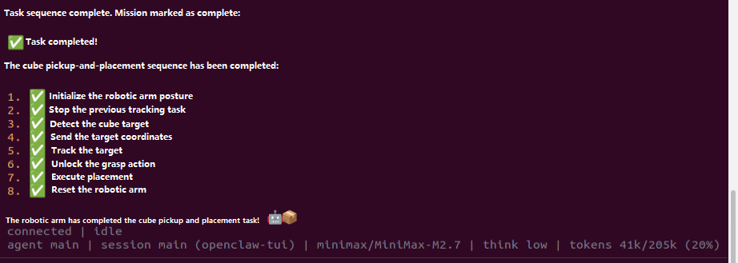

> [!NOTE]
>
> **Responses are generated automatically by the large model. Only the intended meaning is guaranteed. The exact wording may vary.**

8. When the output shown above appears in the TUI window, one round of dialogue has been completed, and a new control command can be entered to start the next interaction.
9. To continue experiencing other basic applications, keep entering other control commands according to the tutorial. To switch to comprehensive applications, press **Ctrl + C** in the last terminal opened in step 5 to stop robot hardware control. If the process does not exit, press **Ctrl + C** several times. If it still cannot be closed, open a new terminal and enter the following command to clear the ROS nodes.

```bash
~/.stop_ros.sh
```

10. To close OpenClaw completely, press **Ctrl + C** in each terminal window.

#### 13.4.2.3 Program Outcome

After the feature starts, text commands can be entered freely in the TUI window or on the app chat page to control the robotic arm for color-based grasping or depth-based grasping.

> [!NOTE]
>
> **Actual performance may vary depending on the large AI model used. Differences may appear in command execution time, response time, and the final execution result.**

<p id ="anther13.4.2.4"></p>

#### 13.4.2.4 Step-by-Step Debugging

> [!NOTE]
>
> **If OpenClaw does not start successfully after a text command is entered in the TUI window, run the commands step by step to locate any error messages.**

1. Start the feature:

```bash
ros2 launch openclaw_controller robot_base_control.launch.py  track_method:="obj_track"  object_track_debug:=true enable_tracking:=true
```

2. Start the feature service first:

```bash
ros2 service call /claw_track_and_grab/start std_srvs/srv/Trigger "{}"
```

3. Use the left mouse button to draw a box around the object.
4. Send the pick command:

```bash
ros2 service call /claw_track_and_grab/start_pick std_srvs/srv/Trigger "{}"
```

5. Place the object:

```bash
ros2 service call /claw_track_and_grab/place std_srvs/srv/Trigger "{}"
```

6. Initialize the pose:

```bash
ros2 service call /claw_track_and_grab/init_pose std_srvs/srv/Trigger "{}"
```

7. Query the pick status:

```bash
ros2 service call /claw_track_and_grab/pick_status std_srvs/srv/Trigger "{}"
```

#### 13.4.2.5 Program Analysis

Program path:

**/home/ubuntu/ros2_ws/src/openclaw_controller/openclaw_controller/claw_object_track/claw_object_track.py**

1. This function is a mouse event callback used for interactively selecting and resetting the target tracking region. When the left mouse button is pressed, the drag start point is recorded. The rectangular selection is updated in real time during dragging. When the left mouse button is released, the selection is saved as the tracking window and converted to the target box format `x, y, w, h`. When the right mouse button is pressed, the current selection and tracking window are cleared, the existing tracker is stopped, and the system state is reset so a new target can be selected.

```python
    def onmouse(self, event, x, y, flags, param):
        if event == cv2.EVENT_LBUTTONDOWN:  # Left mouse button pressed
            self.mouse_click = True
            self.drag_start = (x, y)  # Mouse starting position
            self.track_window = None
            self.get_logger().info(f'LBUTTONDOWN: drag_start={self.drag_start}')
        if self.drag_start:  # Record the mouse position while dragging
            xmin = min(x, self.drag_start[0])
            ymin = min(y, self.drag_start[1])
            xmax = max(x, self.drag_start[0])
            ymax = max(y, self.drag_start[1])
            self.selection = (xmin, ymin, xmax, ymax)
        if event == cv2.EVENT_LBUTTONUP:  # Left mouse button released
            self.mouse_click = False
            self.drag_start = None
            self.track_window = self.selection
            # Convert track_window from xmin, ymin, xmax, ymax to box format x, y, w, h
            xmin, ymin, xmax, ymax = self.selection
            self.box = [xmin, ymin, xmax - xmin, ymax - ymin]
            self.get_logger().info(f'LBUTTONUP: track_window={self.track_window}, box={self.box}')
            self.selection = None
        if event == cv2.EVENT_RBUTTONDOWN:
            self.mouse_click = False
            self.selection = None  # Real-time region tracked by the mouse
            self.track_window = None  # Region where the object to be detected is located
            self.drag_start = None  # Flag that indicates whether dragging has started
            self.start_track = False  # Reset tracking state and allow a new selection to be drawn
            self.box = []  # Clear the box and allow it to be set again
            self.track_status = 'track_ready'
            if self.track is not None:
                self.track.stop()
            # Note: do not destroy self.track. Only stop tracking so it can be reused
            self.get_logger().info(f'RBUTTONDOWN: reset tracking state')
```

2. This function is an RGB image callback. It receives ROS image messages and converts them to color image arrays in NumPy format. When an image is received for the first time, the image resolution is recorded. It then uses a queue strategy that drops the oldest frame when the queue is full, so that the later vision processing module uses data with better real-time performance. If conversion fails, an error log is printed.

```python
    def rgb_callback(self, msg):
        try:
            rgb_image = np.ndarray(
                shape=(msg.height, msg.width, 3),
                dtype=np.uint8,
                buffer=msg.data
            )

            # Store image dimensions on first receipt
            if self.img_width is None:
                self.img_width = msg.width
                self.img_height = msg.height
                self.get_logger().info(f'Image size: {self.img_width}x{self.img_height}')

            if self.image_queue.full():
                self.image_queue.get()
            self.image_queue.put(rgb_image)

        except Exception as e:
            self.get_logger().error(f'Image conversion failed: {e}')
```

3. This function receives the target recognition result message and updates the tracking box. It first checks whether tracking is enabled. If tracking is disabled, the message is ignored. If tracking is enabled, the JSON data in the message is parsed to extract the target name and the normalized detection box coordinates. When the box format is valid and the image size is known, the normalized coordinates are converted to actual pixel coordinates and then converted further to the format `[x, y, w, h]`, which is stored in `self.box` for later target tracking. If the data is invalid, the image size is unknown, or parsing fails, a corresponding log message is printed.

```python
    def box_callback(self, msg):
        if not self.enable_tracking:
            self.get_logger().debug('Tracking disabled, ignoring box message')
            return

        try:
            data = json.loads(msg.data)
            object_name = data.get('object', '')
            box_coords = data.get('box', [])   # normalized [xmin, ymin, xmax, ymax]

            if box_coords and len(box_coords) == 4:
                # Convert normalized coordinates to pixel coordinates using actual image size
                if self.img_width is not None and self.img_height is not None:
                    xmin, ymin, xmax, ymax = box_coords
                    pixel_box = [
                        int(xmin * self.img_width),
                        int(ymin * self.img_height),
                        int(xmax * self.img_width),
                        int(ymax * self.img_height)
                    ]
                    # Convert to [x, y, w, h] format
                    self.box = [pixel_box[0], pixel_box[1], pixel_box[2] - pixel_box[0], pixel_box[3] - pixel_box[1]]
                    self.get_logger().info(f'Received recognition result: {object_name}, box={self.box}')
                else:
                    self.get_logger().warn('No image size available yet, skipping box conversion')
            else:
                self.get_logger().warn(f'Invalid box coordinates: {box_coords}')
        except Exception as e:
            self.get_logger().error(f'Failed to parse box message: {e}')
```

4. This function is the main entry point of the node. It first checks whether target tracking is enabled through `enable_tracking`. If tracking is enabled, CUDA and tracker-related modules are imported dynamically, and the tracker classes are stored in the member variables for later initialization in the display thread. If tracking is disabled, the node runs only in display mode. The function then creates and starts the display thread. In the main thread, it continuously processes ROS callback events through `rclpy.spin_once()`. After the running flag is cleared or ROS exits, the function stops execution, waits for the display thread to finish, destroys the node, and closes the ROS environment.

```python
    def spin(self):
        if self.enable_tracking:
            # Dynamically import tracking-related modules only when needed
            import pycuda.driver as cuda
            from large_models_examples.track_anything import ObjectTracker
            from large_models_examples.tracker import Tracker

            # Store classes for later use in display thread
            self.ObjectTracker = ObjectTracker
            self._Tracker = Tracker

            self.get_logger().info('Will initialize CUDA and Tracker in display_thread...')
        else:
            self.get_logger().info('Tracking disabled, running in display-only mode')

        # Start display thread
        thread = threading.Thread(target=self.display_thread, args=(self,))
        thread.start()

        while self.running and rclpy.ok():
            rclpy.spin_once(self, timeout_sec=0.1)

        self.running = False
        thread.join()

        self.destroy_node()
        rclpy.shutdown()
```

### 13.4.3 OpenClaw + Smart Home Assistant

After the program starts, text can be entered to control robot navigation, such as **Take me to the zoo, inspect what is there, and give me a summary.** OpenClaw matches the task to the skill description, then sends messages or service calls according to the command to control chassis navigation. After the task is executed, OpenClaw invokes the configured large model through the agent to generate a text reply.

#### 13.4.3.1 Preparation

* **Preparation**

Reference Tutorial: [13.1 Preparation](#anther13.1)

Refer to tutorial **[1. Tutorials/5. Mapping & Navigation Course](https://wiki.hiwonder.com/projects/rosorin-pro/en/latest/docs/5_Mapping_%26_Navigation_Course.html#mapping-navigation-course)** to build the map.

* **Configure the Large Model API Key**

Reference Tutorial: [13.2 Large Model API Key Setup](#anther13.2)

<p id ="anther13.4.3.2"></p>

#### 13.4.3.2 Operation Steps

> [!NOTE]
>
> * **Command input is case-sensitive and space-sensitive.**
>
> * **The robot must be connected to the network. Use STA mode on a local network or AP mode for a direct connection through Ethernet.**

1. Click the terminal icon  on the left side of the system interface to open the command line terminal.
2. Enter the following command to disable the app auto-start service.

```bash
sudo systemctl stop start_app_node.service
```

3. Enter the following command and press Enter to start the robot's hardware navigation. RViz will also launch.

```bash
ros2 launch openclaw_controller navigation_manager.launch.py
```

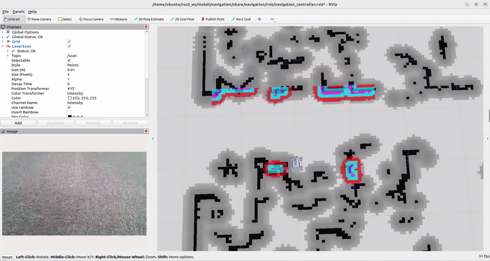

4. Open a new terminal, enter the following command, and press **Enter** to start the OpenClaw service. If the service is already running, this step can be skipped.

```bash
openclaw gateway run
```

5. Open a new terminal, enter the following command, and press **Enter** to open the TUI window for command input.

```bash
openclaw tui
```

6. In the TUI window or on the app chat page, enter the following command and press **Enter** to start robot navigation: **Take me to the zoo, see what animals are there, and put together a table introducing them for me.**

7. After a short wait, the robot navigates to the target point and observes the scene ahead. A text reply is then generated in the TUI window.

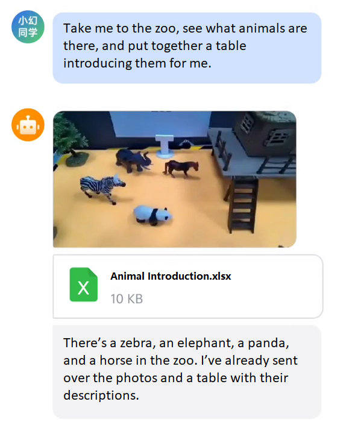

> [!NOTE]
>
> **Responses are generated automatically by the large model. Only the intended meaning is guaranteed. The exact wording may vary.**

8. When the output shown above appears in the TUI window, one round of dialogue has been completed, and a new control command can be entered to start the next interaction.
9. To continue with other basic applications, follow the basic application tutorial and enter other control commands. To switch to comprehensive applications, press **Ctrl + C** in the last terminal opened in step 5 to stop robot hardware control. If the process does not exit, press **Ctrl + C** several times. If it still cannot be closed, open a new terminal and enter the following command to clear the ROS nodes.

```bash
~/.stop_ros.sh
```

10. To close OpenClaw completely, press **Ctrl + C** in each terminal window.

#### 13.4.3.3 Program Outcome

After the feature starts, text commands can be entered freely in the TUI window or on the app chat page to control robot navigation.

> [!NOTE]
>
> **Actual performance may vary depending on the large AI model used. Differences may appear in command execution time, response time, and the final execution result.**

#### 13.4.3.4 Navigation Point Modification

1. Click the terminal icon  on the left side of the system interface to open the command line terminal.
2. Enter the following command to go to the corresponding path.

```bash
cd ros2_ws/src/openclaw_controller/config
```

3. Enter the following command to edit the YAML file.

```bash
gedit navigation_position.yaml 
```

4. Only the `x`, `y`, and `yaw` values of the coordinate point need to be modified here.

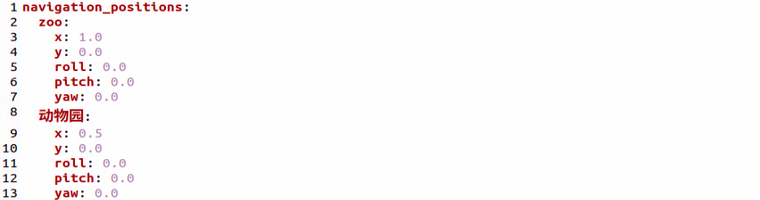

5. After the modification is completed, click **Ctrl + S** to save and exit. Then follow [13.4.3.2 Operation Steps](#anther13.4.3.2) to run the feature again.

### 13.4.4 OpenClaw + Smart Community

After the program starts, text can be entered to control robot navigation, such as **Take the package from home to the parcel drop-off station, then go to the grocery store and bring the fruit basket back home.** OpenClaw matches the task to the skill description, then sends messages or service calls according to the command to control robot navigation. After the task is executed, OpenClaw invokes the configured large model through the agent to generate a text reply.

#### 13.4.4.1 Preparation

* **Preparation**

Reference Tutorial: [13.1 Preparation](#anther13.1)

Refer to tutorial **[1. Tutorials/5. Mapping & Navigation Course](https://wiki.hiwonder.com/projects/rosorin-pro/en/latest/docs/5_Mapping_%26_Navigation_Course.html#mapping-navigation-course)** to build the map and use route planning to prepare the navigation path points.

* **Configure the Large Model API Key**

Reference Tutorial: [13.2 Large Model API Key Setup](#anther13.2)

<p id ="anther13.4.4.2"></p>

#### 13.4.4.2 Operation Steps

> [!NOTE]
>
> * **Command input is case-sensitive and space-sensitive.**
>
> * **The robot must be connected to the network. Use STA mode on a local network or AP mode for a direct connection through Ethernet.**

1. Click the terminal icon  on the left side of the system interface to open the command line terminal.
2. Enter the following command to disable the app auto-start service.

```bash
sudo systemctl stop start_app_node.service
```

3. Enter the following command and press **Enter** to start robotic arm debugging.

```bash
ros2 launch openclaw_controller apriltag_control_node.launch.py
```

---

> **Package Box Grasping Debugging**

* First, grasp the package box. Debugging mode -> calibrate and grasp the package box -> place the package box -> reset the robotic arm.

1. Set the debug mode to package box.

```bash
ros2 service call /apriltag_control_node/set_debug_mode interfaces/srv/SetString "{data: pick_exp}"
```

2. Calibrate and grasp the package box.

> [!NOTE]
>
> **When the gripper lowers for the first time, place the package box at the center of the gripper. The AprilTag ID on the package box is `0`.**

```bash
ros2 service call /apriltag_control_node/debug_pick_exp std_srvs/srv/Trigger "{}"
```

3. Debug the package box placement.

```bash
ros2 service call /apriltag_control_node/place_exp std_srvs/srv/Trigger "{}"
```

4. Reset the robotic arm.

```bash
ros2 service call /apriltag_control_node/init_pose std_srvs/srv/Trigger "{}"
```

---

> **Fruit Basket Grasping Debugging**

* Grasp the fruit basket. Debugging mode -> calibrate and grasp the fruit basket -> place the fruit basket -> reset the robotic arm.

1. Set the debug mode to fruit basket.

```bash
ros2 service call /apriltag_control_node/set_debug_mode interfaces/srv/SetString "{data: pick_basket}"
```

2. Debug fruit basket grasping.

> [!NOTE]
>
> **When the gripper lowers for the first time, place the fruit basket at the center of the gripper. The AprilTag ID on the fruit basket is `1`.**

```bash
ros2 service call /apriltag_control_node/debug_pick_basket std_srvs/srv/Trigger "{}"
```

3. Debug fruit basket placement.

```bash
ros2 service call /apriltag_control_node/debug_place_basket std_srvs/srv/Trigger "{}"
```

4. Reset the robotic arm.

```bash
ros2 service call /apriltag_control_node/init_pose std_srvs/srv/Trigger "{}"
```

5. After debugging is completed, press **Ctrl + C** in the terminal used for debugging to stop the debugging process. Then enter the following command to start the integrated test. RViz and the camera feed will also open.

```bash
ros2 launch openclaw_controller smart_scene_navigation.launch.py  navigation_mode:="smart_community"
```

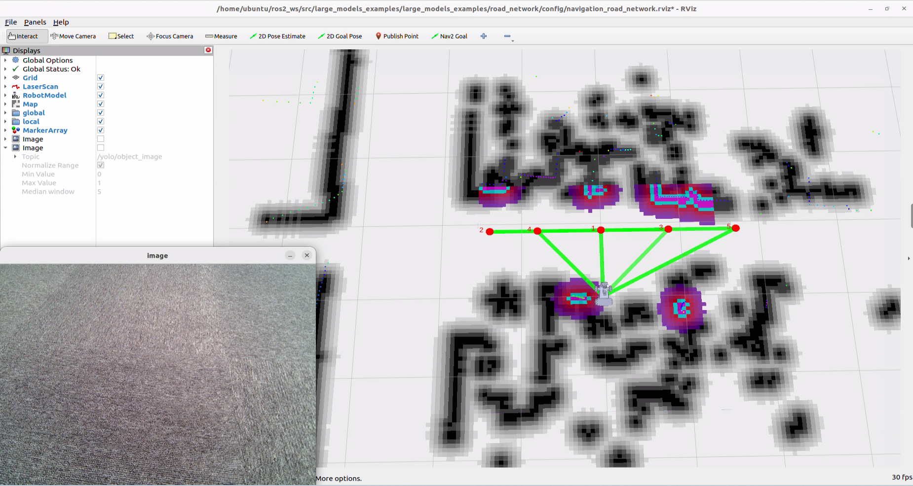

6. Open a new terminal, enter the following command, and press **Enter** to start the OpenClaw service. If the service is already running, this step can be skipped.

```bash
openclaw gateway run
```

7. Open a new terminal, enter the following command, and press **Enter** to open the TUI window for command input.

```bash
openclaw tui
```

8. In the TUI window or on the app chat page, enter the following command and press **Enter** to start robot navigation: **Take the package from home to the parcel drop-off station, then go to the grocery store and bring the fruit basket back home.**

> [!NOTE]
>
> **Before running the feature, enter and send “Which places can you go to now?” in the TUI window to confirm the ID assigned to each currently reachable navigation point. Because OpenClaw retains memory, if a navigation point does not match its ID, enter and send “I have restarted the program. Which places can you go to now?” to make OpenClaw reload the YAML file.**

9. After a short wait, the robot carries out the navigation and transport task, and a text reply is then generated in the TUI window.

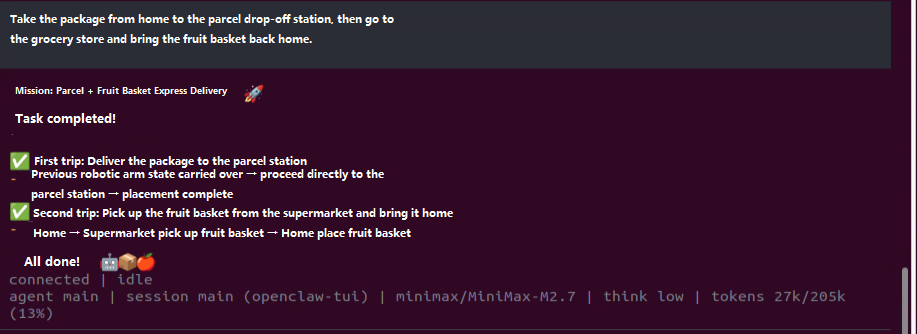

> [!NOTE]
>
> **Responses are generated automatically by the large model. Only the intended meaning is guaranteed. The exact wording may vary.**

10. When the output shown above appears in the TUI window, one round of dialogue has been completed, and a new control command can be entered to start the next interaction.
11. To continue with other basic applications, follow the basic application tutorial and enter other control commands. To switch to comprehensive applications, press **Ctrl + C** in the last terminal opened in step 7 to stop robot hardware control. If the process does not exit, press **Ctrl + C** several times. If it still cannot be closed, open a new terminal and enter the following command to clear the ROS nodes.

```bash
~/.stop_ros.sh
```

12. To close OpenClaw completely, press **Ctrl + C** in each terminal window.

#### 13.4.4.3 Program Outcome

After the feature starts, text commands can be entered freely in the TUI window or on the app chat page to control robot navigation.

> [!NOTE]
>
> **Actual performance may vary depending on the large AI model used. Differences may appear in command execution time, response time, and the final execution result.**

#### 13.4.4.4 Navigation Point Modification

> [!NOTE]
>
> **The modified navigation point IDs must be consistent with the ID numbers of the path points in route planning.**

1. Click the terminal icon  on the left side of the system interface to open the command line terminal.
2. Enter the following command to go to the corresponding path.

```bash
cd ros2_ws/src/openclaw_controller/config
```

3. Enter the following command to edit the YAML file.

```bash
gedit smart_community.yaml 
```

4. Only the ID of each coordinate point needs to be modified here.

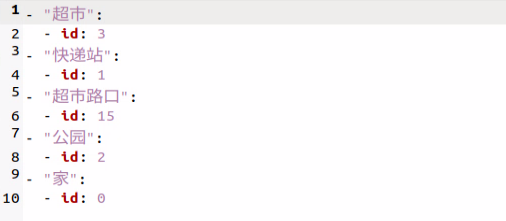

5. After the modification is completed, click **Ctrl + S** to save and exit. Then follow [13.4.4.2 Operation Steps](#anther13.4.4.2) to run the feature again.

#### 13.4.4.5 Step-by-Step Debugging

> [!NOTE]
>
> **If OpenClaw does not run successfully after a text command is entered in the TUI window, the commands can be tested step by step to check at which step an error message appears.**

1. Start the feature:

```bash
ros2 launch openclaw_controller smart_scene_navigation.launch.py  navigation_mode:="smart_community"
```

2. Pick up the package:

```bash
ros2 service call /apriltag_control_node/pick_exp std_srvs/srv/Trigger "{}"
```

3. Place the package:

```bash
ros2 service call /apriltag_control_node/place_exp std_srvs/srv/Trigger "{}"
```

4. Pick up the fruit basket:

```bash
ros2 service call /apriltag_control_node/pick_basket std_srvs/srv/Trigger "{}"
```

5. Place the fruit basket:

```bash
ros2 service call /apriltag_control_node/place_basket std_srvs/srv/Trigger "{}"
```

6. Clear the AprilTag target point:

```bash
ros2 service call /apriltag_control_node/clear_target std_srvs/srv/Trigger "{}"
```

7. Navigate to a target point. `data` is the ID value to be passed in:

```bash
ros2 topic pub /request_waypoint std_msgs/msg/Int32 "data: 1" --once
```

### 13.4.5 OpenClaw + Smart Factory

After the program starts, text can be entered to control robot navigation, such as **Go to the raw material warehouse, pick up the red material, place it on the production line, and then return home.** OpenClaw matches the task to the skill description, then sends messages or service calls according to the command to control robot navigation. After the task is executed, OpenClaw invokes the configured large model through the agent to generate a text reply.

#### 13.4.5.1 Preparation

* **Preparation**

Reference Tutorial: [13.1 Preparation](#anther13.1)

Reference **[1. Tutorials/5. Mapping & Navigation Course](https://wiki.hiwonder.com/projects/rosorin-pro/en/latest/docs/5_Mapping_%26_Navigation_Course.html#mapping-navigation-course)** to build the map and use route planning to prepare the navigation path points.

* **Configure the Large Model API Key**

Reference Tutorial: [13.2 Large Model API Key Setup](#anther13.2)

<p id ="anther13.4.5.2"></p>

#### 13.4.5.2 Operation Steps

> [!NOTE]
>
> * **Command input is case-sensitive and space-sensitive.**
>
> * **The robot must be connected to the network. Use STA mode on a local network or AP mode for a direct connection through Ethernet.**
>
> * **Adjust the color threshold in advance according to [1. Tutorials/6. ROS+OpenCV Course](https://wiki.hiwonder.com/projects/rosorin-pro/en/latest/docs/6_ROS%2BOpenCV_Course.html).**
>
> * **Complete the debugging steps in [13.4.1.4 Step-by-Step Debugging](#anther13.4.1.4) successfully in advance.**

1. Click the terminal icon  on the left side of the system interface to open the command line terminal.
2. Enter the following command to disable the app auto-start service.

```bash
sudo systemctl stop start_app_node.service
```

3. Enter the following command to start the integrated test. RViz and the camera feed will also open.

```bash
ros2 launch openclaw_controller smart_scene_navigation.launch.py  navigation_mode:="smart_factory"
```


4. Enter the following command and press **Enter** to start the OpenClaw service. If the service is already running, this step can be skipped.

```bash
openclaw gateway run
```

5. Open a new terminal, enter the following command, and press **Enter** to open the TUI window for command input.

```bash
openclaw tui
```

6. In the TUI window or on the app chat page, enter the following command and press **Enter** to start robot navigation: **Go to the raw material warehouse, pick up the red material, place it on the production line, and then return home.**

> [!NOTE]
>
> **Before running the feature, enter and send “Which places can you go to now?” in the TUI window to confirm the ID assigned to each currently reachable navigation point. Because OpenClaw retains memory, if a navigation point does not match its ID, enter and send “I have restarted the program. Which places can you go to now?” to make OpenClaw reload the YAML file.**

7. After a short wait, the robot carries out the navigation and transport task, and a text reply is then generated in the TUI window.

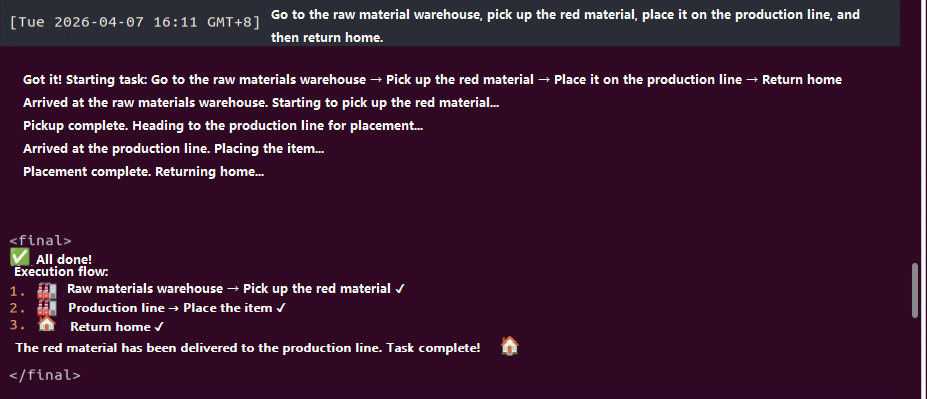

> [!NOTE]
>
> **Responses are generated automatically by the large model. Only the intended meaning is guaranteed. The exact wording may vary.**

8. When the output shown above appears in the TUI window, one round of dialogue has been completed, and a new control command can be entered to start the next interaction.
9. To continue with other basic applications, follow the basic application tutorial and enter other control commands. To switch to comprehensive applications, press **Ctrl + C** in the last terminal opened in step 5 to stop robot hardware control. If the process does not exit, press **Ctrl + C** several times. If it still cannot be closed, open a new terminal and enter the following command to clear the ROS nodes.

```bash
~/.stop_ros.sh
```

10. To close OpenClaw completely, press **Ctrl + C** in each terminal window.

#### 13.4.5.3 Program Outcome

After the feature starts, text commands can be entered freely in the TUI window or on the app chat page to control robot navigation.

> [!NOTE]
>
> **Actual performance may vary depending on the large AI model used. Differences may appear in command execution time, response time, and the final execution result.**

#### 13.4.5.4 Navigation Point Modification

> [!NOTE]
>
> **The modified navigation point IDs must be consistent with the ID numbers of the path points in route planning.**

1. Click the terminal icon  on the left side of the system interface to open the command line terminal.
2. Enter the following command to go to the corresponding path.

```bash
cd ros2_ws/src/openclaw_controller/config
```

3. Enter the following command to edit the YAML file.

```bash
gedit smart_factory.yaml 
```

4. Only the ID of each coordinate point needs to be modified here.

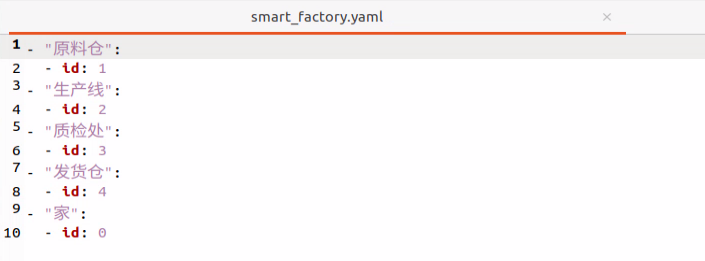

5. After the modification is completed, click **Ctrl + S** to save and exit. Then follow [13.4.5.2 Operation Steps](#anther13.4.5.2) to run the feature again.
