# 8. ROS2 Robotic Arm Control

## 8.1 Basic Robotic Arm Control

<p id ="p10-1"></p>

This section explains the basic structure and motion control of the robotic arm.

### 8.1.1 Vision Robotic Arm Introduction

ROSOrin Pro is equipped with a 6DOF robotic arm built from intelligent bus servos and metal sheet components. It can move easily to any reachable position within its workspace. The arm provides six degrees of freedom: X-axis translation, Y-axis translation, Z-axis translation, X-axis rotation, Y-axis rotation, and Z-axis rotation, enabling extension, rotation, lifting, and related movements.

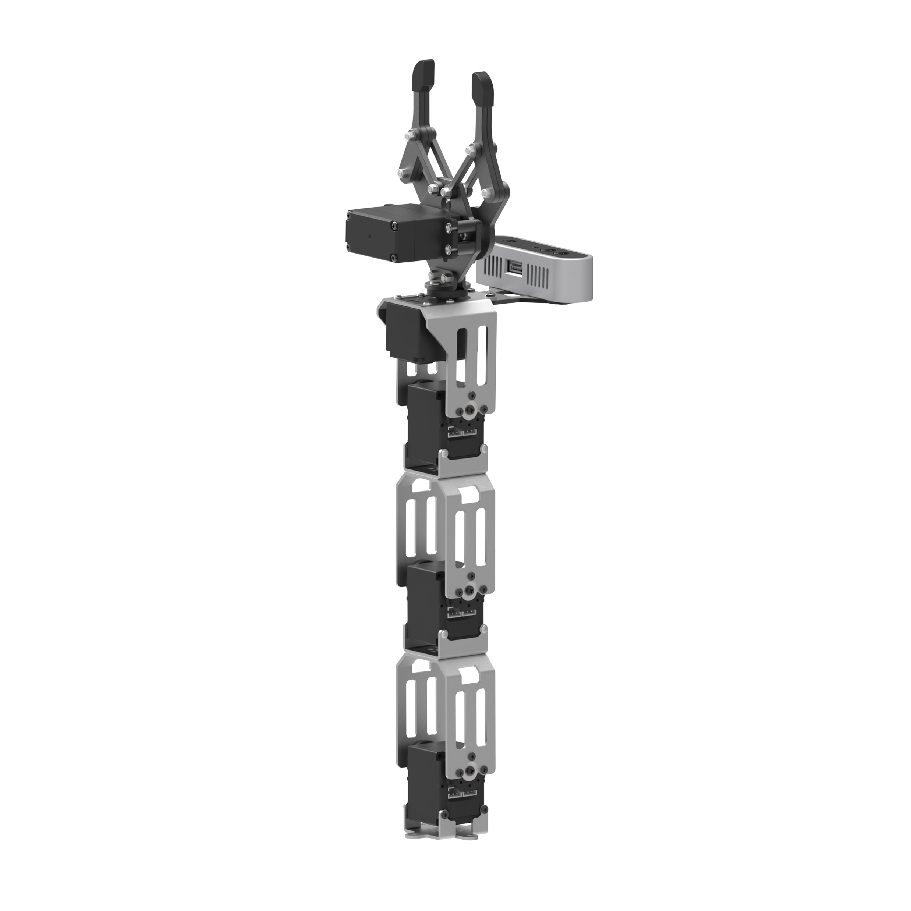

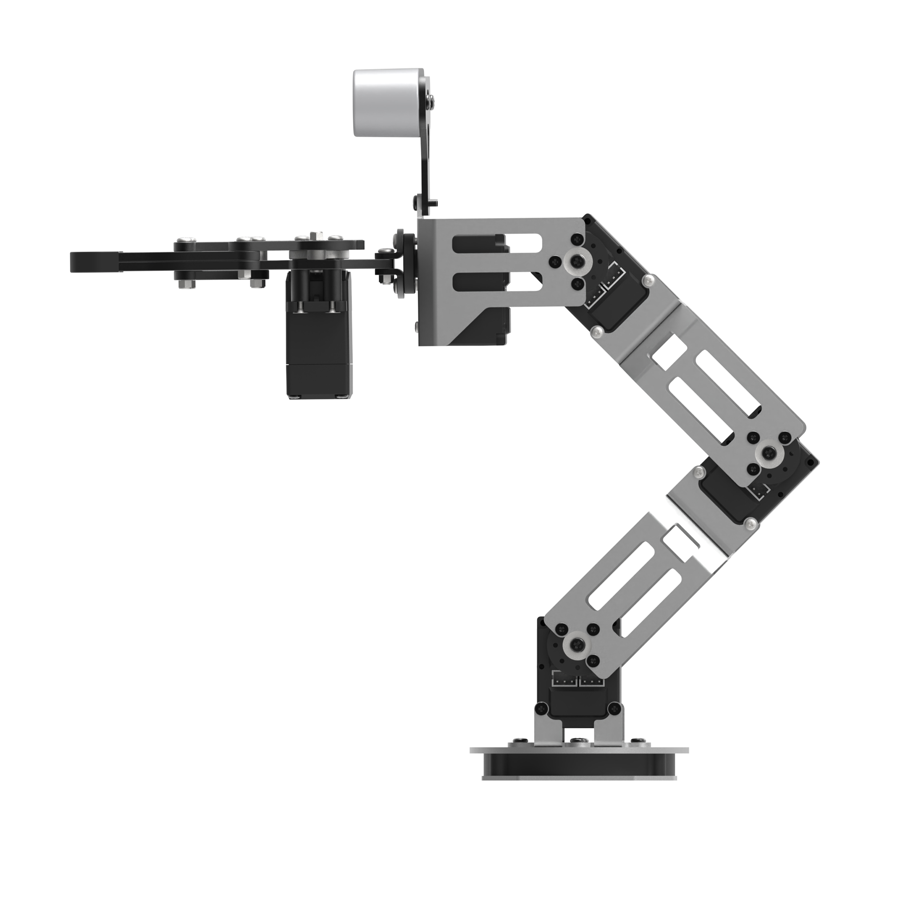

The table below lists the main robotic arm parameters.

|          Item          |                         Description                          |          Item          |                    Description                    |
| :--------------------: | :----------------------------------------------------------: | :--------------------: | :-----------------------------------------------: |
|     Servo setup:       | HTS-21H for gripper + HX-12H bus servos for arm and pan-tilt  |    Servo accuracy:     | HTS-21H bus servo: 0.2°. HX-12H bus servo: 0.3°. |
|    Arm material:       |                  Anodized aluminum alloy                     |   Control method:      |                 UART serial command               |
|      Arm DOF:          |                            6 DOF                             |   Baud rate:           |                      115200                       |
|      Arm payload:      |                   500 g for gripping and transport           |   Servo storage:       |       Saves custom settings after power-off       |
|      Arm span:         |                           410 mm                             |   Readback:            |            Supports angle readback                |
| Effective gripping range: |                    Radius less than or equal to 30 cm     | Servo protection:      | Stall protection and over-temperature protection     |
|    Camera name:        |                       Vision camera                          |  Parameter feedback:   |             Temperature, voltage, position        |
|      Pixels:           |                             2 MP                             |   System support:      |         Windows, Linux, OpenWrt                   |
|    Resolution:         |                         1920 × 1080                          |   Frame rate:          |                      60 FPS                       |
| Connection method:     |                      Driver-free USB                         |   Focus mode:          |                    Autofocus                      |

> [!NOTE]
>
> * **The robotic arm has already been calibrated before shipment. No readjustment is required.**
>
> * **This note is provided for restoring the robotic arm state after modifications.**
>
> * **The robotic arm has six joints. Joint 1 controls the overall horizontal rotation of the arm and requires the most attention during adjustment. Keep the entire arm facing the front of the vehicle and avoid any left or right deviation whenever possible.**
>
> * **Any servo deviation on the robotic arm can be checked against the side view and top view in this document path.**

### 8.1.2 Intelligent Bus Servo and Precautions

The servo is the main control component of the robotic arm in this product. The primary model used is the **HX-12H** bus servo, a common serial bus servo controlled through serial commands at a baud rate of 115200. Based on the communication protocol provided by Hiwonder, the corresponding commands can be sent to the servo to control rotation or read servo information. Before servo control begins, the servo parameters and ID must be configured first.

This servo uses a half-duplex UART asynchronous serial interface. The signal pin can both send and receive signals. During operation, different commands can be sent through the serial port based on different IDs, making it possible to control each servo independently. This type of servo is widely used in joint designs for various biomimetic robots.

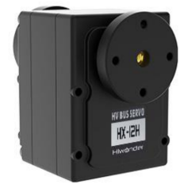

* **Structure and Specifications**

The structural dimensions of the HX-12H bus servo are shown below.

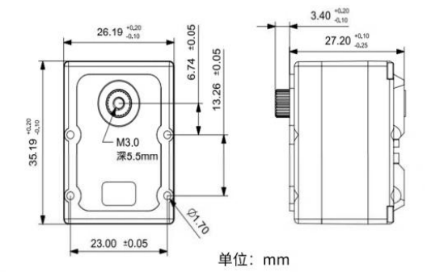

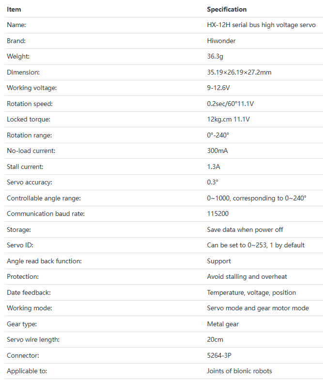

* **Features**

1. **High-voltage servo, lower power consumption:**

   Compared with conventional 7.4 V servos, an 11.1 V high-voltage servo reduces current by more than 60%, greatly extending robot operating time.

2. **Serial bus interface:**

   The control board routes one I/O port to the servo, and the servos are connected in series through three-pin connectors. This reduces serial port usage. Wiring is simpler, and the overall product design is cleaner and more refined.

3. **ID recognition and bus communication:**

   Each servo can be assigned an ID for identification. The default servo ID is 1 and can be changed as needed. Communication between the controller and servos uses a single bus at a baud rate of 115200. Each servo can be assigned its own ID. The commands sent by the controller include ID information. Only the servo with the matching ID receives the full command and performs the corresponding action.

4. **High-precision potentiometer:**

   A high-precision imported potentiometer is used inside the servo for angle feedback. This delivers excellent accuracy and linearity, making robot operation more stable and significantly extending servo service life.

5. **High torque:**

   The 12 kg high torque output provides a strong driving force for the robot.

6. **Position, temperature, and voltage feedback:**

   Position, temperature, and voltage feedback are supported, making it possible to monitor internal servo data in real time for protection purposes.

7. **Two operating modes:**

   Supports servo mode and gear motor mode.

   1. In servo mode, positioning control is available within a 240-degree range.
   2. In gear motor mode, continuous 360-degree rotation is supported, with controllable direction and speed.

8. **Metal gears:**

   High-precision embedded gears reduce noise caused by gear friction.

9. **Metal housing:**

   The green anodized metal housing provides strong heat dissipation and a more striking appearance.

* **Installation notes**

Refer to the image below for servo horn installation. Align it with the red cross marker.

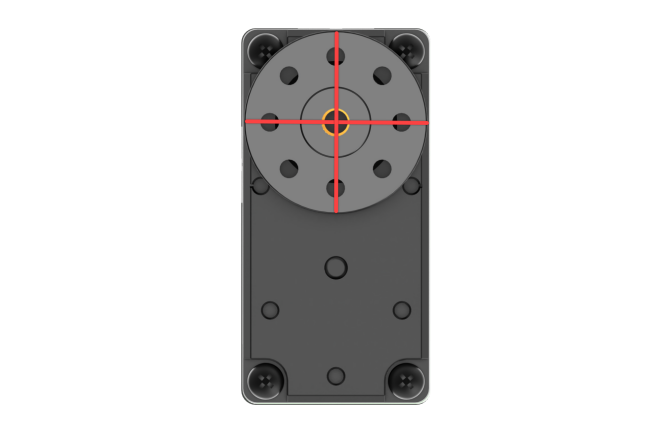

For the interface layout and description, refer to the figure and table below.

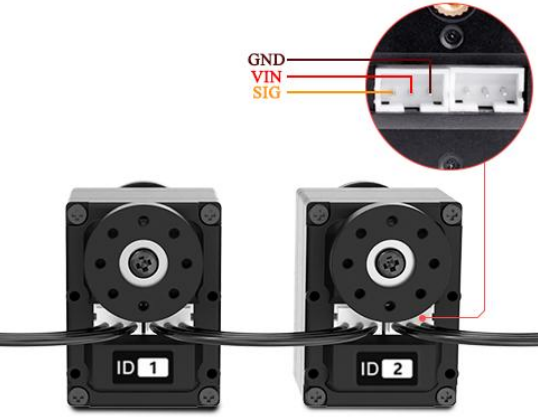

| Pin |                    Description                     |
| :--: | :------------------------------------------------: |
| GND  |                     Power ground                   |
| VIN  |                     Power input                    |
| SIG  | Signal pin, half-duplex UART asynchronous serial interface |

### 8.1.3 PC Software Interface Overview

* **PC Software Overview**

The host computer corresponds to the lower-level controller. It is used to send commands to the controller and receive feedback data from it. In most cases, the host computer is a PC. Software running on the PC, referred to as PC software, is used to control the lower-level controller.

To send commands and receive feedback data, the host computer software must communicate through the serial port. In this setup, the serial port is accessed through the USB interface. The host computer connects to the lower-level controller through USB, and the host computer software communicates with the lower-level controller through that same USB connection. This enables coordinated operation between the host computer and the lower-level controller.

This section introduces the interface and functions of the host computer software used to control ROSOrin Pro.

* **Starting the PC Software**

1. **Launch from the Desktop Icon**

   (1) Double-click the desktop icon  to open the command-line terminal. Before adjusting the deviation and robotic arm position, stop the app auto-start service first:

   ```
   sudo systemctl stop start_app_node.service
   ```

   (2) Click the **Arm** icon on the desktop to launch the PC software.

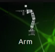

2. **Launch from the Command Line**

   (3) Double-click the desktop icon  to open the command-line terminal. Before adjusting the deviation and robotic arm position, stop the app auto-start service first:

   ```
   sudo systemctl stop start_app_node.service
   ```

   (4) Enter the following command to open the PC software directory:

   ```
   cd software/arm_pc
   ```

   

   (5) Enter the following command to launch the PC software:

   ```
   python3 main.py
   ```

   

> [!NOTE]
>
> **When any servo-related node is running, such as mapping and navigation features, the PC software or servo tool cannot be opened again because the serial port is already occupied.**

3. **PC Software Interface Layout**

The **General Mode** interface of the PC software is shown below.

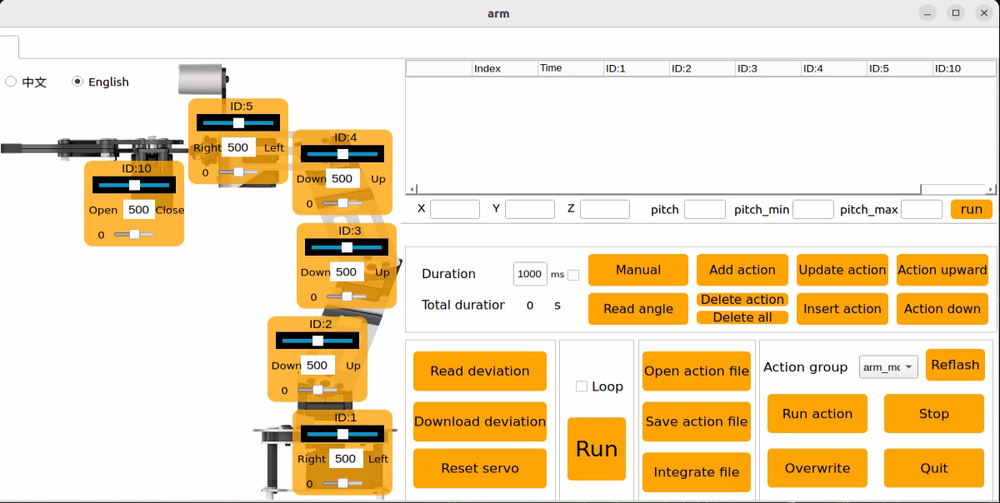

All servos have already been calibrated before shipment, so no further adjustment is required. **If this tool must be used due to an issue, operation must be carried out under the guidance of professional technicians. Otherwise, robotic arm malfunction may occur.**

The PC software interface is shown below. Different functional areas are outlined with red boxes.

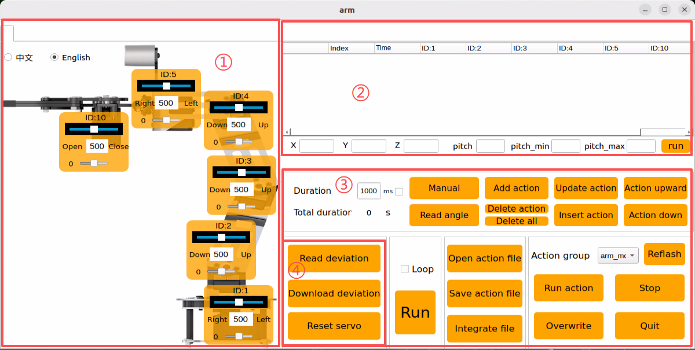

**① Servo Control Area**

The servo control area displays the icon of the selected servo. Adjusting the corresponding slider changes the servo position.

|                           **Icon**                           |                         **Function**                         |
| :----------------------------------------------------------: | :----------------------------------------------------------: |
|  |   Displays the servo ID, with 1 shown here as an example.    |
| 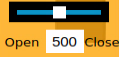 | Used to adjust the servo position. Minimum value 0, maximum value 1000. |
|  | Used to adjust the servo deviation. Minimum value -125, maximum value 125. |
| 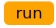 | After the robot x, y, z, and pitch pose values are set, it runs the motion. |

**② Action Detail List**

The action detail list shows the execution time of each action in the current action group and the servo values for every action.

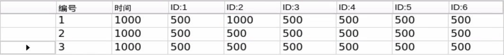

|                           **Icon**                           |                         **Function**                         |
| :----------------------------------------------------------: | :----------------------------------------------------------: |
| 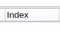 |                     Action group number.                     |
| 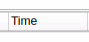 | Execution time of the action, meaning the time required to complete it. |
| 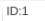 | Action value corresponding to this ID. Double-click the value below  to modify it directly. |

**③ Action Group Settings Area**

|                             Icon                             |                           Function                           |
| :----------------------------------------------------------: | :----------------------------------------------------------: |
| 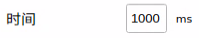 | Time required to run a single action. Click  to modify it. |
| 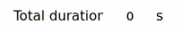 |      Total time required to run the full action group.       |
|  | After clicking, the robot joints relax so the robot can be moved by hand for pose design. |
|  | Reads the angle data of the manually posed shape. Use together with the **Manual** button. |
| 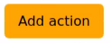 | Adds the current servo values in the servo control area as a new action to the last row of the action detail list. |
| 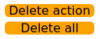 | **Delete Action** removes the selected action in the action detail list. **Delete All** removes all actions in the action detail list. |
| 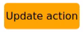 | Replaces the selected values in the action detail list. Servo values are replaced with the current values in the servo control area, and the action time is replaced with the time set in **Time**. |
| 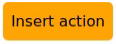 | Inserts one action row above the selected action. The action time uses the value in **Time ms**, and the angle values use the current servo values in the servo control area. |
| 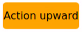 |       Swaps the selected action with the row above it.       |
| 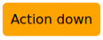 |       Swaps the selected action with the row below it.       |
| 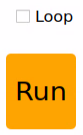 | Click once to run the actions in the action detail list one time. If **Loop** is checked, the robot repeats the action sequence. |
| 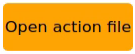 | After clicking, select the action group to open, and its data will be loaded into the action detail list. |
|  | Saves the actions currently shown in the action detail list to the specified location. |
| 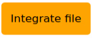 | After one action group is opened, click **Integrate file**, then open another action group file to combine the two into a new action group. |
| 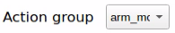 |     Displays the saved action groups in the PC software.     |
|  |          Refreshes the action group selection list.          |
| 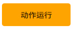 |           Executes the selected action group once.           |
|  | Overwrites the previously selected action group with the action content currently shown in the action detail list. |
| 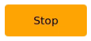 |          Stops the action group currently running.           |
| 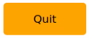 |          Exits the current host computer interface.          |

**④ Deviation Settings Area**

This area is for basic familiarity with the available function buttons.

|                           **Icon**                           |                         **Function**                         |
| :----------------------------------------------------------: | :----------------------------------------------------------: |
| 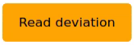 |   Automatically reads the saved deviation after clicking.    |
| 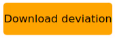 | Downloads the adjusted deviation from the host computer to the robot after clicking. |
| 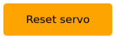 | Restores all servos in the servo control area to position 500 after clicking. |

### 8.1.4 Running Action Groups

* **Overview**

Running an action group means directly loading an edited action group in the PC software and checking the execution result. Action groups edited and saved in later lessons can be run in the same way.

Built-in action groups are preloaded at the factory. The files are stored in the following path:

**ubuntu/software/arm_pc/ActionGroups**

These built-in actions can be viewed and run either through the PC software or through terminal commands.

The detailed procedure is as follows.

> [!NOTE]
>
> **Action files must be saved under "ubuntu/software/arm_pc/ActionGroups" before they can be called.**

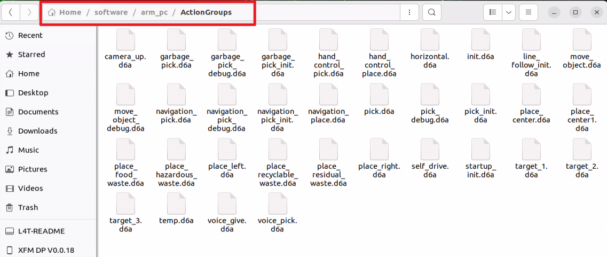

The following steps explain how to run the built-in action groups in the software and make the robotic arm perform the corresponding motions.

* **Operation Steps**

1. Double-click the desktop host computer icon  to enter the editing interface, as shown below.

    

2. Click the **Open action file** button.

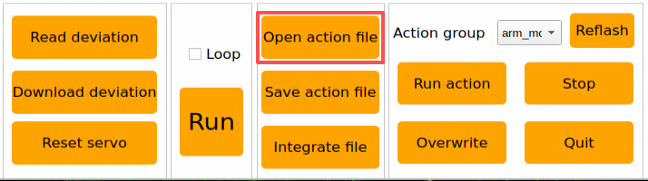

3. Select the action group to run, then click **Open**.

    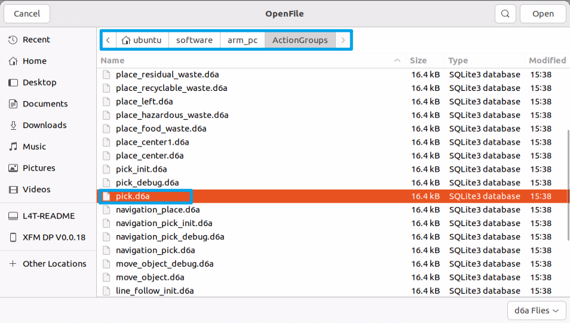

4. The action detail list now displays the execution time and servo values for each action in the action group.

    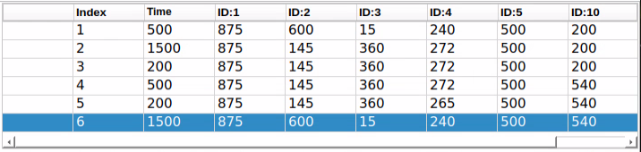

5. First select action number **1**, then click the **Run** button to execute all actions in the current action detail list. To repeat the current action group, check the **Loop** option.

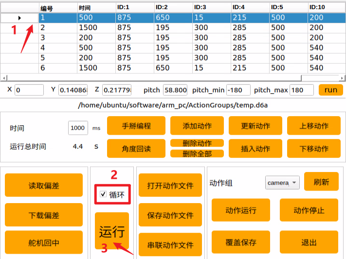

After clicking **Run**, the robotic arm executes the actions in the action group in a loop.

### 8.1.5 Editing Action Groups

* **Overview**

Action editing uses a target motion as the reference. The required motion is achieved by adjusting the angles of the corresponding servos, and multiple actions are then combined into an action group.

This section creates an action group that enables the robotic arm to **grasp the block on the left side**.

* **Creating the Action Group**

1. **Action Design**

   (1) Double-click the PC software icon  on the desktop to open the **General Mode** editing interface.

   

   (2) Click **Reset servo** to return all servos to the central position.

   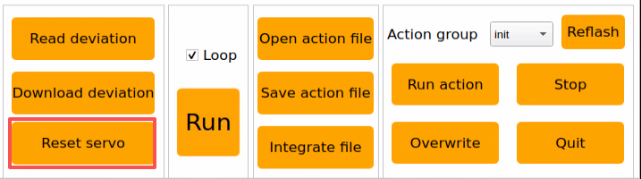

   (3) Move each servo slider so the robotic arm bends down toward the left side. Set the values as shown below.

   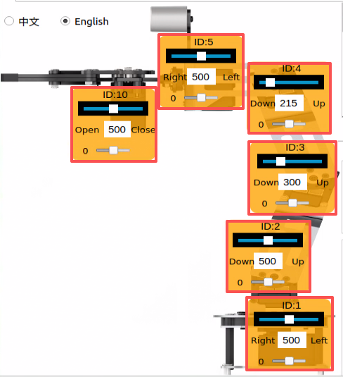

   (4) Click **Add action** to add the current pose to the action detail list.

   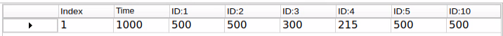

   (5) Next, align the robotic arm with the block. Adjust the servo angles as shown below.

   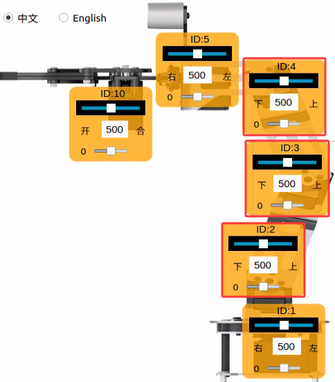

   (6) Set the time to **2000 ms**, then click **Add action** to create Action 2.

   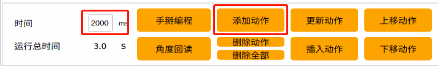

   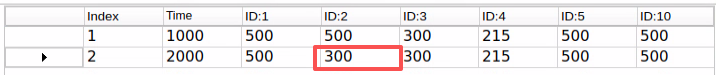

   (7) Add another transition action. Set the time to **200 ms**, then click **Add action** to create Action 3.

   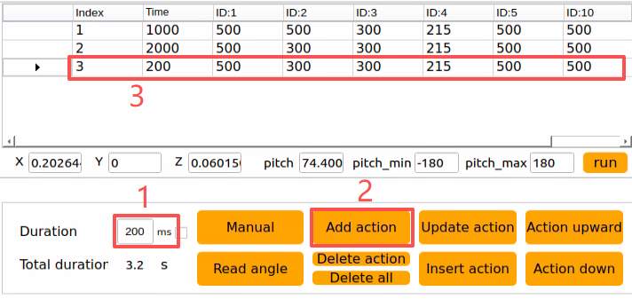

   (8) The next step is gripping. Adjust the value slider of Servo 10. Set **Time** to **500 ms**, then click **Add action**.

   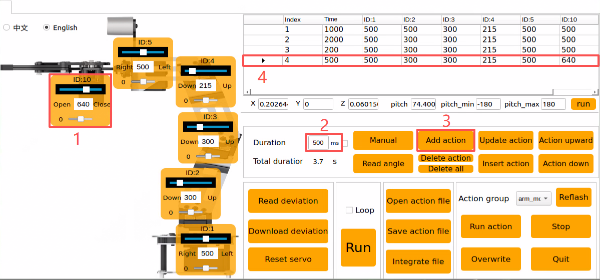

   (9) Then add another transition action. Set the time to **200 ms**, click **Add action**, and Action 5 is created.

   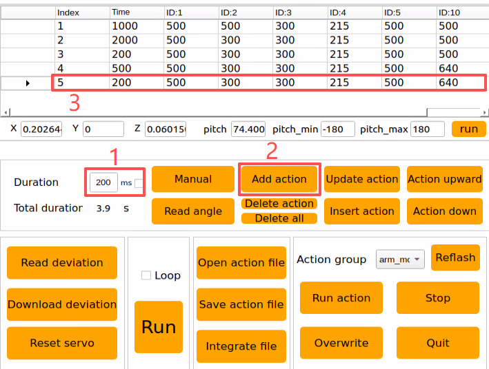

   (10) Next, lift the block to the target height. Set the time to **2000 ms**, then click **Add action** to create Action 6.

   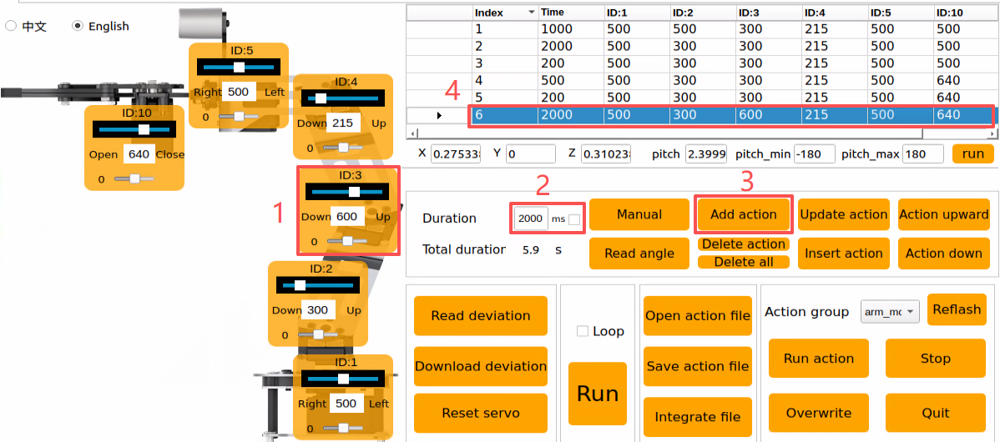

   At this point, the full action detail list for the block-grasping action group has been completed, as shown below.

   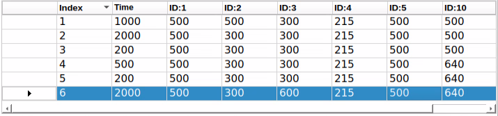

   (11) Next, check the overall effect of the full action group. Select Action 1, then click **Run**. To repeat this action group, check the **Loop** option.

   

2. **Saving the Action**

> [!NOTE]
>
> **Do not use spaces when naming an action group. Otherwise, saving may fail during later debugging. Replace spaces with an underscore** `_` **instead.**

To make later debugging and management easier, the edited action group can be saved. Click the **Save action file** button, then select the following path: **ubuntu/software/arm_pc/ActionGroups**.


Use **font_pick** as the example name here. Click **Save** to store the action group.


### 8.1.6 Integrating Action Files

* **Overview**

Integrating action files means linking two action group files end-to-end to create a new action group file. This makes it possible to merge action groups and control robotic arm motion according to the newly integrated action group.

* **Operation Steps**

1. Double-click the desktop host computer icon  to open the **General Mode** editing interface.


2. Click the **Integrate file** button in the action group settings area, then select the following path.

    

3. In the pop-up window, select **place_left.d6a** and double-click to open it.

    

4. The parameters of this action group now appear in the action group detail list.


5. Click the **Integrate file** button again, select **place_right.d6a**, and double-click to open it. The second action group file is then integrated into the first one.


6. Select Action 1, then click **Run** to execute the newly integrated action group online once.


7. Click the **Save action file** button to save the newly integrated action group for later debugging.


8. Enter a name for the new integrated action. The example name here is **left_right**.

> [!NOTE]
>
> **The file name must be entirely in English and cannot contain spaces. Replace spaces with an underscore** `_` **instead.**


### 8.1.7 Importing and Exporting Action Files

* **Overview**

This section explains how to export action group files edited in the PC software and import them to other devices of the same type for execution, allowing action files to be transferred between different devices.

* **Exporting Actions**

**This section uses exporting and importing the** `pick.d6a` **action group file as the example.**

1. Click the folder icon  on the desktop.

2. Find the **pick.d6a** file under the path shown below.


3. Drag the action file directly to the desktop to export it.


* **Importing Actions**

Importing actions is performed in the same way as exporting. Drag the action group file into the corresponding path.

1. Before starting, bend the antenna to prevent the robotic arm from hitting it during movement.

2. Drag-copy the **pick.d6a** action group file to the desktop.


3. Then drag **pick.d6a**, or copy and paste it, to the following path.


4. Then double-click the desktop host computer icon  to enter the **General Mode** editing interface.


5. Click the **Open action file** button, then select the path outlined below. The imported action file can then be found in the window that opens.

    

6. Select the action group to run, then click **Open**.

    

Or click the drop-down button in the action group selection bar to choose the imported action file from the option list directly.


7. Click **Run** to execute the action group.

    

### 8.1.8 Position and Orientation of the Robotic Arm in 3D Space

1. Double-click the desktop icon  to open the command-line terminal. Enter the command below to stop the app auto-start service first:

   ```
   sudo systemctl stop start_app_node.service
   ```

2. Click the **Arm** icon on the desktop to launch the PC software.


3. The robotic arm can move to a specified position and orientation in 3D space.

    

   (1) **X, Y, Z** represent the 3D coordinate position of the end gripper.

   **X**: position in the forward and backward direction on the horizontal plane.

   **Y**: position in the left and right direction on the horizontal plane.

   **Z**: position in the vertical direction.

   (2) **pitch** is the pitch angle of the end gripper. It describes the rotation angle of the gripper in the vertical plane. The pitch angle tilts the gripper upward or downward. **pitch -90.0** means the end effector tilts upward by 90 degrees. **pitch 0.0** means the gripper is parallel to the ground.

   (3) **pitch_min** and **pitch_max** represent the minimum and maximum limits of the robotic arm pitch angle, which are **-180 degrees** and **180 degrees**.

4. Modify the values of **X**, **Y**, **Z**, and **pitch**, then click **run**. The robotic arm moves to the specified position and orientation in 3D space.

    


## 8.2 Robotic Arm Deviation Adjustment

During robotic arm operation, servo angle deviation may gradually increase over time. If a joint on the robotic arm cannot reach the specified target point during motion execution, the servo deviations of the affected arm joints need to be adjusted manually according to this document.

> [!NOTE]
>
> **Before shipment, the servo deviations of the robotic arm have already been calibrated. No servo deviation adjustment is required during first use or during the initial period after receipt. Deviation adjustment is only necessary when the deviation becomes large enough to affect normal operation.**

### 8.2.1 Robotic Arm Overview

This vehicle is equipped with a 6DOF robotic arm built from intellect bus servos and metal sheet components. It can move easily to any reachable position within its workspace. The arm provides six degrees of freedom: X-axis translation, Y-axis translation, Z-axis translation, X-axis rotation, Y-axis rotation, and Z-axis rotation, enabling extension, rotation, lifting, and related movements. A depth camera, Dabai DCW, is also mounted on the arm and can be used together with the robotic arm for hand following, color block recognition and sorting, color block tracking, line following and obstacle clearing, waste sorting, fixed-point navigation and transport, and related applications.


ROSOrin Pro is equipped with a 6DOF robotic arm built from intellect bus servos and metal sheet components.


The 6DOF robotic arm on ROSOrin Pro is made up of six intellect bus servos: HTS-21H for the gripper and HX-12H bus servos for the arm body and pan-tilt.

Bus servos use serial communication and connect multiple servos to the control system through a single bus. Multiple servos can be daisy-chained through one I/O port. Compared with digital servos, bus servos offer higher precision at a slightly higher cost. The interface layout and description are shown below, using the HX-12H servo as the example.


| Pin  |                      Pin Description                       |
| :--: | :--------------------------------------------------------: |
| GND  |                        Power ground                        |
| VIN  |                        Power input                         |
| SIG  | Signal pin, half-duplex UART asynchronous serial interface |

### 8.2.2 Adjustment Steps

* **8.2.2.1 Adjustment Standards**

<p id ="p10-2-2"></p>

Before servo deviation adjustment begins, the corresponding ID of each servo on the robotic arm must first be identified and understood. These IDs are also used during the later adjustment process.


Servo 1 is the pan-tilt servo. Servos 2, 3, and 4 are the robotic arm joint servos. Servo 5 is the wrist servo. Servo 10 is the gripper servo. A total of six servos are controlled during robotic arm operation. These six servos may all develop deviations over time, so adjustment must be performed according to the robotic arm center-position standard.

During servo deviation adjustment, refer to the standard diagram below. The robotic arm can only be judged to have no deviation when the following two standards are met at the same time. Both are required.


**Standard 1:** In the robotic arm center position, Servos 1, 2, 3, 4, and 5 should align vertically relative to the vehicle chassis. As shown in the figure, the reference line passing through the center screws of the servo horns should form a straight vertical line through these servos.


**Standard 2:** The opening distance of the gripper should remain between 2 cm and 3 cm. This also serves as the center-position reference for the gripper servo. A simple check can be made with two fingers, the index finger and middle finger. If they fit exactly into the gap, the standard is met.

* **8.2.2.2 Adjustment Steps**

After the adjustment standards are understood, servo deviation adjustment can be carried out based on those standards. The example below uses deviation adjustment of Servo 3 on the ROSOrin Pro robotic arm. As shown in the following figure, Servo 3 has developed an deviation, causing the positions of Servos 4, 5, and 10 to shift. In this case, adjustment is required through the PC software.


The detailed steps are as follows:

1. Connect the robot, then click the  icon on the left taskbar to open the terminal.

2. Enter the following command in the terminal to stop the auto-start service:

   ```
   sudo systemctl stop start_app_node.service
   ```

   

3. Double-click the **arm** icon on the desktop to enter the robotic arm PC software interface, as shown below:

   

For the **arm** software interface and related content, refer to **[8.1 Basic Robotic Arm Control](#p10-1)**. This document focuses only on servo deviation adjustment, so those details are not repeated here.

4. Click the **Reset servo** button and check the robotic arm. Servo 3 can be seen to have a deviation.

   

   

5. Click the **Read deviation** button to obtain the current deviation values of the servos mounted on the robotic arm.

   

6. After the **success!** pop-up appears, click **OK**.

   

7. Check the deviation value of Servo **ID 3**, as shown below. Each servo has a corresponding ID. The upper slider represents the current position, the middle number shows the position value, and the bottom slider represents the configured deviation value of the servo.

   

8. The current deviation value of Servo 3 is **-18**. When this type of deviation appears on Servo 3, adjustment must be made in the opposite direction until the arm reaches **Standard 1** under **[8.2.2.1 Adjustment Standards](#p10-2-2)**.

   

   As shown, the deviation value of Servo 3 has now been adjusted to **2**, and the robotic arm has been corrected to the **Standard 1** state under **[8.2.2.1 Adjustment Standards](#p10-2-2)**. The deviation setting for Servo 3 is now complete. The current value still needs to be saved to the robot computer. After the robot starts, the saved value is read for servo control. The same method applies to the other servo IDs.

9. Click **Download deviation**.

   

10. Wait for the **success!** prompt window to appear, then click **OK** to close it.

    

    This completes the deviation adjustment for Servo 3.

11. To return the robotic arm to its initial state, select **camera** in the action group area.

    

12. Select **init**.

    

13. Then click **Run action** to run the **init** action group.

    

    After clicking, the robot's state is shown below.

    

    After the above steps are completed, the deviation adjustment for Servo 3 on the robotic arm is finished. If the other bus servos on the vehicle also show deviations that do not meet the criteria, repeat **[8.2.2 Adjustment Steps](#p10-2-2)** to adjust the corresponding servo deviations. One important point here is that the lower slider must be adjusted, and the **Download deviation** button must then be clicked for the change to take effect. The exact position is marked by the green box in the figure below.

    

### 8.2.3 FAQ

* **Q: While adjusting the gripper position, the gripper stops responding once the value goes beyond a certain point, regardless of further adjustment. Why does this happen?**

**A:** A mechanical limit has been set for the gripper on the robotic arm. This means the gripper driven by Servo 10 reaches its mechanical limit when the position set through the host computer exceeds **700**. At that point, the gripper can no longer close further, and the servo may be damaged. Adjustment only needs to be made in the opposite direction.


The recommended adjustment range for Servo 10 is **200 to 700**.

* **Q: The software interface freezes after clicking Read Deviation**

**A:** Bus servos communicate through the serial port. After the robot is powered on, if the auto-start service has not been stopped, message transmission may be blocked, causing the software interface to freeze. The solution is to stop the auto-start service. Refer to **[8.2.2 Adjustment Steps](#p10-2-2)** for the procedure.


## 8.3 2D Vision

### 8.3.1 Hand Following

* **Overview and Principles**

What are the application scenarios of hand following?

1. Hand tracking technology in virtual reality can be used in VR games, allowing gestures to control character movement, attacks, and other actions.
2. Hand tracking technology in healthcare can be used for rehabilitation training to help restore hand function.
3. Hand tracking technology in education can be used for interactive learning through gestures.
4. Hand tracking technology in smart homes can be used to control switching and adjustment of home devices through gestures.
5. Hand tracking technology in industrial production can be used to control robots through gestures, improving production efficiency.

The hand-feature detection library used by this robot is **MediaPipe**, an open-source multimedia machine learning framework. It runs across platforms on mobile devices, workstations, and servers, and supports mobile GPU acceleration. It also supports the TensorFlow and TF Lite inference engines, so any TensorFlow or TF Lite model can be used with MediaPipe. On mobile and embedded platforms, MediaPipe also supports GPU acceleration provided by the device itself.

First, a hand-recognition model needs to be built. Then, image data is obtained by subscribing to the topic published by the camera node. After image processing such as flipping, the hand information in the image is detected. Next, the position of the hand center is obtained from the connections between the hand keypoints. Finally, the robotic arm is controlled to move up and down by following the hand center point. The source code for this program is located at: **/home/ubuntu/ros2_ws/src/example/example/hand_track/hand_track_node.py**

* **Operation Steps**

> [!NOTE]
>
> **Commands are case-sensitive. The Tab key can be used for auto-completion.**

1. Power on the robot and connect it to NoMachine. For remote desktop installation and connection, refer to section **[1.7 Development Environment Setup](https://wiki.hiwonder.com/projects/rosorin-pro/en/latest/docs/1_ROSOrin_Pro_User_Manual.html#development-environment-setup)** in the user manual.

2. Click the desktop icon  to open the command-line terminal.

3. Enter the following command to stop the app auto-start service:

   ```
   sudo systemctl stop start_app_node.service
   ```

4. Enter the following command to start the feature:

   ```
   ros2 launch example hand_track_node.launch.py
   ```

5. To stop this feature, press **Ctrl + C** in the terminal. If it does not stop successfully, open a **new** terminal and enter the following command to stop all currently running ROS programs.

   ```
   ~/.stop_ros.sh
   ```

* **Program Outcome**

After the program starts, the robotic arm slowly lifts upward. Place a hand in front of the robotic arm camera and move it up and down. The robotic arm follows the hand and moves up and down accordingly.

> [!NOTE]
>
> **Displaying the returned image feed in this feature can easily cause the program to freeze, so no returned image is shown during operation.**
>
> **To view the returned image, open a new terminal, enter `rqt`, and select `/hand_detect/image_result`.**


* **Program Analysis**

**Launch File Analysis**

Program path:

**ros2_ws/src/example/example/hand_track/hand_track_node.launch.py**

```py
from ament_index_python.packages import get_package_share_directory

from launch_ros.actions import Node
from launch import LaunchDescription, LaunchService
from launch.substitutions import LaunchConfiguration
from launch.actions import IncludeLaunchDescription, OpaqueFunction, DeclareLaunchArgument
from launch.launch_description_sources import PythonLaunchDescriptionSource

def launch_setup(context):
    compiled = os.environ['need_compile']
    enable_display = LaunchConfiguration('enable_display', default='true')
    enable_display_arg = DeclareLaunchArgument('enable_display', default_value=enable_display)
    machine_type = os.environ.get('MACHINE_TYPE')
    if compiled == 'True':
        peripherals_package_path = get_package_share_directory('peripherals')
        controller_package_path = get_package_share_directory('controller')
        kinematics_package_path = get_package_share_directory('kinematics')
    else:
        peripherals_package_path = '/home/ubuntu/ros2_ws/src/peripherals'
        controller_package_path = '/home/ubuntu/ros2_ws/src/driver/controller'
        kinematics_package_path = '/home/ubuntu/ros2_ws/src/driver/kinematics'

    depth_camera_launch = IncludeLaunchDescription(
        PythonLaunchDescriptionSource(
            os.path.join(peripherals_package_path, 'launch/depth_camera.launch.py')),
    )
    controller_launch = IncludeLaunchDescription(
        PythonLaunchDescriptionSource(
            os.path.join(controller_package_path, 'launch/controller.launch.py')),
    )

    kinematics_launch = IncludeLaunchDescription(
        PythonLaunchDescriptionSource(
            os.path.join(kinematics_package_path, 'launch/kinematics_node.launch.py')),
    )
```

1. **Reading Package Paths**

Reads the paths of the `peripherals`, `controller`, and `kinematics` packages.

```py
    if compiled == 'True':
        peripherals_package_path = get_package_share_directory('peripherals')
        controller_package_path = get_package_share_directory('controller')
        kinematics_package_path = get_package_share_directory('kinematics')
    else:
        peripherals_package_path = '/home/ubuntu/ros2_ws/src/peripherals'
        controller_package_path = '/home/ubuntu/ros2_ws/src/driver/controller'
        kinematics_package_path = '/home/ubuntu/ros2_ws/src/driver/kinematics'
```

2. **Launching Other Launch Files**

`depth_camera_launch` is used to start the depth camera.

`controller_launch` is used to start chassis control and servo control.

`kinematics_launch` is used to start the kinematics algorithm.

```py
    depth_camera_launch = IncludeLaunchDescription(
        PythonLaunchDescriptionSource(
            os.path.join(peripherals_package_path, 'launch/depth_camera.launch.py')),
    )
    controller_launch = IncludeLaunchDescription(
        PythonLaunchDescriptionSource(
            os.path.join(controller_package_path, 'launch/controller.launch.py')),
    )

    kinematics_launch = IncludeLaunchDescription(
        PythonLaunchDescriptionSource(
            os.path.join(kinematics_package_path, 'launch/kinematics_node.launch.py')),
    )
```

3. **Starting Nodes**

`hand_detect_node` is used to start hand detection.

`hand_track_node` is used to start hand tracking.

```py
        hand_detect_node = Node(
            package='example',
            executable='hand_detect',
            output='screen',
            parameters=[{'enable_display': enable_display, 'use_depth_cam': True}]
        )
    else:
        hand_detect_node = Node(
            package='example',
            executable='hand_detect',
            output='screen',
            parameters=[{'enable_display': enable_display, 'use_depth_cam': False}]
        )
```

**Source Code Analysis**

Program path:

**ros2_ws/src/example/example/hand_track/hand_track_node.py**

```py
#!/usr/bin/env python3
# encoding: utf-8
# @data:2022/11/07
# @author:aiden
# Hand following
import time
import rclpy
import signal
import threading
import sdk.pid as pid
from rclpy.node import Node
from std_srvs.srv import Trigger
from kinematics import transform
from interfaces.msg import Point2D
from geometry_msgs.msg import Twist
from kinematics_msgs.srv import SetRobotPose
from rclpy.executors import MultiThreadedExecutor
from servo_controller_msgs.msg import ServosPosition
from rclpy.callback_groups import ReentrantCallbackGroup
from kinematics.kinematics_control import set_pose_target
from servo_controller.bus_servo_control import set_servo_position

class HandTrackNode(Node):
    def __init__(self, name):
        rclpy.init()
        super().__init__(name)
        self.name = name
        self.image = None
        self.center = None
        self.running = True
        self.z_dis = 0.41
        self.y_dis = 500
        self.x_init = transform.link3 + transform.tool_link

        self.pid_z = pid.PID(0.00008, 0.0, 0.0)
        self.pid_y = pid.PID(0.03, 0.0, 0.0)
        signal.signal(signal.SIGINT, self.shutdown)

        self.mecanum_pub = self.create_publisher(Twist, '/controller/cmd_vel', 1)
        self.joints_pub = self.create_publisher(ServosPosition, '/servo_controller', 1) # Servo control
```

1. **Main Function**

```py
def main():
    node = HandTrackNode('hand_track')
    executor = MultiThreadedExecutor()
    executor.add_node(node)
    executor.spin()
    node.destroy_node()
```

The main function creates the hand-recognition class and starts the node.

- **HandTrackNode Class**

  **init_process**

  ```py
      def init_process(self):
          self.timer.cancel()
  
          self.init_action()
  
          threading.Thread(target=self.main, daemon=True).start()
          self.create_service(Trigger, '~/init_finish', self.get_node_state)
          self.get_logger().info('\033[1;32m%s\033[0m' % 'start')
  ```

  Initializes the action, starts the `main` function, and publishes the current initialization state of the node.

  **send_request**

  ```py
      def send_request(self, client, msg):
          future = client.call_async(msg)
          while rclpy.ok():
              if future.done() and future.result():
                  return future.result()
  ```

  Publishes the detected hand position to the kinematics node and gets the servo angles returned by the kinematics calculation.

  **get_hand_callback**

  ```py
      def get_hand_callback(self, msg):
          if msg.width != 0:
              self.center = msg
          else:
              self.center = None
  ```

  Used to obtain the current hand-detection result.

  **main**

```py
    def main(self):
        while self.running:
            if self.center is not None:
                t1 = time.time()
                self.pid_y.SetPoint = self.center.width / 2
                self.pid_y.update(self.center.width - self.center.x)
                self.y_dis += self.pid_y.output
                if self.y_dis < 200:
                    self.y_dis = 200
                if self.y_dis > 800:
                    self.y_dis = 800

                self.pid_z.SetPoint = self.center.height / 2
                self.pid_z.update(self.center.y)
                self.z_dis += self.pid_z.output
                if self.z_dis > 0.46:
                    self.z_dis = 0.46
                if self.z_dis < 0.36:
                    self.z_dis = 0.36

                msg = set_pose_target([self.x_init, 0.0, self.z_dis], 0.0, [-180.0, 180.0], 1.0)
                res = self.send_request(self.kinematics_client, msg)
                t2 = time.time()
                t = t2 - t1
                if t < 0.02:
                    time.sleep(0.02 - t)
                if res.pulse:
                    servo_data = res.pulse
                    set_servo_position(self.joints_pub, 0.02, ((10, 500), (5, 500), (4, servo_data[3]), (3, servo_data[2]), (2, servo_data[1]), (1, int(self.y_dis))))
                else:
                    set_servo_position(self.joints_pub, 0.02, ((1, int(self.y_dis)), ))

            else:
                time.sleep(0.01)

        self.init_action()
        rclpy.shutdown()
```

Uses the hand-detection result to drive the pan-tilt servo with PID control. PID is also used to control the height required by the robotic arm. The height is published to the kinematics node to obtain the servo angles. Finally, the current servo parameters are published to complete the tracking process.

### 8.3.2 Color Block Recognition and Sorting

* **Overview**

As automation technology continues to advance, production lines in manufacturing enterprises are moving increasingly toward automation and intelligence. More and more automated equipment is being introduced into production lines. In material color recognition, positioning, and sorting, vision is needed for image acquisition and data analysis so that sample colors can be identified and located accurately. To improve production capacity, an effective vision-based solution for color recognition, positioning, and sorting is provided.

This vision-based detection method features fast detection speed, high reliability, and high efficiency. It supports non-contact and non-destructive inspection, making machine-vision-based color recognition, positioning, and sorting practical across many industries and suitable for a wide range of real-world applications.

First, the topic message published by the color-recognition node needs to be subscribed to in order to obtain the recognized color information and image frames.

Then, the initialization action group file is called, so the robotic arm enters the ready pose.

Finally, the corresponding sorting action is matched according to the obtained color information, and the action group is called to sort the color block to the corresponding area.

Sorting is carried out from the robot's first-person view after the color block is recognized. Before starting, prepare the required three color blocks. The source code for this program is located at: **/home/ubuntu/ros2_ws/src/example/example/color_sorting/color_sorting_node.py**

* **Operation Steps**

> [!NOTE]
>
> **Commands are case-sensitive. The Tab key can be used for auto-completion.**

1. Power on the robot and connect it to NoMachine. For remote desktop installation and connection, refer to section **[1.7 Development Environment Setup](https://wiki.hiwonder.com/projects/rosorin-pro/en/latest/docs/1_ROSOrin_Pro_User_Manual.html#development-environment-setup)** in the user manual.

2. Click the desktop icon  to open the command-line terminal.

3. Enter the following command to stop the app auto-start service:

   ```
   sudo systemctl stop start_app_node.service
   ```

4. Enter the following command to start the feature:

   ```
   ros2 launch example color_sorting_node.launch.py debug:=true
   ```

5. Before recognition and gripping begin, the robotic arm enters the calibration stage and performs a downward gripping motion. At this time, the gripper remains open. Place the **colored block** in the **center of the gripper**.

   

6. The robotic arm then lifts upward and enters the waiting state for recognition. After calibration is completed, the red frame in the image changes to yellow and becomes the recognition area. Only colored blocks placed within this area are recognized and then picked up.

   

7. To stop this feature, press **Ctrl + C** in the terminal. If it does not stop successfully, open a **new** terminal and enter the following command to stop all currently running ROS programs.

   ```
   ~/.stop_ros.sh
   ```

* **Program Outcome**

After the program starts, the robotic arm turns to its left and enters the ready state for sorting. Place the block to be sorted inside the yellow frame in the returned image. Once the block is recognized, the robotic arm carries it to the corresponding area.

The red block is carried to the center front of the robot.

The green block is carried to the front-left side of the robot.

The blue block is carried to the front-right side of the robot.


* **Program Analysis**

**Launch File Analysis**

Program path:

**ros2_ws/src/example/example/color_sorting/color_sorting_node.launch.py**

```py
def launch_setup(context):
    compiled = os.environ['need_compile']
    start = LaunchConfiguration('start', default='true')
    start_arg = DeclareLaunchArgument('start', default_value=start)
    debug = LaunchConfiguration('debug', default='false')
    debug_arg = DeclareLaunchArgument('debug', default_value=debug)
    broadcast = LaunchConfiguration('broadcast', default='false')
    broadcast_arg = DeclareLaunchArgument('broadcast', default_value=broadcast)
    if compiled == 'True':
        controller_package_path = get_package_share_directory('controller')
        example_package_path = get_package_share_directory('example')
    else:
        controller_package_path = '/home/ubuntu/ros2_ws/src/driver/controller'
        example_package_path = '/home/ubuntu/ros2_ws/src/example'
    color_detect_launch = IncludeLaunchDescription(
        PythonLaunchDescriptionSource(
            os.path.join(example_package_path, 'example/color_detect/color_detect_node.launch.py')),
        launch_arguments={
            'enable_roi_display': debug,
            'use_depth_cam': 'false',
        }.items(),
    )
    controller_launch = IncludeLaunchDescription(
        PythonLaunchDescriptionSource(
            os.path.join(controller_package_path, 'launch/controller.launch.py')),
    )
```

1. **Launching Other Launch Files**

```py
        launch_arguments={
            'enable_roi_display': debug,
            'use_depth_cam': 'false',
        }.items(),
    )
    controller_launch = IncludeLaunchDescription(
        PythonLaunchDescriptionSource(
            os.path.join(controller_package_path, 'launch/controller.launch.py')),
    )
```

`color_detect_launch` is used to start color recognition.

`controller_launch` is used to start chassis control and servo control.

2. **Starting Nodes**

```py
    color_sorting_node = Node(
        package='example',
        executable='color_sorting',
        output='screen',
        parameters=[os.path.join(example_package_path, 'config/color_sorting_roi.yaml'), {'start': start, 'debug': debug, 'broadcast': broadcast}]
    )
```

`color_sorting_node` is used to start the color-sorting node.

**Source Code Analysis**

Program path:

**ros2_ws/src/example/example/color_sorting/color_sorting_node.py**

**Main Function**

```py
def main():
    node = ColorSortingNode('color_sorting')
    executor = MultiThreadedExecutor()
    executor.add_node(node)
    executor.spin()
    node.destroy_node()
```

The main function creates the `ColorSortingNode` class and starts the node.

**ColorSortingNode**

**init_process**

```py
    def init_process(self):
        self.timer.cancel()

        if self.debug:
            self.pick_roi = [320, 460, 240, 400]
            self.controller.run_action('pick_debug')
            time.sleep(5)
            self.controller.run_action('pick_init')
            time.sleep(2)
        if self.get_parameter('start').value:
            self.start_srv_callback(Trigger.Request(), Trigger.Response())

        threading.Thread(target=self.pick, daemon=True).start()
        threading.Thread(target=self.main, daemon=True).start()
        self.create_service(Trigger, '~/init_finish', self.get_node_state)
        self.get_logger().info('\033[1;32m%s\033[0m' % 'start')
```

Initializes the robotic arm action, starts the `pick` function and the `main` function in separate threads, and publishes the current node status.

**get_node_state**

```py
    def get_node_state(self, request, response):
        response.success = True
        return response
```

Works together with `init_process` to initialize the node status.

**shutdown**

```py
    def shutdown(self, signum, frame):
        self.running = False
```

Callback used to close the program. It sets `running` to `False` and stops the program.

**send_request**

```py
    def send_request(self, client, msg):
        future = client.call_async(msg)
        while rclpy.ok():
            if future.done() and future.result():
                return future.result()
```

Publishes the detected hand position to the kinematics node and gets the servo angles returned by the kinematics calculation.

**start_srv_callback**

```py
    def start_srv_callback(self, request, response):
        self.get_logger().info('\033[1;32m%s\033[0m' % "start color sorting")
        roi = ROI()
        roi.x_min = self.pick_roi[2] - 20
        roi.x_max = self.pick_roi[3] + 20
        roi.y_min = self.pick_roi[0] - 20
        roi.y_max = self.pick_roi[1] + 20
        msg = SetCircleROI.Request()
        msg.data = roi

        res = self.send_request(self.set_roi_client, msg)
        if res.success:
            self.get_logger().info('\033[1;32m%s\033[0m' % 'set roi success')
        else:
            self.get_logger().info('\033[1;32m%s\033[0m' % 'set roi fail')

        msg = SetColorDetectParam.Request()
        msg_red = ColorDetect()
        msg_red.color_name = 'red'
        msg_red.detect_type = 'circle'
        msg_green = ColorDetect()
        msg_green.color_name = 'green'
        msg_green.detect_type = 'circle'
        msg_blue = ColorDetect()
        msg_blue.color_name = 'blue'
        msg_blue.detect_type = 'circle'
        msg.data = [msg_red, msg_green, msg_blue]
        res = self.send_request(self.set_color_client, msg)
        if res.success:
            self.get_logger().info('\033[1;32m%s\033[0m' % 'set color success')
        else:
            self.get_logger().info('\033[1;32m%s\033[0m' % 'set color fail')
        self.start = True

        response.success = True
        response.message = "start"
        return response
```

After being called, the function reads the ROI parameters and sets the colors to be picked. The color information is published to the color-recognition node, and the current sorting program is then started.

**stop_srv_callback**

```py
    def stop_srv_callback(self, request, response):
        self.get_logger().info('\033[1;32m%s\033[0m' % "stop color sorting")
        self.start = False
        res = self.send_request(self.set_color_client, SetColorDetectParam.Request())
        if res.success:
            self.get_logger().info('\033[1;32m%s\033[0m' % 'set color success')
        else:
            self.get_logger().info('\033[1;32m%s\033[0m' % 'set color fail')

        response.success = True
        response.message = "stop"
        return response 
```

After being called, the function stops the current program and publishes empty information to the color-recognition node so that recognition stops.

**get_color_callback**

```py
    def get_color_callback(self, msg):
        data = msg.data
        if data != []:
            if data[0].radius > 10:
                self.center = data[0]
                self.color = data[0].color
            else:
                self.color = ''
        else:
            self.color = ''
```

After being called, the function reads the color currently detected by the color-recognition node.

**pick**

```py
    def pick(self):
        while self.running:
            if self.start_pick:
                self.stop_srv_callback(Trigger.Request(), Trigger.Response())
                self.get_logger().info('\033[1;32mcolor: %s\033[0m' % self.target_color)
                if self.target_color == 'red':
                    self.controller.run_action('pick')
                    if self.broadcast:
                        voice_play.play('red', language=self.language)
                    self.controller.run_action('place_center')
                elif self.target_color == 'green':
                    self.controller.run_action('pick')
                    if self.broadcast:
                        voice_play.play('green', language=self.language)
                    self.controller.run_action('place_left')
                elif self.target_color == 'blue':
                    self.controller.run_action('pick')
                    if self.broadcast:
                        voice_play.play('blue', language=self.language)
                    self.controller.run_action('place_right')
                self.start_pick = False
                self.controller.run_action('pick_init')
                time.sleep(0.5)
                self.start_srv_callback(Trigger.Request(), Trigger.Response())
            else:
                time.sleep(0.01)
```

After being called, the function uses action groups to grip the object and then runs different action groups according to the recognized color, placing the object in three different positions.

**main**

```py
    def main(self):
        count = 0
        while self.running:
            try:
                image = self.image_queue.get(block=True, timeout=1)
            except queue.Empty:
                if not self.running:
                    break
                else:
                    continue
            if self.color in ['red', 'green', 'blue'] and self.start:
                if self.pick_roi[2] < self.center.x < self.pick_roi[3] and self.pick_roi[0] < self.center.y < self.pick_roi[1] and not self.start_pick and not self.debug:
                    self.count += 1
                    if self.count > 30:
                        self.count = 0
                        self.target_color = self.color
                        self.start_pick = True
                elif self.debug:
                    count += 1
                    if count > 50:
                        count = 0
                        self.pick_roi = [self.center.y - 10, self.center.y + 10, self.center.x - 10, self.center.x + 10]
                        data = {'/**': {'ros__parameters': {'roi': {}}}}
                        roi = data['/**']['ros__parameters']['roi']
                        roi['x_min'] = self.pick_roi[2]
                        roi['x_max'] = self.pick_roi[3]
                        roi['y_min'] = self.pick_roi[0]
                        roi['y_max'] = self.pick_roi[1]
                        common.save_yaml_data(data, '/home/ubuntu/ros2_ws/src/example/config/color_sorting_roi.yaml')
                        self.start_srv_callback(Trigger.Request(), Trigger.Response())
                        self.debug = False
                    self.get_logger().info(str([self.center.y - 10, self.center.y + 10, self.center.x - 10, self.center.x + 10]))
                    cv2.rectangle(image, (self.center.x - 25, self.center.y - 25,), (self.center.x + 25, self.center.y + 25), (0, 0, 255), 2)
                else:
                    count = 0
            if image is not None:
                if not self.start_pick and not self.debug:
                    cv2.rectangle(image, (self.pick_roi[2] - 25, self.pick_roi[0] - 25), (self.pick_roi[3] + 25, self.pick_roi[1] + 25), (0, 255, 255), 2)
                cv2.imshow('image', image)
                key = cv2.waitKey(1)
                if key == ord('q') or key == 27:  # Press Q or Esc to exit
                    self.running = False
        self.controller.run_action('init')
        rclpy.shutdown()
```

After being called, the function decides whether sorting should begin according to the color to be sorted and the ROI.

**image_callback**

```py
    def image_callback(self, ros_image):
        rgb_image = np.ndarray(shape=(ros_image.height, ros_image.width, 3), dtype=np.uint8,
                               buffer=ros_image.data)  # original RGB image

        if self.image_queue.full():
            # if the queue is full, discard the oldest image
            self.image_queue.get()
            # put the image into the queue
        self.image_queue.put(rgb_image)
```

After being called, the function reads the camera data and places it into the queue for later access.

### 8.3.3 Color Block Tracking

* **Overview**

First-person vision means the tracking task is completed from the robot's own point of view.

Before starting, prepare the required colored block for the experiment.

First, the topic message published by the color-recognition node needs to be subscribed to in order to obtain the recognized color information.

Then, after the target color is matched, the center position of the target image is obtained.

Finally, inverse kinematics is used to calculate the angle required to align the center of the image with the center of the target image. The corresponding topic message is then published to control the servo rotation so that the robotic arm follows the target movement.

The source code for this program is located at: **/home/ubuntu/ros2_ws/src/example/example/color_track/color_track_node.py**

* **Operation Steps**

> [!NOTE]
>
> **Commands are case-sensitive. The Tab key can be used for auto-completion.**

1. Power on the robot and connect it to NoMachine. For remote desktop installation and connection, refer to section **[1.7 Development Environment Setup](https://wiki.hiwonder.com/projects/rosorin-pro/en/latest/docs/1_ROSOrin_Pro_User_Manual.html#development-environment-setup)** in the user manual.
2. Click the desktop icon  to open the command-line terminal.
3. Enter the following command to stop the app auto-start service:

```
sudo systemctl stop start_app_node.service
```

4. Enter the following command to start the feature:

```
ros2 launch example color_track_node.launch.py
```

5. To stop this feature, press **Ctrl + C** in the terminal. If it does not stop successfully, open a **new** terminal and enter the following command to stop all currently running ROS programs.

```
~/.stop_ros.sh
```

* **Program Outcome**

After the feature starts, place a red block in front of the robotic arm camera. The returned image shows the recognized target color, and the robotic arm continuously follows the target block.


* **Program Analysis**

**Launch File Analysis**

Program path:

**ros2_ws/src/example/example/color_track/color_track_node.launch.p**

```py
import os
from ament_index_python.packages import get_package_share_directory

from launch_ros.actions import Node
from launch import LaunchDescription, LaunchService
from launch.substitutions import LaunchConfiguration
from launch.launch_description_sources import PythonLaunchDescriptionSource
from launch.actions import IncludeLaunchDescription, DeclareLaunchArgument, OpaqueFunction

def launch_setup(context):
    compiled = os.environ['need_compile']
    enable_display = LaunchConfiguration('enable_display', default='true')
    enable_display_arg = DeclareLaunchArgument('enable_display', default_value=enable_display)
    start = LaunchConfiguration('start', default='true')
    start_arg = DeclareLaunchArgument('start', default_value=start)
    machine_type = os.environ.get('MACHINE_TYPE')
    if compiled == 'True':
        controller_package_path = get_package_share_directory('controller')
        kinematics_package_path = get_package_share_directory('kinematics')
        example_package_path = get_package_share_directory('example')
    else:
        controller_package_path = '/home/ubuntu/ros2_ws/src/driver/controller'
        kinematics_package_path = '/home/ubuntu/ros2_ws/src/driver/kinematics'
        example_package_path = '/home/ubuntu/ros2_ws/src/example'
```

**Launching Other Launch Files**

```py
    controller_launch = IncludeLaunchDescription(
        PythonLaunchDescriptionSource(
            os.path.join(controller_package_path, 'launch/controller.launch.py')),
    )

    kinematics_launch = IncludeLaunchDescription(
        PythonLaunchDescriptionSource(
            os.path.join(kinematics_package_path, 'launch/kinematics_node.launch.py')),
    )

    if machine_type == 'JetAuto':
        color_detect_launch = IncludeLaunchDescription(
            PythonLaunchDescriptionSource(
                os.path.join(example_package_path, 'example/color_detect/color_detect_node.launch.py')),
            launch_arguments={
                'enable_display': enable_display,
                'use_depth_cam': 'true',
            }.items()
        )
```

`color_detect_launch` is used to start color recognition.

`controller_launch` is used to start chassis control and servo control.

`kinematics_launch` starts the kinematics algorithm and calculates the servo angles required by the robotic arm based on the recognized information.

**Starting Nodes**

```py
    color_track_node = Node(
        package='example',
        executable='color_track',
        output='screen',
        parameters=[{'start': start}]
    )
```

`color_track_node` is used to start the color-tracking node.

**Source Code Analysis**

Program path:

**ros2_ws/src/example/example/color_track/color_track_node.py**

**Main Function**

```py
def main():
    node = ColorTrackNode('color_track')
    executor = MultiThreadedExecutor()
    executor.add_node(node)
    executor.spin()
    node.destroy_node()
```

The main function creates the `ColorTrackNode` class and starts the node.

**ColorTrackNode**

**init_process**

```py
    def init_process(self):
        self.timer.cancel()

        self.init_action()
        if self.get_parameter('start').value:
            self.start_srv_callback(Trigger.Request(), Trigger.Response())
            request = SetString.Request()
            request.data = 'red'
            self.set_color_srv_callback(request, SetString.Response())

        threading.Thread(target=self.main, daemon=True).start()
        self.create_service(Trigger, '~/init_finish', self.get_node_state)
        self.get_logger().info('\033[1;32m%s\033[0m' % 'start')
```

Initializes the robotic arm action, starts the `main` function in a separate thread, and publishes the current node status.

**init_action**

```py
    def init_action(self):
        msg = set_pose_target([self.x_init, 0.0, self.z_dis], 0.0, [-180.0, 180.0], 1.0)
        res = self.send_request(self.kinematics_client, msg)
        if res.pulse:
            servo_data = res.pulse
            set_servo_position(self.joints_pub, 1.5, ((10, 500), (5, 500), (4, servo_data[3]), (3, servo_data[2]), (2, servo_data[1]), (1, servo_data[0])))
            time.sleep(1.8)
        self.mecanum_pub.publish(Twist())
```

Initializes all robot actions and returns the robotic arm to the gripping state.

**get_node_state**

```py
    def get_node_state(self, request, response):
        response.success = True
        return response
```

Works together with `init_process` to initialize the node status.

**shutdown**

```py
    def shutdown(self, signum, frame):
        self.running = False
```

Callback used to close the program. It sets `running` to `False` and stops the program.

**send_request**

```py
    def send_request(self, client, msg):
        future = client.call_async(msg)
        while rclpy.ok():
            if future.done() and future.result():
                return future.result()
```

Publishes the detected hand position to the kinematics node and gets the servo angles returned by the kinematics calculation.

**set_color_srv_callback**

```py
    def set_color_srv_callback(self, request, response):
        self.get_logger().info('\033[1;32m%s\033[0m' % "set_color")
        msg = SetColorDetectParam.Request()
        msg_red = ColorDetect()
        msg_red.color_name = request.data
        msg_red.detect_type = 'circle'
        msg.data = [msg_red]
        res = self.send_request(self.set_color_client, msg)
        if res.success:
            self.get_logger().info('\033[1;32m%s\033[0m' % 'start_track_%s'%msg_red.color_name)
        else:
            self.get_logger().info('\033[1;32m%s\033[0m' % 'track_fail')
        response.success = True
        response.message = "set_color"
        return response
```

Used to set the target color to be recognized through a service call.

**start_srv_callback**

```py
    def start_srv_callback(self, request, response):
        self.get_logger().info('\033[1;32m%s\033[0m' % "start color track")
        self.start = True
        response.success = True
        response.message = "start"
        return response
```

After being called, the function reads the ROI parameters, sets the target color for gripping, publishes the color information to the color recognition node, and then starts the current sorting program.

**stop_srv_callback**

```py
    def stop_srv_callback(self, request, response):
        self.get_logger().info('\033[1;32m%s\033[0m' % "stop color track")
        self.start = False
        res = self.send_request(ColorDetect.Request())
        if res.success:
            self.get_logger().info('\033[1;32m%s\033[0m' % 'set color success')
        else:
            self.get_logger().info('\033[1;32m%s\033[0m' % 'set color fail')
        response.success = True
        response.message = "stop"
        return response
```

After being called, the function stops the current program and publishes empty information to the color-recognition node so that recognition stops.

**get_color_callback**

```py
    def get_color_callback(self, msg):
        if msg.data != []:
            if msg.data[0].radius > 10:
                self.center = msg.data[0]
            else:
                self.center = None 
        else:
            self.center = None
```

After being called, the function reads the color currently detected by the color-recognition node.

**main**

```py
    def main(self):
        while self.running:
            if self.center is not None and self.start:
                t1 = time.time()
                center = self.center

                self.pid_y.SetPoint = center.width/2 
                self.pid_y.update(center.x)
                self.y_dis += self.pid_y.output
                if self.y_dis < 200:
                    self.y_dis = 200
                if self.y_dis > 800:
                    self.y_dis = 800

                self.pid_z.SetPoint = center.height/2 
                self.pid_z.update(center.y)
                self.z_dis += self.pid_z.output
                if self.z_dis > 0.46:
                    self.z_dis = 0.46
                if self.z_dis < 0.36:
                    self.z_dis = 0.36
                msg = set_pose_target([self.x_init, 0.0, self.z_dis], 0.0, [-180.0, 180.0], 1.0)
                res = self.send_request(self.kinematics_client, msg)
                t2 = time.time()
                t = t2 - t1
                if t < 0.02:
                    time.sleep(0.02 - t)
                if res.pulse:
                    servo_data = res.pulse
                    set_servo_position(self.joints_pub, 0.02, ((10, 500), (5, 500), (4, servo_data[3]), (3, servo_data[2]), (2, servo_data[1]), (1, int(self.y_dis))))
                else:
                    set_servo_position(self.joints_pub, 0.02, ((1, int(self.y_dis)), ))
            else:
                time.sleep(0.01)

        self.init_action()
        rclpy.shutdown()
```

After being called, the function determines whether sorting should begin according to the color to be sorted and the ROI.

* **Function Extension**

The program recognizes red by default. The target color can be changed to green or blue by modifying the program code. The example below changes the recognized color to green. The specific steps are as follows:

1. Power on the robot and connect it to NoMachine. For remote desktop installation and connection, refer to section **[1.7 Development Environment Setup](https://wiki.hiwonder.com/projects/rosorin-pro/en/latest/docs/1_ROSOrin_Pro_User_Manual.html#development-environment-setup)** in the user manual.

2. Click the desktop icon  to open the command-line terminal.

3. Enter the following command and press **Enter** to go to the program directory:

   ```
   cd /home/ubuntu/ros2_ws/src/example/example/color_track/
   ```


4. Enter the following command to open the program file:

   ```
   vim color_track_node.py
   ```


5. Press the **i** key to enter edit mode, then change the assigned value of the `request.data` parameter to **green**.

   

6. After the change is completed, press **ESC**, enter `:wq`, then save and exit.

   

7. Then run the feature again according to **Operation Steps**.

### 8.3.4 Line Following and Obstacle Clearing

* **Overview**

Line following and obstacle clearing means the robot moves forward along a black line and automatically removes colored block obstacles located on the line.

Before starting, place the black line in advance and position the robot in front of it. Make sure there are no other objects of the same color nearby to avoid recognition interference, and place colored block obstacles along the black line path.

First, subscribe to the topic messages published by the color-recognition node and the LiDAR node to obtain the recognized color information, image frames, and LiDAR data.

Then, obtain the center coordinates of the line in the image, calculate the deviation from the image center, update the PID data, and correct the robot's driving path.

Finally, when a colored block obstacle is detected on the route, call the obstacle-clearing action group and use the robotic arm to remove the colored block obstacle.

The source code for this program is located at: **/home/ubuntu/ros2_ws/src/example/example/line_follow_clean/line_follow_clean_node.py**

* **Operation Steps**

<p id ="p10-3-4-1"></p>

> [!NOTE]
>
> **Commands are case-sensitive. The Tab key can be used for auto-completion.**

1. Power on the robot and connect it to NoMachine. For remote desktop installation and connection, refer to section **[1.7 Development Environment Setup](https://wiki.hiwonder.com/projects/rosorin-pro/en/latest/docs/1_ROSOrin_Pro_User_Manual.html#development-environment-setup)** in the user manual.

2. Click the desktop icon  to open the command-line terminal.

3. Enter the following command to stop the app auto-start service:

   ```
   sudo systemctl stop start_app_node.service
   ```

4. Enter the following command to start the feature:

   ```
   ros2 launch example line_follow_clean_node.launch.py
   ```

5. The camera image interface started by the program is shown below.

   

6. To stop this feature, press **Ctrl + C** in the terminal. If it does not stop successfully, open a **new** terminal and enter the following command to stop all currently running ROS programs.

   ```
   ~/.stop_ros.sh
   ```

* **Program Outcome**

After the feature starts, the robot moves forward along the detected black line. When it encounters a colored block obstacle on the way, it stops, grips the obstacle, places it on the left side of the robot, and then continues moving forward.

* **Program Analysis**

**Launch File Analysis**

Program path:

**ros2_ws/src/example/example/line_follow_clean/line_follow_clean_node.launch.py**

```py
import os
from ament_index_python.packages import get_package_share_directory

from launch_ros.actions import Node
from launch import LaunchDescription, LaunchService
from launch.substitutions import LaunchConfiguration
from launch.launch_description_sources import PythonLaunchDescriptionSource
from launch.actions import IncludeLaunchDescription, DeclareLaunchArgument, OpaqueFunction

def launch_setup(context):
    compiled = os.environ['need_compile']
    debug = LaunchConfiguration('debug', default='false')
    debug_arg = DeclareLaunchArgument('debug', default_value=debug)
    if compiled == 'True':
        peripherals_package_path = get_package_share_directory('peripherals')
        controller_package_path = get_package_share_directory('controller')
        example_package_path = get_package_share_directory('example')
    else:
        peripherals_package_path = '/home/ubuntu/ros2_ws/src/peripherals'
        controller_package_path = '/home/ubuntu/ros2_ws/src/driver/controller'
        example_package_path = '/home/ubuntu/ros2_ws/src/example'

```

**Launching Other Launch Files**

```py
    lidar_launch = IncludeLaunchDescription(
        PythonLaunchDescriptionSource(
            os.path.join(peripherals_package_path, 'launch/lidar.launch.py')),
    )

    color_detect_launch = IncludeLaunchDescription(
        PythonLaunchDescriptionSource(
            os.path.join(example_package_path, 'example/color_detect/color_detect_node.launch.py')),
        launch_arguments={
            'enable_roi_display': debug,
            'use_depth_cam': 'false',
        }.items(),
    )
    controller_launch = IncludeLaunchDescription(
        PythonLaunchDescriptionSource(
            os.path.join(controller_package_path, 'launch/controller.launch.py')),
    )
```

`color_detect_launch` is used to start color recognition.

`controller_launch` is used to start chassis control and servo control.

`lidar_launch` starts the LiDAR.

**Starting Nodes**

```py
    line_follow_clean_node = Node(
        package='example',
        executable='line_follow_clean',
        output='screen',
        parameters=[os.path.join(example_package_path, 'config/line_follow_clean_roi.yaml'), {'debug': debug}]
    )
```

`line_follow_clean_node` is used to start the line-following and sorting node.

**Source Code Analysis**

Program path:

**/ros2_ws/src/example/example/line_follow_clean/line_follow_clean_node.py**

**Main Function**

```py
def main():
    node = LineFollowCleanNode('line_follow_clean')
    executor = MultiThreadedExecutor()
    executor.add_node(node)
    executor.spin()
    node.destroy_node()
```

The main function creates the hand recognition class and starts the node.

**LineFollowCleanNode**

**init_process**

```py
    def init_process(self):
        self.timer.cancel()

        self.mecanum_pub.publish(Twist())
        self.controller.run_action('line_follow_init')
        if self.debug:
            self.controller.run_action('move_object_debug')
            time.sleep(5)
            self.controller.run_action('line_follow_init')
            time.sleep(2)

        self.start_srv_callback(Trigger.Request(), Trigger.Response())

        threading.Thread(target=self.pick, daemon=True).start()
        threading.Thread(target=self.main, daemon=True).start()
        self.create_service(Trigger, '~/init_finish', self.get_node_state)
        self.get_logger().info('\033[1;32m%s\033[0m' % 'start')
```

Initializes the robotic arm action, starts the `pick` function and the `main` function in separate threads, and publishes the current node status.

**get_node_state**

```py
    def get_node_state(self, request, response):
        response.success = True
        return response
```

Works together with `init_process` to initialize the node status.

**shutdown**

```py
    def shutdown(self, signum, frame):
        self.running = False
```

Callback used to close the program. It sets `running` to `False` and stops the program.

**send_request**

```py
    def send_request(self, client, msg):
        future = client.call_async(msg)
        while rclpy.ok():
            if future.done() and future.result():
                return future.result()
```

Publishes the detected hand position to the kinematics node and gets the servo angles returned by the kinematics calculation.

**start_srv_callback**

```py
    def start_srv_callback(self, request, response):
        self.get_logger().info('\033[1;32m%s\033[0m' % "start line follow clean")

        line_roi = LineROI()
        line_roi.roi_up.x_min = 0
        line_roi.roi_up.x_max = 640
        line_roi.roi_up.y_min = 270
        line_roi.roi_up.y_max = 280
        line_roi.roi_up.scale = 0.0

        line_roi.roi_center.x_min = 0
        line_roi.roi_center.x_max = 640
        line_roi.roi_center.y_min = 330
        line_roi.roi_center.y_max = 340
        line_roi.roi_center.scale = 0.1

        line_roi.roi_down.x_min = 0
        line_roi.roi_down.x_max = 640
        line_roi.roi_down.y_min = 390
        line_roi.roi_down.y_max = 400
        line_roi.roi_down.scale = 0.9
        msg = SetLineROI.Request()
        msg.data = line_roi
        res = self.send_request(self.set_line_client, msg)
        if res.success:
            self.get_logger().info('set roi success')
        else:
            self.get_logger().info('set roi fail')

        object_roi = ROI()
        object_roi.x_min = 0
```

After being called, the function reads the ROI parameters, sets the colors to be gripped, publishes the color information to the color-recognition node, and finally starts the current sorting program.

**stop_srv_callback**

```py
    def stop_srv_callback(self, request, response):
        self.get_logger().info('\033[1;32m%s\033[0m' % "stop line follow clean")
        res = self.send_request(self.set_color_client, SetColorDetectParam.Request())
        if res.success:
            self.get_logger().info('set color success')
        else:
            self.get_logger().info('set color fail')

        response.success = True
        response.message = "stop"
        return response
```

After being called, the function stops the current program and publishes empty information to the color-recognition node so that recognition stops.

**get_color_callback**

```py
    def get_color_callback(self, msg):
        line_x = None
        center = None
        for i in msg.data:
            if i.color == self.line_color:
                line_x = i.x
            elif i.color == self.object_blue or i.color == self.object_red or i.color == self.object_green:
                center = i
        self.temp_line_x = line_x
        self.temp_center = center
```

After being called, the function reads the colors currently detected by the color-recognition node.

**pick**

```py
    def pick(self):
        while self.running:
            if self.start_pick:
                self.stop_srv_callback(Trigger.Request(), Trigger.Response())
                self.mecanum_pub.publish(Twist())
                time.sleep(0.5)
                self.controller.run_action('move_object')
                self.controller.run_action('line_follow_init')
                time.sleep(0.5)
                self.start_pick = False
                self.start_srv_callback(Trigger.Request(), Trigger.Response())
            else:
                time.sleep(0.01)
```

After being called, the function runs the gripping action group for obstacle clearing.

**main**

```py
    def main(self):
        count = 0
        while self.running:
            try:
                image = self.image_queue.get(block=True, timeout=1)
            except queue.Empty:
                if not self.running:
                    break
                else:
                    continue
            self.line_x = self.temp_line_x
            self.center = self.temp_center
            if self.line_x is not None and not self.start_pick:
                twist = Twist()
                if self.center is not None:
                    if self.center.y > 100 and abs(self.center.x - self.line_x) < 100 and not self.debug:
                        self.pid_x.SetPoint = (self.pick_roi[1] + self.pick_roi[0])/2
                        self.pid_x.update(self.center.y)
                        self.pid.SetPoint = (self.pick_roi[2] + self.pick_roi[3])/2
                        self.pid.update(self.center.x)
                        twist.linear.x = common.set_range(self.pid_x.output, -0.1, 0.1)
                        twist.angular.z = common.set_range(self.pid.output, -0.5, 0.5)
                        if abs(twist.linear.x) <= 0.0065 and abs(twist.angular.z) <= 0.05:
                            self.count += 1
                            time.sleep(0.01)
                            if self.count > 50:
                                self.count = 0
                                self.start_pick = True
                        else:
                            self.count = 0
                    elif self.debug:
                        count += 1
                        if count > 50:
                            count = 0
                            self.pick_roi = [self.center.y - 15, self.center.y + 15, self.center.x - 15, self.center.x + 15]
                            data = {'/**': {'ros__parameters': {'roi': {}}}}
                            roi = data['/**']['ros__parameters']['roi']
                            roi['x_min'] = self.pick_roi[2]
                            roi['x_max'] = self.pick_roi[3]
                            roi['y_min'] = self.pick_roi[0]
                            roi['y_max'] = self.pick_roi[1]
                            common.save_yaml_data(data, os.path.join(
                                os.path.abspath(os.path.join(os.path.split(os.path.realpath(__file__))[0], '../..')),
                                'config/line_follow_clean_roi.yaml'))
                            self.debug = False
                            self.start_srv_callback(Trigger.Request(), Trigger.Response())
                        self.get_logger().info(str([self.center.y - 15, self.center.y + 15, self.center.x - 15, self.center.x + 15]))
                        cv2.rectangle(image, (self.center.x - 25, self.center.y - 25,), (self.center.x + 25, self.center.y + 25), (0, 0, 255), 2)
                    else:
                        self.pid.SetPoint = 320
                        self.pid.update(self.line_x)
                        twist.linear.x = 0.08
                        twist.angular.z = common.set_range(self.pid.output, -0.8, 0.8)
                elif not self.debug:
                    self.pid.SetPoint = 320
                    self.pid.update(self.line_x)
                    twist.linear.x = 0.15
                    twist.angular.z = common.set_range(self.pid.output, -0.8, 0.8)
                if not self.stop:
                    self.mecanum_pub.publish(twist)
                else:
                    self.mecanum_pub.publish(Twist())
            else:
                self.mecanum_pub.publish(Twist())
                time.sleep(0.01)
            if image is not None:
                if not self.start_pick and not self.debug:
                    cv2.rectangle(image, (self.pick_roi[2] - 30, self.pick_roi[0] - 30), (self.pick_roi[3] + 30, self.pick_roi[1] + 30), (0, 255, 255), 2)
                cv2.imshow('image', image)
                key = cv2.waitKey(1)
                if key == ord('q') or key == 27:  # press Q or Esc to quit
                    self.running = False
        self.mecanum_pub.publish(Twist())
        self.controller.run_action('line_follow_init')
        rclpy.shutdown()
```

After being called, the function determines whether sorting should begin according to the color to be sorted and the ROI.

**image_callback**

```py
    def image_callback(self, ros_image):
        cv_image = self.bridge.imgmsg_to_cv2(ros_image, "bgr8")
        rgb_image = np.array(cv_image, dtype=np.uint8)
        if self.image_queue.full():
            # if the queue is full, discard the oldest image
            self.image_queue.get()
        # put the image into the queue
        self.image_queue.put(rgb_image)
```

Used to read image information and place it into the queue for later use.

**lidar_callback**

```py
    def lidar_callback(self, lidar_data):
        # data size = scanning angle / angle increment per scan
        if self.lidar_type != 'G4':
            max_index = int(math.radians(MAX_SCAN_ANGLE / 2.0) / lidar_data.angle_increment)
            left_ranges = lidar_data.ranges[:max_index]  # left-side data
            right_ranges = lidar_data.ranges[::-1][:max_index]  # right-side data
        elif self.lidar_type == 'G4':
            min_index = int(math.radians((360 - MAX_SCAN_ANGLE) / 2.0) / lidar_data.angle_increment)
            max_index = min_index + int(math.radians(MAX_SCAN_ANGLE / 2.0) / lidar_data.angle_increment)
            left_ranges = lidar_data.ranges[::-1][min_index:max_index][::-1]  # left-side data
            right_ranges = lidar_data.ranges[min_index:max_index][::-1]  # right-side data

        # obtain data based on the settings
        angle = self.scan_angle / 2
        angle_index = int(angle / lidar_data.angle_increment + 0.50)
        left_range, right_range = np.array(left_ranges[:angle_index]), np.array(right_ranges[:angle_index])

        left_nonzero = left_range.nonzero()
        right_nonzero = right_range.nonzero()
        left_nonan = np.isfinite(left_range[left_nonzero])
        right_nonan = np.isfinite(right_range[right_nonzero])
        # take the nearest distance on the left and right
        min_dist_left_ = left_range[left_nonzero][left_nonan]
        min_dist_right_ = right_range[right_nonzero][right_nonan]
        if len(min_dist_left_) > 1 and len(min_dist_right_) > 1:
            min_dist_left = min_dist_left_.min()
            min_dist_right = min_dist_right_.min()
            if min_dist_left < self.stop_threshold or min_dist_right < self.stop_threshold: 
                self.stop = True
            else:
                self.count_stop += 1
                if self.count_stop > 5:
                    self.count_stop = 0
                    self.stop = False
```

Used to read LiDAR information, process the data according to the LiDAR model, and calculate the nearest position relative to the robot.

* **Grasping Calibration**

The default recognition and gripping area of the program is the center of the image, and normally no adjustment is required. Due to differences in camera parameters, the robotic arm may occasionally fail to grip the color block. In that case, the position of this area can be adjusted through the program commands. The detailed steps are as follows:

1. Power on the robot and connect it to NoMachine. For remote desktop installation and connection, refer to section **[1.7 Development Environment Setup](https://wiki.hiwonder.com/projects/rosorin-pro/en/latest/docs/1_ROSOrin_Pro_User_Manual.html#development-environment-setup)** in the user manual.

2. Click the desktop icon  to open the command-line terminal.

3. Enter the following command to start the test program:

   ```
   ros2 launch example line_follow_clean_node.launch.py debug:=true
   ```


4. In this mode, the line-following function is disabled and only color-block gripping remains active. After the robotic arm moves to the gripping position, place the color block at the center of the gripper. Wait for the robotic arm to reset. The recognition box position is then marked. Wait again for the robotic arm to perform the gripping action and mark the gripping position. After calibration is complete, the terminal prints the pixel coordinates of the color block in the image and a completion message.

   

5. Then run the program according to **[Operation Steps](#p10-3-4-1)**.

### 8.3.5 Waste Classification

* **Overview**

Waste classification means the robot recognizes the garbage cards in front of the camera and carries them to the fixed area for the corresponding waste category.

Before starting, print the garbage cards in advance. The garbage-card images can be found in the same directory as this document.

First, subscribe to the topic message published by the YOLO26 object-detection node to obtain the recognized card information and card image.

Then, match the obtained card information to find the corresponding garbage category.

Finally, execute the corresponding classification action group according to the garbage category to complete the waste classification task.

The source code for this program is located at: **/home/ubuntu/ros2_ws/src/example/example/garbage_classification/garbage_classification.py**

* **Operation Steps**

> [!NOTE]
>
> **Commands are case-sensitive. The Tab key can be used for auto-completion.**

1. Power on the robot and connect it to NoMachine. For information on remote desktop connection, refer to section **[1.7 Development Environment Setup](https://wiki.hiwonder.com/projects/rosorin-pro/en/latest/docs/1_ROSOrin_Pro_User_Manual.html#development-environment-setup)** in the user manual.

2. Click the desktop icon  to open the command-line terminal.

3. Enter the following command to stop the app auto-start service:

   ```
   sudo systemctl stop start_app_node.service
   ```

4. Enter the following command and press **Enter** to start the waste classification feature:

   ```
   ros2 launch example garbage_classification.launch.py debug:=true
   ```

5. Before recognition and gripping begin, the robotic arm enters the calibration stage and performs a downward gripping motion. At this time, the gripper remains open. Place the garbage block in the center of the gripper.

   

6. The robotic arm then lifts upward and enters the ready state for recognition. Back in the remote interface, a red box appears in the software window to mark the calibrated recognition area.

   

   The program uses boxes in different colors to recognize garbage card objects. A number smaller than 1 appears next to the name. Taking **BananaPeel** as an example, the `0.96` shown to the right of **BananaPeel** indicates the current recognition confidence. The range is 0 to 1. The larger the value, the more accurate the current recognition of the **BananaPeel** category. Better lighting conditions generally produce better recognition results.

7. After calibration is completed, the red box in the image changes to yellow and becomes the recognition area. Only garbage card blocks placed within this area are recognized and then picked up.

   

8. To stop this feature, press **Ctrl + C** in the terminal. If it does not stop successfully, open a **new** terminal and enter the following command to stop all currently running ROS programs.

   ```
   ~/.stop_ros.sh
   ```

* **Program Outcome**

After the feature starts, garbage cards in the image are recognized. Place a garbage card block inside the yellow frame in the image. The robotic arm grips the card and carries it to the corresponding waste-category area.

* **Program Analysis**

**Launch File Analysis**

Program path:

**/ros2_ws/src/example/example/garbage_classification/garbage_classification.launch.py**

```py
import os
from ament_index_python.packages import get_package_share_directory

from launch_ros.actions import Node
from launch import LaunchDescription, LaunchService
from launch.substitutions import LaunchConfiguration
from launch.launch_description_sources import PythonLaunchDescriptionSource
from launch.actions import IncludeLaunchDescription, DeclareLaunchArgument, OpaqueFunction

def launch_setup(context):
    compiled = os.environ['need_compile']
    start = LaunchConfiguration('start', default='true')
    start_arg = DeclareLaunchArgument('start', default_value=start)
    debug = LaunchConfiguration('debug', default='false')
    debug_arg = DeclareLaunchArgument('debug', default_value=debug)
    broadcast = LaunchConfiguration('broadcast', default='false')
    broadcast_arg = DeclareLaunchArgument('broadcast', default_value=broadcast)
    if compiled == 'True':
        peripherals_package_path = get_package_share_directory('peripherals')
        controller_package_path = get_package_share_directory('controller')
        example_package_path = get_package_share_directory('example')
    else:
        peripherals_package_path = '/home/ubuntu/ros2_ws/src/peripherals'
        controller_package_path = '/home/ubuntu/ros2_ws/src/driver/controller'
        example_package_path = '/home/ubuntu/ros2_ws/src/example'

    depth_camera_launch = IncludeLaunchDescription(
        PythonLaunchDescriptionSource(
            os.path.join(peripherals_package_path, 'launch/depth_camera.launch.py')),
    )
    controller_launch = IncludeLaunchDescription(
        PythonLaunchDescriptionSource(
            os.path.join(controller_package_path, 'launch/controller.launch.py')),
    )
```

**Launching Other Launch Files**

```py
    controller_launch = IncludeLaunchDescription(
        PythonLaunchDescriptionSource(
            os.path.join(controller_package_path, 'launch/controller.launch.py')),
    )
```

`controller_launch` is used to start chassis control and servo control.

**Starting Nodes**

```py
    garbage_classification_node = Node(
        package='example',
        executable='garbage_classification',
        output='screen',
        parameters=[os.path.join(example_package_path, 'config/garbage_classification_roi.yaml'), {'start': start}, {'debug': debug}, {'broadcast': broadcast}],
    )
```

`garbage_classification_node` is used to start the waste classification node.

**Source Code Analysis**

Program path:

**/ros2_ws/src/example/example/garbage_classification/garbage_classification.py**

**Main Function**

```py
def main():
    node = GarbageClassificationNode('garbage_classification')
    executor = MultiThreadedExecutor()
    executor.add_node(node)
    executor.spin()
    node.destroy_node()
    rclpy.shutdown()
```

The main function creates the `GarbageClassificationNode` class and starts the node.

**GarbageClassificationNode**

**init_process**

```py
    def init_process(self):
        self.timer.cancel()

        self.mecanum_pub.publish(Twist())
        self.controller.run_action('garbage_pick_init')
        if self.debug:
            self.pick_roi = [30, 450, 30, 610]
            self.controller.run_action('garbage_pick_debug')
            time.sleep(5)
            self.controller.run_action('garbage_pick_init')
            time.sleep(2)

        if self.get_parameter('start').value:
            self.start_srv_callback(Trigger.Request(), Trigger.Response())

        threading.Thread(target=self.pick, daemon=True).start()
        threading.Thread(target=self.main, daemon=True).start()
        self.create_service(Trigger, '~/init_finish', self.get_node_state)
        self.get_logger().info('\033[1;32m%s\033[0m' % 'start')
```

Initializes the robotic arm action, starts the `pick` function and the `main` function in separate threads, and publishes the current node status.

**get_node_state**

```py
    def get_node_state(self, request, response):
        response.success = True
        return response
```

Works together with `init_process` to initialize the node status.

**play**

```py
    def play(self, name):
        if self.broadcast:
            voice_play.play(name, language=self.language)
```

After being called, the function plays the voice broadcast for the corresponding waste category.

**shutdown**

```py
    def shutdown(self, signum, frame):
        self.running = False
```

Callback used to close the program. It sets `running` to `False` and stops the program.

**send_request**

```py
    def send_request(self, client, msg):
        future = client.call_async(msg)
        while rclpy.ok():
            if future.done() and future.result():
                return future.result()
```

Publishes the detected hand position to the kinematics node and gets the servo angles returned by the kinematics calculation.

**start_srv_callback**

```py
    def start_srv_callback(self, request, response):
        self.get_logger().info('\033[1;32m%s\033[0m' % "start garbage classification")

        self.send_request(self.start_yolov_client, Trigger.Request())
        response.success = True
        response.message = "start"
        return response
```

After being called, the function starts YOLO26 recognition, begins waste classification, and returns the current program status.

**stop_srv_callback**

```py
    def stop_srv_callback(self, request, response):
        self.get_logger().info('\033[1;32m%s\033[0m' % "stop garbage classification")
        self.send_request(self.stop_yolov_client, Trigger.Request())
        response.success = True
        response.message = "stop"
        return response
```

After being called, the function stops the current program and stops YOLO26 recognition.

**image_callback**

```py
    def image_callback(self, ros_image):
        cv_image = self.bridge.imgmsg_to_cv2(ros_image, "bgr8")
        bgr_image = np.array(cv_image, dtype=np.uint8)
        if self.image_queue.full():
            # if the queue is full, discard the oldest image
            self.image_queue.get()
        # put the image into the queue
        self.image_queue.put(bgr_image)
```

Used to read image information and place it into the queue for later use.

**pick**

```py
    def pick(self):
        while self.running:
            waste_category = None
            if self.start_pick:
                time.sleep(0.2)
                for k, v in WASTE_CLASSES.items():
                    if self.current_class_name in v:
                        waste_category = k
                        break
                self.class_name = None
                self.get_logger().info('\033[1;32m%s\033[0m' % waste_category)
                self.stop_srv_callback(Trigger.Request(), Trigger.Response())
                self.controller.run_action('garbage_pick')
                if waste_category == 'food_waste':
                    self.play('food_waste')
                    self.controller.run_action('place_food_waste')
                elif waste_category == 'hazardous_waste':
                    self.play('hazardous_waste')
                    self.controller.run_action('place_hazardous_waste')
                elif waste_category == 'recyclable_waste':
                    self.play('recyclable_waste')
                    self.controller.run_action('place_recyclable_waste')
                elif waste_category == 'residual_waste':
                    self.play('residual_waste')
                    self.controller.run_action('place_residual_waste')
                self.controller.run_action('garbage_pick_init')
                time.sleep(0.5)
                self.start_pick = False
                self.start_srv_callback(Trigger.Request(), Trigger.Response())
            else:
                time.sleep(0.01)
```

After being called, the function selects the corresponding action group based on the recognized category.

**get_color_callback**


After being called, the function runs the gripping action group for obstacle clearing.

**main**

```py
    def main(self):
        count = 0
        while self.running:
            try:
                image = self.image_queue.get(block=True, timeout=1)
            except queue.Empty:
                if not self.running:
                    break
                else:
                    continue
            if self.class_name is not None and not self.start_pick and not self.debug:
                self.count += 1
                if self.count > 10:
                    self.current_class_name = self.class_name
                    self.start_pick = True
                    self.count = 0
            elif self.debug and self.class_name is not None:
                count += 1
                if count > 50:
                    count = 0
                    self.pick_roi = [self.center[1] - 15, self.center[1] + 15, self.center[0] - 15, self.center[0] + 15]
                    data = {'/**': {'ros__parameters': {'roi': {}}}}
                    roi = data['/**']['ros__parameters']['roi']
                    roi['x_min'] = self.pick_roi[2]
                    roi['x_max'] = self.pick_roi[3]
                    roi['y_min'] = self.pick_roi[0]
                    roi['y_max'] = self.pick_roi[1]
                    common.save_yaml_data(data, os.path.join(
                        os.path.abspath(os.path.join(os.path.split(os.path.realpath(__file__))[0], '../..')),
                        'config/garbage_classification_roi.yaml'))
                    self.debug = False
                self.get_logger().info(str([self.center[1] - 15, self.center[1] + 15, self.center[0] - 15, self.center[0] + 15]))
                cv2.rectangle(image, (self.center[0] - 45, self.center[1] - 45), (self.center[0] + 45, self.center[1] + 45), (0, 0, 255), 2)
            else:
                self.count = 0
                time.sleep(0.01)
            if image is not None:
                if not self.start_pick and not self.debug:
                    cv2.rectangle(image, (self.pick_roi[2] - 30, self.pick_roi[0] - 30), (self.pick_roi[3] + 30, self.pick_roi[1] + 30), (0, 255, 255), 2)
                cv2.imshow('image', image)
                key = cv2.waitKey(1)
                if key == ord('q') or key == 27:  # Press Q or Esc to exit
                    self.running = False
        self.mecanum_pub.publish(Twist())
        self.controller.run_action('garbage_pick_init')
```

After being called, the function determines whether sorting should begin according to the color to be sorted and the ROI.

**get_object_callback**

```py
    def get_object_callback(self, msg):
        objects = msg.objects
        if objects == []:
            self.center = None
            self.class_name = None
        else:
            for i in objects:
                center = (int((i.box[0] + i.box[2])/2), int((i.box[1] + i.box[3])/2))
                if self.pick_roi[2] < center[0] < self.pick_roi[3] and self.pick_roi[0] < center[1] < self.pick_roi[1]:
                    self.center = center
                    self.class_name = i.class_name
```

Used to read the YOLO26 recognition results.

### 8.3.6 Fixed-Point Navigation and Transport

* **Overview**

First, subscribe to the topic message published by the camera node to obtain the image frames.

Then, enable the navigation service and obtain the position information of the destination.

Finally, after the target color block is recognized at the destination, the servo-control node publishes the topic message to control the robotic arm and complete the gripping and transport task.

* **Operation Steps**

> [!NOTE]
>
> **Commands are case-sensitive. The Tab key can be used for auto-completion.**

1. Before starting, complete LiDAR mapping in the area where navigation and transport will be carried out, and prepare the color block. Mark the placement position in the area with a red sign. For LiDAR mapping, refer to **[5.1 Mapping Tutorial](https://wiki.hiwonder.com/projects/rosorin-pro/en/latest/docs/5_Mapping_%26_Navigation_Course.html#mapping-tutorial)** in the **5. Mapping & Navigation Course**.

2. Power on the robot and connect it to NoMachine. For remote desktop installation and connection, refer to section **[1.7 Development Environment Setup](https://wiki.hiwonder.com/projects/rosorin-pro/en/latest/docs/1_ROSOrin_Pro_User_Manual.html#development-environment-setup)** in the user manual.

3. Click the desktop icon  to open the command-line terminal.

4. Enter the following command to stop the app auto-start service:

   ```
   sudo systemctl stop start_app_node.service
   ```

5. Enter the following command to perform grip calibration for the robotic arm first:

   ```
   ros2 launch example automatic_pick.launch.py debug:=true
   ```

6. Then, enter the following command to start the feature:

   ```
   ros2 launch example navigation_transport.launch.py map:=map_01
   ```

> [!NOTE]
>
> **By default, this feature places the block directly at the preset navigation point. To place the block only after the red color box is recognized at the next target point, add `place_without_color:=false` after the command.**


7. To stop this feature, press **Ctrl + C** in the terminal. If it does not stop successfully, open a **new** terminal and enter the following command to stop all currently running ROS programs.

```
~/.stop_ros.sh
```

* **Program Outcome**

After RViz is opened, check whether the position of the robot in the map matches the real-world position. If it does not match, manual adjustment is required. The **2D Pose Estimate** tool in RViz can be used for this adjustment.

There are four tools in the RViz toolbar: **2D Pose Estimate**, **2D Goal Pose**, **Publish Point**, and **Nav2 Goal**.


**2D Pose Estimate** is used to set the initial position of the robot.

**2D Goal Pose** is used to set a single target point for the robot. It is suitable for basic navigation tasks where complex issues such as obstacle avoidance and path planning do not need to be considered.

**Publish Point** is used to set multiple target points for the robot.

**Nav2 Goal** is used to set more complex navigation targets, such as a target point, a target pose, or a target area.

Click **Nav2 Goal** in the toolbar and select a target point on the map with a single mouse click. After the selection is completed, the robot automatically generates a route and moves to the target point.


Click **2D Goal Pose** in the toolbar and select a target point on the map with a single mouse click. After the selection is completed, the robot automatically generates a route and moves to the target point.

> [!NOTE]
>
> **After the program starts, only one pick-and-place cycle can be completed. To perform the next pick-and-place cycle, restart the feature.**

* **Program Analysis**

**Launch File Analysis**

Program path:

**ros2_ws/src/example/example/navigation_transport/navigation_transport.launch.py**

```py
import os
from ament_index_python.packages import get_package_share_directory

from launch_ros.actions import Node
from launch_ros.actions import PushRosNamespace
from launch import LaunchDescription, LaunchService
from launch.substitutions import LaunchConfiguration
from launch.launch_description_sources import PythonLaunchDescriptionSource
from launch.actions import DeclareLaunchArgument, IncludeLaunchDescription, GroupAction, OpaqueFunction, TimerAction, ExecuteProcess

def launch_setup(context):
    compiled = os.environ['need_compile']
    if compiled == 'True':
        jetauto_description_package_path = get_package_share_directory('jetauto_description')
        slam_package_path = get_package_share_directory('slam')
        navigation_package_path = get_package_share_directory('navigation')
        example_package_path = get_package_share_directory('example')
    else:
        jetauto_description_package_path = '/home/ubuntu/ros2_ws/src/simulations/jetauto_description'
        slam_package_path = '/home/ubuntu/ros2_ws/src/slam'
        navigation_package_path = '/home/ubuntu/ros2_ws/src/navigation'
        example_package_path = '/home/ubuntu/ros2_ws/src/example'
```

**Launching Other Launch Files**

```py
    automatic_pick_launch = IncludeLaunchDescription(
        PythonLaunchDescriptionSource(os.path.join(example_package_path, 'example/navigation_transport/automatic_pick.launch.py')),
        launch_arguments={
            'broadcast': broadcast,
            'debug': debug,
            'place_without_color': place_without_color,
            'place_position': place_position,
            'master_name': master_name,
            'robot_name': robot_name,
            'enable_display': 'false',
        }.items(),
    )

    navigation_launch = IncludeLaunchDescription(
        PythonLaunchDescriptionSource(os.path.join(navigation_package_path, 'launch/include/bringup.launch.py')),
        launch_arguments={
            'use_sim_time': 'false',
            'map': os.path.join(slam_package_path, 'maps', map_name + '.yaml'),
            'params_file': os.path.join(navigation_package_path, 'config', 'nav2_params.yaml'),
            'namespace': robot_name,
            'use_namespace': 'false',
            'autostart': 'true',
        }.items(),
    )

    navigation_transport_node = Node(
        package='example',
        executable='navigation_transport',
        output='screen',
        parameters=[{'map_frame': 'map', 'nav_goal': '/nav_goal'}]
    )

    rviz_node = ExecuteProcess(
            cmd=['rviz2', 'rviz2', '-d', os.path.join(navigation_package_path, 'rviz/navigation_transport.rviz')],
            output='screen'
        )
    bringup_launch = GroupAction(
     actions=[
         PushRosNamespace(robot_name),
         automatic_pick_launch,
         TimerAction(
             period=10.0,  # delay for enabling other nodes
             actions=[navigation_launch],
         ),
      ]
    )
```

`automatic_pick_launch` aligns with the object by color and grips the object.

`navigation_launch` starts navigation.

`rviz_launch` uses RVIZ to display the navigation effect.

`bringup_launch` initializes the actions.

**Starting Nodes**

```py
    navigation_transport_node = Node(
        package='example',
        executable='navigation_transport',
        output='screen',
        parameters=[{'map_frame': 'map', 'nav_goal': '/nav_goal'}]
    )
```

`navigation_transport_node` starts the navigation-and-transport node.

**Source Code Analysis**

Program path:

**ros2_ws/src/example/example/navigation_transport/navigation_transport.py**

**Main Function**

```py
def main():
    node = NavigationTransport('navigation_transport')
    executor = MultiThreadedExecutor()
    executor.add_node(node)
    executor.spin()
    node.destroy_node()
```

The main function creates the `NavigationTransport` class and starts the node.

**NavigationTransport**

**get_node_state**

```py
    def get_node_state(self, request, response):
        response.success = True
        return response
```

Works together with `init_process` to initialize the node status.

**send_request**

```py
    def send_request(self, client, msg):
        future = client.call_async(msg)
        while rclpy.ok():
            if future.done() and future.result():
                return future.result()
```

Used to publish certain recognized information to a service.

**start_pick_srv_callback**

```py
    def start_pick_srv_callback(self, request, response):
        self.get_logger().info('start navigaiton pick')

        marker_Array = MarkerArray()
        marker = Marker()
        marker.header.frame_id = self.map_frame
        marker.action = Marker.DELETEALL
        marker_Array.markers.append(marker)

        self.mark_pub.publish(marker_Array)

        markerArray = MarkerArray()
        pose = PoseStamped()
        pose.header.frame_id = self.map_frame
        pose.header.stamp = self.navigator.get_clock().now().to_msg()
        data = request.data
        q = common.rpy2qua(math.radians(data.roll), math.radians(data.pitch), math.radians(data.yaw))
        pose.pose.position.x = data.x
        pose.pose.position.y = data.y
        pose.pose.orientation = q
```

After being called, navigation points can be set in RViz and object gripping begins based on the navigation-point position.

**start_place_srv_callback**

```py
    def start_place_srv_callback(self, request, response):
        self.get_logger().info('start navigaiton place')

        markerArray = MarkerArray()
        pose = PoseStamped()
        pose.header.frame_id = self.map_frame
        pose.header.stamp = self.navigator.get_clock().now().to_msg()
        data = request.data
        q = common.rpy2qua(math.radians(data.roll), math.radians(data.pitch), math.radians(data.yaw))
        pose.pose.position.x = data.x
        pose.pose.position.y = data.y
        pose.pose.orientation = q

        # mark the point with number to display
        marker = Marker()
        marker.header.frame_id = self.map_frame
```

After being called, navigation points can be set in RViz and object placement begins based on the navigation-point position.

**goal_callback**

```py
    def goal_callback(self, msg):
        # obtain the navigation point to be published
        self.get_logger().info('\033[1;32m%s\033[0m' % str(msg))

        get_parameters_request = GetParameters.Request()
        get_parameters_request.names = ['status']
        status = self.send_request(self.get_param_client, get_parameters_request).values[0].string_value
        self.get_logger().info('\033[1;32m%s\033[0m' % status)
        if status == 'start' or status == 'place_finish':  # in the state of ready to pick
            self.pick = True
            self.place = False
            self.get_logger().info('\033[1;32m%s\033[0m' % 'nav pick')

            self.navigator.goToPose(msg)
            self.haved_publish_goal = True
        elif status == 'pick_finish':  # in the state of ready to place
            self.pick = False
            self.place = True
            self.get_logger().info('\033[1;32m%s\033[0m' % 'nav place')

            self.navigator.goToPose(msg)
            self.haved_publish_goal = True

        if self.haved_publish_goal:
```

This callback for the navigation-point node switches repeatedly between pick mode and place mode according to the currently set navigation point.

* **Grip Calibration**

The default recognition and gripping area of the program is the center of the image, and normally, no adjustment is required. During use, if the robotic arm fails to grip the color block, the position of this area can be adjusted through program commands. The detailed steps are as follows:

1. Power on the robot and connect it to NoMachine.

2. Click the desktop icon  to open the command-line terminal.

3. Enter the following command to stop the app auto-start service:

   ```
   sudo systemctl stop start_app_node.service
   ```

4. Enter the following command to start grip-position calibration:

   ```
   ros2 launch example automatic_pick.launch.py debug:=true
   ```

5. After the robotic arm reaches the gripping position, place the color block at the center of the gripper. Wait for the arm to reset and grip again to complete calibration. Once finished, the terminal displays the pixel coordinates of the color block in the image and a completion message.

   

   The automatically calibrated data is saved in **/home/ros_ws/src/hiwonder_example/config/automatic_pick_rol.yaml**.

   `pick_stop_pixel_coordinate` is the pixel coordinate of the gripping position in the image. The first value is the x-axis coordinate. Reducing this value shifts the gripping position to the left, and increasing it shifts the gripping position to the right. The second value is the y-axis coordinate. Reducing this value moves the gripping position closer, and increasing it moves the gripping position farther away. In most cases, the automatic calibration result is sufficient, though it can also be adjusted as needed.

   `place_stop_pixel_coordinate` is the pixel coordinate of the placement position in the image. The first value is the x-axis coordinate. Reducing this value shifts the placement position to the left, and increasing it shifts the placement position to the right. The second value is the y-axis coordinate. Reducing this value moves the placement position closer, and increasing it moves the placement position farther away.

   > [!NOTE]
   >
   > **Automatic calibration only calibrates the coordinates of the gripping position. The coordinates of the placement position are not calibrated automatically. When a placement target is configured and the placement result is poor, manual adjustment is required.**

   

6. After the modification is completed, run the feature again according to **Operation Steps**.


## 8.4 3D Vision

### 8.4.1 Fall Prevention

* **Overview**

During movement, a mobile robot may encounter downward steps, floor recesses, and similar terrain changes. Without corresponding detection and handling measures, the robot faces a risk of falling. When the road surface is relatively flat, the measured distance values in two different areas remain within a stable range and change continuously. When there is a step or depression ahead, the measured distance values show a clear jump. For this reason, ensuring movement safety during autonomous robot motion is especially important. The depth camera can be used to acquire depth information and determine whether the direction ahead is safe for forward movement.

* **Operation Steps**

> [!NOTE]
>
> **Commands are case-sensitive. The Tab key can be used for auto-completion.**

1. Power on the robot and connect it to NoMachine. For remote desktop installation and connection, refer to section **[1.7 Development Environment Setup](https://wiki.hiwonder.com/projects/rosorin-pro/en/latest/docs/1_ROSOrin_Pro_User_Manual.html#development-environment-setup)** in the user manual.

2. Click the desktop icon  to open the command-line terminal.

3. Enter the following command to stop the app auto-start service:

   ```
   sudo systemctl stop start_app_node.service
   ```

4. Enter the following command to start the fall-prevention feature:

   ```
   ros2 launch example prevent_falling.launch.py debug:=true
   ```

5. To stop this feature, press **Ctrl + C** in the terminal. If it does not stop successfully, try again several times.

* **Program Outcome**

After the feature starts, the robot moves forward autonomously. When the terrain in front of the robot is significantly higher or lower, the robot turns in place automatically and then checks again whether the area ahead is flat. If it is flat, the robot continues moving forward. Otherwise, it keeps turning in place until the terrain ahead becomes flat enough for safe movement.

> [!NOTE]
>
> **At first use, or whenever the robot placement position changes, be sure to run `ros2 launch example prevent_falling.launch.py debug:=true` to calibrate the current ground surface and obtain a safe reference state. After that, running `ros2 launch example prevent_falling.launch.py` in the same location produces the same result.**

* **Program Analysis**

1. **Launch Analysis**

Program path:

**~/ros2_ws/src/example/example/rgbd_function/prevent_falling.launch.py**

**Launching Other Launch Files**

```py
	depth_camera_launch = IncludeLaunchDescription(
        PythonLaunchDescriptionSource(
            os.path.join(peripherals_package_path, 'launch/depth_camera.launch.py')),
    )
    controller_launch = IncludeLaunchDescription(
        PythonLaunchDescriptionSource(
            os.path.join(controller_package_path, 'launch/controller.launch.py')),
    )
```

`depth_camera_launch` is used to start the camera.

`controller_launch` is used to start chassis control, servo control, and related functions.

**Starting Nodes**

```py
	prevent_falling_node = Node(
        package='example',
        executable='prevent_falling',
        output='screen',
        parameters=[os.path.join(example_package_path, 'config/plane_distance.yaml'), {'debug': debug}]
    )
```

`prevent_falling_node` is used to start the fall-prevention node.

2. **Python Program Analysis**

This section analyzes the fall-prevention feature. The source code is located at: **~/ros2_ws/src/example/example/rgbd_function/prevent_falling_node.py**

Functions:

**Main**

```py
def main():
    node = PreventFallingNode('prevent_falling')
    rclpy.spin(node)
    node.destroy_node()
```

Starts the fall-prevention node.

Class:

**PreventFallingNode**

```py
class PreventFallingNode(Node):
    def __init__(self, name):
        rclpy.init()
        super().__init__(name, allow_undeclared_parameters=True, automatically_declare_parameters_from_overrides=True)
        signal.signal(signal.SIGINT, self.shutdown)
        self.running = True
        self.turn = False
```

**Init**

```py
    def __init__(self, name):
        rclpy.init()
        super().__init__(name, allow_undeclared_parameters=True, automatically_declare_parameters_from_overrides=True)
        signal.signal(signal.SIGINT, self.shutdown)
        self.running = True
        self.turn = False
        self.plane_high = self.get_parameter('plane_distance').value
        self.debug = self.get_parameter('debug').value
        self.time_stamp = time.time()
        self.image_queue = queue.Queue(maxsize=2)
        self.left_roi = [290, 300, 95, 105] 
        self.center_roi = [290, 300, 315, 325]
        self.right_roi = [290, 300, 535, 545]

        self.joints_pub = self.create_publisher(ServosPosition, '/servo_controller', 1) # servo control
        self.mecanum_pub = self.create_publisher(Twist, '/controller/cmd_vel', 1)  # chassis control
        self.create_subscription(Image, '/depth_cam/depth/image_raw', self.depth_callback, 1)
        self.client = self.create_client(SetBool, '/depth_cam/set_ldp_enable')
        self.client.wait_for_service()
        msg = SetBool.Request()
        msg.data = False
        future = self.client.call_async(msg)
        rclpy.spin_until_future_complete(self, future)
        self.client = self.create_client(Trigger, '/controller_manager/init_finish')
        self.client.wait_for_service()

        self.mecanum_pub.publish(Twist())
        set_servo_position(self.joints_pub, 1, ((1, 500), (2, 700), (3, 85), (4, 150), (5, 500), (10, 200)))
        time.sleep(1)

        threading.Thread(target=self.main, daemon=True).start()
        self.create_service(Trigger, '~/init_finish', self.get_node_state)
        self.get_logger().info('\033[1;32m%s\033[0m' % 'start')
```

Initializes the parameters required for fall prevention, calls servo control, chassis control, and the camera node, performs the initial action, and then calls the `main` function.

**get_node_state**

```py
    def get_node_state(self, request, response):
        response.success = True
        return responsee
```

Initializes the node state.

**depth_callback**

```py
    def depth_callback(self, ros_depth_image):
        depth_image = np.ndarray(shape=(ros_depth_image.height, ros_depth_image.width), dtype=np.uint16, buffer=ros_depth_image.data)
        if self.image_queue.full():
            # if the queue is full, discard the oldest image
            self.image_queue.get()
        # put the image into the queue
        self.image_queue.put(depth_image)
```

Used to read depth information and store it in the queue.

**shutdown**

```py
    def shutdown(self, signum, frame):
        self.running = False
```

Callback used to close the program. It sets `running` to `False` and stops the program.

**get_roi_distance**

```py
    def get_roi_distance(self, depth_image, roi):
        roi_image = depth_image[roi[0]:roi[1], roi[2]:roi[3]]
        try:
            distance = round(float(np.mean(roi_image[np.logical_and(roi_image>0, roi_image<30000)])/1000), 3)
        except:
            distance = 0
        return distance
```

Obtains the current depth information from the ROI-cropped image.

**move_policy**

```py
    def move_policy(self, left_distance, center_distance, right_distance):
        if abs(left_distance - self.plane_high) > 0.02 or abs(center_distance - self.plane_high) > 0.02 or abs(right_distance - self.plane_high) > 0.02:
            twist = Twist()
            twist.angular.z = 0.8
            self.turn = True
            self.time_stamp = time.time() + 0.3
            self.mecanum_pub.publish(twist)
        else:
            if self.turn:
                self.current_time_stamp = time.time()
                if self.time_stamp < self.current_time_stamp:
                    self.turn = False
                    self.mecanum_pub.publish(Twist())
                    self.time_stamp = time.time() + 0.2
            else:
                self.current_time_stamp = time.time()
                if self.time_stamp < self.current_time_stamp:
                    twist = Twist()
                    twist.linear.x = 0.2
                    self.mecanum_pub.publish(twist)
```

Movement strategy function. It uses the depth information recognized by the robot to steer and prevent falling.

**main**

```py
    def main(self):
        count = 0
        while self.running:
            try:
                depth_image = self.image_queue.get(block=True, timeout=1)
            except queue.Empty:
                if not self.running:
                    break
                else:
                    continue
            depth_color_map = cv2.applyColorMap(cv2.convertScaleAbs(depth_image, alpha=0.45), cv2.COLORMAP_JET)
            cv2.circle(depth_color_map, (int((self.left_roi[2] + self.left_roi[3]) / 2), int((self.left_roi[0] + self.left_roi[1]) / 2)), 10, (0, 0, 0), -1)
            cv2.circle(depth_color_map, (int((self.center_roi[2] + self.center_roi[3]) / 2), int((self.center_roi[0] + self.center_roi[1]) / 2)), 10, (0, 0, 0), -1)
            cv2.circle(depth_color_map, (int((self.right_roi[2] + self.right_roi[3]) / 2), int((self.right_roi[0] + self.right_roi[1]) / 2)), 10, (0, 0, 0), -1)
            left_distance = self.get_roi_distance(depth_image, self.left_roi)
            center_distance = self.get_roi_distance(depth_image, self.center_roi)
            right_distance = self.get_roi_distance(depth_image, self.right_roi)
            self.get_logger().info(str([left_distance, center_distance, right_distance]))
```

This is the main function of the fall-prevention class. It first reads the depth information, crops the image through ROI, obtains the recognition information from the cropped image, applies the movement strategy based on the recognized information, and displays the image.

### 8.4.2 Narrow Bridge Crossing

* **Overview**

Crossing a narrow bridge involves multiple technologies, including balance control and environmental perception. The robot needs to perceive information about the surrounding environment in real time, including the width, height, and incline of the narrow bridge, so that posture control can be adjusted accordingly. Finally, extensive experimentation and debugging are required to achieve reliable narrow bridge crossing.

* **Operation Steps**

> [!NOTE]
>
> **Commands are case-sensitive. The Tab key can be used for auto-completion.**

1. Power on the robot and connect it to NoMachine. For remote desktop installation and connection, refer to section **[1.7 Development Environment Setup](https://wiki.hiwonder.com/projects/rosorin-pro/en/latest/docs/1_ROSOrin_Pro_User_Manual.html#development-environment-setup)** in the user manual.

2. Click the desktop icon  to open the command-line terminal.

3. Enter the following command to stop the app auto-start service:

   ```
   sudo systemctl stop start_app_node.service
   ```

4. Enter the following command to start the feature:

   ```
   ros2 launch example cross_bridge.launch.py debug:=true
   ```

5. To stop this feature, press **Ctrl + C** in the terminal. If it does not stop successfully, try again several times.

* **Program Outcome**

After the props are placed in position and the program is started, the robot adjusts its posture and moves steadily along the narrow bridge without falling.

> [!NOTE]
>
> **At first use of the bridge crossing feature, or whenever the robot placement position changes, be sure to run `ros2 launch example cross_bridge.launch.py debug:=true` to calibrate the current bridge and obtain a reference detection state. After that, running `ros2 launch example cross_bridge.launch.py` in the same location produces the same result.**

* **Program Analysis**

1. **Launch Analysis**

Program path:

**~/ros2_ws/src/example/example/rgbd_function/cross_bridge.launch.py**

**Launching Other Launch Files**

```py
    depth_camera_launch = IncludeLaunchDescription(
        PythonLaunchDescriptionSource(
            os.path.join(peripherals_package_path, 'launch/depth_camera.launch.py')),
    )
    controller_launch = IncludeLaunchDescription(
        PythonLaunchDescriptionSource(
            os.path.join(controller_package_path, 'launch/controller.launch.py')),
    )
```

`depth_camera_launch` is used to start the camera.

`controller_launch` is used to start chassis control, servo control, and related functions.

**Starting Nodes**

```py
    cross_bridge_node = Node(
        package='example',
        executable='cross_bridge',
        output='screen',
        parameters=[os.path.join(example_package_path, 'config/bridge_plane_distance.yaml'), {'debug': debug}]
    )
```

2. **Python Program Analysis**

This section analyzes the narrow bridge crossing feature. The source code is located at: **~/ros2_ws/src/example/example/rgbd_function/cross_bridge_node.py**

Functions:

**Main**

```py
def main():
    node = CrossBridgeNode('cross_bridge')
    rclpy.spin(node)
    node.destroy_node()
```

Starts the bridge crossing node.

Class:

**CrossBridgeNode**

```py
class CrossBridgeNode(Node):
def __init__(self, name):
        rclpy.init()
        super().__init__(name, allow_undeclared_parameters=True, automatically_declare_parameters_from_overrides=True)
        self.name = name
        signal.signal(signal.SIGINT, self.shutdown)
        self.running = True
        self.turn = False
        self.plane_high = self.get_parameter('plane_distance').value
        self.debug = self.get_parameter('debug').value
```

**Init**

```py
    def __init__(self, name):
        rclpy.init()
        super().__init__(name, allow_undeclared_parameters=True, automatically_declare_parameters_from_overrides=True)
        self.name = name
        signal.signal(signal.SIGINT, self.shutdown)
        self.running = True
        self.turn = False
        self.plane_high = self.get_parameter('plane_distance').value
        self.debug = self.get_parameter('debug').value
        self.twist = Twist()
        self.image_queue = queue.Queue(maxsize=2)
        self.left_roi = [290, 300, 165, 175]
        self.center_roi = [290, 300, 315, 325]
        self.right_roi = [290, 300, 465, 475]
        self.debug = self.get_parameter('debug').value
        self.joints_pub = self.create_publisher(ServosPosition, '/servo_controller', 1) # servo control
        self.mecanum_pub = self.create_publisher(Twist, '/controller/cmd_vel', 1)  # chassis control
        self.create_subscription(Image, '/depth_cam/depth/image_raw', self.depth_callback, 1)
        self.client = self.create_client(SetBool, '/depth_cam/set_ldp_enable')
        self.client.wait_for_service()
        msg = SetBool.Request()
        msg.data = False
        future = self.client.call_async(msg)
        rclpy.spin_until_future_complete(self, future)
        self.client = self.create_client(Trigger, '/controller_manager/init_finish')
        self.client.wait_for_service()

        self.mecanum_pub.publish(Twist())
        set_servo_position(self.joints_pub, 1, ((1, 500), (2, 700), (3, 85), (4, 150), (5, 500), (10, 200)))
        time.sleep(1)

        threading.Thread(target=self.main, daemon=True).start()
        self.create_service(Trigger, '~/init_finish', self.get_node_state)
        self.get_logger().info('\033[1;32m%s\033[0m' % 'start')
```

Initializes the parameters required for crossing the narrow bridge, calls servo control, chassis control, and the camera node, performs the initial action, and then calls the `main` function.

**get_node_state**

```py
    def get_node_state(self, request, response):
        response.success = True
        return response
```

Initializes the node state.

**depth_callback**

```py
    def depth_callback(self, ros_depth_image):
        depth_image = np.ndarray(shape=(ros_depth_image.height, ros_depth_image.width), dtype=np.uint16,
                                 buffer=ros_depth_image.data)
        if self.image_queue.full():
            # if the queue is full, discard the oldest image
            self.image_queue.get()
        # put the image into the queue
        self.image_queue.put(depth_image)
```

Used to read depth information and store it in the queue.

**shutdown**

```py
    def shutdown(self, signum, frame):
        self.running = False
        self.get_logger().info('\033[1;32m%s\033[0m' % "shutdown")
```

Callback used to close the program. It sets `running` to `False` and stops the program.

**get_roi_distance**

```py
    def get_roi_distance(self, depth_image, roi):
        roi_image = depth_image[roi[0]:roi[1], roi[2]:roi[3]]
        try:
            distance = round(float(np.mean(roi_image[np.logical_and(roi_image > 0, roi_image < 30000)]) / 1000), 3)
        except:
            distance = 0
        return distance
```

Obtains the current depth information from the ROI-cropped image.

**move_policy**

```py
    def move_policy(self, left_distance, center_distance, right_distance):
        if abs(left_distance - self.plane_high) > 0.02:
            if abs(center_distance - self.plane_high) > 0.02:
                self.twist.angular.z = -1.0
            else:
                self.twist.angular.z = -0.2
        elif abs(right_distance - self.plane_high) > 0.02:
            if abs(center_distance - self.plane_high) > 0.02:
                self.twist.angular.z = 1.0
            else:
                self.twist.angular.z = 0.2
        else:
            self.twist.angular.z = 0.0
        if abs(left_distance - self.plane_high) > 0.02 and abs(right_distance - self.plane_high) > 0.02 and abs(center_distance - self.plane_high) > 0.02:
            self.twist = Twist()
            #self.running = False
        else:
            self.twist.linear.x = 0.2

        self.mecanum_pub.publish(self.twist)
```

Movement strategy function. It uses the depth information recognized by the robot to steer and prevent falling, allowing the robot to travel stably across the narrow bridge.

**main**

```py
    def main(self):
        count = 0
        while self.running:
            try:
                depth_image = self.image_queue.get(block=True, timeout=1)
            except queue.Empty:
                if not self.running:
                    break
                else:
                    continue
            depth_color_map = cv2.applyColorMap(cv2.convertScaleAbs(depth_image, alpha=0.45), cv2.COLORMAP_JET)
            if self.debug:
                cv2.circle(depth_color_map, (int((self.left_roi[2] + self.left_roi[3]) / 2), int((self.left_roi[0] + self.left_roi[1]) / 2)), 10, (0, 0, 0), -1)
                cv2.circle(depth_color_map, (int((self.center_roi[2] + self.center_roi[3]) / 2), int((self.center_roi[0] + self.center_roi[1]) / 2)), 10, (0, 0, 0), -1)
                cv2.circle(depth_color_map, (int((self.right_roi[2] + self.right_roi[3]) / 2), int((self.right_roi[0] + self.right_roi[1]) / 2)), 10, (0, 0, 0), -1)
                left_distance = self.get_roi_distance(depth_image, self.left_roi)
                center_distance = self.get_roi_distance(depth_image, self.center_roi)
                right_distance = self.get_roi_distance(depth_image, self.right_roi)
                count += 1
                self.get_logger().info(str([left_distance, center_distance, right_distance]))
                if count > 50 and not math.isnan(center_distance):
                    count = 0
                    self.plane_high = center_distance
                    data = {'/**': {'ros__parameters': {'plane_distance': {}}}}
                    data['/**']['ros__parameters']['plane_distance'] = self.plane_high
                    common.save_yaml_data(data, os.path.join(
                        os.path.abspath(os.path.join(os.path.split(os.path.realpath(__file__))[0], '../..')),
                        'config/bridge_plane_distance.yaml'))
                    self.debug = False
            else:
                left_roi = [self.left_roi[0], self.left_roi[1], self.left_roi[2] - 80, self.left_roi[3] - 80] 
                right_roi = [self.right_roi[0], self.right_roi[1], self.right_roi[2] + 80, self.right_roi[3] + 80] 
                cv2.circle(depth_color_map, (int((left_roi[2] + left_roi[3]) / 2), int((left_roi[0] + left_roi[1]) / 2)), 10, (0, 0, 0), -1)
                cv2.circle(depth_color_map, (int((self.center_roi[2] + self.center_roi[3]) / 2), int((self.center_roi[0] + self.center_roi[1]) / 2)), 10, (0, 0, 0), -1)
                cv2.circle(depth_color_map, (int((right_roi[2] + right_roi[3]) / 2), int((right_roi[0] + right_roi[1]) / 2)), 10, (0, 0, 0), -1)
                left_distance = self.get_roi_distance(depth_image, left_roi)
                center_distance = self.get_roi_distance(depth_image, self.center_roi)
                right_distance = self.get_roi_distance(depth_image, right_roi)
                self.get_logger().info(str([left_distance, center_distance, right_distance]))
                if math.isnan(left_distance):
                    left_distance = 0
                if math.isnan(center_distance):
                    center_distance = 0
                if math.isnan(right_distance):
                    right_distance = 0
                self.move_policy(left_distance, center_distance, right_distance)

            cv2.imshow('depth_color_map', depth_color_map)
            k = cv2.waitKey(1) & 0xFF
            if k == 27 or k == ord('q'):
                self.running = False
        self.mecanum_pub.publish(Twist())
        self.get_logger().info('\033[1;32m%s\033[0m' % 'shutdown')
        rclpy.shutdown()
```

This is the main function of the bridge class. It first reads the depth information, crops the image through ROI, obtains the recognition information from the cropped image, applies the movement strategy based on the recognized information, and displays the image.

### 8.4.3 Object Tracking

* **Overview**

Object tracking enables vision-based object tracking and robot motion control. It combines image processing, point-cloud processing, PID control, robot motion control, visualization, and interaction. It can be used to guide the robot to automatically track and approach a specific object.

* **Operation Steps**

> [!NOTE]
>
> **Commands are case-sensitive. The Tab key can be used for auto-completion.**

1. Power on the robot and connect it to NoMachine. For remote desktop installation and connection, refer to section **[1.7 Development Environment Setup](https://wiki.hiwonder.com/projects/rosorin-pro/en/latest/docs/1_ROSOrin_Pro_User_Manual.html#development-environment-setup)** in the user manual.

2. Click the desktop icon  to open the command-line terminal.

3. Enter the following command to stop the app auto-start service:

   ```
   sudo systemctl stop start_app_node.service
   ```

4. Enter the following command to start the object-tracking feature:

   ```
   ros2 launch example track_object.launch.py
   ```

5. To stop this feature, press **Ctrl + C** in the terminal. If it does not stop successfully, try again several times.

* **Program Outcome**

After the feature starts, the camera tracks the object and controls the robot movement accordingly.

* **Program Analysis**

1. **Launch Analysis**

Program path:

**~/ros2_ws/src/example/example/rgbd_function/track_object.launch.py**

**Launching Other Launch Files**

```py
    depth_camera_launch = IncludeLaunchDescription(
        PythonLaunchDescriptionSource(
            os.path.join(peripherals_package_path, 'launch/depth_camera.launch.py')),
    )
    controller_launch = IncludeLaunchDescription(
        PythonLaunchDescriptionSource(
            os.path.join(controller_package_path, 'launch/controller.launch.py')),
    )
```

`depth_camera_launch` is used to start the camera.

`controller_launch` is used to start chassis control, servo control, and related functions.

**Starting Nodes**

```py
    track_object_node = Node(
        package='example',
        executable='track_object',
        output='screen',
    )
```

`track_object_node` is used to start the object-tracking node.

2. **Python Program Analysis**

This section analyzes the object-tracking feature. The source code is located at: **~/ros2_ws/src/example/example/rgbd_function/track_object_node.py**

Functions:

**Main**

```py
def main():
    node = TrackObjectNode('track_object')
    executor = MultiThreadedExecutor()
    executor.add_node(node)
    executor.spin()
    node.destroy_node()
```

Starts the object-tracking node.

Class:

**TrackObjectNode**

```py
class TrackObjectNode(Node):
    def __init__(self, name):
        rclpy.init()
        super().__init__(name, allow_undeclared_parameters=True, automatically_declare_parameters_from_overrides=True)
        signal.signal(signal.SIGINT, self.shutdown)
        self.machine_type = os.environ.get('MACHINE_TYPE')
        self.pid_x = pid.PID(1.5, 0, 0)
```

**Init**

```py
    def __init__(self, name):
        rclpy.init()
        super().__init__(name, allow_undeclared_parameters=True, automatically_declare_parameters_from_overrides=True)
        signal.signal(signal.SIGINT, self.shutdown)
        self.machine_type = os.environ.get('MACHINE_TYPE')
        self.pid_x = pid.PID(1.5, 0, 0)
        self.pid_y = pid.PID(1.5, 0, 0)
        self.pid_z = pid.PID(3, 0, 0)
        self.x_speed, self.y_speed, self.z_speed = 0.007, 0.007, 0.04
        self.stop_distance = 0.4
        self.x_stop = -0.1
        self.scale = 4
        self.proc_size = [int(640/self.scale), int(480/self.scale)] 
        self.linear_x, self.linear_y, self.angular = 0, 0, 0
        self.haved_add = False
        self.get_point = False
        self.display = 1
        self.running = True
        self.pc_queue = queue.Queue(maxsize=1)
        self.target_cloud = o3d.geometry.PointCloud() # the point cloud to be displayed
        # crop roi
        # x, y, z
        roi = np.array([
            [-0.7, -0.5, 0],
            [-0.7, 0.3, 0],
            [0.7,  0.3, 0],
            [0.7,  -0.5, 0]], 
            dtype = np.float64)
        # positive for y direction is forward, and negative for x direction is left
        self.vol = o3d.visualization.SelectionPolygonVolume()
        # crop z-axis, range
        self.vol.orthogonal_axis = 'Z'
        self.vol.axis_max = 0.9
        self.vol.axis_min = -0.3
        self.vol.bounding_polygon = o3d.utility.Vector3dVector(roi)

        self.t0 = time.time()
        self.joints_pub = self.create_publisher(ServosPosition, '/servo_controller', 1) # servo control
        self.mecanum_pub = self.create_publisher(Twist, '/controller/cmd_vel', 1)  # chassis control

        timer_cb_group = ReentrantCallbackGroup()

        self.client = self.create_client(Trigger, '/controller_manager/init_finish')
        self.client.wait_for_service()

        self.client = self.create_client(SetBool, '/depth_cam/set_ldp_enable')
        self.client.wait_for_service()

        camera_name = 'depth_cam'
        rgb_sub = message_filters.Subscriber(self, Image, '/%s/rgb/image_raw' % camera_name)
        depth_sub = message_filters.Subscriber(self, Image, '/%s/depth/image_raw' % camera_name)
        info_sub = message_filters.Subscriber(self, CameraInfo, '/%s/depth/camera_info' % camera_name)

        # synchronize timestamps, allowing a time deviation of up to 0.02 seconds
```

Initializes the parameters required for object tracking, calls servo control, chassis control, and the camera node. It reads both the RGB image and the depth information from the camera and synchronizes their timestamps to ensure real-time recognition.

**init_process**

```py
    def init_process(self):
        self.timer.cancel()

        self.mecanum_pub.publish(Twist())
        set_servo_position(self.joints_pub, 1, ((1, 500), (2, 765), (3, 85), (4, 150), (5, 500), (10, 200)))

        # msg = SetBool.Request()
        # msg.data = False
        # self.send_request(self.client, msg)

        threading.Thread(target=self.main, daemon=True).start()
        self.create_service(Trigger, '~/init_finish', self.get_node_state)
        self.get_logger().info('\033[1;32m%s\033[0m' % 'start')
```

Initializes the robotic arm pose and starts the `main` function.

**get_node_state**

```py
    def get_node_state(self, request, response):
        response.success = True
        return response
```

Initializes the node state.

**send_request**

```py
    def send_request(self, client, msg):
        future = client.call_async(msg)
        while rclpy.ok():
            if future.done() and future.result():
                return future.result()
```

Used to publish service requests.

**multi_callback**

```py
    def multi_callback(self, ros_rgb_image, ros_depth_image, depth_camera_info):
        try:
            # convert ros format to numpy
            rgb_image = np.ndarray(shape=(ros_rgb_image.height, ros_rgb_image.width, 3), dtype=np.uint8, buffer=ros_rgb_image.data)
            depth_image = np.ndarray(shape=(ros_depth_image.height, ros_depth_image.width), dtype=np.uint16, buffer=ros_depth_image.data)

            rgb_image = cv2.resize(rgb_image, tuple(self.proc_size), interpolation=cv2.INTER_NEAREST)
            depth_image = cv2.resize(depth_image, tuple(self.proc_size), interpolation=cv2.INTER_NEAREST)
            # self.get_logger().info('\033[1;32m%s\033[0m' % str(depth_camera_info))
            intrinsic = o3d.camera.PinholeCameraIntrinsic(int(depth_camera_info.width / self.scale),
                                                               int(depth_camera_info.height / self.scale),
                                                               int(depth_camera_info.k[0] / self.scale), int(depth_camera_info.k[4] / self.scale),
                                                               int(depth_camera_info.k[2] / self.scale), int(depth_camera_info.k[5] / self.scale))
            o3d_image_rgb = o3d.geometry.Image(rgb_image)
            o3d_image_depth = o3d.geometry.Image(np.ascontiguousarray(depth_image))

            # rgbd_function --> point_cloud
            rgbd_image = o3d.geometry.RGBDImage.create_from_color_and_depth(o3d_image_rgb, o3d_image_depth, convert_rgb_to_intensity=False)
            # the cpu usage is high
            pc = o3d.geometry.PointCloud.create_from_rgbd_image(rgbd_image, intrinsic)#, extrinsic=extrinsic)ic)

            # crop
            roi_pc = self.vol.crop_point_cloud(pc)
```

Reads the depth information and RGB image, builds RGBD data, creates a point cloud, and then removes the ground by height filtering so that only the objects to be recognized are retained.

**shutdown**

```py
    def shutdown(self, signum, frame):
        self.running = False
```

Callback used to close the program. It sets `running` to `False` and stops the program.

**main**

```py
    def main(self):
        if self.display:
            # create a visualization window
            vis = o3d.visualization.Visualizer()
            vis.create_window(window_name='point cloud', width=640, height=360, visible=1)
        while self.running:
            if not self.haved_add:
                if self.display:
                    try:
                        point_cloud = self.pc_queue.get(block=True, timeout=2)
                    except queue.Empty:
                        continue
                    vis.add_geometry(point_cloud)
                self.haved_add = True
            if self.haved_add:
                try:
                    point_cloud = self.pc_queue.get(block=True, timeout=2)
                except queue.Empty:
                    continue
                # refresh
                points = np.asarray(point_cloud.points)
                if len(points) > 0:
                    twist = Twist()
                    min_index = np.argmax(points[:, 2])
                    min_point = points[min_index]
                    if len(point_cloud.colors) < min_index:
                        continue
                    point_cloud.colors[min_index] = [255, 255, 0]

                    # kdtree = o3d.geometry.KDTreeFlann(point_cloud)
                    # search for the 10 nearest neighboring points of the specified coordinate point
                    # nearest_points = kdtree.search_knn_vector_3d(min_point, 8)
                    # color the 10 points
```

This is the main function of the object-tracking class. It creates a visualization window and uses PID control to perform object tracking.

### 8.4.4 Tracking and Grasping

* **Overview**

This feature combines depth vision and robot control to recognize and track an object of a specific color and complete precise grasping. A depth camera is used to obtain image and depth information, a color-tracking algorithm is used to locate the target object, and the robotic arm is used to manipulate the object. The function includes using the OpenCV library to recognize objects of a specific color in the image, using depth information to calculate the exact 3D position of the object, and using a PID controller to adjust the robotic arm movement so that the target can be tracked and approached accurately. It can be used in automated production lines and other scenarios that require precise picking and placing, such as service robots and automation systems.

* **Operation Steps**

> [!NOTE]
>
> **Commands are case-sensitive. The Tab key can be used for auto-completion.**

1. Power on the robot and connect it to NoMachine. For remote desktop installation and connection, refer to section **[1.7 Development Environment Setup](https://wiki.hiwonder.com/projects/rosorin-pro/en/latest/docs/1_ROSOrin_Pro_User_Manual.html#development-environment-setup)** in the user manual.

2. Click the desktop icon  to open the command-line terminal.

3. Enter the following command to stop the app auto-start service:

   ```
   sudo systemctl stop start_app_node.service
   ```

4. Enter the following command to start the feature:

   ```
   ros2 launch example track_and_grab.launch.py
   ```

5. To stop this feature, press **Ctrl + C** in the terminal. If it does not stop successfully, try again several times.

* **Program Outcome**

After the feature starts, the system recognizes cylinders, cubes, spheres, and similar objects in the image. The robotic arm tracks the object and grips it after recognition.

* **Program Analysis**

1. **Launch Analysis**

Program path:

**~/ros2_ws/src/example/example/rgbd_function/track_and_grab.launch.py**

**Launching Other Launch Files**

```py
    depth_camera_launch = IncludeLaunchDescription(
        PythonLaunchDescriptionSource(
            os.path.join(peripherals_package_path, 'launch/depth_camera.launch.py')),
    )
    controller_launch = IncludeLaunchDescription(
        PythonLaunchDescriptionSource(
            os.path.join(controller_package_path, 'launch/controller.launch.py')),
    )

    kinematics_launch = IncludeLaunchDescription(
        PythonLaunchDescriptionSource(
            os.path.join(kinematics_package_path, 'launch/kinematics_node.launch.py')),
    )
```

`depth_camera_launch` is used to start the camera.

`controller_launch` is used to start chassis control, servo control, and related functions.

`kinematics_launch` starts the kinematics node and is used to convert 3D coordinates into the required servo angles.

**Starting Nodes**

```py
    track_and_grab_node = Node(
        package='example',
        executable='track_and_grab',
        output='screen',
        parameters=[{'color': color}, {'start': start}]
    )
```

`track_and_grab_node` is used to start the tracking and grasping node.

2. **Python Program Analysis**

This section analyzes the tracking and grasping feature. The source code is located at: **~/ros2_ws/src/example/example/rgbd_function/track_and_grab.py**

Functions:

**Main**

```py
def main():
    node = TrackAndGrabNode('track_and_grab')
    executor = MultiThreadedExecutor()
    executor.add_node(node)
    executor.spin()
    node.destroy_node()
```

Starts the tracking and grasping node.

**depth_pixel_to_camera**

```py
def depth_pixel_to_camera(pixel_coords, depth, intrinsics):
    fx, fy, cx, cy = intrinsics
    px, py = pixel_coords
    x = (px - cx) * depth / fx
    y = (py - cy) * depth / fy
    z = depth
    return np.array([x, y, z])
```

Converts pixel coordinates to world coordinates.

Class:

**ColorTracker**

```py
class ColorTracker:
    def __init__(self, target_color):
        self.target_color = target_color
        self.pid_yaw = pid.PID(20.5, 1.0, 1.2)
        self.pid_pitch = pid.PID(20.5, 1.0, 1.2)
        self.yaw = 500
        self.pitch = 150

    def proc(self, source_image, result_image, color_ranges):
        h, w = source_image.shape[:2]
        color = color_ranges['lab']['Stereo'][self.target_color]
```

**Init**

```py
    def __init__(self, target_color):
        self.target_color = target_color
        self.pid_yaw = pid.PID(20.5, 1.0, 1.2)
        self.pid_pitch = pid.PID(20.5, 1.0, 1.2)
        self.yaw = 500
        self.pitch = 150
```

Initializes the parameters required for tracking and grasping.

**proc**

```py
    def proc(self, source_image, result_image, color_ranges):
        h, w = source_image.shape[:2]
        color = color_ranges['lab']['Stereo'][self.target_color]

        img = cv2.resize(source_image, (int(w/2), int(h/2)))
        img_blur = cv2.GaussianBlur(img, (3, 3), 3) # Gaussian blur
        img_lab = cv2.cvtColor(img_blur, cv2.COLOR_RGB2LAB) # convert to the LAB space
        mask = cv2.inRange(img_lab, tuple(color['min']), tuple(color['max'])) # binarization

        # smooth the edges, remove small patches, and merge adjacent patches
        eroded = cv2.erode(mask, cv2.getStructuringElement(cv2.MORPH_RECT, (3, 3)))
        dilated = cv2.dilate(eroded, cv2.getStructuringElement(cv2.MORPH_RECT, (3, 3)))
        # find out the contour with the maximal area
        contours = cv2.findContours(dilated, cv2.RETR_EXTERNAL, cv2.CHAIN_APPROX_NONE)[-2]
        min_c = None
        for c in contours:
            if math.fabs(cv2.contourArea(c)) < 50:
                continue
            (center_x, center_y), radius = cv2.minEnclosingCircle(c) # the minimum circumcircle
            if min_c is None:
                min_c = (c, center_x)
            elif center_x < min_c[1]:
                if center_x < min_c[1]:
                    min_c = (c, center_x)

        # if there are contours that meet the requirements
        if min_c is not None:
            (center_x, center_y), radius = cv2.minEnclosingCircle(min_c[0]) # the minimum circumcircle
```

Performs color recognition according to the target color to be tracked and processes the recognized image.

**TrackAndGrabNode**

```py
class TrackAndGrabNode(Node):
    hand2cam_tf_matrix = [
    [0.0, 0.0, 1.0, -0.101],
    [-1.0, 0.0, 0.0, 0.011],
    [0.0, -1.0, 0.0, 0.045],
    [0.0, 0.0, 0.0, 1.0]
]

    def __init__(self, name):
        rclpy.init()
        super().__init__(name, allow_undeclared_parameters=True, automatically_declare_parameters_from_overrides=True)
```

**Init**

```py
        super().__init__(name, allow_undeclared_parameters=True, automatically_declare_parameters_from_overrides=True)
        self.fps = fps.FPS()
        self.moving = False
        self.count = 0
        self.start = False
        self.running = True
        self.last_pitch_yaw = (0, 0)

        self.enable_disp = 1
        signal.signal(signal.SIGINT, self.shutdown)
        self.lab_data = common.get_yaml_data("/home/ubuntu/software/lab_tool/lab_config.yaml")
        self.last_position = (0, 0, 0)
        self.stamp = time.time()

        self.joints_pub = self.create_publisher(ServosPosition, '/servo_controller', 1)

        self.target_color = None

        self.get_current_pose_client = self.create_client(GetRobotPose, '/kinematics/get_current_pose')
        self.get_current_pose_client.wait_for_service()
        self.set_pose_target_client = self.create_client(SetRobotPose, '/kinematics/set_pose_target')
        self.set_pose_target_client.wait_for_service()

        self.create_service(Trigger, '~/start', self.start_srv_callback)
        self.create_service(Trigger, '~/stop', self.stop_srv_callback)
        self.create_service(SetString, '~/set_color', self.set_color_srv_callback)
        self.tracker = None

        self.image_queue = queue.Queue(maxsize=2)
        self.endpoint = None

        self.start_stamp = time.time() + 3

        self.client = self.create_client(Trigger, '/controller_manager/init_finish')
        self.client.wait_for_service()
        self.client = self.create_client(SetBool, '/depth_cam/set_ldp_enable')
        self.client.wait_for_service()

        rgb_sub = message_filters.Subscriber(self, Image, '/depth_cam/rgb/image_raw')
        depth_sub = message_filters.Subscriber(self, Image, '/depth_cam/depth/image_raw')
        info_sub = message_filters.Subscriber(self, CameraInfo, '/depth_cam/depth/camera_info')

        # synchronize timestamps, allowing a time deviation of up to 0.03 seconds
        sync = message_filters.ApproximateTimeSynchronizer([rgb_sub, depth_sub, info_sub], 3, 0.02)
        sync.registerCallback(self.multi_callback) # execute feedback function

        timer_cb_group = ReentrantCallbackGroup()
        self.timer = self.create_timer(0.0, self.init_process, callback_group=timer_cb_group)
```

Initializes the parameters required for tracking and grasping, calls the servo control, chassis control, camera node, and kinematics node, and creates the `start`, `stop`, and `set_color` services. Reads the RGB image and depth information from the camera and synchronizes their timestamps to ensure real-time recognition.

**init_process**

```py
    def init_process(self):
        self.timer.cancel()

        msg = SetBool.Request()
        msg.data = False
        self.send_request(self.client, msg)

        set_servo_position(self.joints_pub, 1, ((1, 500), (2, 720), (3, 100), (4, 120), (5, 500), (10, 200)))
        time.sleep(1)
        if self.get_parameter('start').value:
            self.target_color = self.get_parameter('color').value

            msg = SetString.Request()
            msg.data = self.target_color
            self.set_color_srv_callback(msg, SetString.Response())

        threading.Thread(target=self.main, daemon=True).start()
        self.create_service(Trigger, '~/init_finish', self.get_node_state)
        self.get_logger().info('\033[1;32m%s\033[0m' % 'start')
```

Initializes the robotic arm pose and starts the `main` function.

**get_node_state**

```py
    def get_node_state(self, request, response):
        response.success = True
        return response
```

Initializes the node state.

**shutdown**

```py
    def shutdown(self, signum, frame):
        self.running = False
```

Callback used to close the program. It sets `running` to `False` and stops the program.

**set_color_srv_callback**

```py
    def set_color_srv_callback(self, request, response):
        self.get_logger().info('\033[1;32m%s\033[0m' % "set_color")
        self.target_color = request.data
        self.tracker = ColorTracker(self.target_color)
        self.get_logger().info('\033[1;32mset color: %s\033[0m' % self.target_color)
        self.start = True
        response.success = True
        response.message = "set_color"
        return response
```

Color-setting service. Calling this service allows the target color to be set directly through a string.

**start_srv_callback**

```py
    def start_srv_callback(self, request, response):
        self.get_logger().info('\033[1;32m%s\033[0m' % "start")
        self.start = True
        response.success = True
        response.message = "start"
        return response
```

Starts the tracking and grasping service.

**send_request**

```py
    def send_request(self, client, msg):
        future = client.call_async(msg)
        while rclpy.ok():
            if future.done() and future.result():
                return future.result()
```

Used to publish service requests.

**multi_callback**

```py
    def multi_callback(self, ros_rgb_image, ros_depth_image, depth_camera_info):
        if self.image_queue.full():
            # if the queue is full, discard the oldest image
            self.image_queue.get()
        # put the image into the queue
        self.image_queue.put((ros_rgb_image, ros_depth_image, depth_camera_info))
```

Reads the depth information and RGB image, then synchronizes and pushes them into the queue.

**get_endpoint**

```py
    def get_endpoint(self):
        endpoint = self.send_request(self.get_current_pose_client, GetRobotPose.Request()).pose
        self.endpoint = common.xyz_quat_to_mat([endpoint.position.x, endpoint.position.y, endpoint.position.z],
                                        [endpoint.orientation.w, endpoint.orientation.x, endpoint.orientation.y, endpoint.orientation.z])
        return self.endpoint
```

Used to read the camera intrinsic and extrinsic parameters, making the conversion between world coordinates and pixel coordinates possible.

**pick**

```py
    def pick(self, position):
        if position[2] < 0.2:
            yaw = 80
        else:
            yaw = 30
        msg = set_pose_target(position, yaw, [-180.0, 180.0], 1.0)
        res = self.send_request(self.set_pose_target_client, msg)
        if res.pulse:
            servo_data = res.pulse
            set_servo_position(self.joints_pub, 1, ((1, servo_data[0]), ))
            time.sleep(1)
            set_servo_position(self.joints_pub, 1.5, ((1, servo_data[0]),(2, servo_data[1]), (3, servo_data[2]),(4, servo_data[3]), (5, servo_data[4])))
            time.sleep(1.5)
        set_servo_position(self.joints_pub, 0.5, ((10, 600),))
        time.sleep(1)
        position[2] += 0.03

        msg = set_pose_target(position, yaw, [-180.0, 180.0], 1.0)
        res = self.send_request(self.set_pose_target_client, msg)
        if res.pulse:
            servo_data = res.pulse
            set_servo_position(self.joints_pub, 1, ((1, servo_data[0]),(2, servo_data[1]), (3, servo_data[2]),(4, servo_data[3]), (5, servo_data[4])))
            time.sleep(1)
        set_servo_position(self.joints_pub, 1, ((1, 500), (2, 720), (3, 100), (4, 120), (5, 500), (10, 600)))
        time.sleep(1)
        set_servo_position(self.joints_pub, 1, ((1, 125), (2, 635), (3, 120), (4, 200), (5, 500)))
        time.sleep(1)
        set_servo_position(self.joints_pub, 1.5, ((1, 125), (2, 325), (3, 200), (4, 290), (5, 500)))
        time.sleep(1.5)
        set_servo_position(self.joints_pub, 1, ((1, 125), (2, 325), (3, 200), (4, 290), (5, 500), (10, 200)))
        time.sleep(1.5)
        set_servo_position(self.joints_pub, 1, ((1, 500), (2, 720), (3, 100), (4, 150), (5, 500), (10, 200)))
        time.sleep(2)
        self.tracker.yaw = 500
        self.tracker.pitch = 150
        self.tracker.pid_yaw.clear()
        self.tracker.pid_pitch.clear()
        self.stamp = time.time()
        self.moving = False
```

This is the robotic arm gripping strategy. A target position in world coordinates is provided to the kinematics node. If the position is reachable, the node returns the required servo angles, which are then used to drive the servos so the robotic arm can grasp the object in 3D space.

**main**

```py
    def main(self):
        while self.running:
            try:
                ros_rgb_image, ros_depth_image, depth_camera_info = self.image_queue.get(block=True, timeout=1)
            except queue.Empty:
                if not self.running:
                    break
                else:
                    continue
            try:
                rgb_image = np.ndarray(shape=(ros_rgb_image.height, ros_rgb_image.width, 3), dtype=np.uint8, buffer=ros_rgb_image.data)
                depth_image = np.ndarray(shape=(ros_depth_image.height, ros_depth_image.width), dtype=np.uint16, buffer=ros_depth_image.data)
                result_image = np.copy(rgb_image)

                h, w = depth_image.shape[:2]
                depth = np.copy(depth_image).reshape((-1, ))
                depth[depth<=0] = 55555

                sim_depth_image = np.clip(depth_image, 0, 2000).astype(np.float64)

                sim_depth_image = sim_depth_image / 2000.0 * 255.0
                bgr_image = cv2.cvtColor(rgb_image, cv2.COLOR_RGB2BGR)

                depth_color_map = cv2.applyColorMap(sim_depth_image.astype(np.uint8), cv2.COLORMAP_JET)

                if self.tracker is not None and self.moving == False and time.time() > self.start_stamp and self.start:
                    result_image, p_y, center, r = self.tracker.proc(rgb_image, result_image, self.lab_data)
                    if p_y is not None:
                        set_servo_position(self.joints_pub, 0.02, ((1, int(p_y[1])), (4, int(p_y[0]))))
                        center_x, center_y = center
                        if center_x > w:
                            center_x = w
                        if center_y > h:
                            center_y = h
```

This is the main function of the tracking and grasping class. It uses the camera data, performs rough positioning through color, adds depth information to convert the target into world coordinates, and then begins tracking and gripping according to the current robotic-arm state.

### 8.4.5 Object Classification

* **Overview**

Object classification has a wide range of industrial applications, such as part sorting on production lines and cargo classification in logistics warehouses. These applications require fast and accurate recognition and classification of objects in order to improve production efficiency and automation.

In production-line part sorting, robots can use machine vision and image processing technology to identify different types of parts and sort them to different locations according to predefined classification rules. This improves production efficiency and accuracy while reducing manual intervention and error rates.

In addition, object classification has many other industrial applications, such as quality inspection, defect detection, and automated assembly. All of these applications require fast and accurate recognition and classification of objects to ensure process stability and product quality.

This function simulates industrial object-classification applications, allowing the robot to recognize objects of different shapes and colors in the current environment.

* **Operation Steps**

> [!NOTE]
>
> **Commands are case-sensitive. The Tab key can be used for auto-completion.**

1. Power on the robot and connect it to NoMachine. For remote desktop installation and connection, refer to section **[1.7 Development Environment Setup](https://wiki.hiwonder.com/projects/rosorin-pro/en/latest/docs/1_ROSOrin_Pro_User_Manual.html#development-environment-setup)** in the user manual.

2. Click the desktop icon  to open the command-line terminal.

3. Enter the following command to stop the app auto-start service:

   ```
   sudo systemctl stop start_app_node.service
   ```

4. Enter the following command to start the object-classification feature:

   ```
   ros2 launch example object_classification.launch.py
   ```

5. To stop this feature, press **Ctrl + C** in the terminal. If it does not stop successfully, try again several times.

* **Program Outcome**

Place the objects to be recognized in front of the camera. The system can recognize **cuboids, spheres, cylinders**, and their colors. The camera then identifies and grips the objects one by one according to how close they are to the center of the camera's view. After a successful grasp, the objects are sorted to designated positions according to their category.

* **Program Analysis**

1. **Launch Analysis**

Program path:

**~/ros2_ws/src/example/example/rgbd_function/track_and_grab.launch.py**

**Launching Other Launch Files**

```py
    depth_camera_launch = IncludeLaunchDescription(
        PythonLaunchDescriptionSource(
            os.path.join(peripherals_package_path, 'launch/depth_camera.launch.py')),
    )
    controller_launch = IncludeLaunchDescription(
        PythonLaunchDescriptionSource(
            os.path.join(controller_package_path, 'launch/controller.launch.py')),
    )

    kinematics_launch = IncludeLaunchDescription(
        PythonLaunchDescriptionSource(
            os.path.join(kinematics_package_path, 'launch/kinematics_node.launch.py')),
    )
```

`depth_camera_launch` is used to start the camera.

`controller_launch` is used to start chassis control, servo control, and related functions.

`kinematics_launch` starts the kinematics node and is used to convert 3D coordinates into the required servo angles.

**Starting Nodes**

```pyth
    object_classification_node = Node(
        package='example',
        executable='object_classification',
        output='screen',
        parameters=[{ 'start': start, 'display': display}]
    ) 
```

`object_classification_node` is used to start the object-classification node.

2. **Python Program Analysis**

This section analyzes the object-classification feature. The source code is located at: **~/ros2_ws/src/example/example/rgbd_function/object_classification.py**

Functions:

**Main**

```py
def main():
    node = ObjectClassificationNode('object_classification')
    executor = MultiThreadedExecutor()
    executor.add_node(node)
    executor.spin()
    node.destroy_node()
```

Starts the object classification node.

**depth_pixel_to_camera**

```py
def depth_pixel_to_camera(pixel_coords, intrinsic_matrix):
    fx, fy, cx, cy = intrinsic_matrix[0], intrinsic_matrix[4], intrinsic_matrix[2], intrinsic_matrix[5]
    px, py, pz = pixel_coords
    x = (px - cx) * pz / fx
    y = (py - cy) * pz / fy
    z = pz
    return np.array([x, y, z])
```

Converts pixel coordinates to world coordinates.

Class:

**ObjectClassificationNode**

```py
class ObjectClassificationNode(Node):
    hand2cam_tf_matrix = [
        [0.0, 0.0, 1.0, -0.101],
        [-1.0, 0.0, 0.0, 0.011],
        [0.0, -1.0, 0.0, 0.045],
        [0.0, 0.0, 0.0, 1.0]
    ]
    pick_offset = [0.01, 0.01, 0.0, -0.01, 0.0]  # x1, x2, y1, y2, z
    '''

                 x1(+)
        y1(+)   center    y2(-)
                  x2

                  arm
                  car
    '''
```

**Init**

```py
    def __init__(self, name):
        rclpy.init()
        super().__init__(name, allow_undeclared_parameters=True, automatically_declare_parameters_from_overrides=True)

        self.declare_parameter('pick_offset_x1', 0.01)
        self.declare_parameter('pick_offset_x2', 0.03)
        self.declare_parameter('pick_offset_y1', 0.0)
        self.declare_parameter('pick_offset_y2', -0.015)
        self.declare_parameter('pick_offset_z', 0.01)

        self.pick_offset = [
            self.get_parameter('pick_offset_x1').value,
            self.get_parameter('pick_offset_x2').value,
            self.get_parameter('pick_offset_y1').value,
            self.get_parameter('pick_offset_y2').value,
            self.get_parameter('pick_offset_z').value
        ]

        self.fps = fps.FPS()
        self.moving = False
        self.count = 0
        self.running = True
        self.start = False
        self.shapes = None
        # self.colors = None
        self.target_shapes = ''
        self.roi = [100, 320, 140, 500] # 
        self.endpoint = None
        self.last_position = 0, 0
        self.last_object_info_list = []
        signal.signal(signal.SIGINT, self.shutdown)
        self.language = os.environ['ASR_LANGUAGE']
        self.image_queue = queue.Queue(maxsize=2)
        self.debug = True
        self.joints_pub = self.create_publisher(ServosPosition, '/servo_controller11', 1)
        self.buzzer_pub = self.create_publisher(BuzzerState, '/ros_robot_controller/set_buzzer', 1)

        self.create_service(Trigger, '~/start', self.start_srv_callback)
        self.create_service(Trigger, '~/stop', self.stop_srv_callback)

        # add parameter-change callback
        self.add_on_set_parameters_callback(self.parameters_callback)
        self.create_service(SetStringList, '~/set_shape', self.set_shape_srv_callback)

        rgb_sub = message_filters.Subscriber(self, Image, '/depth_cam/rgb0/image_raw')
        depth_sub = message_filters.Subscriber(self, Image, '/depth_cam/depth0/image_raw')
        info_sub = message_filters.Subscriber(self, CameraInfo, '/depth_cam/depth0/camera_info')

        # Synchronize the timestamp. The time is allowed to have an error of 0.02 seconds. synchronize timestamps, allowing a time deviation of up to 0.03 seconds
        sync = message_filters.ApproximateTimeSynchronizer([rgb_sub, depth_sub, info_sub], 3, 0.2)
        sync.registerCallback(self.multi_callback)
        self.client = self.create_client(Trigger, '/controller_manager/init_finish')
        self.client.wait_for_service()


        timer_cb_group = ReentrantCallbackGroup()
        self.set_joint_value_target_client = self.create_client(SetJointValue, '/kinematics/set_joint_value_target', callback_group=timer_cb_group)
        self.set_joint_value_target_client.wait_for_service()
        self.kinematics_client = self.create_client(SetRobotPose, '/kinematics/set_pose_target')
        self.kinematics_client.wait_for_service()

        self.controller = ActionGroupController(self.create_publisher(ServosPosition, 'servo_controller', 1), '/home/ubuntu/software/arm_pc/ActionGroups11')

        self.timer = self.create_timer(0.0, self.init_process, callback_group=timer_cb_group)
```

Initializes the parameters required for object classification, calls the servo control, chassis control, camera node, and kinematics node, and creates the `start`, `stop`, `set_shape`, and `set_color` services. Reads the RGB image and depth information from the camera and synchronizes their timestamps to ensure real-time recognition.

**init_process**

```py
    def init_process(self):
        self.timer.cancel()

        msg = SetBool.Request()
        msg.data = False
        self.send_request(self.client, msg)

        self.goto_default()

        if self.get_parameter('start').value:
            if self.get_parameter('category').value == 'shape':
                msg = SetStringList.Request()
                msg.data = ['sphere', 'cuboid', 'cylinder']
                self.set_shape_srv_callback(msg, SetStringList.Response())
            else:
                msg = SetStringListi.Request()
                msg.data = ['red', 'green', 'blue']
                self.set_color_srv_callback(msg, SetStringList.Response())

        threading.Thread(target=self.main, daemon=True).start()
        self.create_service(Trigger, '~/init_finish', self.get_node_state)
        self.get_logger().info('\033[1;32m%s\033[0m' % 'start')
```

Initializes the robotic arm pose, shape, and color, then calls the `main` function.

**get_node_state**

```py
    def get_node_state(self, request, response):
        response.success = True
        return response
```

Initializes the node state.

**shutdown**

```py
    def shutdown(self, signum, frame):
        self.running = False
        self.get_logger().info('\033[1;32m%s\033[0m' % "shutdown")
```

Callback used to close the program. It sets `running` to `False` and stops the program.

**send_request**

```py
    def send_request(self, client, msg):
        future = client.call_async(msg)
        while rclpy.ok():
            if future.done() and future.result():
                return future.result()
```

Used to publish service requests.

**set_shape_srv_callback**

```py
    def set_shape_srv_callback(self, request, response):
        self.get_logger().info('\033[1;32m%s\033[0m' % "set_shape")
        self.colors = None
        self.shapes = request.data
        self.start = True
        response.success = True
        response.message = "set_shape"
        return response
```

Shape-setting service. Calling this service allows the target shape to be set directly through a string.

**set_color_srv_callback**

```py
    def stop_srv_callback(self, request, response):
        self.get_logger().info('\033[1;32m%s\033[0m' % "stop")
        self.start = False
        # self.colors = None
        self.shapes = None
        self.moving = False
        self.count = 0
        self.target_shapes = ''
        self.last_position = 0, 0
        self.last_object_info_list = []
        response.success = True
        response.message = "stop"
        return response
```

Color-setting service. Calling this service allows the target color to be set directly through a string.

**start_srv_callback**

```py
    def start_srv_callback(self, request, response):
        self.get_logger().info('\033[1;32m%s\033[0m' % "start")
        self.start = True
        response.success = True
        response.message = "start"
        return response
```

Starts the object classification service.

**stop_srv_callback**

```py
    def stop_srv_callback(self, request, response):
        self.get_logger().info('\033[1;32m%s\033[0m' % "stop")
        self.start = False
        self.colors = None
        self.shapes = None
        self.moving = False
        self.count = 0
        self.target_shapes = ''
        self.last_position = 0, 0
        self.last_object_info_list = []
        response.success = True
        response.message = "stop"
        return response
```

Stops the object-classification service. After being called, the related parameters are cleared or disabled so the program stops.

**goto_default**

```py
    def goto_default(self):
        msg = set_joint_value_target([500.0, 470.0, 220.0, 90.0, 500.0])
        endpoint = self.send_request(self.set_joint_value_target_client, msg)
        pose_t = endpoint.pose.position
        pose_r = endpoint.pose.orientation
        set_servo_position(self.joints_pub, 1, ((1, 500), (2, 470), (3, 220), (4, 90), (5, 500), (10, 200)))
        self.endpoint = common.xyz_quat_to_mat([pose_t.x, pose_t.y, pose_t.z], [pose_r.w, pose_r.x, pose_r.y, pose_r.z])
```

Used to read the camera intrinsic and extrinsic parameters, making the conversion between world coordinates and pixel coordinates possible.

**move**

```py
    def move(self, obejct_info):
        shape, pose_t = obejct_info[:2]
        color, angle = obejct_info[-2:]
        msg = BuzzerState()
        msg.freq = 1900
        msg.on_time = 0.2
        msg.off_time = 0.01
        msg.repeat = 1
        self.buzzer_pub.publish(msg)
        time.sleep(1)
        if 'sphere' in shape:
            offset_z = -0.015 + self.pick_offset[-1]
        elif 'cylinder' in shape:
            offset_z = 0.02 + self.pick_offset[-1]
        else:
            offset_z = 0.01 + self.pick_offset[-1]
        if pose_t[0] > 0.21:
            offset_x = self.pick_offset[0]
        else:
            offset_x = self.pick_offset[1]
        if pose_t[1] > 0:
            offset_y = self.pick_offset[2]
        else:
            offset_y = self.pick_offset[3]
        pose_t[0] += offset_x
        pose_t[1] += offset_y
        pose_t[2] += offset_z
        msg = kinematics_control.set_pose_target(pose_t, 85)
        res1 = self.send_request(self.kinematics_client, msg)
        if res1.pulse:
            servo_data = res1.pulse
            set_servo_position(self.joints_pub, 1.5, ((1, servo_data[0]), (2, servo_data[1]), (3, servo_data[2]), (4, servo_data[3]), (5, servo_data[4])))
            time.sleep(1.5)
        pose_t[2] -= 0.05
        msg = kinematics_control.set_pose_target(pose_t, 85)
        res2 = self.send_request(self.kinematics_client, msg)
        if angle != 0:
            if 'sphere' in shape or ('cylinder' in shape and 'cylinder_horizontal_' not in shape):
                angle = 500
```

This is the robotic arm grasping strategy. A target position in world coordinates is sent to the kinematics node. If the robotic arm can reach that position, the node returns the required servo angles, which are then used to drive the servos for gripping. After the object is picked up, different action groups are executed for sorting based on its shape.

**multi_callback**

```py
    def multi_callback(self, ros_rgb_image, ros_depth_image, depth_camera_info):
        if self.image_queue.full():
            # if the queue is full, discard the oldest image
            self.image_queue.get()
        # put the image into the queue
        self.image_queue.put((ros_rgb_image, ros_depth_image, depth_camera_info))
```

Reads the depth information and RGB image, then synchronizes and pushes them into the queue.

**cal_position**

```py
    def cal_position(self, x, y, depth, intrinsic_matrix):
        position = depth_pixel_to_camera([x, y, depth / 1000], intrinsic_matrix)
        position[0] -= 0.01
        pose_end = np.matmul(self.hand2cam_tf_matrix, common.xyz_euler_to_mat(position, (0, 0, 0)))
        world_pose = np.matmul(self.endpoint, pose_end)
        pose_t, pose_r = common.mat_to_xyz_euler(world_pose)
        return pose_t
```

Used to convert pixel coordinates into world coordinates according to the current hand-eye calibration matrix of the gripper and camera.

**get_min_distance**

```py
    def get_min_distance(self, depth_image):
        ih, iw = depth_image.shape[:2]
        # mask certain areas to lower recognition conditions and enhance reliability
        depth_image[:, :self.roi[2]] = np.array([[1000, ] * self.roi[2]] * ih)
        depth_image[:, self.roi[3]:] = np.array([[1000, ] * (iw - self.roi[3])] * ih)
        depth_image[self.roi[1]:, :] = np.array([[1000, ] * iw] * (ih - self.roi[1]))
        depth_image[:self.roi[0], :] = np.array([[1000, ] * iw] * self.roi[0])
        depth = np.copy(depth_image).reshape((-1,))
        depth[depth <= 0] = 55555  # a distance of 0 may indicate entry into a dead zone or failure to recognize due to color issues. Assign a large value to the distance

        min_index = np.argmin(depth)  # the pixel with the minimum distance
        min_y = min_index // iw
        min_x = min_index - min_y * iw

        min_dist = depth_image[min_y, min_x]  # get the distance of the object that is closest to the camera
        return min_dist
```

Masks part of the image to make recognition more reliable, then outputs the nearest distance point relative to the camera through cropping and value comparison.

**get_contours**

```py
    def get_contours(self, depth_image, min_dist):
        depth_image = np.where(depth_image > 260, 0, depth_image)  
        depth_image = np.where(depth_image > min_dist + 70, 0, depth_image)  # Set the pixels with a depth value greater than the minimum distance of 15mm to 0. 
        sim_depth_image_sort = np.clip(depth_image, 0, min_dist - 10).astype(np.float64) / (min_dist - 10) * 255
        depth_gray = sim_depth_image_sort.astype(np.uint8)
        _, depth_bit = cv2.threshold(depth_gray, 1, 255, cv2.THRESH_BINARY)
        contours, hierarchy = cv2.findContours(depth_bit, cv2.RETR_EXTERNAL, cv2.CHAIN_APPROX_NONE)
        return contours
```

Uses NumPy functions to mask the ground so that the robot only recognizes the objects.

**shape_recognition**

```py
    def shape_recognition(self, rgb_image, depth_image, depth_color_map, intrinsic_matrix, min_dist):
        object_info_list = []
        image_height, image_width = depth_image.shape[:2]
        self.get_logger().info('\033[1;32m%s\033[0m' % str(min_dist))
        if min_dist <= 270:  # The initial position of the robotic arm is not level with the desktop. If it exceeds this value, it indicates that it is already below the desktop, which may result in an incorrect detection and no recognition will be made. 
            sphere_index = 0
            cuboid_index = 0
            cylinder_index = 0
            cylinder_horizontal_index = 0
            contours = self.get_contours(depth_image, min_dist)
            self.get_logger().info('\033[1;32m%s\033[0m' % 'contours: ' + str(len(contours)))
            for obj in contours:
                area = cv2.contourArea(obj)
                self.get_logger().info('\033[1;32m%s\033[0m' % 'area: ' + str(area))
                if area < 300:
                    continue
                perimeter = cv2.arcLength(obj, True)  # Calculate the perimeter of the contour.
                approx = cv2.approxPolyDP(obj, 0.035 * perimeter, True)  # Obtain the coordinates of the contour corner points.

                CornerNum = len(approx)
```

This function is used for shape recognition. It first determines whether recognition should proceed according to the contour area, then uses OpenCV to draw the object contour and obtain the contour length, width, and angle, and finally identifies the shapes by calculating the standard deviation on the contour.

**color_comparison**

```py
    def color_comparison(self, rgb):
        if rgb[0] > rgb[1] and rgb[0] > rgb[2]:
            return 'red'
        elif rgb[2] > rgb[1] and rgb[2] > rgb[1]:
            return 'blue'
        else:
            return None
```

Used to compare whether the recognized contour matches the required color.

**main**

```py
    def main(self):
        count = 0
        while self.running:
            try:
                ros_rgb_image, ros_depth_image, depth_camera_info = self.image_queue.get(block=True, timeout=1)
            except queue.Empty:
                if not self.running:
                    break
                else:
                    continue
            try:
                rgb_image = np.ndarray(shape=(ros_rgb_image.height, ros_rgb_image.width, 3), dtype=np.uint8, buffer=ros_rgb_image.data)
                depth_image = np.ndarray(shape=(ros_depth_image.height, ros_depth_image.width), dtype=np.uint16, buffer=ros_depth_image.data)
                # cv2.imshow('rgb', cv2.applyColorMap(depth_image.astype(np.uint8), cv2.COLORMAP_JET))
                depth_image = depth_image.copy()
                min_dist = self.get_min_distance(depth_image)
                if self.debug:
                    count += 1
                    self.get_logger().info(str(min_dist))
                    if count > 50:
                        count = 0
                        data = {'/**': {'ros__parameters': {'plane_distance': {}}}}
                        data['/**']['ros__parameters']['plane_distance'] = int(min_dist)
                        common.save_yaml_data(data, os.path.join(
                            os.path.abspath(os.path.join(os.path.split(os.path.realpath(__file__))[0], '../..')),
                            'config/object_classification_plane_distance.yaml'))
                        msg = BuzzerState()
                        msg.freq = 1900
                        msg.on_time = 0.2
                        msg.off_time = 0.01
                        msg.repeat = 1
                        self.buzzer_pub.publish(msg)
                        self.debug = False
```

This is the main function of the object classification class. It processes the camera data by first identifying the object shape from the depth information, then using the RGB image to determine whether the current contour matches the target color. Sorting begins according to the height of the detected contour, followed by gripping and classification.
